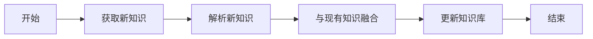
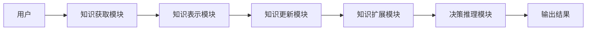
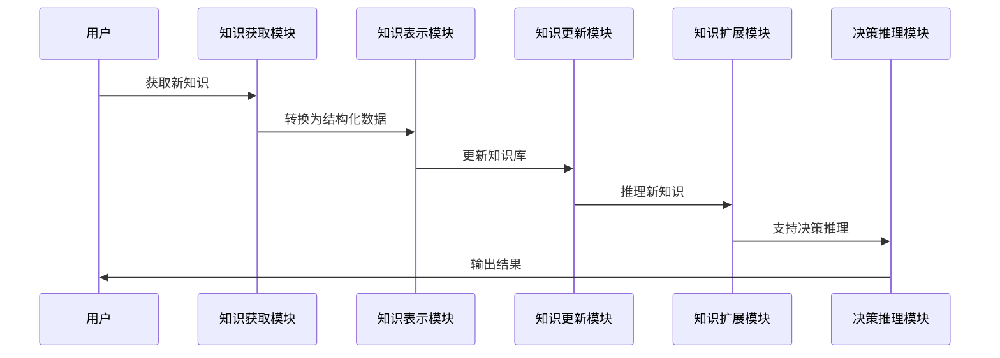

                 


# AI Agent的终身学习：持续更新和扩展知识库

> 关键词：AI Agent，终身学习，知识库，知识表示，自适应学习，强化学习

> 摘要：AI Agent的终身学习能力是实现智能系统持续进化和适应环境变化的核心。本文从AI Agent的基本概念出发，深入探讨知识表示与知识库构建、自适应学习机制、终身学习算法、系统架构设计以及项目实战等关键环节，结合强化学习和数学模型，详细阐述了AI Agent如何通过持续更新和扩展知识库来实现终身学习的目标。文章最后总结了最佳实践和未来发展方向，为读者提供全面的技术指导。

---

## 第1章: AI Agent与终身学习概述

### 1.1 AI Agent的基本概念

#### 1.1.1 什么是AI Agent
AI Agent（人工智能代理）是指在计算机系统中，能够感知环境、执行任务并做出决策的智能实体。它通过传感器获取信息，利用推理和学习能力解决问题，并通过执行器与环境交互。AI Agent可以是软件程序、机器人或其他智能系统。

#### 1.1.2 AI Agent的核心特征
- **自主性**：能够在没有外部干预的情况下独立运行。
- **反应性**：能够感知环境并实时做出反应。
- **学习能力**：能够通过经验或数据改进自身的性能。
- **推理能力**：能够基于现有知识做出合理的推理和决策。

#### 1.1.3 AI Agent的应用场景
- 智能助手（如Siri、Alexa）
- 自动驾驶系统
- 智能推荐系统
- 机器人客服

### 1.2 终身学习的背景与意义

#### 1.2.1 传统AI的局限性
传统AI系统通常依赖于预定义的规则和静态知识库，难以适应环境的变化和新知识的引入。当环境发生变化或新的数据出现时，传统AI系统需要人工干预才能更新知识，这限制了其灵活性和适应性。

#### 1.2.2 终身学习的定义与特点
终身学习是指AI系统能够在运行过程中持续学习和更新知识，以适应环境的变化和任务的需求。其特点包括：
- 持续性：系统能够不断学习新的知识。
- 自适应性：系统能够根据新知识调整自身行为。
- 可扩展性：系统能够处理不同类型和数量的新知识。

#### 1.2.3 终身学习在AI Agent中的重要性
终身学习使AI Agent能够：
- 自动适应环境变化。
- 处理多样化的任务。
- 提高系统的智能水平和决策能力。

### 1.3 AI Agent终身学习的挑战与解决方案

#### 1.3.1 知识更新的难点
- 数据异构性：新数据可能来自不同的来源，格式和语义可能不同。
- 知识冲突：新知识可能与现有知识冲突，需要进行协调。
- 计算资源限制：实时更新知识可能需要大量的计算资源。

#### 1.3.2 知识扩展的技术挑战
- 知识表示的复杂性：如何有效表示和管理不同类型的知识。
- 知识推理的准确性：如何确保推理的正确性和高效性。
- 知识安全与隐私：如何保护学习过程中涉及的敏感数据。

#### 1.3.3 解决方案概述
- **知识表示与融合**：采用多模态知识表示方法，整合多种来源的知识。
- **自适应学习算法**：使用强化学习和迁移学习等算法，实现知识的持续更新和扩展。
- **分布式计算**：利用云计算和边缘计算等技术，提高知识更新的效率和能力。

---

## 第2章: 知识表示与知识库构建

### 2.1 知识表示的基本概念

#### 2.1.1 知识表示的定义
知识表示是指将知识以某种形式表示出来，以便计算机能够理解和利用。常见的知识表示方法包括符号逻辑、语义网络、知识图谱等。

#### 2.1.2 知识表示的形式
- **符号逻辑**：使用符号和规则表示知识，如逻辑表达式。
- **语义网络**：使用节点和边表示概念及其关系。
- **知识图谱**：使用实体和关系构建结构化的知识网络。

#### 2.1.3 知识表示的优缺点对比

| 知识表示方法 | 优点 | 缺点 |
|--------------|------|------|
| 符号逻辑     | 表达清晰，易于推理 | 难以处理语义复杂性 |
| 语义网络     | 可视化能力强，易于扩展 | 实现复杂，推理效率低 |
| 知识图谱     | 结构化程度高，易于查询 | 数据获取和维护成本高 |

### 2.2 知识库的构建与管理

#### 2.2.1 知识库的结构设计
知识库通常由实体（概念）、属性（特征）和关系（关联）组成。例如，知识库可以表示为：

```
实体：Person
属性：name, age, gender
关系：knows（Person-A到Person-B）
```

#### 2.2.2 知识库的存储与检索
- **存储**：使用数据库（如关系型数据库、NoSQL数据库）或知识图谱存储系统（如Neo4j）。
- **检索**：通过查询语言（如SPARQL）或API进行知识检索。

#### 2.2.3 知识库的更新与维护
- **数据清洗**：去除冗余和不一致的数据。
- **数据融合**：整合来自不同来源的数据。
- **数据扩展**：添加新的知识和关系。

### 2.3 知识图谱与知识库的关系

#### 2.3.1 知识图谱的定义与特点
知识图谱是一种结构化的知识表示方法，由实体、属性和关系组成。它能够表示复杂的语义关系，并支持高效的语义查询。

#### 2.3.2 知识库与知识图谱的异同
- **知识库**：通常存储结构化数据，支持简单的查询和检索。
- **知识图谱**：支持复杂的语义查询和推理，能够表示丰富的语义关系。

#### 2.3.3 知识图谱在AI Agent中的应用
知识图谱可以用于：
- 实体识别与链接
- 语义理解与推理
- 知识融合与扩展

---

## 第3章: AI Agent的自适应学习机制

### 3.1 自适应学习的基本原理

#### 3.1.1 自适应学习的定义
自适应学习是指系统能够根据环境反馈和任务需求，动态调整自身的学习策略和知识表示方法。

#### 3.1.2 自适应学习的核心机制
- **反馈机制**：根据环境反馈调整学习策略。
- **元学习**：学习如何学习，以提高学习效率。

#### 3.1.3 自适应学习的实现步骤
1. 感知环境：通过传感器获取环境信息。
2. 分析需求：识别任务需求和知识缺口。
3. 选择学习策略：根据需求选择合适的学习方法。
4. 更新知识库：学习新知识并更新知识库。
5. 评估效果：通过反馈评估学习效果并优化策略。

### 3.2 知识更新的算法实现

#### 3.2.1 知识更新的算法选择
常用的算法包括：
- **随机游走算法**：用于知识图谱中的节点遍历。
- **马尔可夫链**：用于概率推理和状态转移。
- **协同过滤**：用于推荐系统中的知识更新。

#### 3.2.2 知识更新的流程图


#### 3.2.3 知识更新的代码实现
```python
def update_knowledge_base(new_data, knowledge_base):
    # 解析新数据
    parsed_data = parse(new_data)
    # 与现有知识融合
    merged_data = merge(parsed_data, knowledge_base)
    # 更新知识库
    knowledge_base.update(merged_data)
    return knowledge_base
```

### 3.3 知识扩展的技术实现

#### 3.3.1 知识扩展的定义
知识扩展是指在现有知识库的基础上，添加新的知识和关系，以增强系统的知识基础。

#### 3.3.2 知识扩展的算法选择
- **图嵌入算法**：用于表示知识图谱中的节点和关系。
- **规则推理**：基于知识库中的规则进行推理和扩展。
- **机器学习模型**：用于预测新知识和关系。

#### 3.3.3 知识扩展的代码实现
```python
def extend_knowledge_base(knowledge_base, new_rules):
    # 应用规则进行推理
    inferred_data = infer(knowledge_base, new_rules)
    # 扩展知识库
    extended_base = knowledge_base.extend(inferred_data)
    return extended_base
```

---

## 第4章: AI Agent的终身学习算法

### 4.1 终身学习算法的基本原理

#### 4.1.1 终身学习算法的定义
终身学习算法是指能够在运行过程中持续学习和更新知识的算法，具有自适应性和灵活性。

#### 4.1.2 终身学习算法的核心机制
- **在线学习**：逐步学习数据流中的实例。
- **增量学习**：在已有模型的基础上，逐步更新模型。

#### 4.1.3 终身学习算法的实现步骤
1. 初始化模型：设置初始参数和知识库。
2. 接收数据：获取新数据或反馈。
3. 更新模型：基于新数据更新模型参数。
4. 扩展知识：根据新数据扩展知识库。
5. 评估性能：通过反馈评估模型性能。

### 4.2 基于强化学习的终身学习

#### 4.2.1 强化学习的基本原理
强化学习是一种通过试错方法，学习策略以最大化累积奖励的算法。它包括以下几个步骤：
1. 状态感知：感知当前环境状态。
2. 行动选择：选择一个动作。
3. 反馈接收：获得奖励或惩罚。
4. 策略更新：根据反馈更新策略。

#### 4.2.2 强化学习在终身学习中的应用
- **策略优化**：通过强化学习优化AI Agent的决策策略。
- **知识表示**：将知识表示为状态和动作，以适应强化学习框架。
- **任务迁移**：通过强化学习实现任务之间的知识迁移。

#### 4.2.3 强化学习的数学模型
强化学习的核心是Q-learning算法，其数学模型如下：

$$ Q(s, a) = Q(s, a) + \alpha [r + \max_{a'} Q(s', a') - Q(s, a)] $$

其中：
- \( Q(s, a) \) 表示在状态 \( s \) 下执行动作 \( a \) 的价值。
- \( \alpha \) 表示学习率。
- \( r \) 表示获得的奖励。
- \( s' \) 表示新的状态。

---

## 第5章: 系统分析与架构设计

### 5.1 项目介绍与系统功能设计

#### 5.1.1 项目介绍
本项目旨在开发一个具备终身学习能力的AI Agent，能够通过持续学习和更新知识库，实现对复杂环境的适应和任务完成。

#### 5.1.2 系统功能设计
- **知识获取**：从多种来源获取新知识。
- **知识表示**：将知识表示为结构化的形式。
- **知识更新**：根据新知识更新知识库。
- **知识扩展**：通过推理和学习扩展知识库。
- **决策推理**：基于知识库进行推理和决策。

#### 5.1.3 系统功能的ER实体关系图
```mermaid
erDiagram
    actor User {
        <identity>
        id : integer
        name : string
    }
    class KnowledgeBase {
        <identity>
        id : integer
        content : string
    }
    class Agent {
        <identity>
        id : integer
        knowledge_base : KnowledgeBase
    }
    User --> Agent
    Agent --> KnowledgeBase
```

### 5.2 系统架构设计

#### 5.2.1 系统架构的模块划分
- **知识获取模块**：负责获取新知识。
- **知识表示模块**：负责知识的表示和存储。
- **知识更新模块**：负责知识的更新和维护。
- **知识扩展模块**：负责知识的推理和扩展。
- **决策推理模块**：负责基于知识库进行推理和决策。

#### 5.2.2 系统架构的流程图


#### 5.2.3 系统架构的交互图


---

## 第6章: 项目实战

### 6.1 环境安装与配置

#### 6.1.1 环境安装
- **Python**：安装Python 3.x及以上版本。
- **库依赖**：安装必要的库，如`networkx`、`neo4j`、`scikit-learn`等。

#### 6.1.2 环境配置
- **虚拟环境**：使用`venv`或`virtualenv`创建虚拟环境。
- **配置文件**：配置数据库连接、API密钥等。

### 6.2 核心代码实现

#### 6.2.1 知识获取模块
```python
import requests

def fetch_data(url):
    response = requests.get(url)
    return response.json()
```

#### 6.2.2 知识表示模块
```python
from neo4j import GraphDatabase

def store Knowledge(tx, data):
    # 假设data是结构化的数据
    for entity in data['entities']:
        tx.run("MERGE (a:{ EntityType } {{ id: {id} }}) SET a.name = '{name}'".format EntityType=entity['type'], id=entity['id'], name=entity['name'])
```

#### 6.2.3 知识更新模块
```python
def update Knowledge(tx, new_data):
    # 更新知识库
    tx.run("MATCH (a) WHERE ... SET ...")
```

#### 6.2.4 知识扩展模块
```python
def infer(tx, rules):
    # 基于规则进行推理
    tx.run("MATCH (a)-[r]->(b) CREATE (b)-[r2]->(c) WHERE ...")
```

#### 6.2.5 决策推理模块
```python
def make_decision(tx, goal):
    # 基于知识库进行决策推理
    result = tx.run("MATCH (a)-[r]->(b) WHERE ... RETURN ...").single().value
    return result
```

### 6.3 案例分析与实现解读

#### 6.3.1 案例分析
假设我们开发一个智能客服AI Agent，能够根据客户的问题动态更新知识库，并提供准确的解答。

#### 6.3.2 代码实现解读
- **知识获取模块**：从知识库中获取客户的问题和相关信息。
- **知识表示模块**：将问题和答案表示为结构化的知识图谱。
- **知识更新模块**：根据客户的反馈更新知识库。
- **知识扩展模块**：推理相关问题和答案，扩展知识库。
- **决策推理模块**：基于知识库进行推理，生成回答。

### 6.4 项目小结

通过本项目，我们实现了具备终身学习能力的AI Agent，能够：
- 持续更新和扩展知识库。
- 适应环境的变化和任务的需求。
- 提高系统的智能水平和决策能力。

---

## 第7章: 最佳实践与未来展望

### 7.1 最佳实践

#### 7.1.1 知识表示与存储
- 使用多模态知识表示方法，整合多种来源的知识。
- 采用分布式存储技术，提高知识库的扩展性和性能。

#### 7.1.2 算法选择与优化
- 根据具体场景选择合适的算法，如强化学习、迁移学习等。
- 定期评估和优化算法性能，提高学习效率。

#### 7.1.3 系统架构设计
- 采用微服务架构，提高系统的可扩展性和可维护性。
- 使用容器化技术（如Docker），方便部署和管理。

#### 7.1.4 伦理与安全
- 确保知识学习和更新过程中的数据安全和隐私保护。
- 遵守相关法律法规，避免伦理问题。

### 7.2 小结

通过本文的详细讲解，我们深入探讨了AI Agent的终身学习能力，包括知识表示、知识库构建、自适应学习机制、终身学习算法以及系统架构设计等方面。通过项目实战，我们进一步验证了理论的可行性和实用性。

### 7.3 未来展望

随着人工智能技术的不断发展，AI Agent的终身学习能力将更加智能化和自动化。未来的研究方向包括：
- 更高效的自适应学习算法。
- 更智能的知识表示和推理方法。
- 更安全的数据存储和传输技术。
- 更广泛的应用场景，如医疗、教育、金融等领域。

---

# 结语

AI Agent的终身学习能力是实现智能系统持续进化和适应环境变化的核心。通过本文的系统讲解和项目实战，我们希望能够为读者提供全面的技术指导，帮助他们在实际应用中更好地实现AI Agent的终身学习。

