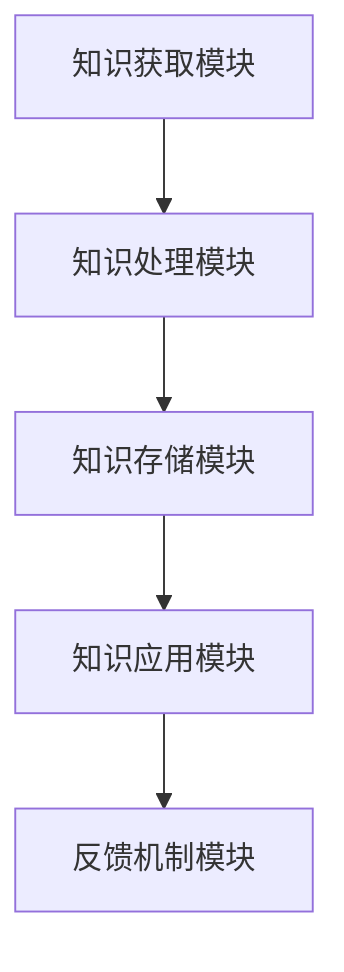
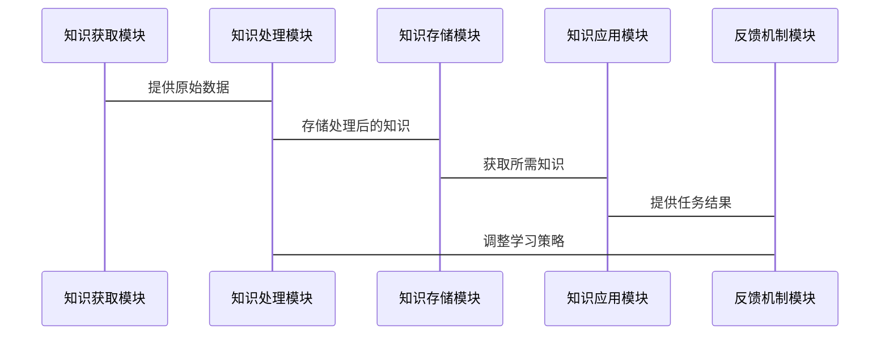

                 


# AI Agent的终身学习：持续适应新知识

> 关键词：AI Agent, 终身学习, 人工智能, 知识表示, 动态环境适应, 自我优化

> 摘要：AI Agent的终身学习是指AI代理在不断变化的环境中持续学习和适应新知识的能力，这种能力使其能够应对复杂任务和不确定性挑战。本文将从AI Agent的基本概念出发，探讨终身学习的核心机制、算法原理、系统架构，并通过实际案例分析和项目实战，深入解析终身学习在AI Agent中的应用。最后，结合最佳实践，总结经验并展望未来发展方向。

---

# 第一部分: AI Agent的终身学习基础

# 第1章: AI Agent与终身学习概述

## 1.1 AI Agent的基本概念
### 1.1.1 AI Agent的定义
- AI Agent是具备感知环境、自主决策和执行任务的智能体。
- Agent的类型：简单反射型、基于模型型、实用推理型、目标驱动型。
- Agent的核心特征：智能性、自主性、反应性、社会性。

### 1.1.2 AI Agent的工作原理
- 知识表示：符号表示、概率表示、神经网络表示。
- 问题求解：搜索、推理、规划、学习。
- 决策机制：基于知识的决策、基于模型的决策、基于数据的决策。

### 1.1.3 终身学习的定义与特点
- 终身学习：AI Agent在动态环境中持续学习新知识，适应新任务的能力。
- 终身学习的特点：
  - 持续性：持续吸收新知识，更新旧知识。
  - 自适应性：根据环境变化调整学习策略。
  - 累积性：知识不断积累，能力逐步增强。

## 1.2 终身学习在AI Agent中的必要性
### 1.2.1 AI Agent面临的动态环境挑战
- 动态环境的特点：不确定性、复杂性、不可预测性。
- AI Agent在动态环境中的局限性：
  - 知识固定：无法应对新任务和新知识。
  - 程序性：依赖预定义规则，难以灵活调整。

### 1.2.2 终身学习的解决思路
- 知识更新：动态调整知识库，适应新环境。
- 策略优化：根据反馈调整学习策略。
- 自我优化：通过自我评估和改进，提升学习效率。

### 1.2.3 终身学习与传统机器学习的区别
- 传统机器学习：静态知识库，离线训练。
- 终身学习：动态知识库，在线学习。
- 对比表格：
| 特性          | 传统机器学习                 | 终身学习                   |
|---------------|------------------------------|-----------------------------|
| 知识更新       | 离线，一次性训练               | 在线，持续学习               |
| 适应性         | 低                          | 高                         |
| 环境复杂性      | 简单或固定                   | 复杂或动态                 |

## 1.3 终身学习的背景与技术背景
### 1.3.1 人工智能的发展趋势
- AI从规则驱动到数据驱动的转变。
- AI Agent的广泛应用：自动驾驶、智能助手、机器人等。
- 终身学习是AI Agent适应复杂环境的关键技术。

### 1.3.2 终身学习的研究现状
- 国内外研究进展：元学习（Meta-Learning）、迁移学习（Transfer Learning）、自适应学习（Adaptive Learning）。
- 当前技术瓶颈：知识遗忘、知识冲突、计算效率。

### 1.3.3 当前技术背景下的终身学习挑战
- 数据稀疏性：新任务数据少，难以训练。
- 任务多样性：跨任务学习难度大。
- 环境实时性：需要快速适应动态变化。

## 1.4 本章小结
- 本章介绍了AI Agent的基本概念和终身学习的必要性。
- 分析了终身学习与传统机器学习的区别，以及当前技术背景下的挑战。

---

# 第2章: 终身学习的核心概念与机制

## 2.1 终身学习的核心概念
### 2.1.1 终身学习的定义与属性
- 终身学习的定义：AI Agent在动态环境中通过持续学习和自适应，提升自身智能水平的能力。
- 终身学习的属性：
  - 持续性：学习过程不断进行。
  - 自适应性：根据环境反馈调整学习策略。
  - 累积性：知识不断积累，能力逐步增强。

### 2.1.2 终身学习的关键特征对比
- 对比表格：
| 特性          | 离线学习                   | 在线学习                   | 终身学习                   |
|---------------|--------------------------|---------------------------|---------------------------|
| 数据来源       | 预先收集的数据             | 实时数据流                 | 实时数据流                 |
| 学习目标       | 预定任务                   | 新任务                     | 新任务                     |
| 知识更新       | 离线，周期性更新             | 在线，实时更新             | 在线，实时更新             |

### 2.1.3 终身学习的数学模型
- 终身学习的数学模型：
$$ f_{\text{meta}}(x) = \arg\min_{\theta} \mathbb{E}_{(x,y)} \mathcal{L}(x,y;\theta) $$
- 其中，$x$ 是输入，$y$ 是目标输出，$\theta$ 是模型参数，$\mathcal{L}$ 是损失函数。

## 2.2 终身学习的机制
### 2.2.1 知识表示与更新机制
- 知识表示：
  - 符号表示：规则、逻辑、语义。
  - 向量表示：词嵌入、句嵌入。
  - 神经网络表示：深度学习模型。
- 知识更新：
  - 增量学习：逐步更新模型参数。
  - 知识蒸馏：通过教师模型指导学生模型学习。

### 2.2.2 知识整合与推理机制
- 知识整合：
  - 知识融合：将不同来源的知识整合到统一的知识库中。
  - 知识关联：建立知识之间的关联关系。
- 知识推理：
  - 基于规则的推理：通过逻辑推理解决问题。
  - 基于概率的推理：通过贝叶斯网络进行推理。
  - 基于神经网络的推理：通过图神经网络进行推理。

### 2.2.3 知识遗忘与重学机制
- 知识遗忘：
  - 忘记曲线：知识随时间逐渐遗忘。
  - 选择性遗忘：主动遗忘低价值的知识。
- 知识重学：
  - 重学策略：定期复习已学知识。
  - 迁移学习：利用已有知识快速学习新知识。

## 2.3 终身学习的核心要素
### 2.3.1 知识库的构建与管理
- 知识库的构建：
  - 数据采集：从多源数据中提取知识。
  - 数据清洗：去除噪声数据。
  - 数据标注：对数据进行标注和分类。
- 知识库的管理：
  - 知识分类：将知识按领域或任务分类。
  - 知识更新：根据新数据更新知识库。
  - 知识检索：快速检索所需知识。

### 2.3.2 学习策略的选择与优化
- 学习策略：
  - 监督学习：基于标注数据学习。
  - 无监督学习：基于未标注数据学习。
  - 强化学习：通过奖励机制学习。
- 策略优化：
  - 策略搜索：通过搜索找到最优策略。
  - 策略迁移：将已有策略迁移到新任务。

### 2.3.3 环境感知与反馈机制
- 环境感知：
  - 感知器：通过传感器感知环境。
  - 解释器：对感知到的信息进行解释。
- 环境反馈：
  - 监督反馈：教师提供的反馈。
  - 强化反馈：环境提供的奖励或惩罚。
  - 自我反馈：Agent的自我评估和反馈。

## 2.4 本章小结
- 本章详细讲解了终身学习的核心概念和机制。
- 分析了知识表示、知识整合、知识遗忘等关键问题，并提出了相应的解决方案。

---

# 第3章: 终身学习的算法原理

## 3.1 元学习与迁移学习
### 3.1.1 元学习的基本原理
- 元学习的定义：学习如何学习，即通过学习多个任务来优化学习算法。
- 元学习的算法：
  - MAML（Meta-Automated Learning）：通过优化初始参数，使得模型在新任务上快速收敛。
  - Reptile：通过迭代更新模型参数，使得模型在新任务上快速适应。

### 3.1.2 迁移学习的核心思想
- 迁移学习的定义：将已有的知识迁移到新任务中。
- 迁移学习的算法：
  - DANN（Domain-Adversarial Neural Networks）：通过对抗训练消除领域差异。
  - DA-RNN：通过循环神经网络进行领域适应。

### 3.1.3 元学习与迁移学习的对比
- 对比表格：
| 特性          | 元学习                   | 迁移学习                   |
|---------------|--------------------------|---------------------------|
| 核心思想       | 学习如何学习             | 利用已有知识学习新任务     |
| 适用场景       | 少样本任务               | 相关任务                   |
| 算法复杂度     | 较高                     | 较低                     |

## 3.2 基于神经网络的终身学习算法
### 3.2.1 神经网络的可微学习
- 可微学习的定义：通过优化神经网络参数，使得模型在新任务上快速适应。
- 算法实现：
  - 网络结构：多层感知机、卷积神经网络、循环神经网络。
  - 优化方法：随机梯度下降（SGD）、Adam优化器。

### 3.2.2 知识蒸馏与参数迁移
- 知识蒸馏的定义：通过教师模型指导学生模型学习。
- 参数迁移的定义：将已训练模型的参数迁移到新任务中。
- 算法实现：
  - 教师模型：预训练好的模型。
  - 学生模型：待训练的模型。
  - 迁移策略：通过参数共享或参数适配实现迁移。

### 3.2.3 网络结构的动态调整
- 动态调整的定义：根据任务需求动态调整网络结构。
- 算法实现：
  - 网络剪枝：去除冗余的神经元或连接。
  - 网络生长：根据需要增加新的神经元或连接。
  - 模型融合：将多个模型的参数融合，得到一个更好的模型。

## 3.3 终身学习的数学模型
### 3.3.1 元学习的数学表达
$$ \text{Meta-objective} = \mathbb{E}_{(x,y) \sim D} \mathbb{E}_{\theta \sim P} \mathcal{L}(x,y;\theta) $$
- 其中，$D$ 是数据分布，$P$ 是初始参数的先验分布，$\mathcal{L}$ 是损失函数。

### 3.3.2 迁移学习的数学模型
$$ p_{\text{target}}(y|x) = \arg\min_{\theta} \mathbb{E}_{(x,y) \sim D_{\text{target}}} \mathcal{L}(x,y;\theta) $$
- 其中，$D_{\text{target}}$ 是目标领域的数据分布。

## 3.4 本章小结
- 本章详细讲解了元学习和迁移学习的算法原理。
- 分析了基于神经网络的终身学习算法，并给出了相应的数学模型。

---

# 第4章: 终身学习的系统架构与设计

## 4.1 系统功能设计
### 4.1.1 知识获取与处理
- 数据采集：从多源数据中采集知识。
- 数据清洗：去除噪声数据。
- 数据标注：对数据进行标注和分类。

### 4.1.2 知识存储与管理
- 知识库设计：基于领域或任务分类存储知识。
- 知识更新：根据新数据更新知识库。
- 知识检索：快速检索所需知识。

### 4.1.3 知识应用与反馈
- 知识应用：将知识应用到具体任务中。
- 环境反馈：根据任务结果调整学习策略。

## 4.2 系统架构设计
### 4.2.1 系统整体架构
- 系统架构图：


### 4.2.2 模块交互流程
- 模块交互流程图：


## 4.3 接口设计与实现
### 4.3.1 知识获取接口
- 接口定义：提供数据采集功能。
- 接口实现：通过API从数据库、网络等来源获取数据。

### 4.3.2 知识处理接口
- 接口定义：提供数据清洗、标注功能。
- 接口实现：使用Python的pandas库进行数据处理。

### 4.3.3 知识应用接口
- 接口定义：提供知识应用功能。
- 接口实现：使用Python的scikit-learn库进行机器学习。

## 4.4 本章小结
- 本章详细讲解了终身学习系统的架构设计。
- 分析了各模块的功能和交互流程，并给出了相应的接口设计。

---

# 第5章: 终身学习的项目实战

## 5.1 项目背景与目标
### 5.1.1 项目背景
- 项目名称：智能助手小A。
- 项目目标：实现一个能够持续学习的智能助手。

### 5.1.2 项目需求
- 功能需求：
  - 多轮对话：支持用户与智能助手的多轮对话。
  - 知识库管理：支持知识的存储和更新。
  - 自我优化：根据用户反馈优化对话策略。

### 5.1.3 项目挑战
- 技术挑战：知识的动态更新和多任务学习。
- 实际挑战：用户反馈的实时处理和系统稳定性。

## 5.2 环境安装与配置
### 5.2.1 环境要求
- 操作系统：Linux/Windows/MacOS。
- 开发工具：Python 3.8及以上版本。
- 依赖库：TensorFlow 2.0及以上版本、Keras、scikit-learn。

### 5.2.2 环境配置
- 安装Python：
  ```bash
  python --version
  ```
- 安装依赖库：
  ```bash
  pip install numpy tensorflow keras scikit-learn
  ```

## 5.3 系统核心实现
### 5.3.1 知识库管理模块
- 实现代码：
  ```python
  class KnowledgeBase:
      def __init__(self):
          self.database = {}
      
      def add_knowledge(self, key, value):
          self.database[key] = value
      
      def get_knowledge(self, key):
          return self.database.get(key, None)
  ```

### 5.3.2 知识学习模块
- 实现代码：
  ```python
  class LifelongLearner:
      def __init__(self, model):
          self.model = model
      
      def train(self, X, y):
          self.model.fit(X, y)
      
      def predict(self, X):
          return self.model.predict(X)
  ```

### 5.3.3 知识应用模块
- 实现代码：
  ```python
  class KnowledgeApp:
      def __init__(self, knowledge_base, learner):
          self.knowledge_base = knowledge_base
          self.learner = learner
      
      def apply_knowledge(self, task, data):
          knowledge = self.knowledge_base.get_knowledge(task)
          if knowledge:
              self.learner.train(data, knowledge)
          else:
              self.learner.train(data, None)
  ```

## 5.4 实际案例分析
### 5.4.1 案例背景
- 案例名称：智能助手小A。
- 案例目标：实现多轮对话中的知识动态更新。

### 5.4.2 案例实现
- 实现代码：
  ```python
  # 初始化知识库
  kb = KnowledgeBase()
  kb.add_knowledge('greeting', 'Hello, how can I help you?')
  
  # 初始化学习器
  model = tf.keras.Sequential([
      tf.keras.layers.Dense(10, activation='relu'),
      tf.keras.layers.Dense(1, activation='sigmoid')
  ])
  learner = LifelongLearner(model)
  
  # 初始化知识应用模块
  app = KnowledgeApp(kb, learner)
  
  # 应用知识
  app.apply_knowledge('greeting', X_train, y_train)
  ```

### 5.4.3 案例分析
- 知识库管理：通过`KnowledgeBase`类实现知识的存储和检索。
- 知识学习：通过`LifelongLearner`类实现模型的训练和预测。
- 知识应用：通过`KnowledgeApp`类实现知识的应用和反馈。

## 5.5 本章小结
- 本章通过实际项目案例，详细讲解了终身学习的实现过程。
- 分析了知识库管理、知识学习、知识应用的具体实现，并给出了相应的代码示例。

---

# 第6章: 终身学习的最佳实践

## 6.1 终身学习的实践经验
### 6.1.1 知识管理策略
- 知识分类：将知识按领域或任务分类。
- 知识更新：定期更新知识库，确保知识的时效性。
- 知识检索：快速检索所需知识，提高学习效率。

### 6.1.2 学习策略优化
- 学习速率：根据任务难度调整学习速率。
- 知识迁移：通过迁移学习快速适应新任务。
- 策略调整：根据反馈调整学习策略。

### 6.1.3 系统优化技巧
- 系统架构：设计高效的系统架构，确保知识的快速流动。
- 并行计算：利用多线程或多进程提高计算效率。
- 模型压缩：通过模型压缩技术减少计算资源消耗。

## 6.2 终身学习的注意事项
### 6.2.1 知识冲突问题
- 知识冲突的原因：不同来源的知识可能存在矛盾。
- 解决方法：通过知识融合技术消除冲突。
- 注意事项：在知识整合过程中，需要考虑知识的可靠性和一致性。

### 6.2.2 系统稳定性问题
- 系统稳定性的影响因素：环境的动态变化、任务的复杂性、模型的鲁棒性。
- 解决方法：通过自我监控和自我修复技术确保系统的稳定性。
- 注意事项：在设计系统时，需要考虑系统的容错能力和恢复能力。

### 6.2.3 计算效率问题
- 计算效率的影响因素：模型的复杂度、数据的规模、算法的效率。
- 解决方法：通过优化算法、并行计算、模型压缩等技术提高计算效率。
- 注意事项：在实际应用中，需要根据具体场景选择合适的优化方法。

## 6.3 未来研究方向
### 6.3.1 知识表示与推理
- 研究方向：研究更高效的知识表示方法，如图神经网络。
- 发展趋势：从符号表示到深度学习表示的转变。

### 6.3.2 学习算法优化
- 研究方向：研究更高效的元学习和迁移学习算法。
- 发展趋势：从单任务学习到多任务学习的转变。

### 6.3.3 系统架构设计
- 研究方向：研究更高效的系统架构，如分布式架构。
- 发展趋势：从单机学习到分布式学习的转变。

## 6.4 本章小结
- 本章总结了终身学习的最佳实践经验和注意事项。
- 展望了未来的研究方向和发展趋势。

---

# 第7章: 总结与展望

## 7.1 本章总结
- 本章总结了AI Agent的终身学习的核心内容。
- 包括终身学习的基本概念、算法原理、系统架构、项目实战以及最佳实践。

## 7.2 未来展望
- 未来研究方向：
  - 更高效的终身学习算法。
  - 更智能的知识表示方法。
  - 更高效的系统架构设计。

## 7.3 致谢
- 感谢读者的支持和关注。
- 感谢同行的交流和帮助。

---

# 参考文献
- [1]《深度学习》——Ian Goodfellow
- [2]《机器学习实战》——周志华
- [3]《元学习：从基础到实践》——唐宇迪
- [4]《迁移学习：理论与实践》——周明
- [5]《终身学习：AI Agent的持续进化之路》——自编

---

* 作者：[您的名字]
* 日期：[日期]

