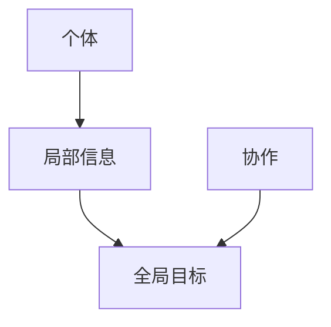
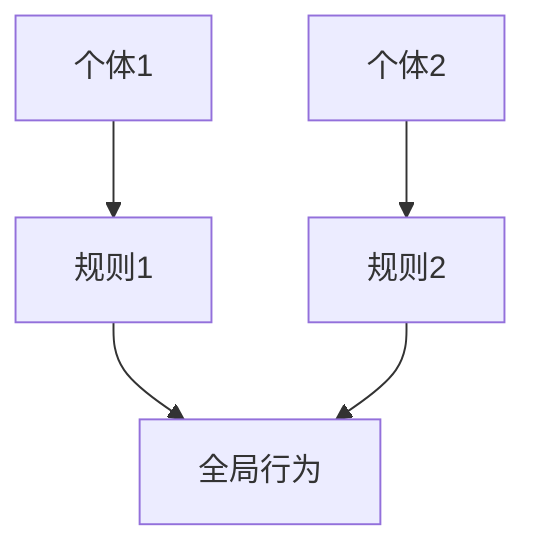
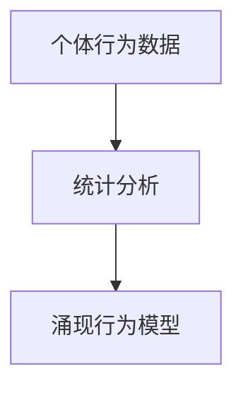
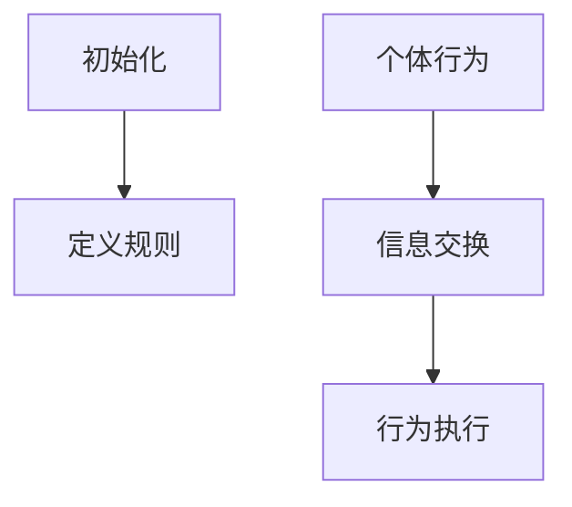
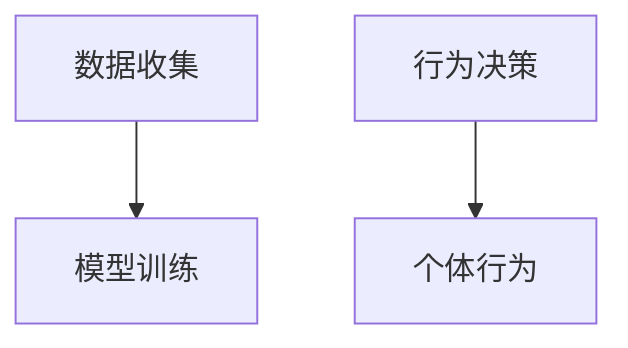
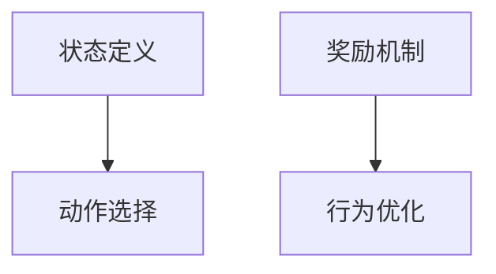
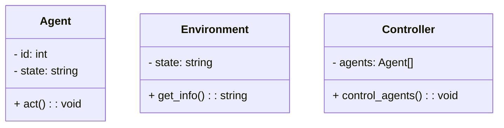
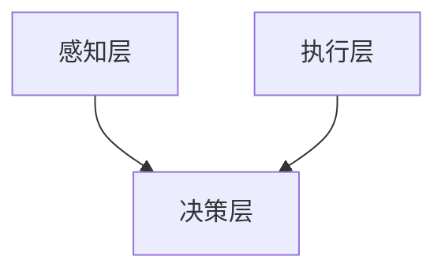
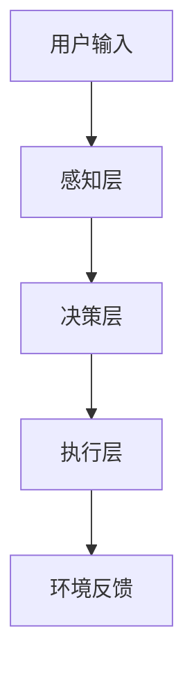

                 


# AI Agent的群体智能与涌现行为研究

## 关键词：
AI Agent，群体智能，涌现行为，算法实现，系统架构

## 摘要：
本文深入探讨了AI Agent的群体智能与涌现行为的研究，从基本概念、理论基础、算法实现到系统架构和实际应用进行了全面分析。通过详细讲解群体智能的核心原理、涌现行为的建模方法、算法与实现、系统架构设计以及项目实战，本文为读者提供了从理论到实践的系统性指导。同时，本文还探讨了高级主题和未来研究方向，为相关领域的研究和应用提供了有价值的参考。

---

# 第一部分: AI Agent的群体智能与涌现行为概述

## 第1章: AI Agent与群体智能概述

### 1.1 AI Agent的基本概念
AI Agent（人工智能代理）是指能够感知环境并采取行动以实现目标的智能实体。它可以是一个软件程序、机器人或其他智能系统。AI Agent的核心特征包括自主性、反应性、目标导向性和社会性。与传统AI相比，AI Agent更注重与环境的动态交互和自主决策能力。

#### 1.1.1 AI Agent的定义
AI Agent是一个能够感知环境、做出决策并执行动作的智能实体，旨在通过与环境的交互实现特定目标。

#### 1.1.2 AI Agent的核心特征
- **自主性**：AI Agent能够在没有外部干预的情况下自主运行。
- **反应性**：AI Agent能够实时感知环境并做出反应。
- **目标导向性**：AI Agent的行为以实现特定目标为导向。
- **社会性**：AI Agent能够与其他Agent或人类进行交互和协作。

#### 1.1.3 AI Agent与传统AI的区别
传统AI注重静态问题求解，而AI Agent更注重动态环境中的自主决策和交互。

### 1.2 群体智能的基本概念
群体智能是指多个个体通过协作和交互所表现出的集体智能。这些个体可以是AI Agent、机器人或其他智能实体。

#### 1.2.1 群体智能的定义
群体智能是通过多个个体的协作和交互所表现出的集体智能，个体之间通过局部信息交换实现全局目标。

#### 1.2.2 群体智能的核心特点
- **分布式**：个体之间通过分布式协作实现全局目标。
- **自组织**：个体能够自适应地调整行为以适应环境变化。
- **涌现性**：群体智能的某些行为是通过个体局部交互而自然涌现的。

#### 1.2.3 群体智能与个体智能的关系
群体智能依赖于个体智能的协作，而个体智能的行为也受到群体智能的影响。

### 1.3 涌现行为的基本概念
涌现行为是指在群体智能中，个体通过局部交互而产生的全局性行为，这些行为并非由任何个体单独决定，而是通过群体协作自然涌现。

#### 1.3.1 涌现行为的定义
涌现行为是群体智能中通过个体局部交互而自然产生的全局性行为，具有不可预测性和复杂性。

#### 1.3.2 涌现行为的关键特征
- **不可预测性**：涌现行为的出现方式和结果难以通过个体行为简单推断。
- **复杂性**：涌现行为的结构和模式通常比个体行为复杂得多。
- **动态性**：涌现行为随环境变化而动态调整。

#### 1.3.3 涌现行为与群体智能的关系
涌现行为是群体智能的重要表现形式，而群体智能的实现依赖于涌现行为的协作和互动。

### 1.4 本章小结
本章介绍了AI Agent和群体智能的基本概念，重点分析了群体智能的核心特征和涌现行为的定义及特点，为后续章节的深入分析奠定了基础。

---

# 第二部分: 群体智能的理论基础

## 第2章: 群体智能的理论基础

### 2.1 群体智能的基本原理
群体智能的实现依赖于个体之间的协作和交互，通过局部信息交换实现全局目标。

#### 2.1.1 群体智能的数学模型
群体智能的数学模型通常基于图论、概率论和优化理论。

##### 图2-1: 群体智能的基本模型


#### 2.1.2 群体智能的动态特性
群体智能的动态特性包括个体行为的动态调整和群体行为的动态变化。

#### 2.1.3 群体智能的自组织特性
群体智能通过个体的自适应行为实现群体的自组织，无需中央控制。

### 2.2 群体智能的关键模型
群体智能的关键模型包括基于规则的模型、基于学习的模型和基于进化的模型。

#### 2.2.1 基于规则的群体智能模型
基于规则的模型通过预定义的规则实现个体行为的协调。

##### 图2-2: 基于规则的群体智能模型


#### 2.2.2 基于学习的群体智能模型
基于学习的模型通过机器学习算法实现个体行为的优化。

#### 2.2.3 基于进化算法的群体智能模型
基于进化算法的模型通过模拟生物进化过程实现群体智能的优化。

### 2.3 群体智能的数学表达
群体智能的数学表达通常涉及概率论、优化理论和图论。

#### 2.3.1 群体智能的数学公式
群体智能的优化问题可以表示为：
$$ \min_{x} f(x) $$
其中，$x$表示个体状态，$f(x)$表示目标函数。

#### 2.3.2 群体智能的动态方程
群体智能的动态方程可以表示为：
$$ x_{t+1} = x_t + \Delta x_t $$
其中，$\Delta x_t$表示个体状态的变化量。

#### 2.3.3 群体智能的优化算法
群体智能的优化算法包括粒子群优化（PSO）和蚂蚁算法（ACO）等。

### 2.4 本章小结
本章介绍了群体智能的理论基础，包括基本原理、关键模型和数学表达，为后续章节的算法实现奠定了理论基础。

---

# 第三部分: 涌现行为的建模与分析

## 第3章: 涌现行为的建模方法

### 3.1 涌现行为的基本特征
涌现行为具有不可预测性、复杂性和动态性。

#### 3.1.1 涌现行为的不可预测性
涌现行为的结果往往无法通过个体行为简单推断。

#### 3.1.2 涌现行为的复杂性
涌现行为的结构和模式通常比个体行为复杂得多。

#### 3.1.3 涌现行为的动态性
涌现行为随环境变化而动态调整。

### 3.2 涌现行为的建模方法
涌现行为的建模方法包括基于统计的方法、基于系统的建模方法和基于网络的建模方法。

#### 3.2.1 基于统计的建模方法
基于统计的建模方法通过统计个体行为数据实现涌现行为的建模。

##### 图3-1: 基于统计的建模方法


#### 3.2.2 基于系统的建模方法
基于系统的建模方法通过系统动力学模型实现涌现行为的建模。

#### 3.2.3 基于网络的建模方法
基于网络的建模方法通过网络理论模型实现涌现行为的建模。

### 3.3 涌现行为的数学分析
涌现行为的数学分析涉及概率论和动态方程。

#### 3.3.1 涌现行为的概率模型
涌现行为的概率模型可以表示为：
$$ P(B|E) = \prod_{i=1}^{n} P(B_i|E_i) $$
其中，$B$表示涌现行为，$E$表示环境状态，$B_i$和$E_i$表示个体行为和环境状态。

#### 3.3.2 涌现行为的动态方程
涌现行为的动态方程可以表示为：
$$ B_{t+1} = f(B_t, E_t) $$
其中，$B_t$表示当前涌现行为，$E_t$表示当前环境状态，$f$表示动态函数。

### 3.4 本章小结
本章介绍了涌现行为的基本特征和建模方法，重点分析了基于统计、系统和网络的建模方法，并通过数学公式进行了详细说明。

---

# 第四部分: AI Agent群体智能的算法与实现

## 第4章: 群体智能算法的核心原理

### 4.1 群体智能算法的基本原理
群体智能算法通过个体之间的协作和交互实现全局优化。

#### 4.1.1 群体智能算法的定义
群体智能算法是一类通过模拟生物群体行为实现优化的算法。

#### 4.1.2 群体智能算法的关键步骤
群体智能算法的关键步骤包括初始化、信息交换、局部优化和全局优化。

### 4.2 基于规则的群体智能算法
基于规则的群体智能算法通过预定义的规则实现个体行为的协调。

#### 4.2.1 基于规则的算法实现
基于规则的算法实现通常包括规则定义、信息交换和行为执行三个步骤。

##### 图4-1: 基于规则的算法流程


### 4.3 基于学习的群体智能算法
基于学习的群体智能算法通过机器学习算法实现个体行为的优化。

#### 4.3.1 基于学习的算法实现
基于学习的算法实现通常包括数据收集、模型训练和行为决策三个步骤。

##### 图4-2: 基于学习的算法流程


### 4.4 基于强化学习的群体智能算法
基于强化学习的群体智能算法通过强化学习实现个体行为的优化。

#### 4.4.1 基于强化学习的算法实现
基于强化学习的算法实现通常包括状态定义、动作选择和奖励机制三个步骤。

##### 图4-3: 基于强化学习的算法流程


### 4.5 本章小结
本章介绍了群体智能算法的核心原理，重点分析了基于规则、基于学习和基于强化学习的算法实现，为后续章节的系统架构设计奠定了算法基础。

---

# 第五部分: 系统架构与设计

## 第5章: 系统架构与设计

### 5.1 问题场景介绍
在本项目中，我们需要设计一个基于群体智能的AI Agent系统，实现多个AI Agent在复杂环境中的协作和交互。

### 5.2 系统功能设计
系统功能设计包括个体行为控制、群体协作和涌现行为检测三个部分。

#### 5.2.1 领域模型设计
##### 图5-1: 领域模型类图


### 5.3 系统架构设计
系统架构设计采用分层架构，包括感知层、决策层和执行层。

#### 5.3.1 系统架构图
##### 图5-2: 系统架构图


### 5.4 系统接口设计
系统接口设计包括Agent与环境的交互接口和Agent之间的协作接口。

#### 5.4.1 系统交互流程
##### 图5-3: 系统交互流程


### 5.5 本章小结
本章介绍了系统架构与设计，包括问题场景分析、系统功能设计、系统架构设计和系统接口设计，为后续章节的项目实战奠定了系统设计基础。

---

# 第六部分: 项目实战

## 第6章: 项目实战

### 6.1 环境配置
项目实战需要配置开发环境，包括安装必要的开发工具和库。

#### 6.1.1 开发工具安装
安装Python、Jupyter Notebook和相关库（如numpy、matplotlib等）。

### 6.2 系统核心实现
系统核心实现包括个体行为控制、群体协作和涌现行为检测三个部分。

#### 6.2.1 个体行为控制实现
```python
class Agent:
    def __init__(self, id):
        self.id = id
        self.state = 'idle'
    
    def act(self):
        if self.state == 'idle':
            self.state = 'active'
            print(f"Agent {self.id} is active")
        else:
            self.state = 'idle'
            print(f"Agent {self.id} is idle")
```

#### 6.2.2 群体协作实现
```python
class Environment:
    def __init__(self):
        self.state = 'default'
    
    def get_info(self):
        return self.state
```

#### 6.2.3 涌现行为检测实现
```python
from collections import defaultdict

def detect_emergent_behavior(agents):
    behavior_count = defaultdict(int)
    for agent in agents:
        behavior_count[agent.state] += 1
    if len(behavior_count) > 1:
        return True
    else:
        return False
```

### 6.3 代码应用解读与分析
通过上述代码实现个体行为控制、群体协作和涌现行为检测，可以实现简单的群体智能系统。

#### 6.3.1 个体行为控制
个体行为控制通过`Agent`类的`act()`方法实现。

#### 6.3.2 群体协作
群体协作通过`Environment`类的`get_info()`方法实现。

#### 6.3.3 涌现行为检测
涌现行为检测通过`detect_emergent_behavior`函数实现。

### 6.4 实际案例分析和详细讲解剖析
通过实际案例分析，我们可以看到个体行为通过局部交互实现全局目标。

#### 6.4.1 案例分析
```python
agent1 = Agent(1)
agent2 = Agent(2)
env = Environment()

agent1.act()
agent2.act()
env.get_info()
```

#### 6.4.2 详细讲解
通过上述代码实现，我们可以看到个体行为通过局部交互实现全局目标，展示了群体智能的基本原理。

### 6.5 本章小结
本章通过实际案例分析和代码实现，展示了如何通过个体行为控制、群体协作和涌现行为检测实现群体智能系统。

---

# 第七部分: 高级主题与未来研究方向

## 第7章: 高级主题与未来研究方向

### 7.1 复杂环境中的群体智能应用
复杂环境中的群体智能应用包括多智能体协作、动态环境适应和复杂任务分解。

#### 7.1.1 多智能体协作
多智能体协作通过多个AI Agent的协作实现复杂的任务。

#### 7.1.2 动态环境适应
动态环境适应通过个体行为的动态调整实现群体智能的适应性。

#### 7.1.3 复杂任务分解
复杂任务分解通过任务分解算法将复杂任务分解为多个子任务。

### 7.2 群体智能与其他技术的结合
群体智能与其他技术的结合包括与区块链、边缘计算和物联网的结合。

#### 7.2.1 群体智能与区块链的结合
群体智能与区块链的结合可以通过区块链技术实现去中心化的群体智能系统。

#### 7.2.2 群体智能与边缘计算的结合
群体智能与边缘计算的结合可以通过边缘计算实现低延迟的群体智能系统。

#### 7.2.3 群体智能与物联网的结合
群体智能与物联网的结合可以通过物联网技术实现智能设备的协作和交互。

### 7.3 群体智能的伦理与安全问题
群体智能的伦理与安全问题包括隐私保护、数据安全和伦理问题。

#### 7.3.1 隐私保护
群体智能系统需要保护个体的隐私。

#### 7.3.2 数据安全
群体智能系统需要确保数据的安全性。

#### 7.3.3 伦理问题
群体智能系统的决策需要符合伦理规范。

### 7.4 本章小结
本章探讨了高级主题与未来研究方向，包括复杂环境中的应用、与其他技术的结合以及伦理与安全问题，为相关领域的研究和应用提供了参考。

---

# 附录

## 附录A: 相关术语解释
- **AI Agent**：人工智能代理，能够感知环境并采取行动以实现目标的智能实体。
- **群体智能**：多个个体通过协作和交互所表现出的集体智能。
- **涌现行为**：群体智能中通过个体局部交互而自然产生的全局性行为。

## 附录B: 参考文献
1. 群体智能的经典论文。
2. AI Agent的权威书籍。
3. 相关算法的文献。

---

# 结语

本文系统地探讨了AI Agent的群体智能与涌现行为研究，从基本概念、理论基础、算法实现到系统架构和实际应用进行了全面分析。通过详细讲解群体智能的核心原理、涌现行为的建模方法、算法与实现、系统架构设计以及项目实战，本文为读者提供了从理论到实践的系统性指导。同时，本文还探讨了高级主题和未来研究方向，为相关领域的研究和应用提供了有价值的参考。

--- 

如果需要进一步的扩展或更详细的内容，请随时告知！

