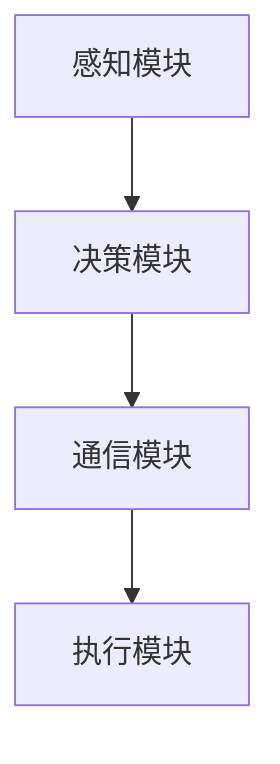
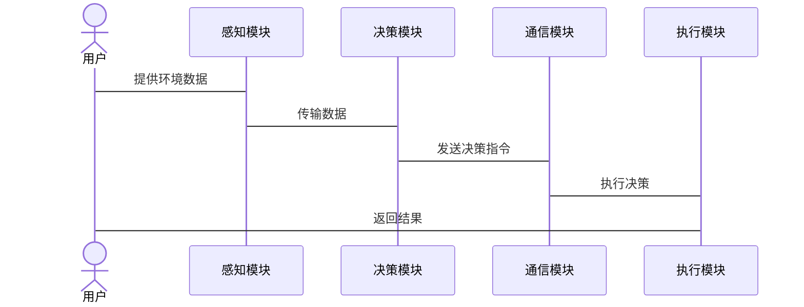

                 


# AI Agent的群体智能与集体决策机制

---

## 关键词：AI Agent，群体智能，集体决策，分布式计算，决策算法，一致性协议

---

## 摘要：  
本文深入探讨AI Agent在群体智能与集体决策中的理论基础、算法实现及系统架构。通过分析群体智能的核心概念、集体决策机制的设计与优化，结合实际案例，详细阐述AI Agent如何通过协同合作实现高效决策。文章涵盖从基础概念到高级算法的全链条内容，为读者提供全面的技术视角。

---

# 第1章: AI Agent与群体智能基础

## 1.1 AI Agent的基本概念

### 1.1.1 AI Agent的定义与分类  
AI Agent（智能体）是指能够感知环境、自主决策并采取行动的实体。根据智能体的智能水平，可分为反应式Agent、基于模型的Agent、效用优化Agent等。  

### 1.1.2 群体智能的定义与特征  
群体智能是指多个Agent协同工作，通过局部交互实现全局目标的智能形式。其核心特征包括分布式性、涌现性、自适应性和去中心化。  

### 1.1.3 集体决策机制的核心概念  
集体决策机制是指多个Agent通过协作达成共识的过程，旨在在复杂环境中实现最优或次优决策。  

---

## 1.2 AI Agent的行为模型

### 1.2.1 基于规则的行为模型  
基于规则的Agent通过预定义的规则响应环境输入，简单但缺乏灵活性。  

### 1.2.2 基于学习的行为模型  
基于学习的Agent通过机器学习算法动态调整行为策略，适应复杂环境的变化。  

### 1.2.3 不同行为模型的对比分析  
| 模型类型 | 优点 | 缺点 |  
|----------|------|------|  
| 基于规则 | 实现简单，易于部署 | 缺乏灵活性，难以应对复杂场景 |  
| 基于学习 | 高度灵活，适应性强 | 训练复杂，计算资源消耗大 |  

---

## 1.3 群体智能的理论基础

### 1.3.1 群体智能的基本原理  
群体智能通过个体间局部交互，形成全局智能行为。蚂蚁觅食、鸟群飞行等自然现象是其灵感来源。  

### 1.3.2 群体智能与分布式计算的关系  
群体智能依赖分布式计算实现去中心化协作，而分布式计算为群体智能提供了技术基础。  

### 1.3.3 群体智能在AI Agent中的应用  
群体智能广泛应用于多Agent系统、分布式任务分配、分布式计算等领域。  

---

## 1.4 集体决策机制的背景与意义

### 1.4.1 集体决策的定义与特点  
集体决策是多个个体通过协作达成共识的过程，具有去中心化、并行性、鲁棒性等特点。  

### 1.4.2 集体决策在AI Agent中的作用  
集体决策是群体智能的核心机制，能够提高系统的可靠性和决策质量。  

### 1.4.3 集体决策的挑战与机遇  
集体决策面临信息不对称、计算复杂性、通信开销等问题，但也为分布式系统提供了新的解决方案。  

---

## 1.5 本章小结  
本章介绍了AI Agent的基本概念、行为模型、群体智能的理论基础以及集体决策机制的背景与意义，为后续内容奠定了基础。

---

# 第2章: 群体智能与集体决策的核心概念

## 2.1 群体智能的数学模型

### 2.1.1 群体智能的数学表示  
群体智能可以用概率分布、状态转移矩阵等数学工具进行建模。  

### 2.1.2 基于概率论的群体智能模型  
概率论为群体智能提供了强大的工具，例如基于马尔可夫链的模型用于描述状态转移过程。  

### 2.1.3 基于博弈论的群体智能模型  
博弈论帮助分析个体间的策略互动，例如纳什均衡用于描述稳定决策状态。  

---

## 2.2 集体决策机制的原理

### 2.2.1 集体决策的基本原理  
集体决策通过个体投票、协商或共识算法实现全局决策。  

### 2.2.2 基于投票的集体决策机制  
投票机制是最常见的集体决策方式，包括简单多数投票、加权投票等。  

### 2.2.3 基于协商的集体决策机制  
协商机制通过个体间的通信达成共识，例如通过DGP算法实现分布式一致性。  

---

## 2.3 群体智能与集体决策的关系

### 2.3.1 群体智能对集体决策的影响  
群体智能为集体决策提供了分布式协作的框架。  

### 2.3.2 集体决策对群体智能的反向影响  
集体决策的效率和质量直接影响群体智能的表现。  

### 2.3.3 两者的协同作用  
群体智能与集体决策相互促进，共同提升系统的智能水平和决策能力。  

---

## 2.4 本章小结  
本章详细探讨了群体智能的数学模型和集体决策机制的原理，揭示了两者之间的协同关系。

---

# 第3章: 集体决策机制的算法实现

## 3.1 基于投票的集体决策算法

### 3.1.1 民主投票算法  
民主投票是最简单的集体决策方式，适用于二选一的场景。  

### 3.1.2 加权投票算法  
加权投票根据个体权重分配决策影响力，适用于重要性不同的个体。  

### 3.1.3 一致性投票算法  
一致性投票通过多次投票迭代，直到达成一致或收敛。  

---

## 3.2 基于协商的集体决策算法

### 3.2.1 协商算法的基本原理  
协商算法通过个体间的通信逐步缩小分歧，最终达成共识。  

### 3.2.2 基于DGP（分布式一致性协议）的协商算法  
DGP算法通过选举 coordinator 来协调协商过程，确保一致性。  

### 3.2.3 基于Paxos算法的协商机制  
Paxos算法通过选主和提案机制实现分布式一致性，是区块链共识的核心算法。  

---

## 3.3 基于共识的集体决策算法

### 3.3.1 普通共识算法  
普通共识算法适用于非拜占庭环境，例如Paxos和Raft算法。  

### 3.3.2 基于拜占庭容错的共识算法  
拜占庭容错算法适用于存在恶意节点的环境，例如PBFT和 Tendermint 算法。  

### 3.3.3 基于区块链的共识机制  
区块链通过共识机制实现分布式账本的维护，例如工作量证明和权益证明机制。  

---

## 3.4 算法的比较与优化

### 3.4.1 不同集体决策算法的优缺点对比  
| 算法类型 | 优点 | 缺点 |  
|----------|------|------|  
| 投票算法 | 实现简单 | 易受票悖论影响 |  
| 协商算法 | 一致性高 | 通信开销大 |  
| 共识算法 | 鲁棒性强 | 实现复杂 |  

### 3.4.2 算法的性能优化  
通过减少通信次数、优化算法复杂度等方式提升算法效率。  

### 3.4.3 算法的可扩展性分析  
分片技术、层次化架构等方法可以提升算法的可扩展性。  

---

## 3.5 本章小结  
本章通过具体算法实现，分析了集体决策机制的设计与优化，为后续章节奠定了算法基础。

---

# 第4章: 集体决策机制的数学模型与公式

## 4.1 群体智能的数学模型

### 4.1.1 群体智能的基本数学表示  
群体智能可以用概率分布 $P(s)$ 表示，其中 $s$ 表示系统状态。  

### 4.1.2 基于概率论的群体智能模型  
假设每个Agent的决策概率独立，整体决策概率为各个体决策概率的乘积。  

### 4.1.3 基于博弈论的群体智能模型  
通过纳什均衡分析个体间的策略互动，找到稳定的决策状态。  

---

## 4.2 集体决策机制的数学公式

### 4.2.1 基于投票的决策公式  
$$ 票数 = \sum_{i=1}^{n} w_i x_i $$  
其中，$w_i$ 为权重，$x_i$ 为个体决策。  

### 4.2.2 基于协商的决策公式  
$$ c = \text{多数}(x_1, x_2, ..., x_n) $$  
其中，$c$ 为最终决策，$x_i$ 为个体决策。  

### 4.2.3 基于共识的决策公式  
$$ c = \text{一致}(x_1, x_2, ..., x_n) $$  
其中，$c$ 为最终决策，$x_i$ 为个体决策。  

---

## 4.3 数学模型的比较与分析

### 4.3.1 不同数学模型的优缺点对比  
| 模型类型 | 优点 | 缺点 |  
|----------|------|------|  
| 概率论模型 | 描述复杂性高 | 需要大量数据支持 |  
| 博弈论模型 | 分析个体互动 | 需要假设理性个体 |  

### 4.3.2 数学模型的适用场景分析  
概率论模型适用于随机性较强的环境，博弈论模型适用于个体间存在竞争的场景。  

### 4.3.3 数学模型的优化建议  
结合多种模型的优点，设计混合模型以适应复杂场景。  

---

## 4.4 本章小结  
本章通过数学公式和模型分析，揭示了集体决策机制的内在逻辑和优化方向。

---

# 第5章: 系统架构设计与项目实战

## 5.1 问题场景介绍

### 5.1.1 问题背景  
在多智能体协作系统中，如何实现高效集体决策是一个关键挑战。  

### 5.1.2 问题描述  
设计一个去中心化的集体决策系统，支持多个AI Agent协作完成任务。  

### 5.1.3 问题解决  
通过分布式计算和一致性协议实现高效集体决策。  

---

## 5.2 系统功能设计

### 5.2.1 系统功能模块  
系统主要包括感知模块、决策模块、通信模块和执行模块。  

### 5.2.2 系统功能流程  
1. 感知模块采集环境数据。  
2. 决策模块基于群体智能算法生成决策。  
3. 通信模块实现个体间的信息交互。  
4. 执行模块根据决策执行操作。  

---

## 5.3 系统架构设计

### 5.3.1 系统架构图  


### 5.3.2 系统交互流程图  


---

## 5.4 项目实战

### 5.4.1 环境安装  
安装Python、Paxos算法库和相关依赖。  

### 5.4.2 系统核心实现源代码  
```python
import random

def paxos算法():
    节点数 = 5
    提案者 = random.choice(range(节点数))
    提案 = 提案者.propose()
    for 节点 in 节点列表:
        if 节点 != 提案者:
            节点.receive(提案)
    return 提案

paxos算法()
```

### 5.4.3 代码应用解读与分析  
上述代码实现了一个简单的Paxos算法，通过随机选择提案者并进行提案和接收，最终达成一致。  

### 5.4.4 实际案例分析  
通过具体案例分析Paxos算法在分布式系统中的应用，例如分布式数据库的写一致性保证。  

---

## 5.5 本章小结  
本章通过系统架构设计和项目实战，展示了集体决策机制在实际应用中的实现过程和效果。

---

# 第6章: 总结与展望

## 6.1 核心知识点总结  
- 群体智能的基本概念与数学模型  
- 集体决策机制的算法实现与优化  
- 系统架构设计与项目实战经验  

## 6.2 当前研究热点  
- 基于区块链的集体决策机制  
- 去中心化算法的优化与创新  
- 群体智能在边缘计算中的应用  

## 6.3 未来发展趋势  
- 更高效的分布式算法研究  
- 新型共识机制的探索与应用  
- 群体智能与人工智能的深度融合  

## 6.4 最佳实践 Tips  
- 根据场景选择合适的算法  
- 注重系统架构的可扩展性设计  
- 加强团队协作与知识共享  

---

## 6.5 本章小结  
本章总结了全文的核心知识点，展望了未来的研究方向，并提供了实践中的注意事项。

---

# 结语

AI Agent的群体智能与集体决策机制是一个充满挑战与机遇的领域，随着技术的不断进步，其应用前景将更加广阔。希望本文能为读者提供有价值的参考，启发更多的思考与实践。

