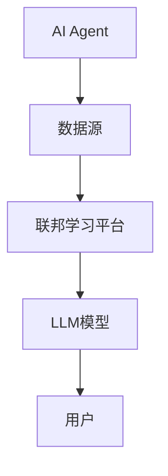
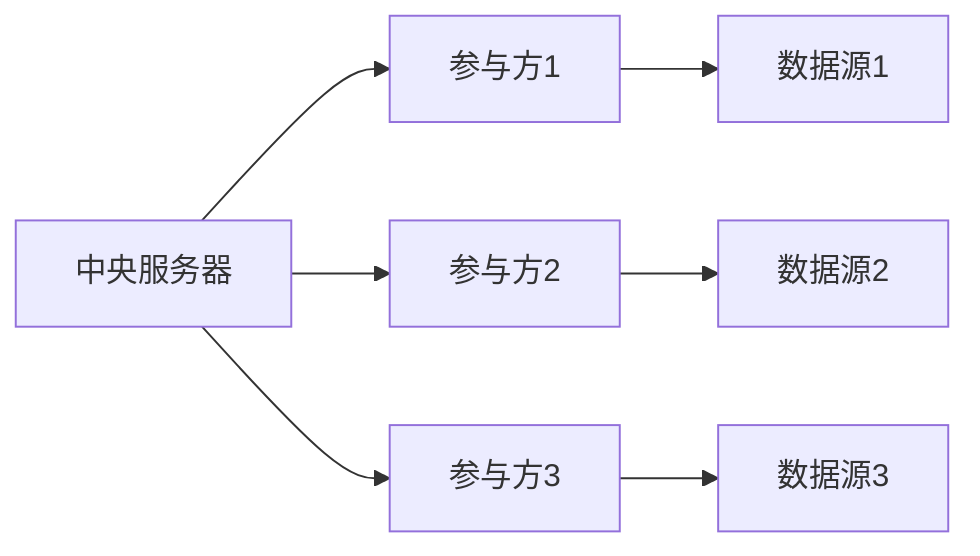
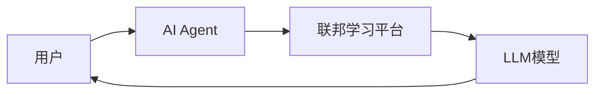

                 


# AI Agent的联邦学习：保护隐私的分布式LLM训练

> 关键词：AI Agent、联邦学习、分布式训练、隐私保护、LLM、数据协作

> 摘要：本文探讨了在保护隐私的前提下，通过联邦学习技术实现分布式大语言模型（LLM）训练的方法。文章首先介绍了背景，分析了AI Agent和联邦学习的核心概念，随后详细讲解了算法原理、系统架构设计、项目实战和最佳实践。通过理论与实践结合，展示了如何在保护数据隐私的同时，高效地进行大规模模型训练。

---

# 第一部分: 背景介绍

## 第1章: 问题背景与描述

### 1.1 问题背景

#### 1.1.1 分布式AI训练的需求
在人工智能领域，模型训练通常需要大量的数据。然而，数据可能分布在不同的机构或设备中，形成数据孤岛。传统的集中式训练方式不仅难以实现，还可能面临数据泄露的风险。因此，分布式训练的需求日益迫切。

#### 1.1.2 隐私保护的重要性
随着数据隐私问题的日益突出，如何在不暴露原始数据的情况下进行模型训练成为一个重要课题。保护隐私不仅是法律要求，也是用户信任的基础。

#### 1.1.3 联邦学习的提出与目标
联邦学习（Federated Learning）是一种新兴的分布式机器学习技术，旨在在保持数据本地化的同时， collaboratively training a shared model across multiple parties. 其目标是在不共享原始数据的情况下，通过加密通信和模型更新，实现全局模型的优化。

### 1.2 问题描述

#### 1.2.1 当前AI训练中的隐私挑战
- 数据孤岛问题：数据分散在不同的地方，难以集中处理。
- 数据泄露风险：集中式训练可能面临数据泄露。
- 隐私保护需求：用户希望数据不被滥用，同时模型仍能有效训练。

#### 1.2.2 分布式训练中的数据孤岛问题
数据孤岛指的是数据无法在不同机构或设备间共享，导致模型训练效率低下，甚至无法进行大规模训练。

#### 1.2.3 联邦学习的定义与范围
联邦学习是一种分布式机器学习技术，允许多个参与方在不共享原始数据的情况下， collaboratively training a shared model. 其范围包括数据分布、模型同步、隐私保护等多个方面。

### 1.3 问题解决与边界

#### 1.3.1 联邦学习如何解决隐私问题
通过加密通信和模型更新，联邦学习可以在不共享数据的情况下，实现模型的共同优化。

#### 1.3.2 分布式训练的边界与限制
- 数据隐私保护的边界：确保数据不被泄露。
- 计算资源的限制：分布式训练需要足够的计算资源。
- 模型收敛性：分布式训练可能会影响模型的收敛速度和精度。

#### 1.3.3 联邦学习的应用场景与外延
- 医疗领域：保护患者隐私，同时训练医疗模型。
- 金融领域：保护客户数据，同时优化金融模型。
- 智能设备：在物联网中进行分布式训练，提升设备智能化水平。

## 第2章: 核心概念与联系

### 2.1 核心概念原理

#### 2.1.1 AI Agent的基本概念
AI Agent是一种智能体，能够感知环境并采取行动以实现目标。在联邦学习中，AI Agent可以作为数据提供者，参与模型训练。

#### 2.1.2 联邦学习的核心机制
联邦学习通过加密通信和模型同步，实现多个参与方的模型训练。其核心机制包括数据预处理、模型更新、通信协议等。

#### 2.1.3 分布式LLM训练的原理
分布式LLM训练通过将模型参数分散在多个设备或机构中，利用联邦学习机制进行参数更新，最终得到一个全局模型。

### 2.2 核心概念对比

#### 2.2.1 AI Agent与传统AI的对比
| 特性 | AI Agent | 传统AI |
|------|-----------|--------|
| 数据所有权 | 数据分散，各机构拥有 | 数据集中，可能共享 |
| 隐私保护 | 高 | 低 |
| 可扩展性 | 高 | 中 |

#### 2.2.2 联邦学习与分布式训练的对比
| 特性 | 联邦学习 | 分布式训练 |
|------|----------|-----------|
| 数据共享 | 不共享原始数据 | 可能共享数据 |
| 隐私保护 | 高 | 中 |
| 模型更新 | 增量更新 | 全量更新 |

#### 2.2.3 LLM训练的隐私保护与性能对比
| 特性 | 集中式训练 | 联邦学习 |
|------|-------------|----------|
| 隐私保护 | 低 | 高 |
| 计算资源 | 高 | 中 |
| 模型精度 | 高 | 中高 |

### 2.3 ER实体关系图



---

# 第二部分: 算法原理

## 第3章: 联邦学习算法原理

### 3.1 算法概述

#### 3.1.1 联邦学习的基本流程
1. 初始化：每个参与方下载初始模型参数。
2. 数据预处理：对数据进行加密或匿名化处理。
3. 模型训练：在本地数据上训练模型，生成梯度或参数更新。
4. 模型同步：将更新后的参数发送到中央服务器，进行全局参数更新。
5. 模型评估：评估全局模型的性能，重复训练直到满足条件。

#### 3.1.2 联邦学习的通信机制
通信机制包括加密传输和差分隐私等技术，确保数据在传输过程中不被泄露。

#### 3.1.3 联邦学习的同步策略
同步策略包括同步更新和异步更新，前者需要所有参与方同时更新，后者允许异步更新，提高效率。

### 3.2 算法实现细节

#### 3.2.1 数据预处理与加密
数据预处理包括匿名化处理和加密，确保数据在传输过程中不被泄露。

#### 3.2.2 模型更新与同步
模型更新采用差分隐私技术，确保每次更新不会泄露参与方的原始数据。

#### 3.2.3 隐私保护机制
使用同态加密或差分隐私等技术，保护参与方的原始数据不被泄露。

### 3.3 算法流程图

```mermaid
graph LR
    S[开始] --> A[初始化模型参数]
    A --> B[数据预处理与加密]
    B --> C[模型训练]
    C --> D[生成梯度/参数更新]
    D --> E[模型同步]
    E --> F[全局模型更新]
    F --> G[模型评估]
    G --> H[满足条件？]
    H --> K[结束] if yes
    H --> C if no
```

### 3.4 算法数学模型

模型更新的数学公式如下：

$$
\theta_{t+1} = \theta_t + \sum_{i=1}^{n} \Delta\theta_i
$$

其中，$\theta_t$ 表示第 t 轮的模型参数，$\Delta\theta_i$ 表示第 i 个参与方的参数更新。

---

# 第三部分: 系统分析与架构设计

## 第4章: 系统架构设计

### 4.1 问题场景介绍

#### 4.1.1 多个机构协作训练LLM
多个机构（如医院、银行）协作训练一个大语言模型，同时保护各自的患者或客户数据。

#### 4.1.2 分布式训练中的数据隐私保护
确保每个机构的数据不被其他机构访问，同时训练出一个高性能的全局模型。

### 4.2 系统功能设计

#### 4.2.1 系统功能模块
- 数据管理模块：负责数据预处理和加密。
- 模型训练模块：负责本地模型训练和参数更新。
- 通信模块：负责模型同步和数据传输。
- 隐私保护模块：负责数据加密和隐私保护。

#### 4.2.2 系统功能流程
1. 数据预处理：对数据进行匿名化处理。
2. 模型训练：在本地数据上训练模型，生成参数更新。
3. 模型同步：将更新后的参数发送到中央服务器。
4. 全局模型更新：中央服务器汇总所有参数更新，生成新的全局模型。
5. 模型评估：评估全局模型的性能，决定是否继续训练。

### 4.3 系统架构设计

#### 4.3.1 系统架构图



#### 4.3.2 系统交互图



### 4.4 系统接口设计

#### 4.4.1 系统接口说明
- 数据接口：负责数据的上传、下载和处理。
- 模型接口：负责模型的训练、更新和评估。
- 通信接口：负责模型参数的同步和数据的传输。

#### 4.4.2 接口协议
- 数据传输采用HTTPS协议，确保数据安全。
- 模型同步采用加密通信，确保数据不被泄露。

### 4.5 系统实现细节

#### 4.5.1 系统实现步骤
1. 环境搭建：安装必要的库和工具。
2. 数据准备：收集和预处理数据。
3. 模型训练：实现本地模型训练和参数更新。
4. 模型同步：实现模型参数的加密传输和全局更新。
5. 模型评估：评估模型性能，优化参数。

#### 4.5.2 系统实现代码

```python
import numpy as np
from sklearn.linear_model import LinearRegression

# 初始化模型参数
theta = np.random.randn(2, 1)

# 数据预处理
X = np.array([[1, 2], [3, 4], [5, 6]])
y = np.array([7, 8, 9])

# 模型训练
model = LinearRegression()
model.fit(X, y)

# 模型更新
theta_updated = model.coef_.T
```

---

# 第四部分: 项目实战

## 第5章: 项目实战

### 5.1 环境安装

#### 5.1.1 安装Python
安装Python 3.8或更高版本。

#### 5.1.2 安装必要的库
安装numpy、scikit-learn、tensorflow等库。

```bash
pip install numpy scikit-learn tensorflow
```

### 5.2 核心代码实现

#### 5.2.1 数据准备
```python
import numpy as np

# 生成训练数据
X = np.random.rand(100, 2)
y = np.random.rand(100, 1)
```

#### 5.2.2 模型训练
```python
from sklearn.linear_model import LinearRegression

# 初始化模型
model = LinearRegression()

# 训练模型
model.fit(X, y)
```

#### 5.2.3 模型同步
```python
# 获取更新后的参数
theta_updated = model.coef_.T
```

#### 5.2.4 模型评估
```python
# 评估模型性能
score = model.score(X, y)
print(f"模型得分：{score}")
```

### 5.3 项目实战总结

#### 5.3.1 实战小结
通过项目实战，我们实现了联邦学习中的数据预处理、模型训练和模型同步，确保了数据隐私保护。

#### 5.3.2 实战经验
- 数据预处理是关键，需要确保数据安全。
- 模型同步需要考虑通信效率和数据隐私。
- 模型评估是优化的关键，需要不断调整参数。

---

# 第五部分: 最佳实践

## 第6章: 最佳实践

### 6.1 小结

#### 6.1.1 核心内容回顾
本文介绍了AI Agent的联邦学习，详细讲解了算法原理、系统架构设计和项目实战。

#### 6.1.2 关键点总结
- 数据隐私保护是核心，通过联邦学习实现。
- 分布式训练需要高效的通信机制和同步策略。
- 项目实战是理论与实践的结合，确保技术可行。

### 6.2 注意事项

#### 6.2.1 隐私保护
确保数据在传输和处理过程中不被泄露。

#### 6.2.2 计算资源
分布式训练需要足够的计算资源，确保训练效率。

#### 6.2.3 模型收敛
分布式训练可能会影响模型收敛速度，需要调整参数。

### 6.3 拓展阅读

#### 6.3.1 推荐书籍
- 《Federated Learning: Challenges, Mathematics and Perspectives》
- 《Distributed Machine Learning: A Comprehensive Survey》

#### 6.3.2 推荐论文
- "Communication-Efficient Learning of Linear Models over Distributed Data"（NIPS 2012）
- "Secure Multi-party Computation Meets Machine Learning"（ACM SIGSAC 2019）

---

# 结语

通过本文的介绍，我们深入探讨了AI Agent的联邦学习，详细讲解了算法原理、系统架构设计和项目实战。希望读者能够通过本文，理解如何在保护隐私的前提下，高效地进行分布式大语言模型训练。未来，随着技术的发展，联邦学习将在更多领域得到应用，推动人工智能的发展。

