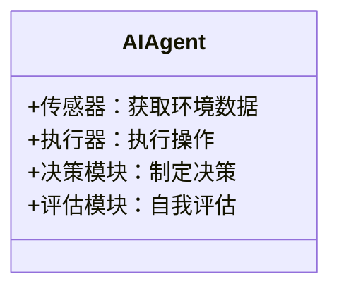

                 


# AI Agent的自我评估机制：持续改进性能

> **关键词**：AI Agent，自我评估，机器学习，强化学习，持续改进

> **摘要**：本文深入探讨了AI Agent的自我评估机制，分析其在持续改进性能中的作用。通过背景介绍、核心概念、算法原理、系统设计、项目实战和最佳实践等多方面，详细阐述了自我评估机制的实现方法和应用场景，帮助读者理解并掌握AI Agent的自我优化能力。

---

# 第一章: AI Agent的背景与自我评估机制的必要性

## 1.1 AI Agent的基本概念

### 1.1.1 什么是AI Agent
AI Agent（人工智能代理）是指能够感知环境、自主决策并执行任务的智能体。它通过传感器获取信息，利用算法处理数据，并通过执行器与环境交互。AI Agent广泛应用于自动驾驶、智能助手、机器人、推荐系统等领域。

### 1.1.2 AI Agent的核心特点
- **自主性**：无需外部干预，自主决策。
- **反应性**：能够实时感知环境变化并调整行为。
- **目标导向**：基于目标驱动行为，优化决策过程。
- **学习能力**：通过经验改进性能，适应复杂环境。

### 1.1.3 AI Agent的应用场景
- **自动驾驶**：实时感知环境，做出驾驶决策。
- **智能助手**：通过语音交互帮助用户完成任务。
- **机器人**：在制造业中执行精准操作。
- **推荐系统**：根据用户行为推荐个性化内容。

## 1.2 自我评估机制的必要性

### 1.2.1 为什么需要自我评估
AI Agent在动态环境中运行时，会面临不确定性、复杂性和多样性的挑战。为了持续改进性能，AI Agent需要能够自我评估，识别不足，并主动优化。

### 1.2.2 自我评估在AI Agent中的作用
- **实时反馈**：通过自我评估获得即时反馈，调整行为策略。
- **持续优化**：基于评估结果，改进算法和决策模型。
- **自适应能力**：适应环境变化，保持高性能。

### 1.2.3 自我评估的边界与外延
自我评估的边界包括数据来源、评估频率和评估范围。外延则涉及与其他机制（如外部评估、监督学习）的结合，形成完整的评估体系。

---

# 第二章: 自我评估机制的核心概念

## 2.1 自我评估的定义与分类

### 2.1.1 自我评估的定义
自我评估是指AI Agent通过内部机制，对自身行为、决策和性能进行分析和评价的过程。

### 2.1.2 自我评估的分类
- **基于反馈的评估**：利用环境反馈进行自我评估。
- **基于对比的评估**：通过与基准或理想结果进行对比。
- **基于强化学习的评估**：通过奖励机制优化行为。

### 2.1.3 各种评估方式的优缺点对比

| 评估方式 | 优点 | 缺点 |
|----------|------|------|
| 基于反馈 | 实时性强 | 可能存在噪声 |
| 基于对比 | 结果明确 | 计算量大 |
| 基于强化 | 激励优化 | 需要设计合理奖励 |

## 2.2 自我评估机制与外部评估机制的联系

### 2.2.1 自我评估与外部评估的对比
- **自我评估**：内部驱动，实时性强。
- **外部评估**：由外部系统提供反馈，结果客观。

### 2.2.2 自我评估的独立性与依赖性
- **独立性**：无需外部输入，自主完成评估。
- **依赖性**：依赖于内部算法和数据质量。

### 2.2.3 自我评估在闭环系统中的作用
在AI Agent的闭环系统中，自我评估负责实时调整参数，优化行为策略，确保系统高效运行。

---

# 第三章: 自我评估机制的算法原理

## 3.1 自我监督学习与自我评估

### 3.1.1 自我监督学习的原理
通过构建伪标签，利用未标记数据进行监督学习，提升模型泛化能力。

### 3.1.2 自我监督学习的流程
1. **数据预处理**：生成伪标签。
2. **模型训练**：利用伪标签进行监督学习。
3. **评估与优化**：通过评估结果优化伪标签生成策略。

### 3.1.3 自我监督学习的关键技术
- **对比学习**：通过对比特征相似性，增强模型表示能力。
- **生成对抗网络**：通过生成对抗，提升模型鲁棒性。

## 3.2 基于对比学习的自我评估

### 3.2.1 对比学习的定义
通过最大化正样本相似性和最小化负样本相似性，学习更好的表示。

### 3.2.2 对比学习在自我评估中的应用
- **特征学习**：提取更有区分度的特征。
- **样本分类**：通过对比损失优化分类性能。

### 3.2.3 对比学习的优缺点
- **优点**：提升模型表示能力。
- **缺点**：计算复杂度高。

## 3.3 强化学习中的自我评估

### 3.3.1 强化学习的定义
通过与环境交互，学习最优策略，最大化累积奖励。

### 3.3.2 自我评估在强化学习中的应用
- **奖励建模**：根据评估结果调整奖励函数。
- **策略优化**：通过评估结果优化策略参数。

---

# 第四章: 系统分析与架构设计

## 4.1 问题场景介绍
设计一个AI Agent，用于动态环境中任务执行，需要具备自我评估能力。

## 4.2 系统功能设计

### 4.2.1 领域模型设计


### 4.2.2 系统架构设计


### 4.2.3 系统接口设计
- **输入接口**：环境数据输入。
- **输出接口**：执行操作输出。
- **评估接口**：评估结果反馈。

### 4.2.4 交互流程图
```mermaid
sequenceDiagram
    AI Agent -> 感知环境：获取环境数据
    感知环境 -> AI Agent：返回数据
    AI Agent -> 制定决策：基于数据制定策略
    制定决策 -> AI Agent：返回决策结果
    AI Agent -> 执行操作：执行决策
    执行操作 -> 环境：改变环境状态
    环境 -> AI Agent：反馈结果
    AI Agent -> 自我评估：评估性能
```

---

# 第五章: 项目实战

## 5.1 环境安装
安装Python、TensorFlow、Keras等依赖库。

## 5.2 核心代码实现

### 5.2.1 自我评估模块代码
```python
def self_assessment(agent, target):
    # 计算评估指标
    metrics = calculate_metrics(agent, target)
    # 生成评估报告
    report = generate_report(metrics)
    return report
```

### 5.2.2 基于对比学习的评估代码
```python
def contrastive_learning(features):
    # 计算正样本相似性
    positive_similarity = features[i]与features[j]的相似性
    # 计算负样本相似性
    negative_similarity = features[k]与features[l]的相似性
    # 计算对比损失
    contrastive_loss =损失函数计算
    return contrastive_loss
```

## 5.3 案例分析
分析一个具体场景，如自动驾驶中的路径规划，展示自我评估机制如何优化决策过程。

---

# 第六章: 最佳实践与小结

## 6.1 小结
- 自我评估机制是AI Agent持续改进的核心。
- 通过多种评估方式和算法优化，提升性能。

## 6.2 注意事项
- 设计合理的评估指标，避免评估偏差。
- 结合具体场景，选择合适的评估方法。

## 6.3 拓展阅读
建议阅读相关领域的最新研究论文和技术博客，深入理解自我评估机制的应用。

---

# 附录: 术语表
- **AI Agent**：人工智能代理。
- **自我评估**：AI Agent对自身行为的分析与评价。
- **强化学习**：通过奖励机制优化决策策略。

---

通过以上结构，您可以逐步扩展每个部分的内容，深入分析AI Agent的自我评估机制，撰写一篇全面且专业的技术博客文章。

