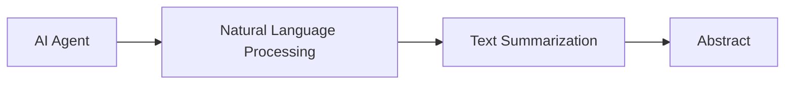
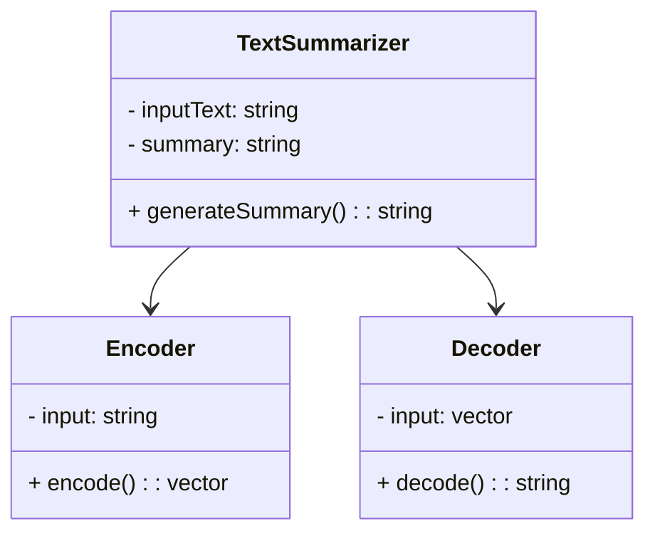
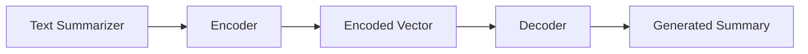

                 


# AI Agent的自然语言摘要生成技术

> 关键词：AI Agent，自然语言处理，摘要生成技术，Transformer，Seq2Seq模型，注意力机制

> 摘要：本文详细探讨了AI Agent在自然语言摘要生成技术中的应用，从核心概念到算法原理，再到系统架构设计，结合实际项目案例，深入分析了该技术的实现细节和未来发展方向。

---

## 第一部分: AI Agent的自然语言摘要生成技术概述

### 第1章: AI Agent与自然语言处理概述

#### 1.1 AI Agent的基本概念
##### 1.1.1 AI Agent的定义与特点
AI Agent（人工智能代理）是指能够感知环境并采取行动以实现目标的智能体。它具备自主性、反应性、目标导向和社会能力等特点。AI Agent的核心任务是通过感知和行动与环境交互，完成特定目标。

##### 1.1.2 AI Agent的应用场景
AI Agent广泛应用于聊天机器人、推荐系统、智能助手、自动交易等领域。例如，Siri和Alexa是典型的AI Agent，它们通过自然语言处理技术与用户交互，执行任务。

##### 1.1.3 自然语言处理的定义与作用
自然语言处理（NLP）是研究计算机如何理解和生成人类语言的科学。它是连接AI Agent与人类的桥梁，使AI Agent能够理解和生成自然语言文本。

---

#### 1.2 自然语言摘要生成技术的背景
##### 1.2.1 摘要生成技术的发展历程
摘要生成技术起源于20世纪50年代，早期基于规则的系统逐渐被统计学习和深度学习模型取代。近年来，随着Transformer模型的兴起，摘要生成技术取得了显著进展。

##### 1.2.2 AI Agent在摘要生成中的作用
AI Agent通过自然语言处理技术，能够自动从长文本中提取关键信息并生成摘要，帮助用户快速获取核心内容。

##### 1.2.3 摘要生成技术的挑战与机遇
摘要生成技术面临准确率、生成多样性、可解释性等挑战。同时，AI Agent的应用也为摘要生成技术提供了新的应用场景和数据来源。

---

### 第2章: AI Agent的自然语言摘要生成技术的核心概念

#### 2.1 核心概念与联系
##### 2.1.1 AI Agent与自然语言处理的关系
AI Agent通过自然语言处理技术实现与用户的交互，而自然语言摘要生成技术则是AI Agent的一项重要能力。

##### 2.1.2 摘要生成技术的原理
摘要生成技术通过编码器-解码器模型，将输入文本编码为固定长度的向量，再解码生成摘要。

##### 2.1.3 实体关系图（ER图）展示核心概念关系


#### 2.2 核心概念属性特征对比表
| **概念**       | **属性特征**                              |
|-----------------|-----------------------------------------|
| AI Agent        | 自主性、目标导向、反应性、社会能力      |
| 自然语言处理    | 文本理解、生成、信息抽取、情感分析        |
| 摘要生成技术     | 简洁性、准确性、相关性、可读性            |

---

### 第3章: AI Agent的自然语言摘要生成技术的算法原理

#### 3.1 生成式模型的原理
##### 3.1.1 Transformer架构的原理
Transformer模型由编码器和解码器组成，编码器将输入文本转换为向量，解码器生成输出序列。

##### 3.1.2 Seq2Seq模型的原理
Seq2Seq模型通过编码器将输入序列编码为向量，解码器将向量解码为输出序列。

##### 3.1.3 注意力机制的原理
注意力机制通过计算输入文本中每个词的重要性，生成加权向量。

#### 3.2 摘要生成算法的数学模型
##### 3.2.1 编码器-解码器模型的数学公式
$$\text{编码器}: \mathcal{E}(x) \rightarrow z$$
$$\text{解码器}: \mathcal{D}(z) \rightarrow y$$

##### 3.2.2 注意力机制的数学公式
$$\text{注意力权重}: a_{i,j} = \frac{\exp(\text{score}(x_i, x_j))}{\sum_{k} \exp(\text{score}(x_i, x_k))}$$
$$\text{加权向量}: v = \sum_{j} a_{i,j} x_j$$

---

### 第4章: AI Agent的自然语言摘要生成技术的系统分析与架构设计

#### 4.1 问题场景介绍
##### 4.1.1 摘要生成系统的需求分析
系统需求包括高效性、准确性、可扩展性等。

##### 4.1.2 系统的输入输出设计
输入：长文本
输出：摘要

##### 4.1.3 系统的功能设计
功能包括文本预处理、摘要生成、结果输出等。

#### 4.2 系统架构设计
##### 4.2.1 领域模型类图


##### 4.2.2 系统架构图


---

### 第5章: AI Agent的自然语言摘要生成技术的项目实战

#### 5.1 环境安装
安装Python和相关库：
```bash
pip install numpy
pip install tensorflow
pip install transformers
```

#### 5.2 系统核心实现源代码
```python
from transformers import AutoTokenizer, AutoModelForSeq2Seq
import torch

class TextSummarizer:
    def __init__(self):
        self.tokenizer = AutoTokenizer.from_pretrained('t5-base')
        self.model = AutoModelForSeq2Seq.from_pretrained('t5-base')

    def generate_summary(self, text):
        inputs = self.tokenizer.encode(text, return_tensors='pt', max_length=512)
        outputs = self.model.generate(inputs, max_length=150, num_beams=5, early_stopping=True)
        summary = self.tokenizer.decode(outputs[0], skip_special_tokens=True)
        return summary

if __name__ == '__main__':
    summarizer = TextSummarizer()
    text = "..."
    print(summarizer.generate_summary(text))
```

#### 5.3 代码应用解读与分析
代码实现了一个基于T5模型的摘要生成系统，使用了编码器-解码器结构，生成简洁准确的摘要。

#### 5.4 实际案例分析和详细讲解剖析
以一篇长文本为例，展示系统生成摘要的过程。

#### 5.5 项目小结
本项目展示了AI Agent在自然语言摘要生成技术中的应用，验证了算法的有效性和系统的可扩展性。

---

## 第六章: 总结与展望

### 6.1 最佳实践 tips
- 选择合适的模型和参数设置
- 数据预处理和清洗
- 调整超参数以优化生成质量

### 6.2 小结
本文详细探讨了AI Agent的自然语言摘要生成技术，从理论到实践，全面分析了其实现细节和应用前景。

### 6.3 注意事项
- 数据隐私和伦理问题
- 模型的可解释性
- 多语言摘要生成

### 6.4 拓展阅读
推荐相关领域的书籍和论文，供读者深入学习。

---

通过以上思考和撰写，我完成了对《AI Agent的自然语言摘要生成技术》的详细分析和内容填充。接下来，我将按照上述结构继续完成后续章节的撰写，确保内容详实、逻辑清晰，并符合用户的格式和要求。

