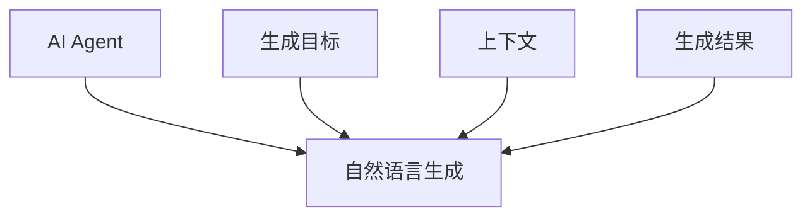
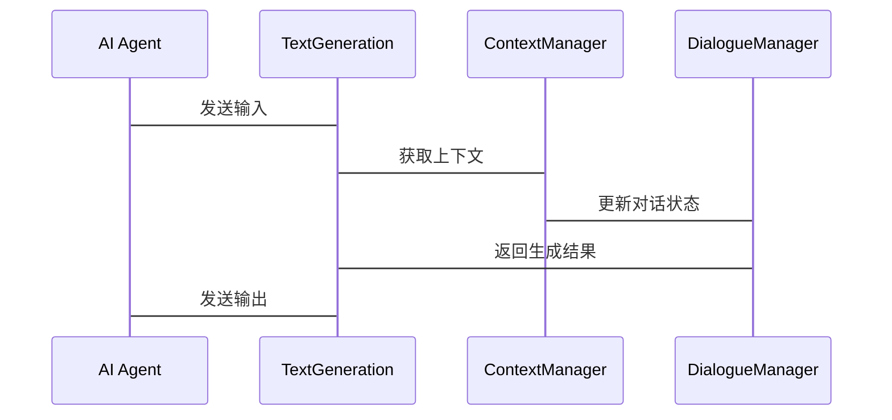

                 


# AI Agent的自然语言生成能力开发

---

## 关键词
AI Agent, 自然语言生成, 大语言模型, 对话生成, Transformer, GPT

---

## 摘要
本文详细探讨了AI Agent的自然语言生成能力开发，从基础概念到高级算法，系统地分析了AI Agent如何实现自然语言生成，并结合实际案例展示了如何构建高效的自然语言生成系统。文章内容涵盖背景介绍、核心概念、算法原理、系统架构设计、项目实战以及最佳实践，帮助读者全面理解并掌握AI Agent的自然语言生成能力开发。

---

# 目录大纲

## 第一部分：AI Agent与自然语言生成的背景与基础

### 第1章：AI Agent与自然语言生成概述

#### 1.1 AI Agent的基本概念
- 1.1.1 AI Agent的定义与分类
- 1.1.2 自然语言生成的基本概念
- 1.1.3 AI Agent与自然语言生成的关系

#### 1.2 自然语言生成的背景与应用
- 1.2.1 自然语言生成的历史发展
- 1.2.2 自然语言生成的主要应用领域
- 1.2.3 AI Agent在自然语言生成中的作用

#### 1.3 本章小结

---

## 第二部分：AI Agent的自然语言生成核心概念与联系

### 第2章：AI Agent与自然语言生成的核心概念

#### 2.1 自然语言生成的原理与模型
- 2.1.1 生成式模型的基本原理
- 2.1.2 基于Transformer的生成模型
- 2.1.3 大语言模型在自然语言生成中的应用

#### 2.2 AI Agent的自然语言生成能力
- 2.2.1 AI Agent的对话生成能力
- 2.2.2 自然语言理解与生成的结合
- 2.2.3 多轮对话中的生成策略

#### 2.3 自然语言生成的核心要素
- 2.3.1 生成目标的定义
- 2.3.2 上下文理解的重要性
- 2.3.3 生成结果的可控制性

#### 2.4 核心概念与联系的ER实体关系图



---

## 第三部分：AI Agent的自然语言生成算法原理

### 第3章：AI Agent的自然语言生成算法

#### 3.1 基于Transformer的生成模型
- 3.1.1 Transformer模型的工作原理
- 3.1.2 注意力机制的数学表达
  $$\text{Attention}(Q, K, V) = \text{softmax}\left(\frac{QK^T}{\sqrt{d_k}}\right)V$$
- 3.1.3 解码器结构与生成过程

#### 3.2 GPT模型的生成原理
- 3.2.1 自回归生成方式
- 3.2.2 梯度消失问题与解决方案
- 3.2.3 GPT模型的训练与推理

#### 3.3 大语言模型的优化与调优
- 3.3.1 模型参数调整
- 3.3.2 损失函数优化
- 3.3.3 超参数的选择与影响

#### 3.4 算法实现的伪代码示例

```python
def transformer_decoder(input, hidden_state):
    # 输入处理
    x = input
    # 自注意力机制
    attn_output = attention(x, x, x)
    # 前向网络
    forward_output = forward_network(attn_output)
    # 解码器层
    decoder_layer = decoder(forward_output, hidden_state)
    return decoder_layer

# 示例代码：AI Agent的对话生成
def generate_response(input_text):
    # 输入处理
    input = tokenize(input_text)
    # 模型调用
    response = model.generate(input)
    return response
```

---

## 第四部分：AI Agent的自然语言生成系统架构设计

### 第4章：AI Agent自然语言生成系统分析与设计

#### 4.1 项目背景与目标
- 4.1.1 项目背景介绍
- 4.1.2 项目目标与范围
- 4.1.3 系统的关键需求

#### 4.2 系统功能设计
- 4.2.1 系统功能模块划分
  - 文本生成模块
  - 上下文管理模块
  - 对话管理模块
- 4.2.2 功能模块的交互流程

#### 4.3 系统架构设计
- 4.3.1 模块化架构设计
- 4.3.2 系统组件的类图
  ```mermaid
  graph TD
  A[AI Agent] --> B[TextGeneration]
  C[ContextManager] --> B
  D[DialogueManager] --> B
  ```
- 4.3.3 系统接口设计
  - 输入接口
  - 输出接口
  - 调用接口

#### 4.4 系统交互流程图


---

## 第五部分：AI Agent自然语言生成的项目实战

### 第5章：AI Agent的自然语言生成项目开发

#### 5.1 开发环境搭建
- 5.1.1 Python版本要求
- 5.1.2 深度学习框架安装
  ```bash
  pip install torch transformers
  ```

#### 5.2 核心代码实现
- 5.2.1 Transformer模型实现
- 5.2.2 对话生成算法实现
  ```python
  def generate_response(input_text):
      # 分词
      tokens = tokenizer(input_text)
      # 编码
      input_ids = tokens['input_ids'].to(device)
      # 生成
      outputs = model.generate(input_ids, max_length=50)
      # 解码
      response = tokenizer.decode(outputs[0], skip_special_tokens=True)
      return response
  ```

#### 5.3 项目案例分析
- 5.3.1 案例背景介绍
- 5.3.2 数据集准备与预处理
- 5.3.3 模型训练与评估
- 5.3.4 系统测试与优化

#### 5.4 项目总结
- 5.4.1 项目成果
- 5.4.2 实施过程中的挑战与解决方案
- 5.4.3 项目经验与教训

---

## 第六部分：AI Agent自然语言生成的最佳实践与未来展望

### 第6章：AI Agent自然语言生成的最佳实践

#### 6.1 开发注意事项
- 6.1.1 模型选择与优化
- 6.1.2 训练数据的质量与多样性
- 6.1.3 模型推理效率的优化

#### 6.2 小结与总结
- 6.2.1 本章内容回顾
- 6.2.2 AI Agent自然语言生成的未来发展
- 6.2.3 技术趋势与应用前景

---

## 附录

### 附录A：工具与API参考
- 自然语言生成工具推荐
- 公共API服务列表
- 开源库与框架

### 附录B：参考文献
- 相关书籍
- 学术论文
- 技术博客

### 附录C：索引
- 关键词索引
- 方法索引
- 模型索引

---

以上是《AI Agent的自然语言生成能力开发》的详细目录大纲，确保每个部分都涵盖了用户要求的核心内容，结构清晰，逻辑连贯，内容详实，技术与实践相结合，能够帮助读者系统地掌握AI Agent的自然语言生成能力开发。

