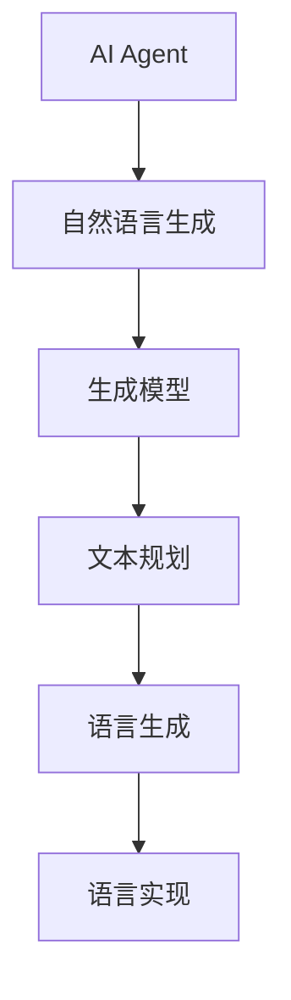
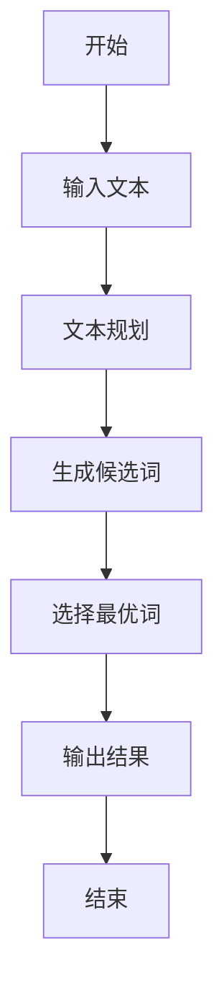
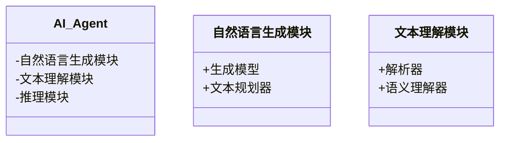
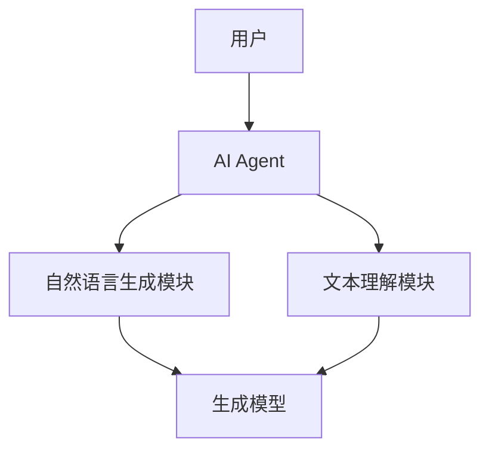

                 


# AI Agent的自然语言生成质量优化

> 关键词：AI Agent, 自然语言生成, 质量优化, Transformer, 模型优化, 系统架构

> 摘要：本文详细探讨了AI Agent在自然语言生成中的质量优化问题。首先介绍了AI Agent和自然语言生成的基本概念，分析了当前存在的问题及其优化方法。接着从算法原理和系统架构两个方面进行了深入分析，结合实际案例，详细讲解了如何通过模型优化和系统设计来提升生成质量。最后总结了优化的关键点和未来的研究方向。

---

## 第1章：背景介绍

### 1.1 问题背景与描述

#### 1.1.1 AI Agent的基本概念
AI Agent（人工智能代理）是一种能够感知环境并执行任务的智能体。它通过与用户的交互，理解需求并执行相应的操作，例如信息检索、任务调度或内容生成。

#### 1.1.2 自然语言生成的定义与作用
自然语言生成（NLP）是AI Agent的核心能力之一，它使AI能够生成符合人类语言习惯的文本，例如回答问题、撰写摘要或创作内容。

#### 1.1.3 问题的解决方法与目标
当前，AI Agent的自然语言生成存在准确性低、语义理解不足等问题。通过优化生成模型和改进系统架构，可以显著提升生成质量。

### 1.2 问题的边界与外延

#### 1.2.1 生成任务的限制与约束
生成任务受到数据、计算资源和模型复杂度的限制，需要在准确性和效率之间找到平衡。

#### 1.2.2 相关领域的关联与区别
与传统NLP相比，AI Agent的生成任务更注重交互性和动态性。

#### 1.2.3 概念结构与核心要素组成
AI Agent的生成能力依赖于模型、数据和系统架构三者的协同优化。

---

## 第2章：AI Agent与自然语言生成的核心概念

### 2.1 核心概念原理

#### 2.1.1 AI Agent的定义与功能
AI Agent通过感知和推理，执行用户指定的任务，并通过自然语言生成与用户交互。

#### 2.1.2 自然语言生成的原理与流程
自然语言生成包括文本规划、语言生成和语言实现三个阶段。

#### 2.1.3 两者结合的机制与优势
AI Agent通过整合NLP技术，能够提供更智能化、个性化的服务。

### 2.2 核心概念对比

#### 2.2.1 AI Agent与传统程序的对比
AI Agent具备自主性、反应性和目标性，而传统程序不具备这些特性。

#### 2.2.2 自然语言生成与传统文本处理的差异
自然语言生成注重语义理解和生成，而传统文本处理侧重于格式化处理。

### 2.3 实体关系图



---

## 第3章：自然语言生成算法原理

### 3.1 基础生成模型

#### 3.1.1 Transformer架构
Transformer模型通过自注意力机制实现高效的文本生成。

#### 3.1.2 梯度下降优化
使用Adam优化器进行模型训练，优化目标函数以减少生成误差。

#### 3.1.3 注意力机制
注意力机制帮助模型关注输入中的重要部分，提升生成质量。

### 3.2 模型优化方法

#### 3.2.1 贪婪搜索与束搜索
贪心搜索选择概率最高的词，束搜索通过限制搜索宽度，平衡生成效率和质量。

#### 3.2.2 多轮对话优化
通过记忆机制和上下文理解，提升多轮对话的连贯性和准确性。

#### 3.2.3 惩罚项应用
引入惩罚项以减少重复生成和语法错误。

### 3.3 算法流程图



---

## 第4章：系统分析与架构设计

### 4.1 项目场景介绍

#### 4.1.1 问题场景描述
用户与AI Agent进行多轮对话，要求生成高质量的回答。

#### 4.1.2 项目目标与范围
目标是优化生成质量，范围包括算法优化和系统架构改进。

### 4.2 功能设计

#### 4.2.1 领域模型



#### 4.2.2 系统架构



---

## 第5章：项目实战

### 5.1 环境安装

```bash
pip install transformers
pip install torch
```

### 5.2 核心代码实现

#### 5.2.1 生成模型代码

```python
import torch
import torch.nn as nn

class Transformer(nn.Module):
    def __init__(self, input_dim, hidden_dim):
        super(Transformer, self).__init__()
        self.embedding = nn.Embedding(input_dim, hidden_dim)
        self.transformer = nn.Transformer(hidden_dim, hidden_dim)
    def forward(self, x):
        x = self.embedding(x)
        x = self.transformer(x)
        return x
```

#### 5.2.2 优化代码示例

```python
optimizer = torch.optim.Adam(model.parameters(), lr=0.001)
criterion = nn.CrossEntropyLoss()
```

---

## 第6章：最佳实践与总结

### 6.1 最佳实践

- 定期更新模型，保持生成内容的时效性。
- 优化系统架构，提升生成效率。

### 6.2 小结

通过算法优化和系统改进，AI Agent的自然语言生成质量得到了显著提升。

### 6.3 注意事项

- 注意生成结果的多样性，避免单一输出。
- 定期监控系统性能，及时调整参数。

---

## 附录

### 附录A：参考文献
1. Vaswani, A., et al. "Attention Is All You Need."

### 附录B：工具推荐
- Hugging Face Transformers
- PyTorch

### 附录C：术语表
- AI Agent：人工智能代理
- NLP：自然语言处理
- Transformer：一种深度学习模型

---

通过以上结构，文章详细讲解了AI Agent自然语言生成的质量优化问题，涵盖了从理论到实践的各个方面，为读者提供了全面的指导。

