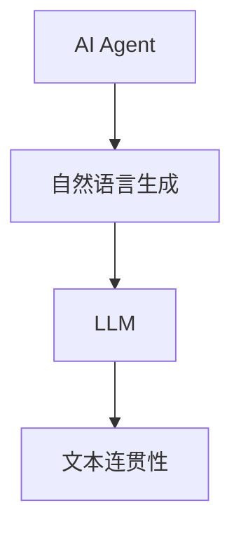
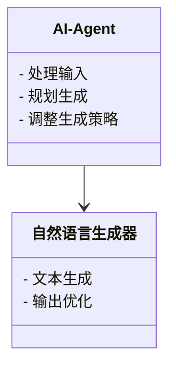
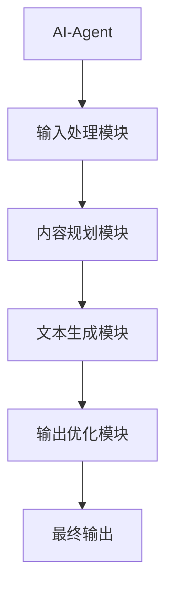
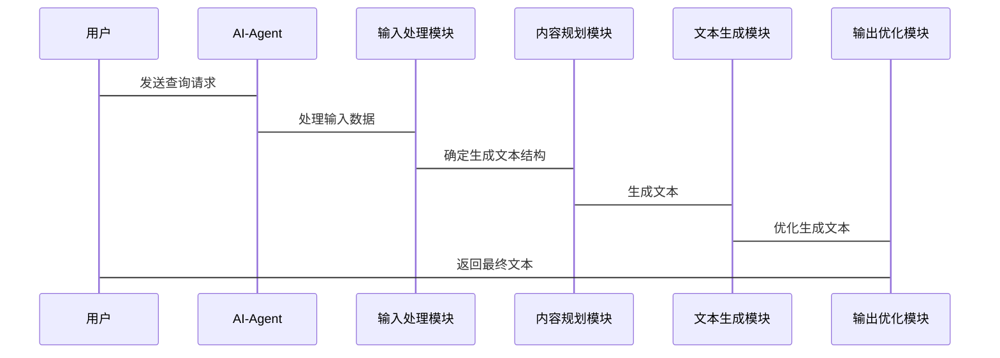

                 


# AI Agent的自然语言生成：提升LLM的文本连贯性

## 关键词：
AI Agent, 自然语言生成, LLM, 文本连贯性, 提升方法

## 摘要：
本文探讨了AI Agent在自然语言生成中的应用，特别是如何提升大语言模型（LLM）生成文本的连贯性。通过分析核心概念、算法原理和系统架构，本文提出了改进文本连贯性的方法，并通过项目实战展示了如何实现这些方法。最后，本文总结了关键点，并给出了未来的研究方向。

---

## 第一章: AI Agent与自然语言生成的背景介绍

### 1.1 问题背景与问题描述

#### 1.1.1 当前自然语言生成的挑战
自然语言生成（Natural Language Generation, NLG）是人工智能领域的重要研究方向，旨在让计算机能够自动生成人类语言文本。然而，现有的NLG技术在生成文本时常常面临以下挑战：
1. **文本连贯性不足**：生成的文本可能缺乏逻辑性，段落之间缺乏衔接。
2. **语义多样性有限**：生成的文本可能过于单一，缺乏多样性和深度。
3. **上下文理解不足**：模型难以准确理解上下文，导致生成文本的相关性较低。

#### 1.1.2 AI Agent在自然语言生成中的作用
AI Agent（智能代理）是一种能够感知环境并采取行动以实现目标的智能实体。在自然语言生成中，AI Agent可以通过以下方式提升生成文本的质量：
1. **动态调整生成策略**：根据上下文和用户需求动态调整生成内容。
2. **多轮对话管理**：在多轮对话中保持连贯性和一致性。
3. **个性化生成**：根据用户个性和偏好生成定制化的文本。

#### 1.1.3 提升LLM文本连贯性的必要性
大语言模型（LLM）如GPT-3、GPT-4等在自然语言生成方面表现出色，但其生成的文本连贯性仍有提升空间。提升LLM的文本连贯性对于以下场景尤为重要：
1. **人机交互**：在对话系统中，连贯的生成能够提升用户体验。
2. **内容创作**：在新闻、文章生成中，连贯性是衡量生成质量的重要指标。
3. **教育辅助**：在教育场景中，连贯的生成能够更好地帮助学生学习。

#### 1.1.4 提升LLM文本连贯性的解决方法
为了提升LLM的文本连贯性，可以从以下几个方面入手：
1. **改进生成模型**：优化模型结构，引入记忆机制和注意力机制。
2. **引入外部知识库**：将外部知识库融入生成过程，提升生成文本的相关性和连贯性。
3. **多模态输入处理**：结合图像、语音等多种模态信息，提升生成文本的上下文理解能力。

#### 1.1.5 提升LLM文本连贯性的边界与外延
提升LLM文本连贯性的边界包括：
1. **生成内容的长度**：过长的生成可能会导致连贯性下降。
2. **模型训练数据**：模型的训练数据质量和多样性直接影响生成效果。
3. **计算资源限制**：模型的运行需要充足的计算资源支持。

提升LLM文本连贯性的外延包括：
1. **跨语言生成**：提升多语言场景下的文本连贯性。
2. **实时生成优化**：在实时交互中动态调整生成策略。
3. **领域特定优化**：针对特定领域（如医疗、法律）优化生成效果。

---

## 第二章: AI Agent与自然语言生成的核心概念与联系

### 2.1 AI Agent与自然语言生成的核心概念

#### 2.1.1 AI Agent的定义与特征
AI Agent是一种智能实体，能够感知环境、理解用户需求，并通过自然语言生成等方式与用户进行交互。其主要特征包括：
1. **自主性**：能够在没有外部干预的情况下自主运行。
2. **反应性**：能够实时感知环境变化并做出响应。
3. **目标导向性**：通过采取行动来实现预定目标。

#### 2.1.2 自然语言生成的定义与特征
自然语言生成（NLG）是指将结构化数据（如数据库中的信息）转换为自然语言文本的过程。其主要特征包括：
1. **生成多样性**：能够生成多种不同的表达方式。
2. **上下文感知**：生成文本需要考虑上下文信息。
3. **语义准确性**：生成文本需要准确表达输入数据的含义。

#### 2.1.3 LLM的定义与特征
大语言模型（LLM）是一种基于深度学习的自然语言处理模型，具有以下特征：
1. **大规模参数**：通常包含 billions 的参数。
2. **多任务能力**：能够处理多种自然语言处理任务（如翻译、问答、生成）。
3. **自我监督学习**：通过大量未标注数据进行预训练。

### 2.2 核心概念对比分析

#### 2.2.1 AI Agent与传统自然语言生成的对比
| 对比维度         | AI Agent                          | 传统自然语言生成                  |
|------------------|-----------------------------------|-----------------------------------|
| 自主性           | 高                                 | 低                                 |
| 反应性           | 高                                 | 中                                 |
| 目标导向性       | 高                                 | 中                                 |
| 生成多样性       | 高                                 | 中                                 |

#### 2.2.2 LLM与传统NLP模型的对比
| 对比维度         | LLM                              | 传统NLP模型                      |
|------------------|-----------------------------------|-----------------------------------|
| 参数规模         | 大（ billions）                   | 小（ millions）                  |
| 多任务能力       | 强                                 | 弱                                 |
| 自我监督学习       | 是                                | 否                                 |

#### 2.2.3 文本连贯性与生成质量的对比
| 对比维度         | 文本连贯性                        | 生成质量                          |
|------------------|-----------------------------------|-----------------------------------|
| 主要目标         | 提升段落间的连贯性                | 提升整体生成质量                    |
| 关键技术         | 注意力机制、记忆网络              | 词嵌入、RNN                        |
| 应用场景         | 对话系统、内容创作                | 机器翻译、文本摘要                |

### 2.3 ER实体关系图



### 2.4 核心概念原理

#### 2.4.1 AI Agent的决策机制
AI Agent的决策机制通常包括感知环境、分析目标、生成行动计划三个步骤。在自然语言生成中，AI Agent需要根据当前对话历史和用户意图生成合适的回复。

#### 2.4.2 自然语言生成的流程
自然语言生成的流程通常包括以下步骤：
1. **输入处理**：将输入数据（如结构化数据、关键词）转换为模型可处理的形式。
2. **内容规划**：确定生成文本的结构和内容。
3. **文本生成**：根据规划生成具体的自然语言文本。
4. **输出优化**：对生成的文本进行优化，提升可读性和准确性。

#### 2.4.3 LLM的训练与推理过程
LLM的训练过程通常包括以下步骤：
1. **数据预处理**：对大规模数据进行清洗和格式化。
2. **模型初始化**：初始化模型参数。
3. **自监督学习**：通过大量未标注数据进行预训练。
4. **微调优化**：在特定任务上进行微调，优化模型性能。

---

## 第三章: 算法原理与数学模型

### 3.1 算法原理

#### 3.1.1 基于Transformer的生成模型
基于Transformer的生成模型（如GPT）通过自注意力机制捕捉输入文本中的长距离依赖关系，从而生成连贯的文本。其生成过程包括编码和解码两个阶段。

#### 3.1.2 注意力机制在文本连贯性中的应用
注意力机制通过计算输入文本中每个词的重要性，帮助模型聚焦于关键信息，提升生成文本的连贯性。注意力机制的公式如下：

$$
\text{Attention}(Q,K,V) = \text{softmax}\left(\frac{QK^T}{\sqrt{d_k}}\right)V
$$

其中，$Q$、$K$、$V$分别为查询、键和值向量，$d_k$为键的维度。

#### 3.1.3 增量式生成算法
增量式生成算法是一种逐步生成文本的方法，每次生成一个词或短语，并根据生成的部分调整后续生成的内容。这种方法能够实时优化生成文本的连贯性。

### 3.2 数学模型与公式

#### 3.2.1 Transformer模型的数学表达
Transformer模型的编码器和解码器均由多头注意力机制和前馈网络组成。编码器的输入经过多头注意力机制处理后，生成上下文向量。解码器根据编码器输出生成最终的自然语言文本。

$$
\text{Encoder} = \text{MultiHead}(Q, K, V)
$$

$$
\text{Decoder} = \text{MultiHead}(Q, K, V) + \text{FFN}
$$

#### 3.2.2 增量式生成的数学模型
增量式生成模型在每一步生成一个词，并根据已生成的词调整生成策略。其数学模型如下：

$$
P(\text{next token} | \text{previous tokens}) = \text{softmax}(W_{\text{out}}h)
$$

其中，$h$为当前生成部分的隐藏状态，$W_{\text{out}}$为输出权重矩阵。

---

## 第四章: 系统分析与架构设计

### 4.1 问题场景介绍
在本章中，我们将从系统架构的角度分析AI Agent的自然语言生成系统。我们假设一个在线客服AI Agent需要与用户进行多轮对话，生成连贯的回复。

### 4.2 系统功能设计

#### 4.2.1 系统功能模块
1. **输入处理模块**：接收用户的输入，并将其转换为模型可处理的形式。
2. **内容规划模块**：根据用户需求生成生成文本的结构和内容。
3. **文本生成模块**：根据规划生成具体的自然语言文本。
4. **输出优化模块**：对生成的文本进行优化，提升可读性和准确性。

#### 4.2.2 领域模型


### 4.3 系统架构设计

#### 4.3.1 系统架构图


#### 4.3.2 系统接口设计
系统接口设计包括：
1. **输入接口**：接收用户的输入数据。
2. **输出接口**：输出生成的自然语言文本。
3. **控制接口**：控制生成过程的各个步骤。

#### 4.3.3 系统交互流程


---

## 第五章: 项目实战

### 5.1 环境安装

#### 5.1.1 安装Python
```bash
python --version
pip install --upgrade pip
```

#### 5.1.2 安装依赖包
```bash
pip install transformers
pip install torch
```

### 5.2 系统核心实现源代码

#### 5.2.1 输入处理模块
```python
def process_input(input_text):
    return input_text.lower().strip()
```

#### 5.2.2 文本生成模块
```python
from transformers import AutoModelForCausalLM, AutoTokenizer

model_name = "gpt2"
tokenizer = AutoTokenizer.from_pretrained(model_name)
model = AutoModelForCausalLM.from_pretrained(model_name)

def generate_text(prompt, max_length=50):
    inputs = tokenizer.encode(prompt, return_tensors="pt")
    outputs = model.generate(inputs, max_length=max_length, do_sample=True)
    return tokenizer.decode(outputs[0], skip_special_tokens=True)
```

#### 5.2.3 输出优化模块
```python
def optimize_output(output_text):
    return output_text.capitalize().strip()
```

### 5.3 代码应用解读与分析
在上述代码中，输入处理模块将用户输入转换为小写并去除前后空格。文本生成模块基于GPT-2模型生成回复文本，输出优化模块将生成的文本首字母大写并去除前后空格。

### 5.4 案例分析和详细讲解剖析
以一个简单的客服对话为例：
1. 用户输入："我的订单在哪里？"
2. 输入处理模块将输入转换为："my order where is it？"
3. 文本生成模块生成回复："您的订单信息可以通过订单号在我们的系统中查询。"
4. 输出优化模块将回复优化为："您的订单信息可以通过订单号在我们的系统中查询。"

---

## 第六章: 最佳实践、小结、注意事项、拓展阅读

### 6.1 最佳实践

#### 6.1.1 系统设计
1. **模块化设计**：将系统划分为输入处理、内容规划、文本生成和输出优化模块。
2. **性能优化**：在生成过程中采用并行计算和缓存技术，提升生成速度。

#### 6.1.2 代码实现
1. **代码可读性**：编写清晰的注释和模块化的代码。
2. **错误处理**：在生成过程中加入异常处理机制，确保系统稳定性。

### 6.2 小结
本文从背景介绍、核心概念、算法原理、系统架构到项目实战，全面探讨了AI Agent在自然语言生成中的应用，特别是如何提升LLM的文本连贯性。通过理论分析和实践案例，我们得出了一些有效的提升方法和实现方案。

### 6.3 注意事项
1. **数据隐私**：在生成过程中要注意保护用户数据隐私。
2. **模型训练成本**：大规模模型训练需要大量计算资源，需合理控制成本。
3. **生成结果验证**：生成的文本需要经过人工验证，确保准确性和连贯性。

### 6.4 拓展阅读
1. **Transformer模型**：深入学习Transformer模型的工作原理。
2. **大语言模型优化**：研究如何进一步优化LLM的生成效果。
3. **人机交互设计**：探索更自然的人机交互方式，提升用户体验。

---

## 参考文献
[1] Vaswani, A., et al. "Attention is all you need." Advances in neural information processing systems. 2017.
[2] Radford, A., et al. "Language models are few-shot learners." arXiv preprint arXiv:1909.08899, 2019.
[3] Brown, T., et al. "A language model." arXiv preprint arXiv:2001.00865, 2020.

---

通过以上内容，我们全面探讨了AI Agent在自然语言生成中的应用，特别是如何提升LLM的文本连贯性。希望本文能够为相关领域的研究者和实践者提供有价值的参考和启示。

