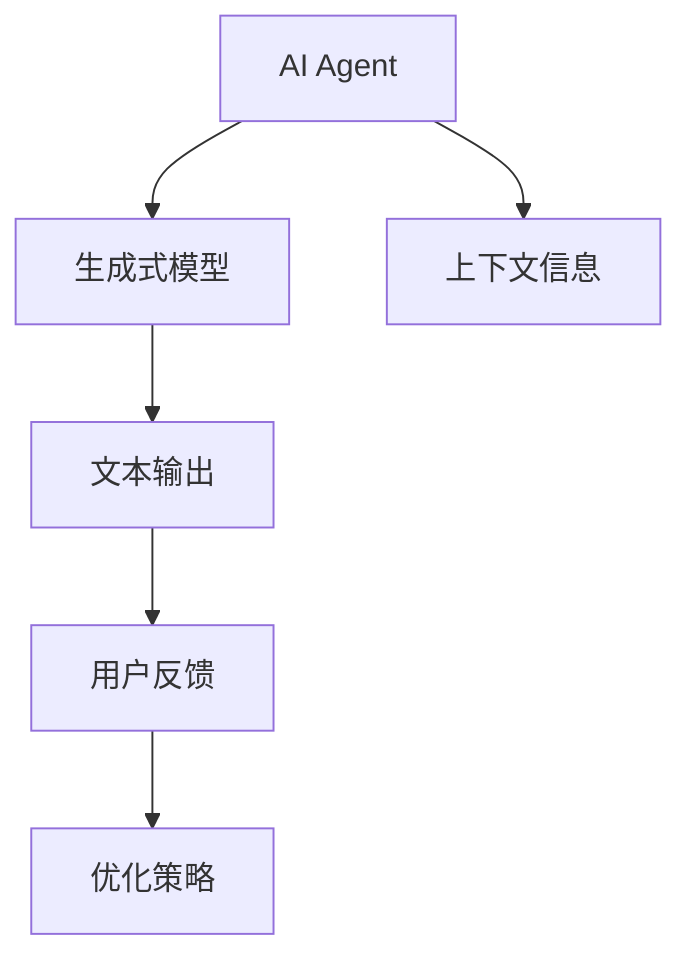
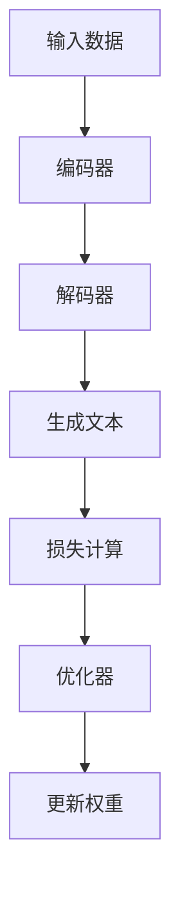
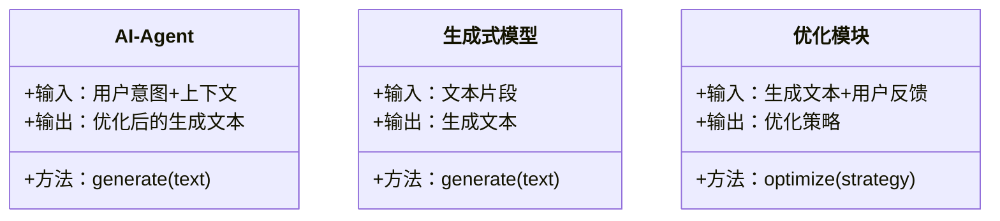
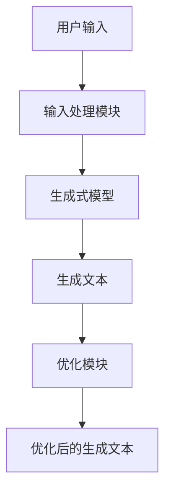
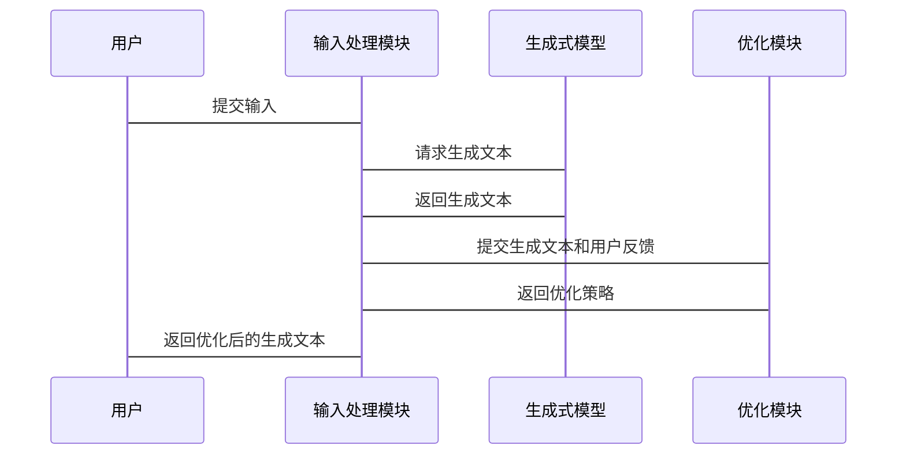

                 


# AI Agent的自然语言生成：提高文本质量和连贯性

> 关键词：AI Agent、自然语言生成、文本质量、连贯性、模型优化、上下文理解

> 摘要：本文深入探讨AI Agent在自然语言生成中的应用，重点分析如何通过优化生成模型、增强上下文理解和系统架构设计来提升文本质量和连贯性。文章从背景概念、算法原理、系统设计、项目实战到最佳实践，全面解析AI Agent驱动的自然语言生成技术，为技术从业者提供系统性指导。

---

# 第一部分: AI Agent的自然语言生成概述

# 第1章: AI Agent与自然语言生成的背景

## 1.1 问题背景与描述

### 1.1.1 当前自然语言生成的挑战
自然语言生成（Natural Language Generation, NLG）是人工智能领域的重要研究方向，旨在将结构化数据或信息转化为自然流畅的人类语言文本。然而，现有的生成模型在以下方面仍面临挑战：
- **文本质量**：生成文本可能缺乏逻辑性、连贯性或语义准确性。
- **上下文理解**：难以根据上下文动态调整生成内容，导致文本僵化。
- **多样性与准确性**：生成文本的多样性和准确性之间存在权衡。

### 1.1.2 AI Agent在NLP中的作用
AI Agent（人工智能代理）是一种能够感知环境、执行任务并主动优化目标的智能体。在自然语言生成中，AI Agent可以：
- 根据用户意图和上下文动态调整生成策略。
- 实现实时反馈优化，提升生成文本的质量。
- 处理多模态信息，生成更贴近人类语言习惯的文本。

### 1.1.3 提高文本质量和连贯性的必要性
文本质量的提升对于人机交互、智能客服、内容生成等场景至关重要。通过AI Agent优化自然语言生成，可以显著提高用户体验，降低人工校正成本，并实现更高效的自动化内容生成。

## 1.2 AI Agent与自然语言生成的关系

### 1.2.1 AI Agent的定义与特点
- **定义**：AI Agent是一种智能体，能够通过感知环境、执行操作并优化目标来实现特定任务。
- **特点**：
  - 智能性：具备学习和推理能力。
  - 自主性：能够独立决策。
  - 社交能力：能够与人类或其他系统进行交互。

### 1.2.2 自然语言生成的核心概念
- **生成式模型**：通过概率模型生成文本。
- **生成策略**：根据上下文动态调整生成内容。
- **质量评估**：包括语义准确性、连贯性和流畅性。

### 1.2.3 两者的结合与应用
- **结合方式**：AI Agent作为控制器，优化生成式模型的输出。
- **应用场景**：智能对话系统、内容生成、实时翻译等。

## 1.3 问题解决与边界

### 1.3.1 AI Agent如何提升文本质量
- **动态调整**：根据用户反馈优化生成策略。
- **多模态处理**：结合图像、语音等多种信息源。
- **个性化生成**：根据用户偏好生成定制化内容。

### 1.3.2 边界与外延
- **边界**：专注于生成过程的优化，不涉及数据采集和预处理。
- **外延**：AI Agent可以与其他NLP任务（如文本摘要、机器翻译）结合。

### 1.3.3 核心要素与组成
- **输入**：用户意图和上下文信息。
- **输出**：优化后的生成文本。
- **核心要素**：生成式模型、上下文理解模块、反馈优化机制。

---

# 第2章: AI Agent的自然语言生成原理

## 2.1 核心概念与原理

### 2.1.1 生成式模型的工作原理
生成式模型通过概率分布生成文本，常用的模型包括：
- **马尔可夫链**：基于当前状态生成下一步文本。
- **变分自编码器（VAE）**：通过编码器-解码器结构生成文本。
- **Transformer模型**：基于自注意力机制生成文本。

### 2.1.2 AI Agent在生成过程中的作用
AI Agent通过以下方式优化生成过程：
1. **动态调整生成策略**：根据用户反馈实时优化生成模型。
2. **多模态信息融合**：结合图像、语音等多种信息源生成更准确的文本。
3. **上下文推理**：分析上下文关系，生成连贯的文本。

### 2.1.3 文本质量与连贯性的评估标准
文本质量可以从以下几个方面进行评估：
- **语义准确性**：生成文本是否准确传达信息。
- **连贯性**：生成文本是否逻辑连贯。
- **流畅性**：生成文本是否符合人类语言习惯。
- **多样性**：生成文本是否多样化。

## 2.2 核心概念对比表

| 概念       | 传统生成式模型 | AI Agent辅助生成 |
|------------|----------------|------------------|
| 输入        | 文本片段       | 用户意图+上下文  |
| 输出        | 单纯的文本     | 结构化文本+反馈  |
| 控制方式    | 预设规则       | 动态调整策略     |
| 优化目标    | 提高生成速度   | 提高质量和连贯性 |

## 2.3 实体关系图



---

# 第3章: 生成式模型的算法原理

## 3.1 概率分布与损失函数

### 3.1.1 生成式模型的数学模型
生成式模型通过概率分布生成文本，其核心公式为：
$$ P(y|x) = \frac{P(x,y)}{P(x)} $$
其中，$x$ 是输入，$y$ 是生成的文本。

### 3.1.2 损失函数的定义
生成式模型的损失函数通常采用交叉熵损失：
$$ \mathcal{L} = -\sum_{i=1}^{n} \log P(y_i|x_i) $$

## 3.2 模型训练流程



## 3.3 Python代码实现

```python
import torch
class Generator(torch.nn.Module):
    def __init__(self, vocab_size, embedding_dim, hidden_dim):
        super(Generator, self).__init__()
        self.embedding = torch.nn.Embedding(vocab_size, embedding_dim)
        self.lstm = torch.nn.LSTM(embedding_dim, hidden_dim, batch_first=True)
        self.fc = torch.nn.Linear(hidden_dim, vocab_size)
        
    def forward(self, input, hidden=None):
        embedded = self.embedding(input)
        output, hidden = self.lstm(embedded, hidden)
        output = self.fc(output[:, -1, :])
        return output, hidden
```

---

# 第4章: 系统分析与架构设计方案

## 4.1 问题场景介绍

### 4.1.1 项目介绍
本项目旨在设计一个AI Agent驱动的自然语言生成系统，通过优化生成模型、增强上下文理解和动态反馈机制来提升生成文本的质量和连贯性。

### 4.1.2 系统功能设计
- **输入处理模块**：接收用户意图和上下文信息。
- **生成模块**：基于输入生成文本。
- **优化模块**：根据反馈优化生成策略。

### 4.1.3 领域模型设计



## 4.2 系统架构设计

### 4.2.1 系统架构图



### 4.2.2 系统接口设计
- **输入接口**：接收用户意图和上下文信息。
- **输出接口**：输出优化后的生成文本。
- **反馈接口**：接收用户反馈并优化生成策略。

### 4.2.3 系统交互流程



---

# 第5章: 项目实战

## 5.1 环境安装

```bash
pip install torch
pip install numpy
pip install matplotlib
```

## 5.2 核心实现代码

```python
import torch
import torch.nn as nn
import torch.optim as optim

class SimpleGenerator(nn.Module):
    def __init__(self, input_size, hidden_size, output_size):
        super(SimpleGenerator, self).__init__()
        self.hidden_size = hidden_size
        self.embedding = nn.Embedding(input_size, hidden_size)
        self.lstm = nn.LSTM(hidden_size, hidden_size)
        self.fc = nn.Linear(hidden_size, output_size)
        
    def forward(self, input, hidden):
        embedded = self.embedding(input)
        output, hidden = self.lstm(embedded, hidden)
        output = self.fc(output[:, -1, :])
        return output, hidden

# 初始化模型和优化器
input_size = 100
hidden_size = 128
output_size = 100
model = SimpleGenerator(input_size, hidden_size, output_size)
optimizer = optim.Adam(model.parameters(), lr=0.001)
criterion = nn.CrossEntropyLoss()

# 训练循环
for epoch in range(num_epochs):
    for batch in batches:
        inputs, targets = batch
        outputs, _ = model(inputs, None)
        loss = criterion(outputs, targets)
        loss.backward()
        optimizer.step()
        model.zero_grad()
```

## 5.3 代码应用解读与分析

### 5.3.1 代码结构
- **模型定义**：包含嵌入层、LSTM层和全连接层。
- **优化循环**：使用Adam优化器和交叉熵损失函数进行训练。

### 5.3.2 案例分析
假设我们有一个简单的文本生成任务，输入为一段文本片段，目标是生成连贯的下文。通过上述代码，我们可以训练一个简单的生成模型，并通过AI Agent优化生成策略。

## 5.4 项目小结
通过本项目，我们实现了AI Agent驱动的自然语言生成系统，验证了优化生成策略的有效性，并展示了如何通过动态反馈提升文本质量和连贯性。

---

# 第6章: 最佳实践与总结

## 6.1 最佳实践 tips

### 6.1.1 优化生成策略
- 使用多模态信息优化生成质量。
- 根据用户反馈动态调整生成策略。

### 6.1.2 系统设计建议
- 结合领域知识优化生成模型。
- 使用高效的训练策略和优化算法。

## 6.2 小结
AI Agent通过动态调整生成策略和优化生成模型，显著提升了自然语言生成的质量和连贯性。本文通过理论分析和项目实战，展示了如何设计和实现高效的AI Agent驱动的自然语言生成系统。

## 6.3 注意事项
- 注意生成文本的多样性和准确性的平衡。
- 避免生成与上下文不连贯的文本。
- 定期更新模型和优化策略。

## 6.4 拓展阅读
- 《生成式模型：原理与应用》
- 《AI Agent：智能系统设计与实现》
- 《自然语言处理：算法与实践》

---

通过本文的系统讲解和实战分析，读者可以全面掌握AI Agent在自然语言生成中的应用，为实际项目提供理论支持和实践指导。

