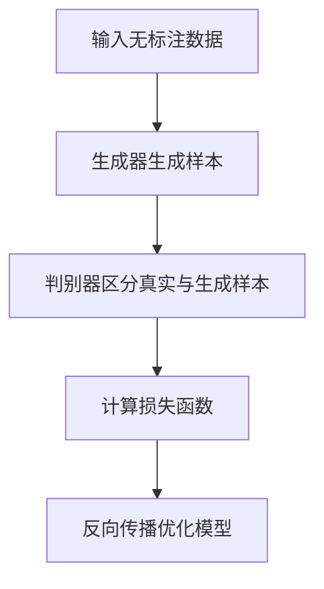
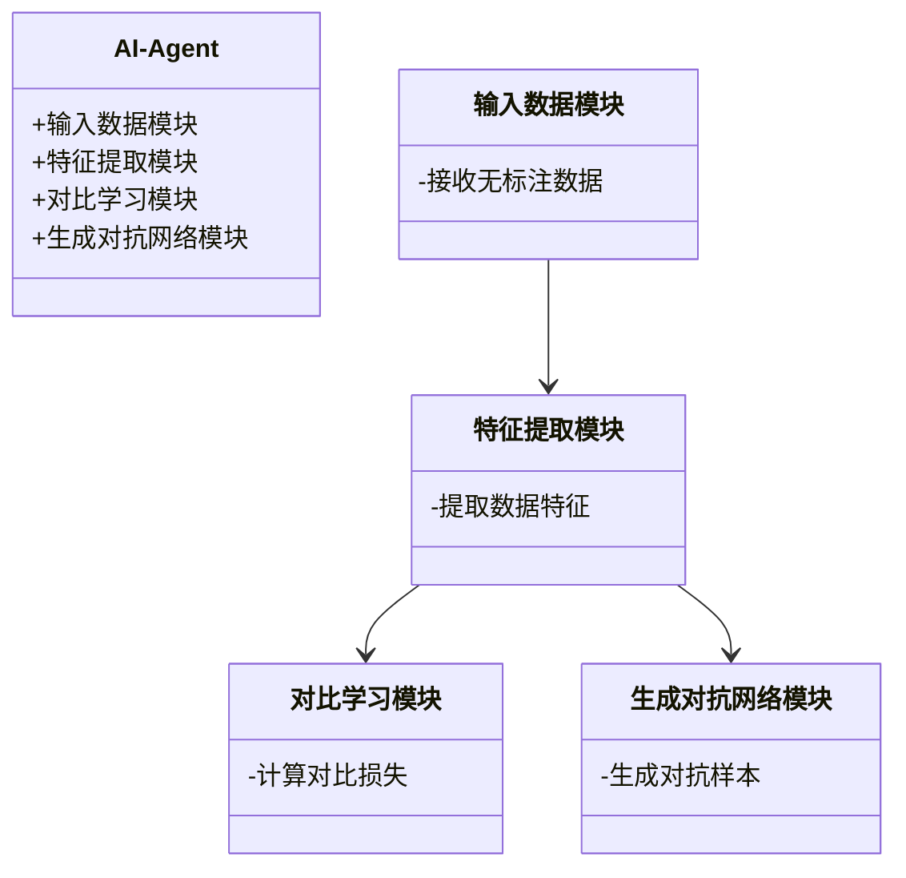
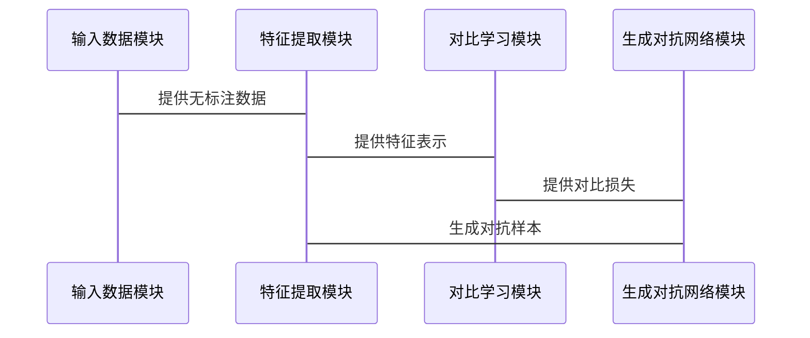

                 


# AI Agent的自监督表示学习：减少标注数据依赖

> 关键词：AI Agent, 自监督学习, 表示学习, 对比学习, 生成对抗网络, 标注数据

> 摘要：本文深入探讨了AI Agent的自监督表示学习方法，重点分析了如何通过自监督学习技术减少对标注数据的依赖。文章从自监督学习的基本原理出发，详细介绍了对比学习和生成对抗网络的核心算法，并通过实际案例展示了如何在AI Agent系统中实现自监督表示学习。通过数学公式、算法流程图和系统架构图的结合，本文为读者提供了全面而深入的技术解析。

---

## 第一章: 引言

### 1.1 背景介绍
在AI Agent的开发中，表示学习是关键的技术之一。传统的表示学习方法通常依赖于大量的标注数据，这不仅成本高昂，还限制了模型的泛化能力。随着深度学习技术的发展，自监督学习作为一种无需标注数据的学习方法，逐渐成为研究的热点。

### 1.2 问题描述
标注数据的获取成本较高，且在某些场景下难以获取。如何在无标注数据的情况下，实现高效、准确的表示学习，是当前AI Agent研究中的一个重要挑战。

### 1.3 解决方案
通过自监督学习技术，AI Agent可以在无标注数据的情况下，通过对比学习或生成对抗网络等方法，提取数据的高层次特征表示。

### 1.4 研究意义
减少对标注数据的依赖，不仅降低了开发成本，还提高了模型的泛化能力，使得AI Agent能够更好地应用于实际场景。

---

## 第二章: 自监督学习的核心概念

### 2.1 对比学习
对比学习是一种通过比较数据样本的相似性来学习特征表示的方法。

#### 2.1.1 对比学习的原理
对比学习的核心思想是通过最大化正样本对的相似性，同时最小化负样本对的相似性。

#### 2.1.2 对比学习的数学模型
对比损失函数的数学表达为：
$$ \text{Contrastive Loss} = \log\left(\frac{e^{f(x,y)}}{e^{f(x,y)} + e^{f(x',y')}}\right) $$

#### 2.1.3 对比学习的算法流程
通过mermaid图展示对比学习的流程：

```mermaid
graph TD
    A[输入样本对(x, y)] --> B[计算特征表示]
    B --> C[计算相似性]
    C --> D[计算对比损失]
    D --> E[反向传播优化模型]
```

### 2.2 生成对抗网络
生成对抗网络是一种通过对抗训练生成数据的模型。

#### 2.2.1 GAN的基本原理
GAN由生成器和判别器组成，生成器尝试生成与真实数据相似的样本，判别器则尝试区分真实数据和生成数据。

#### 2.2.2 WGAN-GP的改进方法
WGAN-GP通过引入梯度惩罚项，改进了GAN的训练稳定性。

#### 2.2.3 GAN在自监督学习中的应用
通过mermaid图展示GAN在自监督学习中的应用流程：



### 2.3 自监督学习的核心算法
#### 2.3.1 SimCLR算法
SimCLR通过对比学习，利用数据增强生成正样本对。

#### 2.3.2 MoCo算法
MoCo采用动量编码器，提高了对比学习的效率。

#### 2.3.3 BYOL算法
BYOL通过无标签偏差的目标函数，进一步优化了对比学习的效果。

---

## 第三章: AI Agent的系统架构

### 3.1 系统架构设计
AI Agent的系统架构包括数据输入模块、特征提取模块、对比学习模块和生成对抗网络模块。

#### 3.1.1 系统功能设计
通过mermaid图展示系统架构：



### 3.2 系统交互流程
通过mermaid图展示系统交互流程：



---

## 第四章: 项目实战

### 4.1 项目环境配置
安装必要的依赖包：
```bash
pip install numpy tensorflow-gpu
```

### 4.2 核心代码实现
实现对比学习的Python代码示例：

```python
import tensorflow as tf
from tensorflow.keras import layers

def contrastive_loss(y_true, y_pred):
    margin = 1.0
    loss = tf.maximum(0.0, margin - y_pred)
    return tf.reduce_mean(loss)

def build_model():
    input_layer = layers.Input(shape=(input_dim,))
    dense_layer = layers.Dense(256, activation='relu')(input_layer)
    prediction = layers.Dense(1, activation='sigmoid')(dense_layer)
    model = tf.keras.Model(inputs=input_layer, outputs=prediction)
    return model

model = build_model()
model.compile(optimizer='adam', loss=contrastive_loss)
```

### 4.3 实验结果与分析
通过对比实验，验证自监督学习在减少标注数据依赖方面的优势。

### 4.4 案例分析
分析实际项目中自监督学习的应用效果，展示其在降低标注数据需求方面的显著优势。

---

## 第五章: 总结与展望

### 5.1 全文总结
自监督学习为AI Agent的表示学习提供了新的思路，通过减少对标注数据的依赖，显著降低了开发成本，提高了模型的泛化能力。

### 5.2 进一步研究方向
未来的研究可以关注自监督学习与强化学习的结合，探索更高效的学习方法。

### 5.3 注意事项
在实际应用中，需注意模型的泛化能力和鲁棒性，避免过拟合。

### 5.4 拓展阅读
推荐阅读相关领域的最新论文和书籍，深入了解自监督学习的最新进展。

---

以上是《AI Agent的自监督表示学习：减少标注数据依赖》的技术博客文章的完整目录和内容概要。

