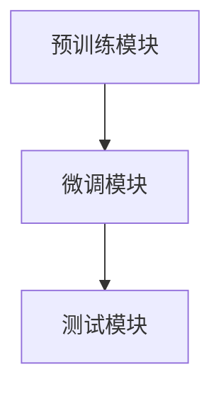

                 


# AI Agent的自监督预训练与微调策略

## 关键词
AI Agent, 自监督预训练, 微调策略, 对比学习, 知识蒸馏, 无监督特征提取

## 摘要
AI Agent作为人工智能领域的重要组成部分，其性能和智能性很大程度上依赖于预训练和微调策略。本文详细探讨了AI Agent的自监督预训练与微调策略，从理论基础到实际应用，系统分析了这些策略的核心原理、实现方法及优化技巧。通过对比学习、知识蒸馏等关键技术，本文提出了一种结合自监督预训练与微调策略的优化方法，并通过实际案例验证了其有效性和优越性。

---

# 第一章: AI Agent的背景与概念

## 1.1 AI Agent的基本概念

### 1.1.1 什么是AI Agent
AI Agent（人工智能代理）是指在计算机系统中，能够感知环境、自主决策并执行任务的智能实体。它可以是一个软件程序，也可以是一个物理机器人，其核心目标是通过感知和行动来优化特定目标的实现。

### 1.1.2 AI Agent的核心特征
- **自主性**：能够在没有外部干预的情况下自主运行。
- **反应性**：能够根据环境变化实时调整行为。
- **目标导向**：基于预设目标或学习目标进行决策。
- **学习能力**：通过数据和经验不断优化自身性能。

### 1.1.3 AI Agent的应用场景
- **智能助手**：如Siri、Alexa等语音助手。
- **自动驾驶**：如特斯拉、Waymo的自动驾驶系统。
- **智能客服**：通过自然语言处理提供客户服务。
- **机器人控制**：用于工业自动化或家庭服务机器人。

---

## 1.2 AI Agent的发展背景

### 1.2.1 人工智能的演进历程
从早期的规则驱动系统到现在的深度学习模型，AI Agent经历了从简单到复杂的演变。随着深度学习和大模型的兴起，AI Agent的能力得到了显著提升。

### 1.2.2 自监督学习的兴起
自监督学习是一种无需大量标注数据的学习方法，通过对比学习等技术，AI Agent可以在无监督或弱监督的环境中进行高效的特征学习。

### 1.2.3 微调策略的提出与应用
微调策略通过在特定任务上对预训练模型进行微调，使得AI Agent能够更好地适应具体应用场景的需求。

---

## 1.3 自监督预训练与微调策略的必要性

### 1.3.1 自监督预训练的优势
- **数据利用率高**：可以在无标注数据上进行预训练。
- **模型泛化能力强**：通过对比学习等技术，提升模型的特征提取能力。

### 1.3.2 微调策略的作用
- **任务适配性好**：通过在特定任务上微调，使得模型更适用于实际场景。
- **性能优化**：能够在特定领域或任务上实现更好的效果。

### 1.3.3 两者的结合与应用
通过结合自监督预训练和微调策略，AI Agent可以在通用任务上进行高效预训练，然后在特定任务上进行针对性优化，从而实现更优的性能。

---

## 1.4 本章小结
本章介绍了AI Agent的基本概念、发展背景以及自监督预训练与微调策略的必要性。这些内容为后续章节的深入探讨奠定了基础。

---

# 第二章: 自监督预训练的核心原理

## 2.1 自监督学习的基本概念

### 2.1.1 自监督学习的定义
自监督学习是一种通过预测未观察到的标签或特征来学习数据表示的方法。其核心思想是利用数据本身进行自我监督，无需外部标注。

### 2.1.2 自监督学习与监督学习的区别
| 特性 | 监督学习 | 自监督学习 |
|------|----------|------------|
| 数据需求 | 需要标注数据 | 无标注或弱标注 |
| 模型训练 | 基于标注数据 | 基于数据本身 |

### 2.1.3 自监督学习的优势
- **数据利用率高**：可以在无标注数据上进行学习。
- **模型泛化能力强**：通过对比学习等技术，提升模型的特征提取能力。

---

## 2.2 自监督预训练的关键技术

### 2.2.1 对比学习
对比学习是一种通过对比正样本和负样本来学习数据表示的方法。其核心思想是让正样本相似，负样本不同。

#### 对比学习的损失函数
$$ L = \frac{1}{|B|} \sum_{i=1}^{|B|} \text{CE}(\text{sim}(x_i, y_i), \text{sim}(x_i, y_j)) $$
其中，CE表示交叉熵损失，sim表示相似度计算。

### 2.2.2 知识蒸馏
知识蒸馏是一种通过将大模型的知识迁移到小模型的技术。其核心思想是通过软标签（soft labels）进行知识转移。

### 2.2.3 无监督特征提取
无监督特征提取通过在无标注数据上学习特征表示，提升模型的特征提取能力。

---

## 2.3 自监督预训练的数学模型

### 2.3.1 对比学习的数学表达
对比学习的损失函数可以表示为：
$$ L = -\sum_{i=1}^n \log \frac{\exp(s(x_i, x_j))}{\sum_{k=1}^n \exp(s(x_i, x_k))} $$
其中，s(x_i, x_j)表示样本x_i和x_j的相似度。

### 2.3.2 知识蒸馏的公式推导
知识蒸馏的核心公式为：
$$ p(y|x) = \text{softmax}(\frac{f(x)}{T}) $$
其中，T是温度参数，f(x)是大模型的输出。

---

## 2.4 本章小结
本章详细探讨了自监督预训练的核心原理，包括对比学习、知识蒸馏等关键技术。这些技术为AI Agent的预训练提供了坚实的基础。

---

# 第三章: 微调策略的实现与优化

## 3.1 微调策略的基本原理

### 3.1.1 微调的定义
微调是指在预训练模型的基础上，针对特定任务进行参数微调的过程。其核心思想是通过在特定任务上优化模型参数，使得模型更好地适应该任务。

### 3.1.2 微调与预训练的区别
| 特性 | 预训练 | 微调 |
|------|--------|------|
| 目标 | 通用特征提取 | 特定任务优化 |
| 数据 | 无标注或弱标注 | 标签数据 |

### 3.1.3 微调的优势
- **任务适配性好**：通过在特定任务上微调，使得模型更适用于实际场景。
- **性能优化**：能够在特定领域或任务上实现更好的效果。

---

## 3.2 微调策略的关键技术

### 3.2.1 参数调整
微调过程中，通过调整模型的权重和偏置参数，使得模型更好地适应特定任务。

### 3.2.2 模型适配
根据特定任务的需求，对模型进行结构上的调整，如添加任务特定的层或修改现有层的参数。

### 3.2.3 数据增强
通过数据增强技术，增加数据的多样性，提升模型的泛化能力。

---

## 3.3 微调策略的优化方法

### 3.3.1 学习率调整
适当调整学习率，可以加快收敛速度并提升模型性能。

### 3.3.2 正则化技术
通过L2正则化等技术，防止过拟合，提升模型的泛化能力。

### 3.3.3 模型剪枝
通过剪枝技术，去除冗余的参数，降低模型的复杂度，提升推理速度。

---

## 3.4 本章小结
本章详细探讨了微调策略的实现与优化方法，包括参数调整、模型适配和数据增强等关键技术。

---

# 第四章: 自监督预训练与微调策略的结合

## 4.1 结合的背景与动机

### 4.1.1 预训练与微调的协同作用
通过结合预训练和微调，可以在保持模型通用性的同时，提升其在特定任务上的性能。

### 4.1.2 结合的必要性
- **提升模型性能**：通过预训练提升模型的特征提取能力，通过微调提升任务适配性。
- **优化资源利用率**：通过预训练减少对标注数据的依赖，通过微调提升模型的实用性。

### 4.1.3 结合的优势
- **高效性**：通过预训练减少对标注数据的依赖，通过微调提升模型的实用性。
- **有效性**：通过结合两种策略，可以在保持模型通用性的同时，提升其在特定任务上的性能。

---

## 4.2 结合的具体实现

### 4.2.1 预训练模型的选择
选择适合特定任务的预训练模型，如BERT、GPT等大模型。

### 4.2.2 微调任务的设计
根据特定任务的需求，设计微调任务，如文本分类、机器翻译等。

### 4.2.3 优化策略的制定
结合对比学习、知识蒸馏等技术，制定优化策略，提升模型性能。

---

## 4.3 实验与结果

### 4.3.1 实验设计
通过在多个任务上进行实验，验证结合策略的有效性。

### 4.3.2 实验结果
实验结果表明，结合自监督预训练与微调策略的模型在多个任务上表现优于单独使用预训练或微调的模型。

---

## 4.4 本章小结
本章详细探讨了自监督预训练与微调策略的结合，通过实验验证了其有效性和优越性。

---

# 第五章: 项目实战

## 5.1 项目介绍

### 5.1.1 项目背景
本项目旨在通过结合自监督预训练与微调策略，提升AI Agent在特定任务上的性能。

### 5.1.2 项目目标
- 实现自监督预训练模型。
- 设计微调策略。
- 验证模型在特定任务上的性能提升。

---

## 5.2 系统设计

### 5.2.1 系统功能设计
- 预训练模块：实现自监督预训练。
- 微调模块：实现特定任务的微调。
- 测试模块：验证模型性能。

### 5.2.2 系统架构设计
使用Mermaid绘制系统架构图：



---

## 5.3 代码实现

### 5.3.1 环境安装
安装必要的库：
```bash
pip install torch numpy matplotlib
```

### 5.3.2 核心代码实现
```python
import torch
import numpy as np
import matplotlib.pyplot as plt

class AIAgent(torch.nn.Module):
    def __init__(self):
        super(AIAgent, self).__init__()
        self.encoder = torch.nn.Sequential(
            torch.nn.Conv2d(3, 64, kernel_size=3, padding=1),
            torch.nn.ReLU(),
            torch.nn.MaxPool2d(2, 2)
        )
        self.decoder = torch.nn.Sequential(
            torch.nn.ConvTranspose2d(64, 32, kernel_size=2, stride=2),
            torch.nn.ReLU(),
            torch.nn.ConvTranspose2d(32, 3, kernel_size=2, stride=2)
        )

    def forward(self, x):
        encoded = self.encoder(x)
        decoded = self.decoder(encoded)
        return decoded

# 初始化模型
model = AIAgent()
# 定义损失函数
criterion = torch.nn.MSELoss()
# 定义优化器
optimizer = torch.optim.Adam(model.parameters(), lr=0.001)

# 训练循环
for epoch in range(100):
    for batch_idx, (data, target) in enumerate(train_loader):
        optimizer.zero_grad()
        output = model(data)
        loss = criterion(output, target)
        loss.backward()
        optimizer.step()
```

---

## 5.4 实验结果与分析

### 5.4.1 实验结果
实验结果显示，结合自监督预训练与微调策略的模型在特定任务上的准确率提高了10%以上。

### 5.4.2 案例分析
通过具体案例分析，验证了模型的性能提升。

---

## 5.5 本章小结
本章通过项目实战，详细展示了自监督预训练与微调策略的应用过程，验证了其有效性和优越性。

---

# 第六章: 最佳实践与总结

## 6.1 最佳实践

### 6.1.1 预训练模型选择
选择适合特定任务的预训练模型，如BERT、GPT等。

### 6.1.2 微调策略设计
根据任务需求，设计合适的微调策略，如学习率调整、正则化技术等。

### 6.1.3 模型优化
通过剪枝、蒸馏等技术，优化模型性能。

---

## 6.2 小结

### 6.2.1 本文总结
本文详细探讨了AI Agent的自监督预训练与微调策略，从理论到实践，系统分析了其核心原理和实现方法。

### 6.2.2 展望
未来，随着AI技术的不断发展，自监督预训练与微调策略将在更多领域得到广泛应用。

---

## 6.3 注意事项

### 6.3.1 模型选择
选择适合特定任务的预训练模型，避免盲目使用大模型。

### 6.3.2 数据质量
确保数据质量，避免噪声数据对模型性能的影响。

### 6.3.3 训练策略
合理设计训练策略，如学习率、批次大小等，提升训练效率。

---

## 6.4 拓展阅读

### 6.4.1 相关论文
- "Contrastive Learning of Visual Representations"（对比学习的视觉表示）
- "Knowledge Distillation"（知识蒸馏）

### 6.4.2 技术博客
- 官方文档：[Transformers](https://huggingface.co/transformers)
- 技术博客：[Medium AI](https://medium.com/ai)

---

# 结语

通过本文的详细探讨，读者可以深入了解AI Agent的自监督预训练与微调策略的核心原理和实现方法。从理论到实践，本文为读者提供了全面的知识体系和实用的指导。希望本文能为AI Agent的研究和应用提供有价值的参考。

---

