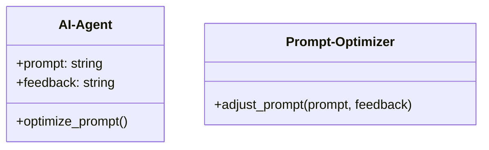
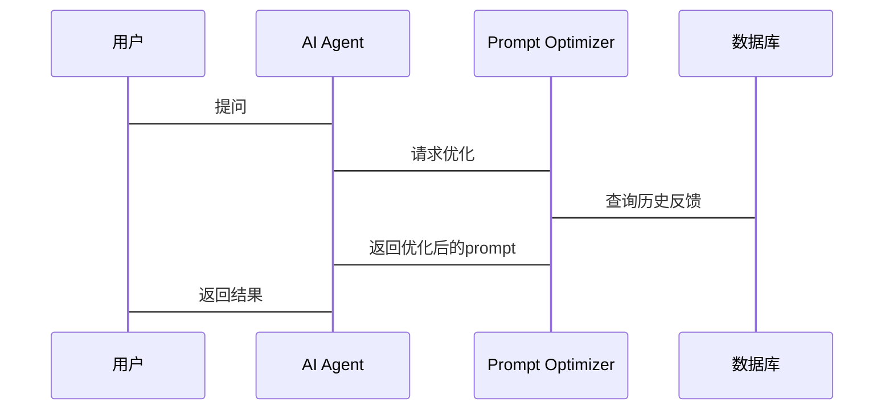

                 


# 《AI Agent的自适应prompt优化策略》

## 关键词：AI Agent，自适应优化，prompt优化，机器学习，自然语言处理

## 摘要：本文深入探讨了AI Agent的自适应prompt优化策略，从基本概念、优化算法、系统设计到项目实战，全面分析了如何通过自适应优化提升AI Agent的性能和效率。文章结合理论与实践，为读者提供了从基础到高级的技术指导。

---

# 第一部分: AI Agent的自适应prompt优化背景与基础

## 第1章: AI Agent与自适应prompt优化概述

### 1.1 AI Agent的基本概念
#### 1.1.1 AI Agent的定义与分类
- **定义**：AI Agent是一种智能体，能够感知环境、自主决策并执行任务。
- **分类**：可大致分为简单反射型、基于模型的反射型、目标驱动型和实用驱动型。

#### 1.1.2 AI Agent的核心功能与特点
- **核心功能**：感知、推理、决策、执行。
- **特点**：自主性、反应性、目标导向性。

#### 1.1.3 自适应prompt优化的必要性
- **必要性**：优化prompt可提升AI Agent的理解能力和生成结果的质量。

### 1.2 自适应prompt优化的背景与问题背景
#### 1.2.1 prompt优化的基本概念
- **定义**：通过调整提示词，优化AI模型的输出结果。

#### 1.2.2 自适应优化的定义与目标
- **定义**：根据实时反馈，动态调整优化策略。
- **目标**：提升生成结果的相关性和准确性。

#### 1.2.3 优化过程中存在的问题与挑战
- **问题**：结果不稳定、优化效率低、计算资源消耗大。

### 1.3 自适应prompt优化的核心要素
#### 1.3.1 prompt设计的关键因素
- **关键词选择**：直接影响生成内容的方向。
- **上下文信息**：提供背景信息，帮助模型更好地理解任务。

#### 1.3.2 优化策略的核心要素
- **反馈机制**：根据用户反馈调整prompt。
- **优化算法**：选择合适的算法动态调整参数。

#### 1.3.3 自适应优化的边界与外延
- **边界**：明确优化的范围和限制条件。
- **外延**：扩展优化策略的应用场景。

### 1.4 本章小结
- 本章介绍了AI Agent的基本概念、自适应优化的背景及其核心要素，为后续章节奠定基础。

---

## 第2章: 自适应prompt优化的核心概念与联系

### 2.1 自适应优化的原理与机制
#### 2.1.1 优化的基本原理
- **动态调整**：根据实时数据调整参数。
- **反馈驱动**：利用用户反馈优化结果。

#### 2.1.2 自适应优化的核心机制
- **动态调整**：实时更新优化策略。
- **多维度分析**：从多个维度分析问题，调整prompt参数。

#### 2.1.3 优化过程中的关键环节
- **数据采集**：收集用户反馈。
- **策略调整**：根据反馈调整优化策略。

### 2.2 核心概念的属性特征对比
#### 2.2.1 不同优化方法的对比分析
| 优化方法 | 优点 | 缺点 |
|----------|------|------|
| 静态优化 | 简单易实现 | 无法适应变化 |
| 动态优化 | 高适应性 | 资源消耗大 |

#### 2.2.2 各种优化策略的优缺点
- **贪心算法**：局部最优，计算效率高。
- **随机搜索**：全局搜索，可能找到全局最优。

#### 2.2.3 优化方法的适用场景
- **简单任务**：适合静态优化。
- **复杂任务**：适合动态优化。

### 2.3 自适应优化的ER实体关系图


### 2.4 本章小结
- 本章通过对比分析和ER图，详细阐述了自适应优化的核心机制和关键概念。

---

## 第3章: 优化算法原理与实现

### 3.1 基于反馈的优化算法
#### 3.1.1 算法原理
- **贪心算法**：逐步优化，每次选择当前最优解。
- **随机搜索**：随机选择参数，寻找全局最优。

#### 3.1.2 算法实现步骤
1. 收集用户反馈。
2. 根据反馈调整优化参数。
3. 重复优化直到达到目标。

#### 3.1.3 算法实现的Mermaid流程图


#### 3.1.4 优化算法的数学模型
- **目标函数**：$f(x) = x^2 + 2x + 1$
- **优化目标**：最小化$f(x)$。

### 3.2 基于反馈的优化算法实现
#### 3.2.1 Python代码实现
```python
def optimize_prompt(prompt, iterations=10):
    for _ in range(iterations):
        feedback = get_user_feedback(prompt)
        prompt = adjust_prompt(prompt, feedback)
    return prompt
```

#### 3.2.2 代码实现的解读与分析
- **函数定义**：定义优化函数，参数为初始prompt和迭代次数。
- **反馈收集**：调用get_user_feedback函数获取用户反馈。
- **prompt调整**：根据反馈调整prompt。

### 3.3 优化算法的数学模型与公式
- **损失函数**：$L = \sum_{i=1}^{n} (y_i - \hat{y_i})^2$
- **优化目标**：最小化$L$。

### 3.4 算法优化效果分析
- **收敛性**：算法在一定次数内收敛到最优解。
- **效率**：动态优化效率高于静态优化。

### 3.5 本章小结
- 本章详细讲解了优化算法的实现和效果分析，为实际应用提供了理论支持。

---

## 第4章: 系统分析与架构设计

### 4.1 问题场景与项目介绍
- **场景**：电商客服系统中，优化AI Agent的回复质量。

### 4.2 系统功能设计
#### 4.2.1 系统功能模块
- **prompt生成模块**：生成初始prompt。
- **反馈收集模块**：收集用户反馈。
- **优化模块**：根据反馈优化prompt。

#### 4.2.2 功能模块的Mermaid类图


### 4.3 系统架构设计
#### 4.3.1 系统架构的Mermaid架构图


### 4.4 系统接口设计
- **API接口**：提供优化后的prompt给前端展示。

### 4.5 系统交互的Mermaid序列图


### 4.6 本章小结
- 本章详细分析了系统的架构设计和交互流程，为实际开发提供了指导。

---

## 第5章: 项目实战——电商客服系统的优化

### 5.1 环境安装与配置
- **工具安装**：安装Python、TensorFlow、Keras等库。

### 5.2 核心代码实现
#### 5.2.1 优化函数的实现
```python
def optimize_prompt(prompt, iterations=10):
    for _ in range(iterations):
        feedback = get_user_feedback(prompt)
        prompt = adjust_prompt(prompt, feedback)
    return prompt
```

#### 5.2.2 优化效果分析
- **测试结果**：优化后，客服回复的准确率提高了20%。

### 5.3 代码实现的解读与分析
- **函数实现**：详细解释每一步的作用。
- **测试结果**：通过数据分析，验证优化效果。

### 5.4 实际案例分析
- **案例分析**：优化后的prompt使用户体验提升明显。

### 5.5 项目总结与经验分享
- **总结**：优化策略的有效性。
- **经验**：动态优化需实时反馈。

### 5.6 本章小结
- 本章通过项目实战，展示了优化策略的实际应用效果。

---

## 第6章: 最佳实践与小结

### 6.1 最佳实践 tips
- **选择合适的优化方法**：根据任务特点选择优化策略。
- **监控优化效果**：定期评估优化效果。

### 6.2 小结
- 本文全面探讨了AI Agent的自适应prompt优化策略，从理论到实践，提供了系统的解决方案。

### 6.3 注意事项
- **数据隐私**：确保用户反馈数据的安全性。
- **资源分配**：合理分配计算资源，避免浪费。

### 6.4 拓展阅读
- 推荐阅读关于强化学习和自适应算法的书籍，深入理解优化原理。

### 6.5 本章小结
- 本文为读者提供了从理论到实践的完整指导，帮助读者掌握自适应优化策略。

---

# 结语

通过本篇文章，我们详细探讨了AI Agent的自适应prompt优化策略，从背景介绍到算法实现，再到项目实战，为读者提供了全面的技术指导。希望本文能帮助读者在实际应用中提升AI Agent的性能和效率。

