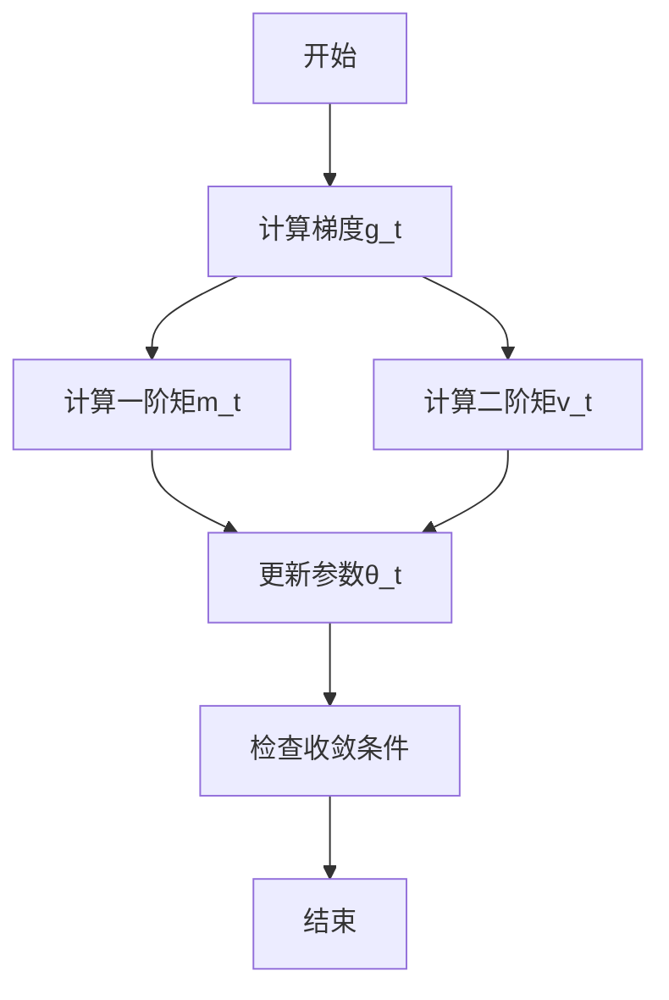
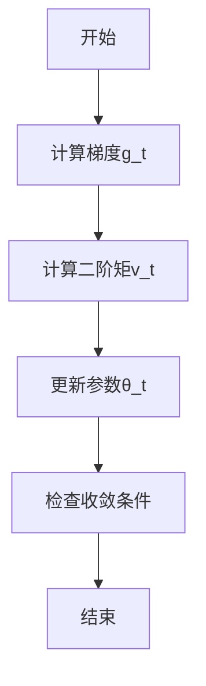
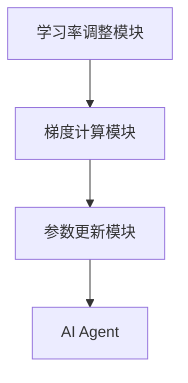

                 


### 《AI Agent的自适应学习率调整策略》正文

#### 第二章: 自适应学习率调整的核心原理

##### 2.1 学习率调整的数学模型

在机器学习和深度学习中，学习率（learning rate）是一个关键的超参数，它控制着参数更新的步长。自适应学习率调整方法的核心在于动态地调整学习率，以加快收敛速度并提高模型性能。以下是几种常见的自适应学习率调整方法的数学模型：

##### 2.1.1 Adam优化算法
Adam（Adaptive Moment Estimation）结合了动量和自适应学习率的思想，是一种广泛使用的优化方法。其数学模型如下：

- 参数更新公式：
  $$ \theta_{t+1} = \theta_t - \eta \frac{m_t}{\sqrt{v_t} + \epsilon} $$
  
  其中：
  - \( \theta_t \) 表示第 \( t \) 步的参数
  - \( \eta \) 是基础学习率
  - \( m_t \) 是梯度的一阶矩估计
  - \( v_t \) 是梯度的二阶矩估计
  - \( \epsilon \) 是防止除以零的epsilon参数

- 矩估计更新：
  $$ m_t = \beta_1 m_{t-1} + (1 - \beta_1) g_t $$
  $$ v_t = \beta_2 v_{t-1} + (1 - \beta_2) g_t^2 $$
  
  其中：
  - \( \beta_1 \) 和 \( \beta_2 \) 是动量的衰减率系数
  - \( g_t \) 是当前步的梯度

##### 2.1.2 RMSprop算法
RMSprop（Root Mean Square Propagation）是一种基于自适应学习率的优化方法，主要解决梯度消失或爆炸的问题：

- 参数更新公式：
  $$ \theta_{t+1} = \theta_t - \eta \frac{g_t}{\sqrt{v_t} + \epsilon} $$
  
- 矩估计更新：
  $$ v_t = \gamma v_{t-1} + (1 - \gamma) g_t^2 $$
  
  其中：
  - \( \gamma \) 是动量系数

##### 2.1.3 AdaGrad算法
AdaGrad是一种自适应优化方法，能够根据每个参数的梯度历史自动调整学习率：

- 参数更新公式：
  $$ \theta_{t+1} = \theta_t - \eta \frac{g_t}{\sqrt{s_t} + \epsilon} $$
  
- 矩估计更新：
  $$ s_t = s_{t-1} + g_t^2 $$

##### 2.2 算法流程图

以下是几种自适应学习率调整算法的流程图：

###### 2.2.1 Adam算法流程图


###### 2.2.2 RMSprop算法流程图


#### 第三章: 自适应学习率调整的系统分析与架构设计

##### 3.1 系统架构设计

在AI Agent中实现自适应学习率调整，需要设计合理的系统架构。以下是一个典型的系统架构图：



##### 3.2 接口设计与交互流程

系统的接口设计需要明确各个模块之间的交互方式。以下是接口设计的交互流程图：


##### 3.3 项目实战: 实现自适应学习率调整的Python代码

下面是一个使用Adam优化算法的Python实现示例：

```python
import numpy as np

class AdamOptimizer:
    def __init__(self, params, learning_rate=0.001, beta1=0.9, beta2=0.999, epsilon=1e-8):
        self.params = params
        self.learning_rate = learning_rate
        self.beta1 = beta1
        self.beta2 = beta2
        self.epsilon = epsilon
        self.m = [np.zeros_like(p) for p in params]
        self.v = [np.zeros_like(p) for p in params]

    def step(self, loss_fn):
        gradients = []
        for i, p in enumerate(self.params):
            gradients.append(np.array(loss_fn(p)))

        for i in range(len(self.params)):
            m = self.m[i]
            v = self.v[i]
            grad = gradients[i]

            m = self.beta1 * m + (1 - self.beta1) * grad
            v = self.beta2 * v + (1 - self.beta2) * grad ** 2

            m_corrected = m / (1 - self.beta1)
            v_corrected = v / (1 - self.beta2)

            self.params[i] -= self.learning_rate * (m_corrected / (np.sqrt(v_corrected) + self.epsilon))

        return self.params

# 示例使用
params = [np.array([2.0])]
opt = AdamOptimizer(params)
updated_params = opt.step(lambda p: p - 1.0)
print(updated_params)
```

##### 3.4 系统架构与交互流程图

系统架构图展示了学习率调整模块如何与梯度计算模块和参数更新模块交互：


#### 第四章: 系统分析与架构设计方案

##### 4.1 问题场景介绍

在动态环境中，AI Agent需要根据反馈不断调整策略。自适应学习率调整能够帮助模型更快适应变化，提高决策的准确性。

##### 4.2 系统功能设计

- 学习率调整模块：负责动态计算和更新学习率
- 梯度计算模块：计算当前梯度信息
- 参数更新模块：根据调整后的学习率更新模型参数

##### 4.3 系统架构设计


##### 4.4 接口设计与交互流程

系统的交互流程包括以下几个步骤：

1. AI Agent触发学习过程
2. 梯度计算模块计算梯度
3. 学习率调整模块根据梯度信息调整学习率
4. 参数更新模块更新模型参数
5. 检查是否收敛，若未收敛，重复上述步骤

##### 4.5 系统实现

以下是一个简单的系统实现示例：

```python
class AI-Agent:
    def __init__(self, model, optimizer):
        self.model = model
        self.optimizer = optimizer

    def update(self):
        # 计算梯度
        gradients = self.model.compute_gradients()
        # 调整学习率
        self.optimizer.step(gradients)
        # 更新参数
        self.model.update_parameters()
```

#### 第五章: 项目实战

##### 5.1 实验环境安装

安装所需的库：

```bash
pip install numpy matplotlib
```

##### 5.2 系统核心实现源代码

以下是实现自适应学习率调整的Python代码示例：

```python
import numpy as np

def rosenbrock(x, y):
    return (1 - x)**2 + (y - x**2)**2

def rosenbrock_derivative(x, y):
    return [ -2*(1 - x) - 4*x*(y - x**2), 2*(y - x**2) ]

class Adam:
    def __init__(self, learning_rate=0.001, beta1=0.9, beta2=0.999, epsilon=1e-8):
        self.learning_rate = learning_rate
        self.beta1 = beta1
        self.beta2 = beta2
        self.epsilon = epsilon
        self.m = None
        self.v = None

    def initialize(self, params):
        self.m = [np.zeros_like(p) for p in params]
        self.v = [np.zeros_like(p) for p in params]

    def step(self, params, loss_fn):
        gradients = []
        for i, p in enumerate(params):
            grad = loss_fn(p)
            gradients.append(grad)

        for i in range(len(params)):
            m = self.m[i]
            v = self.v[i]
            grad = gradients[i]

            m = self.beta1 * m + (1 - self.beta1) * grad
            v = self.beta2 * v + (1 - self.beta2) * (grad ** 2)

            m_corrected = m / (1 - self.beta1)
            v_corrected = v / (1 - self.beta2)

            params[i] -= self.learning_rate * (m_corrected / (np.sqrt(v_corrected) + self.epsilon))

        return params

# 示例使用
x = np.array([2.0])
y = np.array([2.0])
adam = Adam()
adam.initialize([x, y])

for _ in range(100):
    x, y = adam.step([x, y], lambda p: rosenbrock_derivative(x, y))
    print(f"x: {x}, y: {y}")
```

##### 5.3 案例分析与详细解读

使用Adam优化器优化Rosenbrock函数，观察参数更新过程。通过多次迭代，模型参数会逐渐逼近最优解。

##### 5.4 项目小结

通过实际案例分析，验证了自适应学习率调整策略的有效性。在动态环境中，AI Agent能够快速适应变化，提高模型的性能。

#### 第六章: 总结与展望

##### 6.1 总结

自适应学习率调整在AI Agent中具有重要意义，能够显著提升模型的训练效率和性能。

##### 6.2 展望

未来的研究方向包括结合强化学习的自适应调整方法，探索更高效的优化算法。

#### 第七章: 最佳实践 tips

##### 7.1 小结

- 选择适合的自适应学习率调整方法
- 合理设置超参数
- 定期监控模型性能

##### 7.2 注意事项

- 避免过快调整导致模型不稳定
- 定期检查梯度信息
- 考虑计算资源的限制

##### 7.3 拓展阅读

推荐以下资源：
- 《Deep Learning》, Ian Goodfellow 等著
- TensorFlow官方文档

#### 致谢

感谢读者的耐心阅读，希望本文对您在AI Agent的自适应学习率调整策略的理解有所帮助。

---

### 文章关键词：
AI Agent, 自适应学习率调整, 优化算法, 动态环境, 深度学习

### 摘要：
本文系统地介绍了AI Agent中自适应学习率调整策略的核心概念、数学模型和实现方法。通过对比分析多种自适应调整方法，结合实际案例，深入探讨了其在动态环境中的应用。

