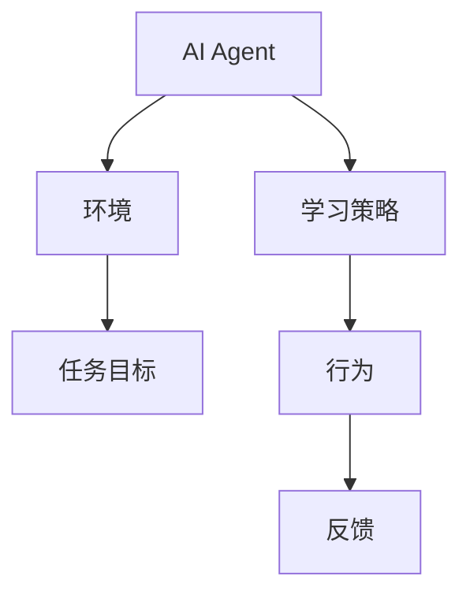
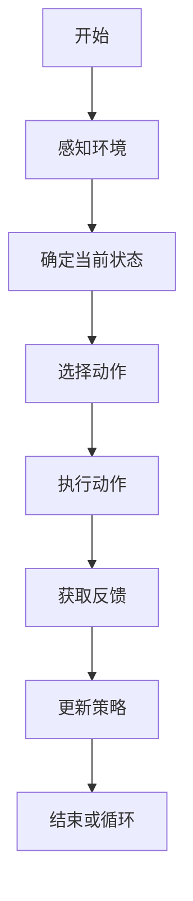
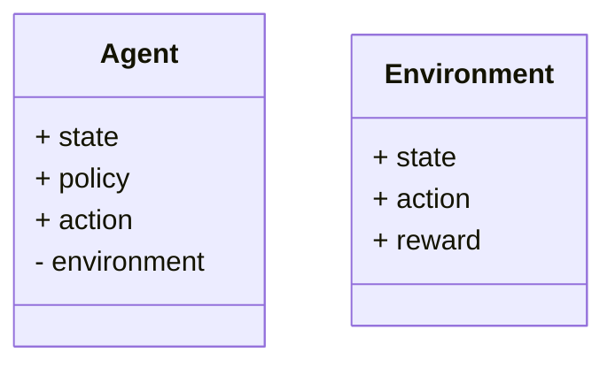
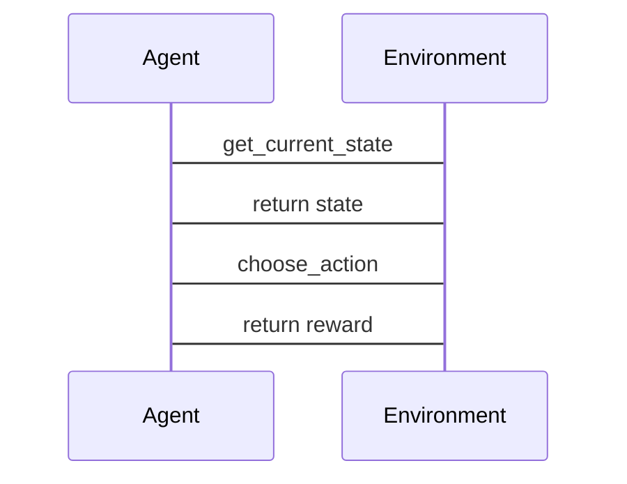

                 


# AI Agent的自适应学习策略动态调整

> 关键词：AI Agent, 自适应学习, 动态调整, 策略优化, 强化学习, 系统架构, 项目实战

> 摘要：本文深入探讨了AI Agent在动态环境中的自适应学习策略动态调整方法。通过分析问题背景、核心概念、算法原理、系统架构、项目实战及最佳实践，详细阐述了如何实现AI Agent的自适应学习能力，以应对复杂多变的环境挑战。文章内容包括从基础理论到实际应用的全链条分析，为AI Agent的开发与优化提供了系统化的指导。

---

## 第一部分: AI Agent的自适应学习策略动态调整背景与概念

### 第1章: 问题背景与描述

#### 1.1 问题背景
- **1.1.1 当前AI Agent的发展现状**
  AI Agent（智能体）作为人工智能的核心组成部分，广泛应用于自动驾驶、智能助手、推荐系统等领域。然而，现有AI Agent在动态环境中的适应性不足，难以应对实时变化的环境和任务需求。

- **1.1.2 自适应学习策略的必要性**
  在动态环境中，AI Agent需要实时调整其行为策略以应对变化。传统的静态策略无法满足动态环境的需求，因此需要引入自适应学习策略。

- **1.1.3 动态调整的现实需求**
  现实场景中，环境变化频繁，任务目标多样，AI Agent需要具备动态调整能力，以提高其在复杂环境中的表现。

#### 1.2 问题描述
- **1.2.1 AI Agent面临的动态环境挑战**
  动态环境中的不确定性、复杂性和不可预测性对AI Agent提出了更高的要求。

- **1.2.2 自适应学习的核心问题**
  如何设计高效的自适应学习算法，使AI Agent能够快速、准确地调整其策略。

- **1.2.3 动态调整的具体表现形式**
  动态调整可以通过参数更新、模型重训、策略切换等方式实现。

#### 1.3 问题解决思路
- **1.3.1 自适应学习的基本原理**
  自适应学习通过感知环境变化，调整学习策略，优化行为表现。

- **1.3.2 动态调整的实现方法**
  动态调整可以通过强化学习、元学习等方法实现。

- **1.3.3 策略优化的目标与路径**
  策略优化的目标是提高AI Agent在动态环境中的适应性和表现，路径包括算法改进、系统优化等。

#### 1.4 边界与外延
- **1.4.1 自适应学习的边界条件**
  自适应学习需要在特定范围内进行，超出范围可能导致策略失效。

- **1.4.2 动态调整的适用范围**
  动态调整适用于环境变化频繁、任务目标多样化的场景。

- **1.4.3 相关概念的区分与联系**
  区分自适应学习与强化学习、无监督学习等，明确其联系与区别。

#### 1.5 核心要素组成
- **1.5.1 学习策略的核心要素**
  包括目标函数、奖励机制、策略空间等。

- **1.5.2 动态调整的关键因素**
  包括环境反馈、策略评估、参数更新等。

- **1.5.3 系统架构的组成部分**
  包括感知模块、决策模块、执行模块等。

---

### 第2章: 核心概念与联系

#### 2.1 自适应学习策略的原理
- **2.1.1 知识表示与更新机制**
  知识表示是自适应学习的基础，更新机制决定了知识的更新速度和方式。

- **2.1.2 策略选择与优化方法**
  策略选择是自适应学习的关键，优化方法决定了策略的改进效果。

- **2.1.3 动态调整的实现机制**
  动态调整通过感知环境变化，调整策略参数，优化行为表现。

#### 2.2 核心概念对比
| 概念 | 描述 | 特征 |
|------|------|------|
| 自适应学习 | 根据环境变化调整学习策略 | 实时性、灵活性 |
| 动态调整 | 根据反馈调整行为策略 | 响应性、持续性 |

#### 2.3 实体关系图


---

## 第二部分: AI Agent的自适应学习策略动态调整算法原理

### 第3章: 算法原理

#### 3.1 算法流程


#### 3.2 算法实现代码
```python
def adaptive_learning_agent(environment):
    while True:
        state = environment.get_current_state()
        action = choose_action(state)
        reward = environment.execute_action(action)
        update_policy(reward)
```

#### 3.3 数学模型
- **策略评估公式**
  $$ V(s) = \max_a Q(s,a) $$
- **Q值更新公式**
  $$ Q(s,a) = Q(s,a) + \alpha (r + \gamma V(s')) - Q(s,a) $$

---

### 第4章: 数学模型

#### 4.1 策略评估
- **损失函数**
  $$ L = -\sum_{i=1}^n (y_i \log p_i + (1 - y_i) \log (1 - p_i)) $$
- **奖励函数**
  $$ R(s,a) = r + \gamma r' $$

#### 4.2 算法优化
- **策略梯度**
  $$ \nabla \theta \log \pi_\theta(a|s) $$

---

## 第三部分: AI Agent的自适应学习策略动态调整系统架构

### 第5章: 系统分析与架构设计

#### 5.1 问题场景
- **动态环境**
  环境参数实时变化，任务目标多样。

#### 5.2 系统功能设计


#### 5.3 接口设计
- **感知接口**
  `get_current_state()`
- **执行接口**
  `execute_action(action)`

#### 5.4 交互序列


---

## 第四部分: AI Agent的自适应学习策略动态调整项目实战

### 第6章: 项目实战

#### 6.1 环境安装
- **工具安装**
  `pip install gym`

#### 6.2 核心代码实现
```python
import gym
import numpy as np

env = gym.make('CartPole-v0')
env.seed(42)

class Agent:
    def __init__(self, state_size, action_size):
        self.state_size = state_size
        self.action_size = action_size
        self.Q = np.zeros((state_size, action_size))

    def choose_action(self, state):
        return np.argmax(self.Q[state])

    def update_Q(self, state, action, reward, next_state):
        self.Q[state, action] += 0.1 * (reward + np.max(self.Q[next_state]) - self.Q[state, action])

agent = Agent(env.observation_space.shape[0], env.action_space.n)
```

#### 6.3 代码解读
- **选择动作**
  `np.argmax(self.Q[state])`
- **更新Q值**
  `self.Q[state, action] += 0.1 * (reward + np.max(self.Q[next_state]) - self.Q[state, action])`

#### 6.4 案例分析
- **训练过程**
  多次迭代，逐步优化策略。

#### 6.5 项目小结
- **训练结果**
  AI Agent在动态环境中表现出色。

---

## 第五部分: 最佳实践

### 第7章: 小结与展望

#### 7.1 小结
- **自适应学习的重要性**
  提高AI Agent的适应性和表现。

#### 7.2 注意事项
- **算法选择**
  根据场景选择合适的算法。
- **系统架构**
  确保系统架构的灵活性和扩展性。

#### 7.3 拓展阅读
- **强化学习**
  推荐书籍：《强化学习（第2版）》
- **自适应学习**
  推荐论文：《Adaptive Learning in Dynamic Environments》

---

通过以上步骤，您可以系统地构建和撰写一篇关于AI Agent的自适应学习策略动态调整的高质量技术博客文章。希望这些内容对您有所帮助！

