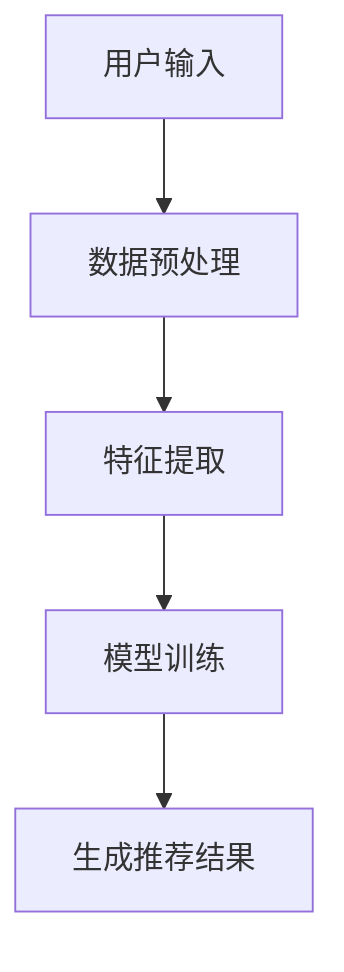
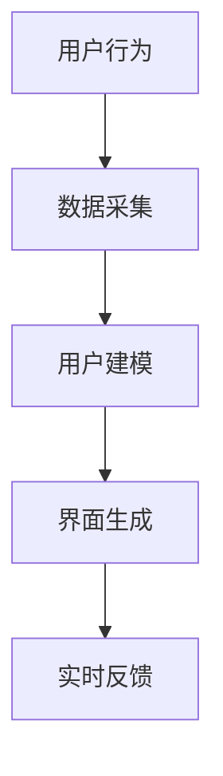
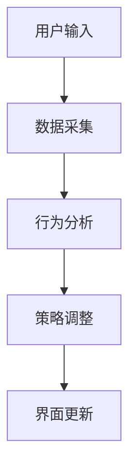

                 


# AI Agent的自适应用户界面：个性化人机交互体验

> 关键词：AI Agent，自适应用户界面，个性化交互，人机交互，用户体验

> 摘要：本文深入探讨了AI Agent在自适应用户界面设计中的应用，分析了个性化人机交互的核心技术与实现方法，结合实际案例，详细讲解了AI Agent如何通过自适应界面提升用户体验。文章从背景介绍、核心概念、算法原理、系统架构设计、项目实战等多维度展开，为读者提供了全面的技术解读。

---

# 第一部分: AI Agent的自适应用户界面概述

## 第1章: 引言

### 1.1 问题背景

#### 1.1.1 人机交互的发展历程
人机交互（Human-Computer Interaction, HCI）经历了从简单命令行到图形用户界面（GUI），再到智能交互的演变。随着人工智能（AI）技术的发展，用户界面不再仅仅是功能的载体，而是成为了用户与系统之间的情感纽带。

#### 1.1.2 当前人机交互的挑战
传统的用户界面设计依赖于固定的规则和流程，难以满足用户的个性化需求。用户的行为习惯、使用场景和偏好存在显著差异，单一的界面设计无法覆盖所有用户群体。此外，实时反馈、动态调整和智能化交互的需求也在不断提升。

#### 1.1.3 AI Agent在人机交互中的作用
AI Agent（智能体）能够通过分析用户行为、偏好和环境数据，动态调整用户界面的呈现方式，为用户提供个性化的交互体验。AI Agent的核心在于理解用户需求，并通过自适应界面实现高效的交互。

### 1.2 问题描述

#### 1.2.1 自适应用户界面的定义
自适应用户界面是指能够根据用户行为、偏好和环境动态调整界面布局、功能和交互方式的用户界面。它通过实时数据采集和分析，为用户提供个性化的视觉和交互体验。

#### 1.2.2 自适应用户界面的核心目标
自适应用户界面的核心目标是通过动态调整界面元素，优化用户体验，提高交互效率，降低用户的学习成本。

#### 1.2.3 自适应用户界面的实现路径
自适应用户界面的实现路径包括数据采集、用户建模、界面生成和实时反馈四个阶段。AI Agent通过分析用户数据，生成个性化的界面设计方案，并实时调整以满足用户需求。

### 1.3 问题解决

#### 1.3.1 AI Agent的基本原理
AI Agent通过感知用户行为、环境数据和反馈信息，利用机器学习算法生成个性化的交互策略。AI Agent的核心在于理解用户需求，并通过动态调整界面元素实现高效的交互。

#### 1.3.2 自适应用户界面的核心技术
自适应用户界面的核心技术包括用户建模、动态布局生成和实时反馈机制。这些技术共同作用，实现界面的个性化调整。

#### 1.3.3 个性化人机交互的实现方法
个性化人机交互的实现方法包括基于用户数据的推荐算法、动态界面生成技术和实时反馈机制。这些方法共同作用，实现个性化的交互体验。

### 1.4 边界与外延

#### 1.4.1 自适应用户界面的边界
自适应用户界面的边界包括用户数据采集范围、界面调整的粒度和交互策略的适用范围。这些边界决定了自适应界面的灵活性和适用性。

#### 1.4.2 与传统用户界面的区别
与传统用户界面相比，自适应用户界面具有更高的个性化和动态调整能力。传统界面基于固定的规则和流程，而自适应界面能够根据用户需求实时调整。

#### 1.4.3 自适应用户界面的未来发展
自适应用户界面的未来发展将更加注重个性化和智能化。随着AI技术的不断进步，自适应界面将更加智能化，能够理解用户的深层需求，并提供更加个性化的交互体验。

### 1.5 概念结构与核心要素

#### 1.5.1 AI Agent的组成
AI Agent通常由感知模块、决策模块和执行模块组成。感知模块负责采集用户数据，决策模块基于数据生成交互策略，执行模块负责调整界面元素。

#### 1.5.2 自适应用户界面的要素
自适应用户界面的要素包括用户数据、界面布局、交互逻辑和实时反馈。这些要素共同作用，实现界面的个性化调整。

#### 1.5.3 个性化人机交互的实现模型
个性化人机交互的实现模型包括数据采集、用户建模、界面生成和实时反馈四个阶段。AI Agent通过分析用户数据，生成个性化的交互策略，并实时调整界面元素以满足用户需求。

---

# 第二部分: AI Agent的核心概念与联系

## 第2章: AI Agent的基本原理

### 2.1 核心概念原理

#### 2.1.1 AI Agent的定义与分类
AI Agent是一种能够感知环境、做出决策并采取行动的智能体。根据功能和应用场景的不同，AI Agent可以分为任务型Agent和交互型Agent两大类。

#### 2.1.2 自适应用户界面的实现机制
自适应用户界面的实现机制包括数据采集、用户建模、界面生成和实时反馈。AI Agent通过分析用户数据，生成个性化的界面设计方案，并实时调整以满足用户需求。

#### 2.1.3 个性化人机交互的核心算法
个性化人机交互的核心算法包括协同过滤算法、基于内容的推荐算法和混合推荐算法。这些算法通过分析用户数据，生成个性化的交互策略。

### 2.2 概念属性特征对比

| 特性                | AI Agent                          | 自适应用户界面                  |
|---------------------|-----------------------------------|--------------------------------|
| 核心目标            | 提供个性化服务                    | 提供个性化交互体验              |
| 实现方式            | 基于机器学习算法                 | 基于动态调整界面元素            |
| 适用场景            | 个性化推荐、智能交互              | 个性化界面设计、动态交互        |
| 数据依赖            | 用户行为、偏好、环境数据          | 用户行为、偏好、环境数据          |

### 2.3 ER实体关系图

```mermaid
er
actor(AI Agent) --> interface: 使用
actor(User) --> interface: 使用
interface --> data: 收集用户数据
interface --> model: 分析用户需求
model --> interface: 优化界面
```

---

# 第三部分: 自适应用户界面的算法原理

## 第3章: 推荐算法

### 3.1 推荐算法原理

#### 3.1.1 基于协同过滤的推荐算法
基于协同过滤的推荐算法通过分析用户的行为数据，找到与当前用户具有相似兴趣的用户群体，推荐这些用户群体喜欢的内容。

#### 3.1.2 基于内容的推荐算法
基于内容的推荐算法通过分析用户偏好和内容特征，推荐与用户兴趣相匹配的内容。

#### 3.1.3 基于混合模型的推荐算法
基于混合模型的推荐算法结合了协同过滤和内容推荐的优点，通过集成多个推荐算法，提升推荐结果的准确性和多样性。

### 3.2 推荐算法实现



### 3.3 推荐算法的数学模型

$$ \text{推荐评分} = \text{用户特征} \times \text{物品特征} + \text{偏置项} $$

---

## 第4章: 自适应算法

### 4.1 自适应算法原理

#### 4.1.1 动态布局调整算法
动态布局调整算法通过分析用户行为和偏好，实时调整界面布局，优化用户的视觉体验。

#### 4.1.2 基于反馈的自适应算法
基于反馈的自适应算法通过收集用户的反馈信息，动态调整界面元素的位置、大小和功能，提升用户的交互体验。

### 4.2 自适应算法实现



### 4.3 自适应算法的数学模型

$$ \text{界面参数} = \text{用户特征} \times \text{环境特征} + \text{优化目标} $$

---

## 第5章: 实时反馈机制

### 5.1 实时反馈机制原理

#### 5.1.1 用户行为分析
用户行为分析通过采集用户的点击、滑动、输入等行为数据，分析用户的偏好和需求。

#### 5.1.2 动态调整策略
动态调整策略基于用户行为分析结果，实时调整界面元素的位置、大小和功能，优化用户的交互体验。

### 5.2 实时反馈机制实现



### 5.3 实时反馈机制的数学模型

$$ \text{反馈评分} = \text{用户满意度} \times \text{交互效率} + \text{系统性能} $$

---

# 第四部分: 系统分析与架构设计

## 第6章: 系统分析与架构设计

### 6.1 问题场景介绍

#### 6.1.1 用户需求分析
用户需求分析包括用户行为分析、偏好分析和使用场景分析。通过分析用户数据，了解用户的实际需求和痛点。

#### 6.1.2 系统功能设计
系统功能设计包括用户数据采集、用户建模、界面生成和实时反馈。这些功能共同作用，实现个性化的交互体验。

### 6.2 系统架构设计

#### 6.2.1 系统架构图


#### 6.2.2 系统交互图

```mermaid
sequence
    User --> Interface: 用户输入
    Interface --> Data Collection: 采集数据
    Data Collection --> User Modeling: 建模
    User Modeling --> AI Agent: 分析
    AI Agent --> Interface: 生成界面
    Interface --> User: 反馈
```

### 6.3 系统接口设计

#### 6.3.1 数据接口
数据接口负责采集用户数据，包括用户行为、偏好和环境数据。

#### 6.3.2 模型接口
模型接口负责用户建模和界面生成，基于用户数据生成个性化的交互策略。

#### 6.3.3 反馈接口
反馈接口负责收集用户的反馈信息，实时调整界面元素。

---

# 第五部分: 项目实战

## 第7章: 项目实战

### 7.1 环境安装

#### 7.1.1 安装Python
```bash
python --version
pip install --upgrade pip
```

#### 7.1.2 安装依赖
```bash
pip install numpy pandas scikit-learn matplotlib
```

### 7.2 核心代码实现

#### 7.2.1 数据预处理
```python
import pandas as pd
data = pd.read_csv('user_data.csv')
```

#### 7.2.2 用户建模
```python
from sklearn.preprocessing import StandardScaler
scaler = StandardScaler()
scaled_data = scaler.fit_transform(data)
```

#### 7.2.3 界面生成
```python
import numpy as np
def generate_interface(data):
    # 简单的布局调整示例
    layout = np.random.choice(['horizontal', 'vertical'], p=[0.6, 0.4])
    return layout
```

### 7.3 实际案例分析

#### 7.3.1 案例背景
假设我们有一个在线教育平台，用户需求是个性化学习路径推荐。

#### 7.3.2 数据分析
通过分析用户的学习行为和偏好，生成个性化的学习计划。

#### 7.3.3 界面调整
根据用户的偏好，动态调整界面布局和功能模块。

---

## 第8章: 最佳实践与总结

### 8.1 最佳实践

#### 8.1.1 数据采集与隐私保护
在采集用户数据时，必须遵守数据隐私保护法规，确保用户数据的安全性和隐私性。

#### 8.1.2 算法选择与优化
选择合适的算法，并通过实验优化算法性能，提升推荐准确性和交互效率。

#### 8.1.3 界面设计与用户体验
界面设计要注重用户体验，确保界面的可读性和可用性，避免过度复杂的布局。

### 8.2 总结与展望

#### 8.2.1 全文总结
本文深入探讨了AI Agent在自适应用户界面设计中的应用，分析了个性化人机交互的核心技术与实现方法，结合实际案例，详细讲解了AI Agent如何通过自适应界面提升用户体验。

#### 8.2.2 未来展望
未来，随着AI技术的不断进步，自适应用户界面将更加智能化和个性化。AI Agent将能够理解用户的深层需求，并提供更加个性化的交互体验。

### 8.3 注意事项

#### 8.3.1 数据隐私
在采集和使用用户数据时，必须遵守数据隐私保护法规，确保用户数据的安全性和隐私性。

#### 8.3.2 算法优化
通过实验和测试，不断优化算法性能，提升推荐准确性和交互效率。

#### 8.3.3 界面设计
界面设计要注重用户体验，确保界面的可读性和可用性，避免过度复杂的布局。

---

# 第六部分: 拓展阅读

## 第9章: 拓展阅读

### 9.1 相关技术

#### 9.1.1 人机交互技术
推荐阅读《The Design of Everyday Things》。

#### 9.1.2 AI技术
推荐阅读《Deep Learning》。

### 9.2 实际应用

#### 9.2.1 在线教育
AI Agent在在线教育中的应用，如个性化学习路径推荐和动态界面生成。

#### 9.2.2 智能客服
AI Agent在智能客服中的应用，如智能对话生成和动态界面调整。

### 9.3 未来趋势

#### 9.3.1 智能家居
AI Agent在智能家居中的应用，如个性化设备控制和动态界面生成。

#### 9.3.2 元宇宙
AI Agent在元宇宙中的应用，如个性化虚拟助手和动态交互界面设计。

---

# 结语

AI Agent的自适应用户界面是个性化人机交互体验的核心技术，通过动态调整界面元素，为用户提供更加个性化的交互体验。随着AI技术的不断进步，自适应用户界面将更加智能化和个性化，为用户带来更加高效和愉悦的交互体验。

