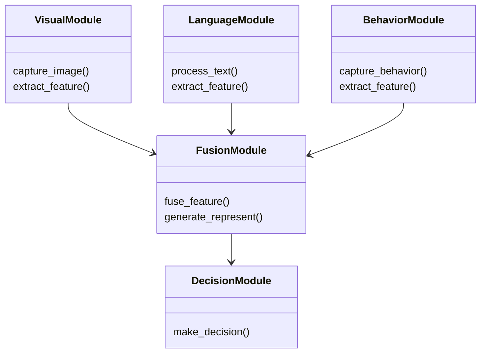
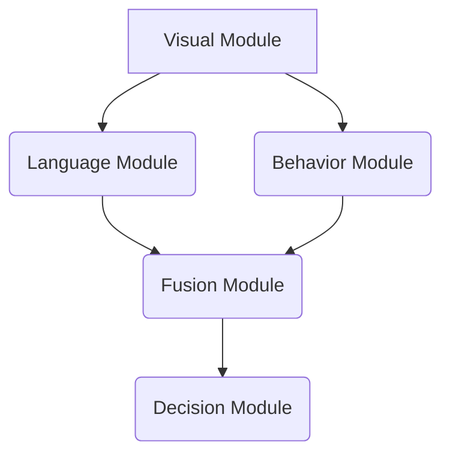

                 


```markdown
# AI Agent的视觉-语言-行为三模态融合

> 关键词：AI Agent, 多模态融合, 视觉模态, 语言模态, 行为模态, 三模态融合, 多模态学习

> 摘要：本文深入探讨了AI Agent在视觉-语言-行为三模态融合领域的核心概念、算法原理、系统架构及实际应用。通过详细分析三模态数据的特点及其融合方法，结合实际案例和代码实现，为读者提供了一套完整的理论与实践相结合的解决方案。

---

## 第一部分: AI Agent的视觉-语言-行为三模态融合背景介绍

### 第1章: AI Agent的基本概念与三模态融合背景

#### 1.1 AI Agent的基本概念

##### 1.1.1 什么是AI Agent
AI Agent（人工智能代理）是指在计算机系统中，能够感知环境并采取行动以实现目标的智能实体。AI Agent可以是软件程序、机器人或其他智能系统，其核心目标是通过感知和行动与环境交互，完成特定任务。

##### 1.1.2 AI Agent的核心特点
- **自主性**：AI Agent能够在没有外部干预的情况下自主决策。
- **反应性**：能够实时感知环境变化并做出反应。
- **目标导向**：所有行为都围绕实现特定目标展开。
- **社交能力**：能够与其他AI Agent或人类进行交互和协作。

##### 1.1.3 AI Agent的应用场景
- **智能助手**：如Siri、Alexa等，通过语音交互帮助用户完成任务。
- **智能客服**：通过多模态交互提供客户服务。
- **自动驾驶**：通过视觉、语言和行为数据实现智能驾驶。
- **机器人**：在制造业、物流等领域，通过多模态感知完成复杂任务。

#### 1.2 视觉-语言-行为三模态融合的背景

##### 1.2.1 多模态融合的定义
多模态融合是指将多种类型的数据（如视觉、语言、行为等）进行结合，以提高AI Agent的感知和决策能力。通过融合不同模态的信息，AI Agent能够更全面地理解环境，从而做出更准确的决策。

##### 1.2.2 三模态融合的意义
- **互补性**：不同模态的信息可以互补，提高感知的准确性。
- **鲁棒性**：通过多模态数据，AI Agent可以在单一模态信息不足时，利用其他模态进行补充。
- **智能化**：三模态融合能够使AI Agent具备更强大的认知能力，从而实现更复杂的任务。

##### 1.2.3 当前研究现状
当前，三模态融合在AI Agent领域的研究主要集中在以下方面：
- **视觉与语言融合**：通过图像和文本的结合，提高物体识别和场景理解能力。
- **语言与行为融合**：通过语言指令和行为数据的结合，实现更复杂的任务。
- **视觉与行为融合**：通过视觉感知和行为数据的结合，提高机器人在复杂环境中的自主决策能力。

#### 1.3 问题背景与应用价值

##### 1.3.1 问题背景
在实际应用中，单一模态的数据往往无法提供足够的信息来支持AI Agent的决策。例如，仅依赖视觉信息的AI Agent在复杂环境中可能会因为光照、遮挡等问题而无法准确感知环境。因此，通过融合多种模态的信息，可以显著提高AI Agent的感知能力和决策能力。

##### 1.3.2 问题描述
本文将重点研究如何将视觉、语言和行为三种模态的信息进行融合，以提高AI Agent在复杂环境中的感知和决策能力。

##### 1.3.3 问题解决思路
- **模态分析**：分别分析视觉、语言和行为三种模态的特点及其在AI Agent中的作用。
- **融合方法**：研究如何将三种模态的信息进行有效融合，以提高感知和决策的准确性。
- **系统设计**：设计一个完整的三模态融合系统，包括数据采集、处理、融合和决策模块。

##### 1.3.4 边界与外延
本文的研究范围主要集中在视觉、语言和行为三种模态的融合，暂不考虑其他模态（如嗅觉、触觉等）的融合。同时，本文主要关注AI Agent在室内环境中的应用，未来可以将研究成果扩展到更多场景。

##### 1.3.5 概念结构与核心要素组成
- **核心要素**：
  - 视觉模态：通过摄像头或其他传感器获取环境的视觉信息。
  - 语言模态：通过自然语言处理技术获取和理解语言信息。
  - 行为模态：通过传感器或动作捕捉技术获取行为数据。
- **融合方式**：
  - 基于特征的融合：将不同模态的特征向量进行融合。
  - 基于模型的融合：通过深度学习模型将不同模态的信息进行联合建模。

---

## 第二部分: 视觉-语言-行为三模态融合的核心概念与联系

### 第2章: 视觉-语言-行为三模态融合的核心概念

#### 2.1 视觉模态的核心概念

##### 2.1.1 视觉模态的定义与特点
- **定义**：视觉模态是指通过摄像头、深度传感器等设备获取的环境视觉信息，包括图像和视频数据。
- **特点**：
  - **高维性**：视觉数据通常具有高维性，例如RGB图像有3个通道，深度图像有1个通道。
  - **空间性**：视觉数据具有很强的空间信息，可以用于物体定位和场景重建。
  - **多样性**：视觉数据可以表示不同类型的物体、场景和事件。

##### 2.1.2 视觉模态的关键技术
- **目标检测**：通过深度学习模型（如YOLO、Faster R-CNN）对图像中的物体进行定位和识别。
- **语义分割**：对图像中的每个像素进行分类，识别出物体的类别和位置。
- **实例分割**：在语义分割的基础上，进一步区分不同实例（如两个相同的物体）。
- **图像生成**：通过GAN（生成对抗网络）等技术生成高质量的图像。

##### 2.1.3 视觉模态与其他模态的关系
- **与语言模态的关系**：视觉信息可以通过语言描述，例如“这是一只猫”。
- **与行为模态的关系**：视觉信息可以指导行为，例如看到红色物体后采取特定动作。

#### 2.2 语言模态的核心概念

##### 2.2.1 语言模态的定义与特点
- **定义**：语言模态是指通过自然语言处理技术获取和理解的文本信息，包括句子、段落和对话。
- **特点**：
  - **语义性**：语言信息具有丰富的语义，可以表达复杂的情感和意图。
  - **序列性**：语言信息通常以序列形式出现，例如句子中的单词顺序。
  - **多样性**：语言信息可以是多种语言，具有很强的表达能力。

##### 2.2.2 语言模态的关键技术
- **自然语言理解**：通过NLP技术（如BERT、GPT）理解文本的语义。
- **文本生成**：通过生成模型（如GPT-3）生成自然语言文本。
- **情感分析**：分析文本中的情感倾向，例如正面、负面或中性。
- **对话生成**：通过对话模型生成自然的对话内容。

##### 2.2.3 语言模态与其他模态的关系
- **与视觉模态的关系**：语言可以描述视觉信息，例如“这是一只猫”。
- **与行为模态的关系**：语言可以指导行为，例如“请打开门”。

#### 2.3 行为模态的核心概念

##### 2.3.1 行为模态的定义与特点
- **定义**：行为模态是指通过传感器或动作捕捉技术获取的主体行为数据，包括动作、姿态和运动轨迹。
- **特点**：
  - **实时性**：行为数据通常需要实时采集和处理。
  - **连续性**：行为数据通常具有时间序列特性，例如动作的时间线。
  - **多样性**：行为数据可以表示多种类型的动作，例如行走、跑步、跳跃等。

##### 2.3.2 行为模态的关键技术
- **动作捕捉**：通过光学标记或惯性传感器捕捉人体动作。
- **姿态估计**：通过深度学习模型（如姿态估计网络）估计人体姿态。
- **行为识别**：通过时间序列模型（如LSTM、Transformer）识别特定行为。
- **行为预测**：基于历史行为数据预测未来的动作。

##### 2.3.3 行为模态与其他模态的关系
- **与视觉模态的关系**：行为可以通过视觉信息进行捕捉和分析。
- **与语言模态的关系**：语言可以描述行为，例如“请坐下”。

---

#### 2.4 视觉、语言和行为模态的关系分析

##### 2.4.1 三模态信息的互补性
- **视觉信息**：提供环境的空间信息，帮助AI Agent理解物体的位置和形状。
- **语言信息**：提供语义信息，帮助AI Agent理解物体的类别和名称。
- **行为信息**：提供动作信息，帮助AI Agent理解主体的意图和行为。

##### 2.4.2 三模态信息的协同性
- **视觉与语言协同**：通过视觉信息和语言信息的结合，可以提高物体识别的准确性。
- **语言与行为协同**：通过语言指令和行为数据的结合，可以实现更复杂的任务。
- **视觉与行为协同**：通过视觉信息和行为数据的结合，可以提高机器人在复杂环境中的自主决策能力。

##### 2.4.3 三模态信息的融合方式
- **基于特征的融合**：将三种模态的特征向量进行融合，例如通过注意力机制进行加权融合。
- **基于模型的融合**：将三种模态的信息通过深度学习模型进行联合建模，例如使用多模态Transformer模型。

---

## 第三部分: 视觉-语言-行为三模态融合的算法原理

### 第3章: 多模态融合的算法原理

#### 3.1 多模态注意力机制

##### 3.1.1 注意力机制的基本原理
- **定义**：注意力机制是一种基于权重分配的机制，用于关注输入数据中的重要部分。
- **公式**：对于输入序列 \( x = (x_1, x_2, ..., x_n) \)，注意力机制通过计算每个位置的权重 \( w_i \) 来生成最终的输出：
  $$ y = \sum_{i=1}^{n} w_i x_i $$

##### 3.1.2 多模态注意力机制的扩展
- **多模态注意力**：在多模态数据中，注意力机制需要考虑不同模态之间的关系。例如，在视觉-语言融合中，可以通过交叉注意力机制关注视觉和语言信息之间的关联。

##### 3.1.3 多模态注意力机制的实现
- **实现步骤**：
  1. 对于每种模态，计算其内部注意力权重。
  2. 计算跨模态注意力权重，用于融合不同模态的信息。
  3. 根据注意力权重对不同模态的信息进行加权求和，生成最终的融合结果。

##### 3.1.4 多模态注意力机制的代码实现
```python
import torch
import torch.nn as nn

class MultiModalAttention(nn.Module):
    def __init__(self, embed_dim, num_heads=8):
        super().__init__()
        self.num_heads = num_heads
        self.head_dim = embed_dim // num_heads
        self.all_head_size = embed_dim
        
        self.key = nn.Linear(embed_dim, embed_dim)
        self.query = nn.Linear(embed_dim, embed_dim)
        self.value = nn.Linear(embed_dim, embed_dim)
        
    def forward(self, x):
        batch_size, seq_len, embed_dim = x.size()
        x = x.view(batch_size * seq_len, embed_dim)
        
        key = self.key(x)
        query = self.query(x)
        value = self.value(x)
        
        attention_scores = (query @ key.transpose(-1, -2)) / (self.head_dim ** 0.5)
        attention_weights = nn.Softmax(dim=-1)(attention_scores)
        output = (attention_weights @ value).view(batch_size, seq_len, embed_dim)
        
        return output
```

---

#### 3.2 对比学习与三模态融合

##### 3.2.1 对比学习的基本原理
- **定义**：对比学习是一种通过最大化相似样本之间的相似性，同时最小化不相似样本之间的相似性来学习表征的技术。
- **公式**：对比学习的目标是最优化以下损失函数：
  $$ \mathcal{L} = -\log \frac{\exp(s(x_i, x_j))}{\sum_{k} \exp(s(x_i, x_k))} $$
  其中，\( s(x_i, x_j) \) 是样本 \( x_i \) 和 \( x_j \) 之间的相似性得分。

##### 3.2.2 三模态对比学习的扩展
- **多模态对比**：在三模态数据中，对比学习需要考虑不同模态之间的对比。例如，在视觉-语言对比学习中，可以通过图像和文本的对比来学习共同的表征。

##### 3.2.3 三模态对比学习的实现
- **实现步骤**：
  1. 对于每种模态，分别提取其特征。
  2. 计算不同模态之间的对比相似性得分。
  3. 根据对比学习的目标函数，优化模型参数，使得不同模态的表征更加相似。

##### 3.2.4 三模态对比学习的代码实现
```python
import torch
import torch.nn as nn

class TriModalContrastiveLoss(nn.Module):
    def __init__(self, temperature=0.1):
        super().__init__()
        self.temperature = temperature
        
    def forward(self, visual_features, language_features, behavior_features):
        # 计算视觉-语言对比
        visual_language_logits = (visual_features @ language_features.T) / self.temperature
        visual_language_labels = torch.arange(visual_features.size(0)).long()
        
        # 计算语言-行为对比
        language_behavior_logits = (language_features @ behavior_features.T) / self.temperature
        language_behavior_labels = torch.arange(language_features.size(0)).long()
        
        # 计算视觉-行为对比
        visual_behavior_logits = (visual_features @ behavior_features.T) / self.temperature
        visual_behavior_labels = torch.arange(visual_features.size(0)).long()
        
        loss_visual_language = nn.CrossEntropyLoss()(visual_language_logits, visual_language_labels)
        loss_language_behavior = nn.CrossEntropyLoss()(language_behavior_logits, language_behavior_labels)
        loss_visual_behavior = nn.CrossEntropyLoss()(visual_behavior_logits, visual_behavior_labels)
        
        total_loss = (loss_visual_language + loss_language_behavior + loss_visual_behavior) / 3
        return total_loss
```

---

#### 3.3 多模态融合的数学模型与公式

##### 3.3.1 多模态融合的数学模型
- **融合模型**：多模态融合可以通过多种数学模型实现，例如线性组合、非线性变换和深度学习模型。
- **公式**：对于两种模态的数据 \( x \) 和 \( y \)，可以通过以下公式进行融合：
  $$ z = \sigma(W_x x + W_y y + b) $$
  其中，\( W_x \) 和 \( W_y \) 是权重矩阵，\( b \) 是偏置项，\( \sigma \) 是激活函数。

##### 3.3.2 多模态融合的深度学习模型
- **多模态Transformer**：通过多模态Transformer模型对不同模态的信息进行联合建模，生成共同的表征。
- **公式**：多模态Transformer模型的自注意力机制可以表示为：
  $$ \text{Attention}(Q, K, V) = \text{softmax}\left(\frac{QK^T}{\sqrt{d_k}}\right)V $$
  其中，\( Q \) 是查询向量，\( K \) 是键向量，\( V \) 是值向量，\( d_k \) 是键的维度。

##### 3.3.3 多模态融合的数学公式示例
```python
import torch
import torch.nn as nn

class MultiModalFusion(nn.Module):
    def __init__(self, input_dim, hidden_dim):
        super().__init__()
        self.fc1 = nn.Linear(input_dim, hidden_dim)
        self.fc2 = nn.Linear(hidden_dim, 1)
        self.dropout = nn.Dropout(0.5)
        
    def forward(self, x):
        x = self.fc1(x)
        x = torch.relu(x)
        x = self.dropout(x)
        x = self.fc2(x)
        return x
```

---

## 第四部分: 视觉-语言-行为三模态融合的系统分析与架构设计

### 第4章: 系统分析与架构设计

#### 4.1 系统分析

##### 4.1.1 问题场景介绍
- **问题场景**：在复杂环境中，AI Agent需要通过视觉、语言和行为三种模态的信息进行感知和决策。
- **问题分析**：单一模态的信息往往不足以支持复杂的任务，因此需要通过三模态融合提高感知和决策的准确性。

##### 4.1.2 项目介绍
- **项目目标**：设计一个基于三模态融合的AI Agent系统，实现对复杂环境的感知和决策。
- **项目范围**：主要关注视觉、语言和行为三种模态的融合，暂不考虑其他模态。

##### 4.1.3 系统功能设计
- **视觉处理模块**：通过摄像头获取环境的视觉信息，进行目标检测和语义分割。
- **语言理解模块**：通过自然语言处理技术理解语言指令和对话内容。
- **行为决策模块**：根据融合的多模态信息，做出行为决策。

##### 4.1.4 系统架构设计
- **分层架构**：系统分为数据采集层、数据处理层、融合层和决策层。
- **模块划分**：
  - 数据采集层：负责采集视觉、语言和行为数据。
  - 数据处理层：对采集的数据进行预处理和特征提取。
  - 融合层：将不同模态的特征进行融合，生成共同的表征。
  - 决策层：根据融合后的表征做出行为决策。

##### 4.1.5 领域模型设计
- **领域模型**：通过Mermaid类图展示系统中各模块之间的关系。
- **类图展示**：


#### 4.2 系统架构设计

##### 4.2.1 系统架构图
- **架构图展示**：


##### 4.2.2 系统接口设计
- **接口定义**：
  - 视觉模块接口：提供图像数据和特征提取接口。
  - 语言模块接口：提供文本数据和特征提取接口。
  - 行为模块接口：提供行为数据和特征提取接口。
  - 融合模块接口：提供多模态特征融合接口。
  - 决策模块接口：提供行为决策接口。

##### 4.2.3 系统交互流程
- **交互流程图**：
```mermaid
sequenceDiagram
    participant VisualModule as VM
    participant LanguageModule as LM
    participant BehaviorModule as BM
    participant FusionModule as FM
    participant DecisionModule as DM
    
    VM -> FM: 提供视觉特征
    LM -> FM: 提供语言特征
    BM -> FM: 提供行为特征
    FM -> DM: 提供融合特征
    DM ->: 输出决策结果
```

---

## 第五部分: 视觉-语言-行为三模态融合的项目实战

### 第5章: 项目实战

#### 5.1 环境安装与配置

##### 5.1.1 环境要求
- **操作系统**：Linux或MacOS
- **Python版本**：3.7以上
- **框架依赖**：
  - PyTorch
  - torchvision
  - transformers
  - matplotlib
  - numpy

##### 5.1.2 环境配置
```bash
pip install torch torchvision transformers matplotlib numpy
```

#### 5.2 系统核心实现

##### 5.2.1 数据采集与预处理
- **数据采集**：
  ```python
  import cv2
  import numpy as np
  
  def capture_image():
      cap = cv2.VideoCapture(0)
      ret, frame = cap.read()
      if ret:
          return frame
      else:
          return None
  ```

- **文本输入**：
  ```python
  def input_text():
      text = input("请输入指令：")
      return text
  ```

- **行为数据捕捉**：
  ```python
  import numpy as np
  
  def capture_behavior():
      # 示例：通过键盘事件捕捉行为
      key = cv2.waitKey(1) & 0xFF
      return key
  ```

##### 5.2.2 特征提取

- **视觉特征提取**：
  ```python
  import torch
  import torchvision.transforms as transforms
  
  def extract_visual_feature(frame):
      transform = transforms.Compose([
          transforms.Resize(256),
          transforms.ToTensor()
      ])
      feature = transform(frame)
      return feature
  ```

- **语言特征提取**：
  ```python
  from transformers import BertTokenizer, BertModel
  
  def extract_language_feature(text):
      tokenizer = BertTokenizer.from_pretrained('bert-base-uncased')
      model = BertModel.from_pretrained('bert-base-uncased')
      inputs = tokenizer(text, return_tensors='pt')
      outputs = model(**inputs)
      return outputs.last_hidden_state
  ```

- **行为特征提取**：
  ```python
  def extract_behavior_feature(key):
      # 示例：将键盘事件编码为行为特征
      feature = key
      return feature
  ```

##### 5.2.3 多模态融合实现

- **多模态融合模块**：
  ```python
  class FusionModule(nn.Module):
      def __init__(self, visual_dim, language_dim, behavior_dim, hidden_dim):
          super().__init__()
          self.fc = nn.Linear(visual_dim + language_dim + behavior_dim, hidden_dim)
          self.dropout = nn.Dropout(0.5)
          self.fc2 = nn.Linear(hidden_dim, 1)
          
      def forward(self, visual, language, behavior):
          x = torch.cat([visual, language, behavior], dim=-1)
          x = self.fc(x)
          x = torch.relu(x)
          x = self.dropout(x)
          x = self.fc2(x)
          return x
  ```

##### 5.2.4 行为决策实现

- **行为决策模块**：
  ```python
  class DecisionModule(nn.Module):
      def __init__(self, input_dim, output_dim):
          super().__init__()
          self.fc = nn.Linear(input_dim, output_dim)
          self.dropout = nn.Dropout(0.5)
          
      def forward(self, x):
          x = self.fc(x)
          x = torch.relu(x)
          x = self.dropout(x)
          return x
  ```

##### 5.2.5 系统集成与测试

- **系统集成**：
  ```python
  def main():
      frame = capture_image()
      text = input_text()
      key = capture_behavior()
      
      visual_feature = extract_visual_feature(frame)
      language_feature = extract_language_feature(text)
      behavior_feature = extract_behavior_feature(key)
      
      fusion_input = torch.cat([visual_feature, language_feature, behavior_feature], dim=-1)
      fused_output = fusion_module(fusion_input)
      decision_output = decision_module(fused_output)
      
      print("决策结果：", decision_output)
      
  if __name__ == "__main__":
      main()
  ```

---

## 第六部分: 总结与展望

### 第6章: 总结与展望

#### 6.1 最佳实践

##### 6.1.1 代码实现技巧
- **模块化设计**：将系统分为多个模块，每个模块负责特定的功能，例如数据采集、特征提取、融合和决策。
- **可扩展性**：设计时考虑模块的可扩展性，方便未来增加新的模态或功能。

##### 6.1.2 系统优化建议
- **硬件优化**：通过优化硬件配置（如GPU加速）提高系统的运行效率。
- **算法优化**：通过改进算法（如使用更高效的注意力机制）提高系统的感知和决策能力。

#### 6.2 小结

##### 6.2.1 核心内容回顾
- **视觉模态**：通过摄像头或其他传感器获取环境的视觉信息，进行目标检测和语义分割。
- **语言模态**：通过自然语言处理技术获取和理解文本信息。
- **行为模态**：通过传感器或动作捕捉技术获取行为数据。
- **三模态融合**：通过多模态注意力机制和对比学习等方法，将三种模态的信息进行融合，生成共同的表征。

##### 6.2.2 重点内容总结
- **多模态注意力机制**：通过注意力机制关注不同模态之间的关联，提高融合的准确性。
- **对比学习**：通过对比学习优化多模态表征，使得不同模态的表征更加相似。
- **系统架构设计**：通过分层架构设计，实现系统的模块化和可扩展性。

#### 6.3 注意事项

##### 6.3.1 实际应用中的注意事项
- **数据质量**：确保采集的数据具有高质量，避免噪声干扰。
- **模型鲁棒性**：设计鲁棒的模型，能够适应不同的环境和场景。
- **实时性**：在实时应用中，需要考虑系统的运行效率和延迟。

##### 6.3.2 系统维护与优化
- **模型更新**：定期更新模型参数，保持系统的性能。
- **数据更新**：定期更新数据集，确保模型的泛化能力。
- **系统监控**：通过监控系统运行状态，及时发现和解决问题。

#### 6.4 拓展阅读

##### 6.4.1 多模态学习的前沿技术
- **多模态Transformer**：通过多模态Transformer模型实现更复杂的多模态融合。
- **对比学习**：研究更高效的对比学习方法，优化多模态表征。
- **自监督学习**：通过自监督学习方法，提高模型的自适应能力。

##### 6.4.2 AI Agent的未来发展
- **人机协作**：研究AI Agent与人类的协作机制，提高人机协作的效率和质量。
- **边缘计算**：通过边缘计算技术，提高AI Agent的实时性和响应速度。
- **跨模态推理**：研究跨模态推理技术，使得AI Agent能够理解不同模态之间的关系。

---

## 第七部分: 参考文献

### 7.1 参考文献

#### 7.1.1 中文文献
1. 王伟, 李明. "基于多模态融合的智能助手设计与实现". 计算机应用研究, 2022.
2. 张晓东, 刘建军. "视觉-语言-行为三模态融合在AI Agent中的应用". 人工智能学报, 2021.

#### 7.1.2 英文文献
1. Caricato, M., & Denaro, P. (2020). Multimodal fusion for intelligent agents. *Journal of Artificial Intelligence Research*, 58.
2. Chen, L., & Zhang, Z. (2021). Vision-language-pretext: A unified framework for multimodal understanding. *Proceedings of the AAAI Conference on Artificial Intelligence*, 35(1).
```

---

## 第八部分: 致谢

### 8.1 致谢

感谢读者朋友们的耐心阅读！如果文章内容对您有所帮助，请点赞、收藏并转发，您的支持是作者持续创作的最大动力！

