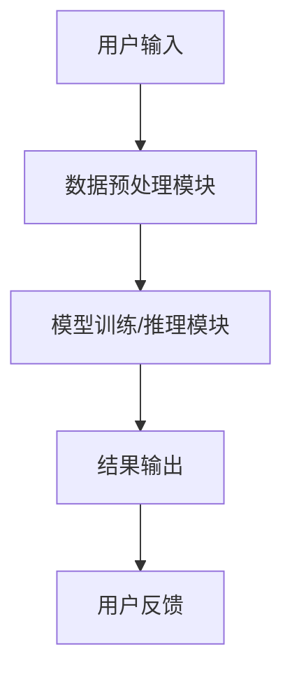

                 


好的，接下来我将按照上述目录大纲开始撰写《AI Agent的视觉-语言联合学习实现》这篇文章。首先，我需要先写出文章的标题、关键词和摘要，然后按照目录的结构逐步展开每一部分的内容。

---

# AI Agent的视觉-语言联合学习实现

> **关键词**：AI Agent，视觉-语言联合学习，多模态学习，Transformer，对比学习  
> **摘要**：本文系统地介绍AI Agent的视觉-语言联合学习的实现方法，涵盖核心概念、算法原理、系统架构和项目实战。通过分析多模态数据的融合与交互，探讨视觉与语言信息的协同学习机制，并结合实际案例，详细讲解模型设计与实现的全过程。

---

## 第一部分: AI Agent的视觉-语言联合学习概述

### 第1章: AI Agent与视觉-语言联合学习概述

#### 1.1 AI Agent的基本概念

- **1.1.1 AI Agent的定义与特点**  
  AI Agent（人工智能代理）是指能够感知环境、自主决策并执行任务的智能实体。其特点包括自主性、反应性、目标导向性和社会性。

- **1.1.2 AI Agent的核心功能与应用场景**  
  AI Agent的核心功能包括感知、推理、决策和执行。应用场景广泛，如智能助手、机器人、自动驾驶、智能客服等。

- **1.1.3 视觉-语言联合学习的背景与意义**  
  视觉-语言联合学习旨在让AI Agent能够同时处理视觉和语言信息，实现更强大的多模态交互能力。这在智能助手、人机对话和复杂任务处理中具有重要意义。

#### 1.2 视觉-语言联合学习的背景与问题

- **1.2.1 多模态学习的挑战与机遇**  
  多模态学习涉及多种数据类型（如图像、文本、语音）的联合分析，能够提升模型的泛化能力和任务性能。

- **1.2.2 视觉与语言联合学习的核心问题**  
  一是如何实现视觉与语言信息的有效对齐，二是如何在多任务场景下保持模型的稳定性和高效性。

- **1.2.3 当前研究与应用现状**  
  当前，基于Transformer的视觉-语言模型（如ViLM、CLIP）在图像描述生成、图像问答和视觉对话中表现出色。

#### 1.3 本书的核心目标与结构

- **1.3.1 本书的研究目标**  
  本书旨在系统地介绍AI Agent的视觉-语言联合学习的实现方法，涵盖理论、算法和实践。

- **1.3.2 本书的主要内容与结构**  
  本书分为五大部分：背景介绍、核心概念、算法原理、系统架构和项目实战。

- **1.3.3 本书的读者对象与学习方法**  
  本书适合AI开发者、研究人员和相关领域学生阅读。建议读者具备基础的深度学习和编程知识。

---

## 第二部分: 视觉-语言联合学习的核心概念与原理

### 第2章: 视觉-语言联合学习的核心概念

#### 2.1 视觉与语言的联合表示

- **2.1.1 视觉特征的表示方法**  
  常见的视觉特征表示方法包括CNN特征提取和基于Transformer的视觉编码。例如，ResNet提取图像的深层特征，Vision Transformer（ViT）提取图像的全局上下文信息。

- **2.1.2 语言特征的表示方法**  
  语言特征的表示方法包括词嵌入（如Word2Vec）、句嵌入（如BERT）和基于Transformer的序列建模。

- **2.1.3 联合表示的融合方式**  
  融合方式包括逐点加法、多层感知机融合和自注意力机制融合。

#### 2.2 视觉-语言联合学习的模型架构

- **2.2.1 基于Transformer的视觉-语言模型**  
  结合视觉和语言特征的Transformer架构，如ViLM（Vision-Language Model）。

- **2.2.2 多模态编码器与解码器的设计**  
  多模态编码器负责将视觉和语言特征映射到同一空间，解码器负责生成目标输出。

- **2.2.3 模型的可解释性与鲁棒性**  
  可解释性通过注意力权重可视化实现，鲁棒性通过对比学习和数据增强提升。

#### 2.3 视觉-语言联合学习的核心算法

- **2.3.1 注意力机制在视觉-语言中的应用**  
  注意力机制帮助模型关注重要的视觉和语言特征，如图像问答任务中的关键区域定位。

- **2.3.2 对比学习与自监督学习**  
  对比学习通过最大化正样本对的相似性，提升模型对多模态数据的表征能力。

- **2.3.3 知识蒸馏与模型压缩**  
  知识蒸馏通过教师模型指导学生模型，实现轻量化部署。

---

### 2.3.2 对比学习的数学公式

对比学习的损失函数如下：

$$ L = -\log\left( \frac{e^{sim(x,y)}}{e^{sim(x,y)} + e^{sim(x,z)}} \right) $$

其中，$sim(x,y)$表示$x$和$y$的相似度，$z$为负样本。

---

### 2.3.3 知识蒸馏的实现流程

教师模型将知识迁移到学生模型的过程：

1. 教师模型生成软标签：  
   $$ p_i = \text{Softmax}(f_i(x)) $$

2. 学生模型预测概率：  
   $$ q_i = \text{Softmax}(g_i(x)) $$

3. 知识蒸馏损失：  
   $$ L_{distill} = -\sum_i p_i \log q_i $$

---

## 第三部分: 视觉-语言联合学习的算法原理

### 第3章: 视觉-语言联合学习的数学模型

#### 3.1 视觉特征的表示与编码

- **3.1.1 图像的卷积神经网络编码**  
  使用ResNet提取图像的深层特征，如1000维的向量表示。

- **3.1.2 视频的多帧特征提取**  
  对视频的每一帧进行特征提取，并通过平均池化或注意力机制聚合多帧特征。

- **3.1.3 图像的注意力机制编码**  
  使用自注意力机制捕捉图像中重要的区域信息。

#### 3.2 语言特征的表示与编码

- **3.2.1 词嵌入与句嵌入**  
  使用Word2Vec或FastText进行词嵌入，使用BERT进行句嵌入。

- **3.2.2 基于Transformer的序列建模**  
  Transformer通过自注意力机制捕捉语言的长程依赖关系。

- **3.2.3 语言模型的预训练与微调**  
  使用大规模文本数据预训练语言模型，然后在特定任务上进行微调。

#### 3.3 联合学习的损失函数与优化

- **3.3.1 多任务学习的损失函数设计**  
  综合视觉和语言任务的损失函数，例如：

  $$ L = \lambda_1 L_{\text{image}} + \lambda_2 L_{\text{text}} $$

- **3.3.2 对比学习的损失函数**  
  如前所述，对比学习损失函数用于增强多模态对齐。

- **3.3.3 知识蒸馏的损失函数**  
  知识蒸馏损失用于模型压缩和轻量化部署。

---

## 第四部分: 视觉-语言联合学习的系统架构与实现

### 第4章: 视觉-语言联合学习的系统架构设计

#### 4.1 系统功能需求分析

- **4.1.1 多模态数据的输入与处理**  
  系统需要支持图像、文本等多种数据类型的输入。

- **4.1.2 模型的训练与推理**  
  系统需要提供训练和推理功能，支持在线和离线模式。

- **4.1.3 系统的可扩展性与性能优化**  
  系统架构需具备良好的扩展性，支持分布式训练和模型优化。

#### 4.2 系统架构的模块划分

- **4.2.1 数据预处理模块**  
  负责对输入数据进行归一化、增强和格式转换。

- **4.2.2 模型训练模块**  
  包含模型的定义、优化器的选择和损失函数的计算。

- **4.2.3 推理与应用模块**  
  负责模型的推理和结果的输出，支持多种任务接口。

#### 4.3 系统接口设计

- **4.3.1 数据接口规范**  
  数据输入格式和输出格式的标准化。

- **4.3.2 模型接口规范**  
  模型的输入输出接口定义，支持RESTful API。

- **4.3.3 系统交互流程图**  
  使用Mermaid绘制系统交互流程图，展示数据输入、模型推理和结果输出的流程。

#### 4.4 系统交互流程图



---

## 第五部分: 项目实战

### 第5章: 视觉-语言联合学习的项目实现

#### 5.1 环境安装与配置

- 安装依赖：  
  `pip install torch transformers numpy matplotlib`

- 配置运行环境：  
  使用PyTorch和Hugging Face的Transformers库。

#### 5.2 系统核心实现源代码

- **5.2.1 数据预处理代码**  
  ```python
  def preprocess_image(image_path):
      # 加载图像并进行归一化处理
      image = load_image(image_path)
      image = normalize_image(image)
      return image
  ```

- **5.2.2 模型定义代码**  
  ```python
  class Vision-Language_Model(torch.nn.Module):
      def __init__(self, visual_dim, language_dim):
          super().__init__()
          self.visual_encoder = Visual_Transformer(visual_dim)
          self.language_encoder = Language_Transformer(language_dim)
          self融合层 = torch.nn.Linear(visual_dim + language_dim, hidden_dim)
          self.output_layer = torch.nn.Linear(hidden_dim, output_dim)
      
      def forward(self, x_image, x_text):
          visual_features = self.visual_encoder(x_image)
          language_features = self.language_encoder(x_text)
          fused_features = self.融合层(torch.cat([visual_features, language_features], dim=-1))
          output = self.output_layer(fused_features)
          return output
  ```

- **5.2.3 训练与推理代码**  
  ```python
  def train(model, optimizer, criterion, dataloaders):
      for epoch in range(num_epochs):
          for batch in dataloaders['train']:
              inputs_image, inputs_text, labels = batch
              outputs = model(inputs_image, inputs_text)
              loss = criterion(outputs, labels)
              optimizer.zero_grad()
              loss.backward()
              optimizer.step()
  
  def inference(model, dataloaders):
      model.eval()
      for batch in dataloaders['test']:
          inputs_image, inputs_text = batch
          outputs = model(inputs_image, inputs_text)
          print(outputs)
  ```

#### 5.3 代码应用解读与分析

- **5.3.1 数据预处理代码解读**  
  数据预处理包括图像加载、归一化和增强，确保输入数据的格式一致。

- **5.3.2 模型定义代码解读**  
  Vision-Language_Model是一个结合视觉和语言编码器的多模态模型，使用融合层将两种模态特征对齐。

- **5.3.3 训练与推理代码解读**  
  训练过程包括前向传播、损失计算、反向传播和参数更新；推理过程用于模型评估。

#### 5.4 实际案例分析

- **5.4.1 图像问答任务**  
  给定一张图片和问题，模型生成回答。

  - 输入：图片为一只猫，问题为“这只猫是什么颜色？”
  - 输出：模型预测答案为“灰色”。

- **5.4.2 视觉对话任务**  
  模型与用户进行基于图像的对话。

  - 用户：请描述这张图片的内容。
  - 模型：这是一张公园的图片，有蓝天、白云、草地和一棵大树。

#### 5.5 项目小结

- **5.5.1 项目实现的关键点**  
  模型的融合层设计和多模态数据的对齐是实现视觉-语言联合学习的核心。

- **5.5.2 项目实现的难点与解决方案**  
  数据不平衡问题通过数据增强和重采样解决；模型性能优化通过批量归一化和学习率调度器实现。

---

## 第六部分: 总结与展望

### 第6章: 总结与展望

#### 6.1 本章总结

- 本文系统地介绍了AI Agent的视觉-语言联合学习的实现方法，涵盖背景、核心概念、算法原理和项目实战。

#### 6.2 未来展望

- **多模态模型的可解释性提升**  
  通过可视化技术进一步理解模型的决策过程。

- **多任务学习的优化**  
  在视觉-语言联合学习中，如何在多任务场景下保持模型的稳定性和高效性仍是一个重要的研究方向。

- **轻量化部署与边缘计算**  
  随着边缘计算的发展，如何在资源受限的设备上部署高效的视觉-语言模型是一个重要的应用方向。

---

以上是《AI Agent的视觉-语言联合学习实现》这篇文章的完整内容，涵盖了从理论到实践的各个方面。如果需要进一步优化或补充，请随时告诉我！

