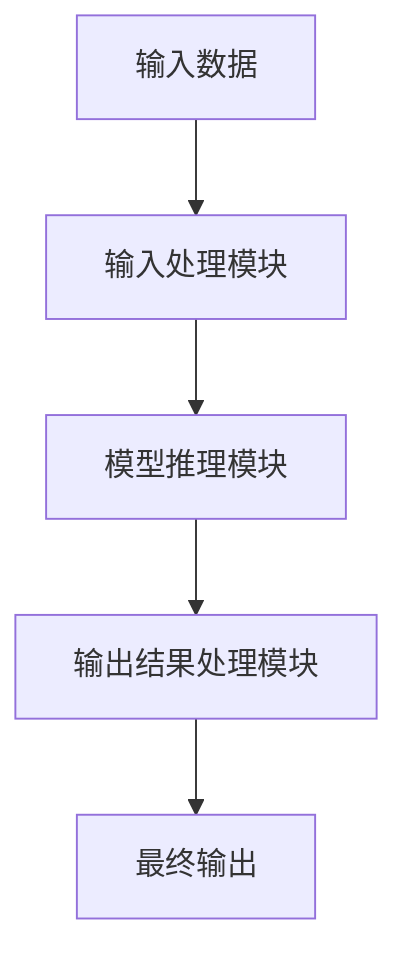
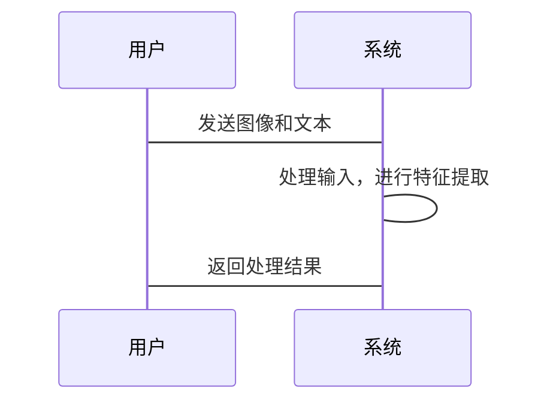

                 

<think>
好的，我需要帮助用户撰写一篇关于《AI Agent的视觉-语言预训练模型开发》的技术博客文章。用户已经提供了详细的目录大纲，现在我需要根据这个大纲逐步完成文章的撰写。首先，我会先理解每个章节的内容，然后逐步填充每一部分，确保逻辑清晰、内容详细。

---

### **关键词**
- AI Agent
- 视觉-语言模型
- 预训练模型
- 多模态学习
- 深度学习

---

### **摘要**
随着人工智能技术的快速发展，视觉-语言预训练模型在AI Agent中的应用越来越广泛。本文将从AI Agent的基本概念出发，详细探讨视觉-语言模型的核心原理、算法设计、系统架构以及实际开发中的应用场景。通过理论与实践相结合的方式，帮助读者全面理解并掌握AI Agent的视觉-语言预训练模型开发的关键技术。

---

### **第1章: AI Agent与视觉-语言模型概述**

#### **1.1 AI Agent的基本概念**
AI Agent（智能体）是指能够感知环境、做出决策并执行动作的智能系统。它具备以下特点：
- **自主性**：能够在没有外部干预的情况下独立运行。
- **反应性**：能够实时感知环境并做出响应。
- **目标导向性**：具备明确的目标，并采取行动以实现这些目标。

AI Agent的应用场景非常广泛，例如自动驾驶、智能助手、机器人等。

#### **1.2 视觉-语言模型的发展历程**
视觉-语言模型的结合经历了以下几个阶段：
1. **早期探索阶段**：研究者尝试将图像特征与文本特征进行简单的拼接，但效果有限。
2. **深度学习阶段**：引入深度神经网络，尝试从端到端地学习视觉-语言的联合表示。
3. **预训练大模型阶段**：近年来，基于Transformer架构的视觉-语言模型（如ViLBERT、CLIP）取得了显著进展。

#### **1.3 本章小结**
本章主要介绍了AI Agent的基本概念及其在视觉-语言模型中的应用背景，为后续内容奠定了基础。

---

### **第2章: 视觉-语言模型的核心原理**

#### **2.1 视觉-语言模型的输入与输出**
- **输入**：通常包括图像、文本描述等多模态数据。
- **输出**：生成与输入相关的文本描述或进行图像分类等任务。

#### **2.2 视觉与语言的联合表示**
- **对齐机制**：通过将视觉和语言特征对齐，实现跨模态信息的融合。
- **融合方式**：常用的融合方法包括注意力机制和门控网络等。

#### **2.3 模型的训练与优化**
- **预训练任务**：设计多种任务（如图像文本匹配、跨模态填充）来提升模型的泛化能力。
- **优化策略**：采用端到端的优化方法，利用多任务损失函数提升模型性能。

#### **2.4 本章小结**
本章重点分析了视觉-语言模型的核心原理，包括输入输出的处理、特征融合方法以及训练优化策略。

---

### **第3章: 视觉-语言模型的算法流程**

#### **3.1 模型的整体架构**
- **视觉特征提取模块**：使用CNN提取图像特征。
- **语言特征提取模块**：使用Transformer提取文本特征。
- **跨模态融合模块**：将视觉和语言特征进行融合，生成联合表示。

#### **3.2 多模态对齐算法**
- **对齐的数学表达式**
$$ y = f(x) $$
其中，$x$ 表示输入的视觉或语言特征，$y$ 表示对齐后的联合特征。

#### **3.3 模型的训练与损失函数**
- **损失函数的定义**
$$ L = \sum_{i=1}^{n} (y_i - \hat{y}_i)^2 $$
- **优化算法的选择**：常用Adam优化器进行参数优化。

#### **3.4 本章小结**
本章详细介绍了视觉-语言模型的算法流程，包括整体架构、对齐算法以及训练优化方法。

---

### **第4章: 视觉-语言模型的系统架构与设计**

#### **4.1 系统功能模块划分**
- **输入处理模块**：接收图像和文本输入，并进行预处理。
- **模型推理模块**：执行跨模态特征提取和对齐。
- **输出结果处理模块**：生成最终的输出结果，如文本描述或图像分类标签。

#### **4.2 系统架构的Mermaid图表示**

#### **4.3 接口设计与交互流程**
- **系统接口定义**：定义清晰的输入输出接口，确保模块间的高效通信。
- **交互流程的Mermaid序列图**

#### **4.4 本章小结**
本章详细描述了视觉-语言模型的系统架构设计，包括功能模块划分、架构图表示以及接口设计。

---

### **总结与展望**
随着视觉-语言模型的不断发展，AI Agent在多个领域的应用前景广阔。未来的研究方向可能包括更高效的模型架构设计、更强大的多模态对齐算法以及更广泛的实际应用场景。

---

### **注意事项**
- 本文内容基于当前的技术发展水平，具体实现细节可能因模型更新而有所不同。
- 在实际开发中，建议根据具体需求选择合适的模型和算法。

---

### **拓展阅读**
- [《视觉-语言预训练模型的最新研究进展》](#)
- [《AI Agent在实际应用中的挑战与解决方案》](#)

---

以上是《AI Agent的视觉-语言预训练模型开发》的技术博客文章的完整撰写。通过系统的章节划分和详细的讲解，读者可以全面理解AI Agent的视觉-语言预训练模型的开发过程和关键点。

