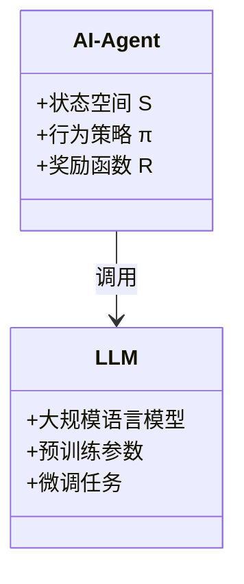
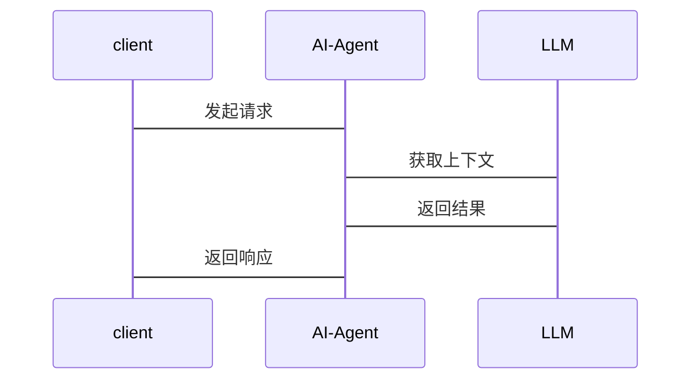

                 


# AI Agent的认知发展模拟：探索LLM的智能进化过程

**关键词**：AI Agent, LLM, 认知模拟, 智能进化, 大语言模型

**摘要**：本文探讨了AI Agent在认知发展模拟中的应用，重点分析了大语言模型（LLM）在智能进化过程中的角色与作用。文章从AI Agent和LLM的基本概念出发，详细阐述了它们的认知模拟能力、进化过程中的关键算法原理，以及系统架构设计。通过实际案例分析，深入解读了AI Agent与LLM协同工作的实现过程，并提出了最佳实践建议。

---

## 第1章: AI Agent与LLM的基本概念

### 1.1 AI Agent的定义与特点
AI Agent是一种能够感知环境并采取行动以实现目标的智能实体。它可以是一个软件程序、机器人或其他形式的智能系统，具备以下特点：
- **自主性**：能够独立决策和行动。
- **反应性**：能够实时感知环境并做出反应。
- **学习能力**：能够通过经验改进自身性能。

### 1.2 LLM的定义与特点
大语言模型（Large Language Model，LLM）是一种基于深度学习的自然语言处理模型，具有以下特点：
- **大规模训练**：通常基于海量数据进行预训练。
- **上下文理解**：能够理解语言的上下文和语义。
- **生成能力**：能够生成自然语言文本。

### 1.3 AI Agent认知发展模拟的背景
认知模拟是指通过计算机模型模拟人类或其他智能体的认知过程。AI Agent的认知发展模拟旨在通过LLM等技术，模拟和增强AI Agent的智能能力。

---

## 第2章: LLM的智能进化过程

### 2.1 LLM的训练过程
LLM的训练通常包括预训练和微调两个阶段：
- **预训练**：通过大量无标签数据进行自监督学习，学习语言的结构和语义。
- **微调**：在特定任务上进行有监督学习，优化模型在具体场景下的性能。

### 2.2 LLM的认知能力提升
- **知识表示**：通过大规模数据训练，模型能够更好地表示和理解知识。
- **推理能力**：模型能够通过上下文推理出隐含的信息。
- **学习能力**：模型能够通过持续学习适应新的任务和数据。

### 2.3 LLM进化中的挑战
- **数据质量**：数据的多样性和代表性直接影响模型性能。
- **计算资源**：训练和推理需要大量的计算资源。
- **模型泛化**：模型在不同领域和任务上的泛化能力有限。

---

## 第3章: AI Agent认知模拟的数学模型

### 3.1 基础概念与公式
- **概率论基础**：概率是AI Agent决策的核心工具。
  - 示例：$P(A|B) = \frac{P(B|A)P(A)}{P(B)}$
- **信息论基础**：信息量是衡量数据重要性的指标。
  - 示例：$I(A;B) = H(A) - H(A|B)$
- **神经网络基础**：神经网络是LLM的核心结构。
  - 示例：$y = f(xW + b)$

### 3.2 LLM的数学模型
- **Transformer模型**：基于自注意力机制的模型。
  - 示例：$$\text{Attention}(Q,K,V) = \text{softmax}\left(\frac{QK^T}{\sqrt{d_k}}\right)V$$

### 3.3 AI Agent的认知模型
- **状态空间**：表示AI Agent所处环境的状态。
  - 示例：$S = \{s_1, s_2, \dots, s_n\}$
- **行为策略**：定义AI Agent在不同状态下的行动策略。
  - 示例：$\pi(a|s) = \text{概率}(a|s)$
- **奖励函数**：衡量AI Agent行动的优劣。
  - 示例：$R(s,a) = r$

---

## 第4章: 系统分析与架构设计

### 4.1 问题场景介绍
- **场景描述**：一个AI Agent需要通过LLM辅助完成复杂任务。
- **核心目标**：实现AI Agent与LLM的协同工作。

### 4.2 系统功能设计
- **领域模型**：定义系统的功能模块和交互关系。
  - 示例：使用Mermaid类图表示。



### 4.3 系统架构设计
- **系统架构**：展示系统的整体架构。
  - 示例：使用Mermaid架构图表示。


### 4.4 系统接口设计
- **接口描述**：定义系统组件之间的接口。
  - 示例：使用Mermaid序列图表示。



---

## 第5章: 项目实战

### 5.1 环境安装
- **工具安装**：安装必要的开发工具和库。
  - 示例：安装Python、TensorFlow、PyTorch等。

### 5.2 核心实现
- **代码示例**：展示AI Agent与LLM协同工作的代码实现。

```python
class AI-Agent:
    def __init__(self):
        self.LLM = LLM_model()

    def process_request(self, request):
        context = self.LLM.generate_context(request)
        action = self.determine_action(context)
        return action
```

### 5.3 实际案例分析
- **案例分析**：通过具体案例展示系统的实现过程和效果。

---

## 第6章: 最佳实践与总结

### 6.1 最佳实践
- **数据质量管理**：确保训练数据的多样性和高质量。
- **模型优化**：通过微调和优化算法提升模型性能。
- **系统设计**：注重系统的可扩展性和可维护性。

### 6.2 小结
本文详细探讨了AI Agent认知发展模拟的实现过程，分析了LLM在智能进化中的关键作用，并通过实际案例展示了系统的实现过程。

### 6.3 注意事项
- **数据隐私**：注意保护用户数据的隐私和安全。
- **计算资源**：合理规划计算资源的使用。

### 6.4 拓展阅读
- 推荐相关书籍和论文，供读者深入研究。

---

以上是完整的目录大纲和文章结构。接下来，我会按照这个结构逐步展开每一部分的内容，确保逻辑清晰、内容详实。

