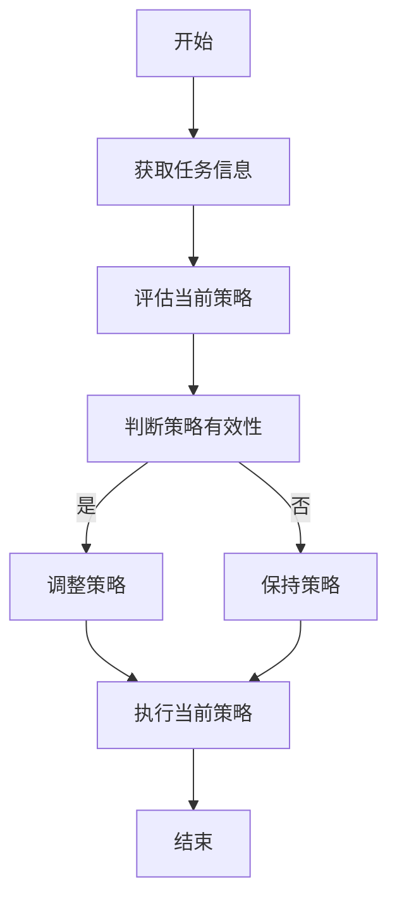
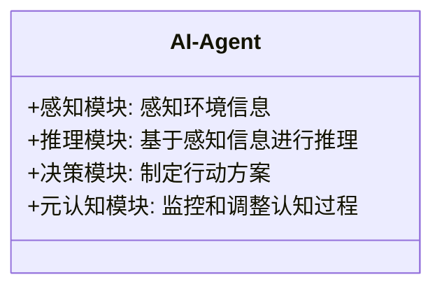
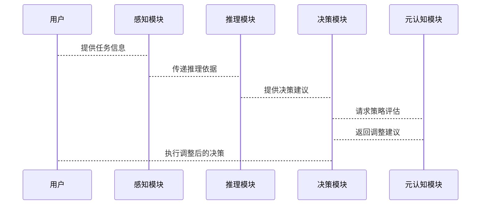

                 


# AI Agent的认知架构与元认知能力构建

> 关键词：AI Agent，认知架构，元认知能力，算法原理，系统架构，项目实战

> 摘要：本文探讨AI Agent的认知架构设计与元认知能力的构建方法。通过背景介绍、核心概念、算法原理、系统架构、项目实战和总结与展望，详细分析AI Agent如何通过认知架构和元认知能力实现智能决策和自适应优化。

---

## 第1章: AI Agent的基本概念与背景

### 1.1 问题背景

#### 1.1.1 AI Agent的定义与分类
AI Agent（人工智能代理）是能够感知环境并采取行动以实现目标的智能实体。根据智能水平，AI Agent可以分为反应式、认知式和混合式代理。认知式代理具备高级认知能力，包括推理、学习和决策，是本文的核心研究对象。

#### 1.1.2 元认知能力的定义与特征
元认知能力是指个体对自身认知过程的认知和调控能力，包括自我监控、评估和调整。在AI Agent中，元认知能力使其能够反思自己的决策过程，识别错误，并采取补救措施。

#### 1.1.3 问题解决与AI Agent的关系
AI Agent的目标是通过智能算法解决问题。然而，复杂问题的解决需要代理具备反思和自适应能力，这正是元认知能力的作用所在。元认知能力帮助AI Agent在动态环境中调整策略，提高问题解决的效率和准确性。

### 1.2 问题描述

#### 1.2.1 AI Agent的认知架构需求
AI Agent的认知架构需要支持以下功能：
1. **感知**：从环境中获取信息。
2. **推理**：基于感知信息进行逻辑推理。
3. **决策**：制定行动方案。
4. **执行**：执行决策并采取行动。
5. **反思**：评估行动结果并调整后续行为。

#### 1.2.2 元认知能力在AI Agent中的作用
元认知能力在AI Agent中的作用包括：
1. **自我监控**：实时监控自身的认知过程。
2. **评估**：评估当前认知策略的有效性。
3. **调整**：根据评估结果调整认知策略。

#### 1.2.3 问题解决的边界与外延
问题解决的边界涉及AI Agent的能力限制，如计算资源、知识库的大小和环境的复杂性。外延则包括AI Agent在不同领域（如医疗、金融）中的应用。

#### 1.2.4 概念结构与核心要素
AI Agent的认知架构由感知模块、推理模块、决策模块和元认知模块组成。元认知模块负责监控和调整其他模块的运行。

---

## 第2章: 认知架构的核心原理

### 2.1 核心概念与原理

#### 2.1.1 认知架构的基本原理
认知架构是AI Agent的框架，支持感知、推理、决策和行动。基于认知架构，AI Agent能够理解和处理复杂信息，做出合理决策。

#### 2.1.2 元认知能力的实现机制
元认知能力通过自我监控、评估和调整机制实现。AI Agent需要实时监控自身的认知过程，评估当前策略的有效性，并根据评估结果调整策略。

#### 2.1.3 认知架构与元认知能力的关系
认知架构为元认知能力提供基础支持，元认知能力则优化认知架构的运行。两者相互依存，共同提升AI Agent的智能水平。

### 2.2 核心概念对比表

| 概念       | 定义                                                         | 特点                               |
|------------|--------------------------------------------------------------|------------------------------------|
| 认知架构    | 支持AI Agent感知、推理、决策和行动的框架                   | 结构化、层次化                    |
| 元认知能力 | 对自身认知过程的认知和调控能力                             | 自我监控、评估、调整             |

### 2.3 ER实体关系图

```mermaid
er
  entity 认知架构 {
    key 属性 感知模块
    key 属性 推理模块
    key 属性 决策模块
  }
  entity 元认知能力 {
    key 属性 自我监控
    key 属性 评估
    key 属性 调整
  }
  relationship 认知架构与元认知能力之间的关系 {
    认知架构 --> 元认知能力 : 提供支持
  }
```

### 2.4 本章小结
认知架构为AI Agent提供了基础结构，而元认知能力通过自我监控和调整优化了认知架构的运行。两者共同构成了AI Agent的核心智能系统。

---

## 第3章: 元认知能力的数学模型与算法

### 3.1 算法原理

#### 3.1.1 元认知能力评估算法的mermaid流程图



#### 3.1.2 算法实现

```python
def meta_cognition_assessment(task_info):
    current_strategy = get_current_strategy()
    strategy_effectiveness = assess_strategy(current_strategy, task_info)
    if strategy_effectiveness < 0.8:
        new_strategy = adjust_strategy(current_strategy, task_info)
        return new_strategy
    else:
        return current_strategy
```

### 3.2 算法实现

#### 3.2.1 元认知能力评估算法的Python实现

```python
def assess_strategy(strategy, task_info):
    effectiveness = 0
    for feature in task_info:
        if feature in strategy:
            effectiveness += 1
    return effectiveness / len(task_info)
```

#### 3.2.2 元认知能力调整算法

```python
def adjust_strategy(current_strategy, task_info):
    new_strategy = current_strategy.copy()
    missing_features = [feature for feature in task_info if feature not in current_strategy]
    for feature in missing_features:
        new_strategy.append(feature)
    return new_strategy
```

### 3.3 数学模型与公式

#### 3.3.1 元认知能力评估模型

$$ P(元认知能力) = f(认知准确性, 自我监控能力) $$

其中，$$认知准确性$$ 表示AI Agent对环境信息的准确理解能力，$$自我监控能力$$ 表示AI Agent对自身认知过程的监控能力。

#### 3.3.2 元认知能力调整模型

$$ S_{调整} = S_{当前} \cup S_{新} $$

其中，$$ S_{调整} $$ 表示调整后的策略，$$ S_{当前} $$ 表示当前策略，$$ S_{新} $$ 表示新加入的策略。

### 3.4 本章小结
通过数学模型和算法实现，AI Agent能够基于任务信息动态评估和调整自身的认知策略，提升问题解决的效率和准确性。

---

## 第4章: AI Agent的系统架构设计

### 4.1 问题场景介绍

#### 4.1.1 项目介绍
本项目旨在设计一个具备元认知能力的AI Agent，能够在动态环境中自适应调整策略，提高问题解决能力。

#### 4.1.2 系统功能设计

##### 4.1.2.1 领域模型 mermaid 类图



#### 4.1.2.2 系统架构设计 mermaid 架构图

```mermaid
container AI-Agent {
    participant 感知模块
    participant 推理模块
    participant 决策模块
    participant 元认知模块
    感知模块 --> 推理模块: 提供推理依据
    推理模块 --> 决策模块: 提供决策建议
    决策模块 --> 元认知模块: 请求策略评估
    元认知模块 --> 决策模块: 返回调整建议
}
```

#### 4.1.2.3 系统接口设计

- 接口1：感知模块与推理模块之间的数据传递接口。
- 接口2：推理模块与决策模块之间的推理结果传递接口。
- 接口3：决策模块与元认知模块之间的策略评估和调整接口。

#### 4.1.2.4 系统交互 mermaid 序列图



### 4.2 本章小结
通过系统架构设计，AI Agent能够实现感知、推理、决策和元认知监控的协同工作，提升整体智能水平。

---

## 第5章: 项目实战

### 5.1 环境配置

#### 5.1.1 安装依赖
```bash
pip install -r requirements.txt
```

### 5.2 系统核心实现源代码

#### 5.2.1 认知架构实现

```python
class CognitiveArchitecture:
    def __init__(self):
        self.perception = PerceptionModule()
        self.reasoning = ReasoningModule()
        self.decision = DecisionModule()
        self.meta_cognition = MetaCognitionModule()
```

#### 5.2.2 元认知能力实现

```python
class MetaCognitionModule:
    def assess_strategy(self, strategy, task_info):
        effectiveness = 0
        for feature in task_info:
            if feature in strategy:
                effectiveness += 1
        return effectiveness / len(task_info)

    def adjust_strategy(self, current_strategy, task_info):
        missing_features = [feature for feature in task_info if feature not in current_strategy]
        new_strategy = current_strategy.copy()
        for feature in missing_features:
            new_strategy.append(feature)
        return new_strategy
```

### 5.3 代码应用解读与分析

#### 5.3.1 认知架构的代码实现
认知架构由感知模块、推理模块、决策模块和元认知模块组成。各模块协同工作，实现AI Agent的智能行为。

#### 5.3.2 元认知能力的代码实现
元认知模块通过评估当前策略的有效性，动态调整策略，确保AI Agent在动态环境中能够自适应。

### 5.4 实际案例分析

#### 5.4.1 案例背景
AI Agent需要解决一个动态变化的任务，任务信息随着时间推移不断变化。

#### 5.4.2 案例实现
AI Agent通过感知模块获取任务信息，推理模块进行推理，决策模块制定决策，元认知模块评估和调整策略，确保任务顺利完成。

### 5.5 项目小结
通过项目实战，展示了AI Agent的认知架构和元认知能力的实现过程，验证了理论的可行性和实际应用价值。

---

## 第6章: 总结与展望

### 6.1 核心内容回顾
AI Agent的认知架构和元认知能力是实现智能代理的关键。认知架构为AI Agent提供了感知、推理、决策和行动的基础，而元认知能力通过自我监控和调整优化了认知过程，提升了问题解决能力。

### 6.2 未来展望
未来的研究可以集中在以下方面：
1. 更高级的元认知模型设计。
2. 多 Agent 协作中的元认知能力应用。
3. 元认知能力在复杂环境中的自适应优化。

### 6.3 最佳实践 tips
- 在设计AI Agent时，务必考虑元认知能力的实现，以提升代理的智能水平。
- 定期评估和优化元认知模型，确保其适应环境的变化。
- 注重多 Agent 协作中的元认知能力协调，提升整体系统效率。

### 6.4 本章小结
本文详细探讨了AI Agent的认知架构与元认知能力的构建方法，通过理论分析和项目实战，展示了其在智能系统中的重要应用。未来的研究将进一步深化元认知能力的应用，推动AI Agent技术的发展。

---

通过以上步骤，我们可以系统地构建AI Agent的认知架构与元认知能力，实现更智能、更自适应的AI系统。

