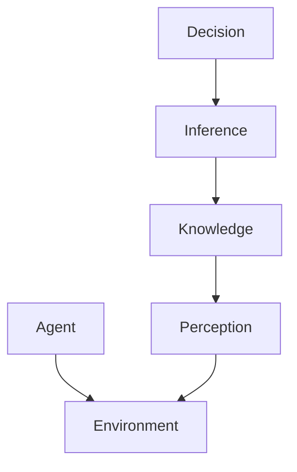
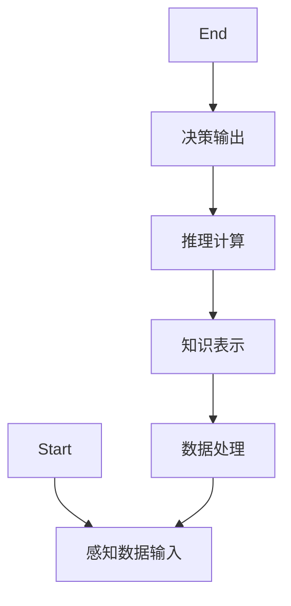
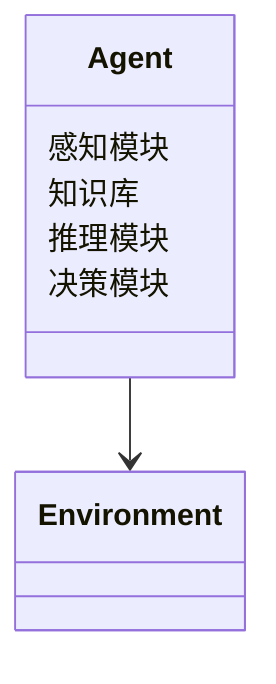
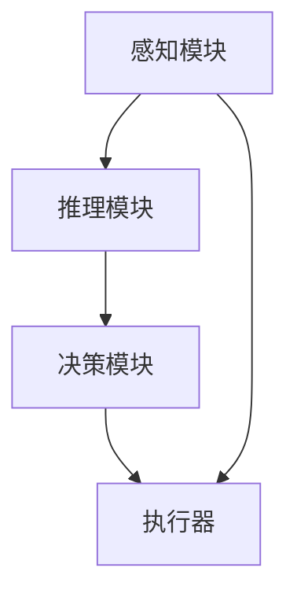
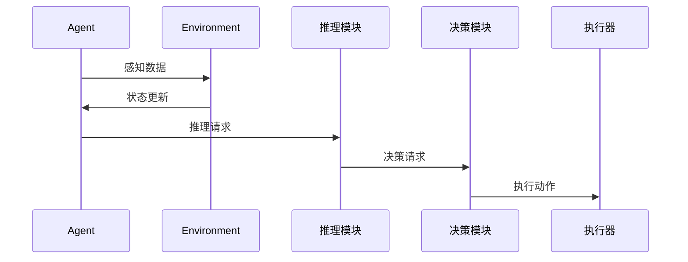

                 


# AI Agent的认知架构：从感知到决策的全流程设计

## 关键词：AI Agent，认知架构，感知，决策，知识表示，推理，算法原理

## 摘要：AI Agent的认知架构是人工智能领域的重要组成部分，涉及从感知到决策的全流程设计。本文将从背景、核心概念、算法原理、系统架构、项目实战等多个角度，详细解析AI Agent的认知架构，帮助读者全面理解其设计与实现。

---

## 第一部分: AI Agent的认知架构基础

## 第1章: AI Agent概述

### 1.1 问题背景与描述

#### 1.1.1 人工智能与智能体的基本概念
人工智能（AI）是模拟人类智能的计算机系统，而智能体（Agent）是具有自主决策能力的实体，能够感知环境、做出决策并执行动作。AI Agent是人工智能的核心实现单元，广泛应用于机器人、自动驾驶、推荐系统等领域。

#### 1.1.2 AI Agent的核心问题与挑战
AI Agent的设计面临感知不确定性、知识表示复杂性、决策优化等问题。如何在复杂环境中实现高效的感知、推理和决策，是AI Agent研究的核心挑战。

#### 1.1.3 认知架构在AI Agent中的重要性
认知架构是AI Agent的“大脑”，负责整合感知信息、处理知识、推理逻辑并做出决策。认知架构的设计直接影响AI Agent的性能和智能水平。

### 1.2 问题解决与边界

#### 1.2.1 AI Agent的认知任务分解
认知任务包括感知、知识表示、推理和决策四个阶段。每个阶段都有其特定的目标和实现方法。

#### 1.2.2 认知架构的边界与外延
认知架构的边界是感知与决策之间的接口，外延则涉及与环境的交互和与其他智能体的协作。

#### 1.2.3 智能体与环境的交互边界
AI Agent通过传感器和执行器与环境交互，感知环境状态并执行动作，形成闭环。

### 1.3 概念结构与核心要素

#### 1.3.1 认知架构的组成要素
认知架构由感知模块、知识库、推理模块和决策模块组成。

#### 1.3.2 感知、推理、决策的核心关系
感知是输入，推理是处理，决策是输出，三者相互关联，共同实现认知功能。

#### 1.3.3 知识表示与推理机制
知识表示是认知的基础，推理是知识处理的关键，两者共同支撑决策过程。

---

## 第2章: AI Agent的核心概念与联系

### 2.1 核心概念原理

#### 2.1.1 感知模块的工作原理
感知模块通过传感器获取环境信息，进行数据处理并提取特征，为推理提供输入。

#### 2.1.2 知识表示与推理机制
知识表示采用符号逻辑或概率模型，推理通过逻辑演绎或归纳推理得出结论。

#### 2.1.3 决策与行动的执行逻辑
决策模块根据推理结果选择最优动作，并通过执行器与环境交互。

### 2.2 概念属性对比表

| 概念 | 属性       | 描述                                   |
|------|------------|----------------------------------------|
| 感知 | 输入数据   | 传感器输入                            |
| 知识 | 表示方法   | 符号逻辑或概率模型                    |
| 推理 | 方法       | 归纳、演绎或类比推理                  |
| 决策 | 输出       | 动作选择                              |

### 2.3 ER实体关系图


---

## 第3章: AI Agent的算法原理

### 3.1 算法原理概述

#### 3.1.1 感知算法的分类与选择
感知算法包括特征提取、模式识别等，选择基于具体任务需求。

#### 3.1.2 知识表示与推理算法
知识表示采用图结构或概率模型，推理算法包括逻辑推理和概率推理。

#### 3.1.3 决策算法的实现逻辑
决策算法通过状态空间搜索或强化学习选择最优动作。

### 3.2 算法流程图



### 3.3 核心算法实现

#### 3.3.1 感知算法的Python实现
```python
def 感知算法(输入数据):
    处理数据
    返回感知结果
```

#### 3.3.2 推理算法的数学模型
$$P(A|B) = \frac{P(B|A)P(A)}{P(B)}$$

#### 3.3.3 决策算法的优化
$$V(s) = \max_a \sum_{s'} P(s'|a,s) V(s')$$`

---

## 第4章: AI Agent的系统分析与架构设计

### 4.1 问题场景介绍

#### 4.1.1 AI Agent的应用场景分析
以自动驾驶为例，分析感知、决策模块的具体实现。

#### 4.1.2 系统目标与功能需求
设计目标是实现高效的感知、推理和决策，满足自动驾驶的安全性和实时性要求。

### 4.2 系统功能设计

#### 4.2.1 领域模型设计


### 4.3 系统架构设计

#### 4.3.1 系统架构图


#### 4.3.2 接口设计


---

## 第5章: 项目实战

### 5.1 环境安装与配置

#### 5.1.1 开发环境
安装Python、NumPy、TensorFlow等库。

#### 5.1.2 依赖管理
使用pip安装所需依赖。

### 5.2 核心代码实现

#### 5.2.1 感知模块代码
```python
import numpy as np

def 感知算法(输入数据):
    features = np.array(输入数据)
    return features
```

#### 5.2.2 推理模块代码
```python
def 推理算法(知识库, features):
    return 推论结果
```

#### 5.2.3 决策模块代码
```python
def 决策算法(推论结果):
    return 动作选择
```

### 5.3 实际案例分析

#### 5.3.1 应用场景
以自动驾驶为例，分析感知、推理和决策的具体实现。

#### 5.3.2 案例分析
详细解读感知数据如何转化为决策动作。

### 5.4 项目小结

#### 5.4.1 经验总结
关键点包括感知算法的选择、知识表示的优化和决策策略的优化。

#### 5.4.2 注意事项
注意数据处理的效率、知识库的更新频率和决策的实时性。

---

## 第6章: 最佳实践

### 6.1 小结

#### 6.1.1 核心观点
认知架构是AI Agent的核心，感知、推理和决策三者相互关联。

#### 6.1.2 关键技术
感知算法的选择、知识表示的优化和决策策略的优化。

### 6.2 注意事项

#### 6.2.1 设计注意事项
确保认知架构的模块化设计，便于维护和扩展。

#### 6.2.2 开发注意事项
注意数据处理的效率、知识库的更新和决策的实时性。

### 6.3 拓展阅读

#### 6.3.1 推荐书籍
《人工智能：一种现代方法》

#### 6.3.2 推荐论文
“Towards Autonomous Vehicles” by Chris Urmson

---

## 结语

AI Agent的认知架构是一个复杂而重要的领域，涉及感知、推理和决策的全流程设计。通过本文的分析，读者可以深入理解认知架构的核心概念、算法原理和系统设计，为实际项目提供理论支持和实践指导。未来，随着技术的发展，认知架构将更加智能化和高效化，为人工智能的发展注入更多活力。

