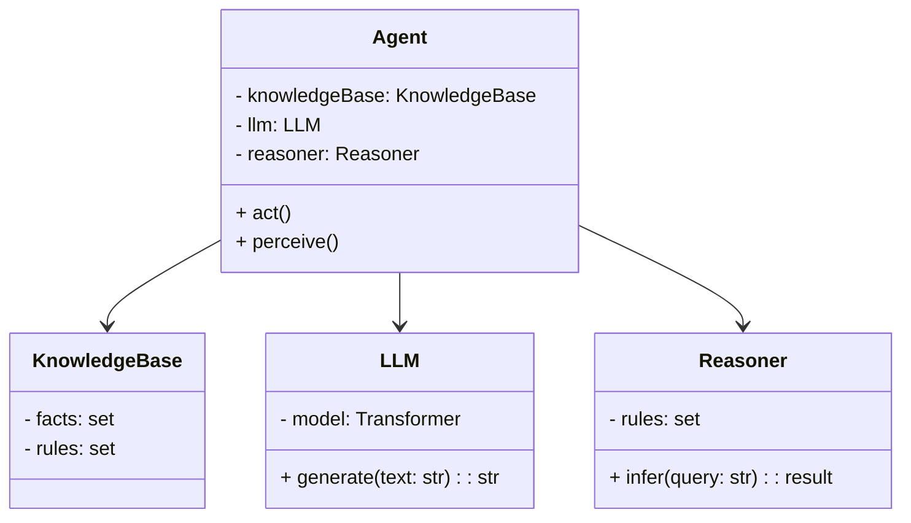
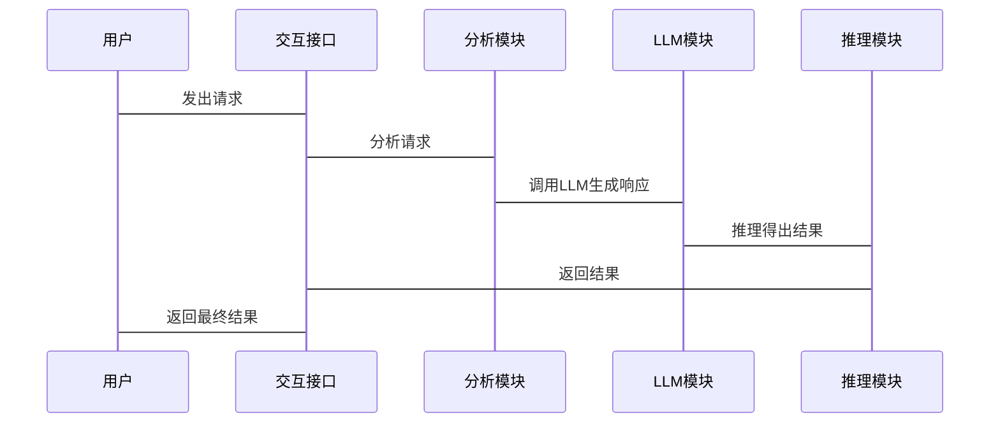

                 


# AI Agent的认知架构：整合LLM与符号推理系统

> 关键词：AI Agent、LLM、符号推理、认知架构、混合智能

> 摘要：本文探讨了AI Agent的认知架构，重点介绍了如何整合大语言模型（LLM）与符号推理系统，以构建更智能的AI代理。通过分析LLM和符号推理的优势与局限，提出了混合架构的设计，并详细阐述了系统实现和实际应用。

---

## 第1章：引言

### 1.1 AI Agent的定义与背景

AI Agent（人工智能代理）是指能够感知环境、自主决策并采取行动的智能实体。它广泛应用于自动驾驶、智能助手、机器人等领域。传统的AI Agent主要依赖规则或基于数据的统计方法，但在复杂任务中表现有限，难以处理需要深度推理和创造性的问题。

### 1.2 问题背景

LLM（大语言模型）如GPT在自然语言处理方面表现出色，但缺乏逻辑推理能力；符号推理系统擅长逻辑推理，但难以处理复杂语言任务。因此，整合两者以互补优势，构建更强大的AI Agent成为趋势。

---

## 第2章：大语言模型（LLM）概述

### 2.1 LLM的基本原理

LLM基于深度学习，通过大量数据训练生成自然语言文本。其优势在于强大的生成能力和理解能力，但逻辑推理和可解释性较弱。

#### 2.1.1 LLM的应用场景

- 自然语言生成
- 信息抽取
- 问题回答

### 2.2 LLM的优势与局限性

- **优势**：生成能力强，能处理复杂语言任务。
- **局限**：推理能力有限，可解释性差。

---

## 第3章：符号推理系统概述

### 3.1 符号推理的基本原理

符号推理通过逻辑规则和知识库进行推理，擅长处理逻辑问题，如定理证明和决策问题。

#### 3.1.1 符号推理的应用场景

- 自动推理
- 专家系统

### 3.2 符号推理的优势与局限性

- **优势**：逻辑推理能力强，可解释性好。
- **局限**：知识表示有限，计算效率低。

---

## 第4章：整合LLM与符号推理系统

### 4.1 混合架构设计

将LLM用于生成自然语言指令，符号推理用于逻辑推理，两者协同工作，提升AI Agent能力。

#### 4.1.1 混合架构的优势

- 综合生成与推理能力
- 提高系统的智能水平

### 4.2 混合架构的实现步骤

1. LLM生成初步指令
2. 符号推理系统进行推理
3. 反馈结果至LLM优化

---

## 第5章：算法原理与数学模型

### 5.1 LLM的数学模型

使用转换器模型，如Transformer，训练目标函数为交叉熵损失。

$$ \mathcal{L} = -\sum_{i=1}^{n} \log P(y_i|x_i) $$

### 5.2 符号推理的逻辑模型

基于逻辑推理规则，如一阶逻辑：

$$ P(X, Y) \land Q(Y, Z) \rightarrow R(X, Z) $$

---

## 第6章：系统分析与架构设计

### 6.1 项目背景

构建一个能处理复杂任务的AI Agent，整合LLM和符号推理系统。

### 6.2 系统功能设计

- 信息处理
- 逻辑推理
- 自然语言生成

#### 6.2.1 领域模型（Mermaid类图）



### 6.3 系统架构设计（Mermaid架构图）


### 6.4 接口设计与交互流程（Mermaid序列图）



---

## 第7章：项目实战

### 7.1 环境安装

安装Python、TensorFlow、PyTorch、符号推理库。

### 7.2 核心代码实现

```python
# LLM 模块实现
class LLM:
    def __init__(self, model):
        self.model = model

    def generate(self, text):
        # 返回生成文本
        pass

# 推理模块实现
class Reasoner:
    def __init__(self, rules):
        self.rules = rules

    def infer(self, query):
        # 推理过程
        pass

# Agent 类实现
class Agent:
    def __init__(self, llm, reasoner, knowledge_base):
        self.llm = llm
        self.reasoner = reasoner
        self.knowledge_base = knowledge_base

    def perceive(self, input):
        # 接收输入，调用LLM生成响应
        response = self.llm.generate(input)
        # 调用推理模块进行推理
        result = self.reasoner.infer(response)
        return result
```

### 7.3 案例分析

实现一个问答系统，结合LLM生成回答，符号推理验证答案正确性。

---

## 第8章：总结与展望

### 8.1 总结

整合LLM与符号推理系统，构建更智能的AI Agent，提升生成与推理能力。

### 8.2 未来展望

探索更高效的知识表示方法，优化推理效率，提升系统的可解释性和实时性。

### 8.3 注意事项

- 确保数据质量和多样性
- 定期更新知识库和规则
- 注意计算资源消耗

### 8.4 拓展阅读

推荐相关书籍和论文，深入学习符号推理和混合智能技术。

---

通过整合LLM与符号推理系统，AI Agent在复杂任务中的表现显著提升，未来将朝着更智能、更高效的混合智能方向发展。

