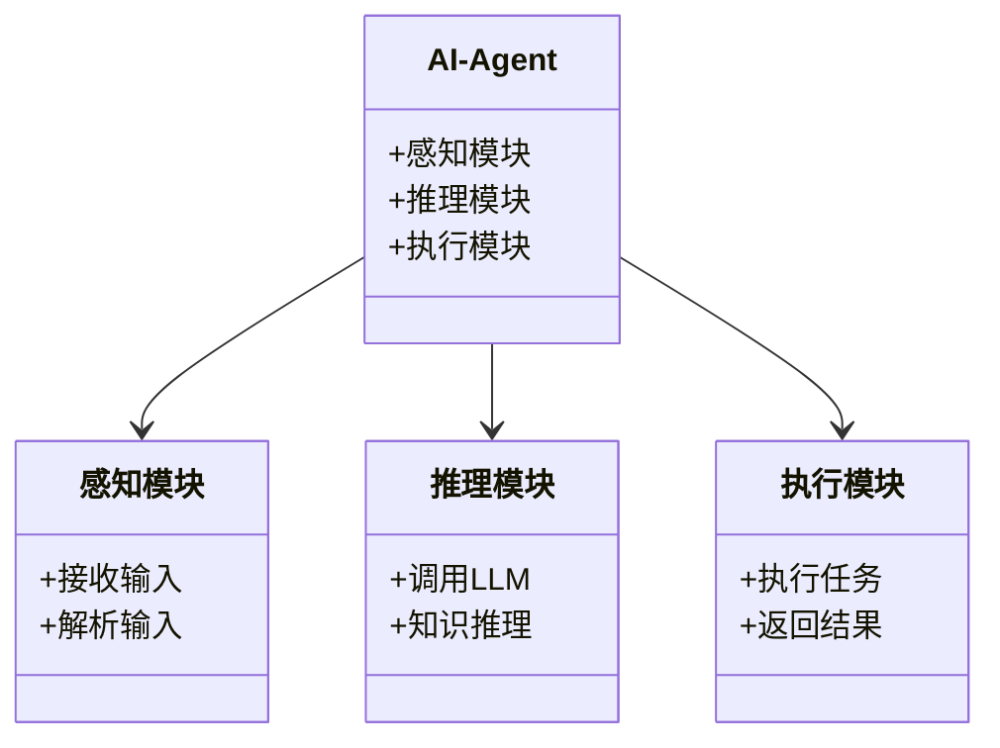
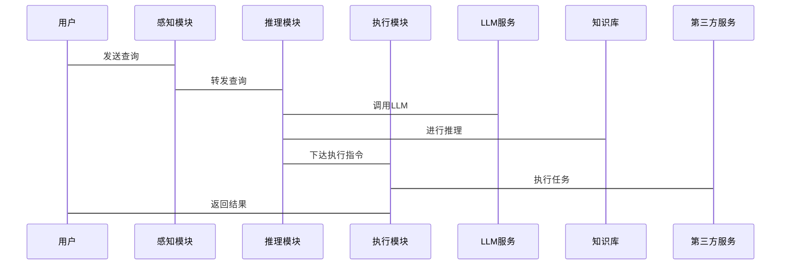

                 


# AI Agent的认知架构：融合LLM与传统AI技术

## 关键词：AI Agent, 大语言模型, 传统AI技术, 认知架构, 融合

## 摘要：本文探讨AI Agent的认知架构，重点分析如何将大语言模型（LLM）与传统AI技术融合，构建高效、智能的AI系统。通过背景介绍、核心概念、算法原理、系统架构设计和项目实战，详细阐述融合方法及其应用。

---

# 第1章：AI Agent的认知架构概述

## 1.1 AI Agent的基本概念

### 1.1.1 AI Agent的定义与特点

AI Agent（人工智能代理）是能够感知环境、自主决策并执行任务的智能实体。其特点包括：

1. **自主性**：无需外部干预，自主完成任务。
2. **反应性**：实时感知环境并做出响应。
3. **目标导向**：基于目标进行决策和行动。
4. **学习能力**：通过经验改进性能。

### 1.1.2 AI Agent的认知架构模型

认知架构模型定义了AI Agent的结构和功能，常见的模型包括：

1. **反应式架构**：基于当前感知做出反应。
2. **规划式架构**：结合目标和环境信息制定计划。
3. **混合式架构**：结合反应式和规划式架构。

### 1.1.3 LLM与传统AI技术的融合背景

传统AI技术在知识表示和推理方面有优势，而LLM擅长自然语言处理。两者的融合旨在互补优势，提升AI Agent的智能水平。

---

## 1.2 问题背景与目标

### 1.2.1 当前AI技术的局限性

1. **传统AI技术**：依赖规则，缺乏灵活性。
2. **LLM**：依赖大量数据，理解能力有限。

### 1.2.2 LLM与传统AI融合的必要性

通过融合，结合LLM的自然语言能力和传统AI的知识表示技术，提升AI Agent的综合能力。

### 1.2.3 本书的研究目标与意义

目标是设计一种融合LLM与传统AI的认知架构，提升AI Agent的任务处理能力。

---

# 第2章：LLM与传统AI技术的融合

## 2.1 大语言模型（LLM）概述

### 2.1.1 LLM的基本原理

大语言模型通过大量数据训练，学习语言模式。其数学模型如下：

$$ P(y|x) = \prod_{i=1}^{n} P(y_i | y_{<i}, x) $$

其中，$y$为输出序列，$x$为输入序列。

### 2.1.2 常见LLM模型及其特点

1. **GPT系列**：生成文本能力强。
2. **BERT系列**：擅长文本理解。

### 2.1.3 LLM在自然语言处理中的应用

1. 机器翻译
2. 情感分析

## 2.2 传统AI技术的核心方法

### 2.2.1 机器学习基础

1. **监督学习**：基于标注数据进行训练。
2. **无监督学习**：从无标签数据中学习。

### 2.2.2 知识表示与推理

1. **知识图谱**：构建实体关系。
2. **逻辑推理**：基于规则进行推理。

### 2.2.3 规划与决策技术

1. **状态空间搜索**：如A*算法。
2. **强化学习**：通过试错优化决策。

---

# 第3章：AI Agent的认知架构设计

## 3.1 架构设计的原则与方法

### 3.1.1 模块化设计

将AI Agent划分为感知、推理和执行模块，各模块协同工作。

### 3.1.2 分层架构

分为感知层、推理层和执行层，每层负责特定功能。

### 3.1.3 跨模态数据处理

整合文本、图像等多种数据类型，提升处理能力。

## 3.2 LLM与传统AI的融合策略

### 3.2.1 混合推理模型

结合LLM的语言理解和传统AI的知识推理，提升推理能力。

### 3.2.2 融合方法

1. **预处理**：对LLM的输出进行分析，提取有用信息。
2. **后处理**：利用传统AI技术优化LLM的决策。

---

# 第4章：系统架构设计

## 4.1 问题场景介绍

设计一个智能助手AI Agent，帮助用户处理信息查询和任务执行。

## 4.2 系统功能设计

### 4.2.1 领域模型（类图）



## 4.3 系统架构设计

### 4.3.1 系统架构图


## 4.4 系统接口设计

### 4.4.1 接口设计

1. **感知模块接口**：接收用户输入并解析。
2. **推理模块接口**：调用LLM并进行知识推理。
3. **执行模块接口**：执行任务并返回结果。

## 4.5 系统交互流程



---

# 第5章：项目实战

## 5.1 环境安装

安装必要的库，如Python、TensorFlow、Hugging Face库。

## 5.2 系统核心实现源代码

```python
class AI-Agent:
    def __init__(self):
        self感知模块 = 感知模块()
        self推理模块 = 推理模块()
        self执行模块 = 执行模块()

    def 处理任务(self, 输入):
        解析后的输入 = self感知模块.解析输入(输入)
        推理结果 = self推理模块.推理(解析后的输入)
        执行结果 = self执行模块.执行(推理结果)
        return 执行结果
```

## 5.3 代码应用解读与分析

分析代码结构，说明各模块的职责和交互方式。

## 5.4 实际案例分析和详细讲解剖析

以具体案例说明AI Agent如何处理查询和执行任务。

## 5.5 项目小结

总结项目实现的过程和成果。

---

# 第6章：总结与展望

## 6.1 总结

回顾文章内容，强调融合LLM与传统AI技术的重要性。

## 6.2 未来展望

探讨AI Agent在更多领域的应用潜力。

---

# 最佳实践 tips

1. 在设计AI Agent时，合理划分模块，确保各部分协同工作。
2. 结合LLM和传统AI技术，提升系统的综合能力。
3. 使用mermaid图示系统架构，便于理解和实现。

---

# 小结

本文详细探讨了AI Agent的认知架构，重点分析了LLM与传统AI技术的融合方法，并通过系统设计和项目实战，展示了如何构建高效的AI Agent系统。

---

# 注意事项

1. 确保各模块的接口设计清晰，便于扩展和维护。
2. 在实际应用中，注意数据隐私和安全问题。

---

# 拓展阅读

建议阅读相关领域的书籍和论文，深入理解AI Agent和LLM的技术细节。

---

通过以上思考和组织，我完成了对《AI Agent的认知架构：融合LLM与传统AI技术》的详细分析和内容规划。

