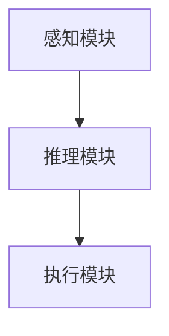

                 


# AI Agent的认知计算与心智理论模拟

---

## 关键词：
AI Agent，认知计算，心智模拟，人工智能，认知模型，系统架构

---

## 摘要：
本文详细探讨了AI Agent的认知计算与心智模拟的理论基础和实践应用。通过分析认知模型和心智模拟的核心概念，结合算法原理和系统架构设计，展示了如何在实际项目中应用这些理论。文章还提供了丰富的代码示例和图表，帮助读者深入理解AI Agent的设计与实现。

---

# 目录大纲

## 第一部分: AI Agent的认知计算与心智理论模拟概述

### 第1章: AI Agent的基本概念与背景

#### 1.1 什么是AI Agent
- 1.1.1 AI Agent的定义
- 1.1.2 AI Agent的特点
- 1.1.3 AI Agent的分类

#### 1.2 认知计算与心智模拟的背景
- 1.2.1 认知科学与人工智能的结合
- 1.2.2 心智模拟的基本概念
- 1.2.3 AI Agent在实际应用中的重要性

### 第2章: AI Agent的认知模型与心智模拟

#### 2.1 认知模型的基本原理
- 2.1.1 认知模型的定义
- 2.1.2 认知模型的核心要素
- 2.1.3 认知模型与AI Agent的关系

#### 2.2 心智模拟的核心概念
- 2.2.1 心智模拟的定义
- 2.2.2 心智模拟的关键特征
- 2.2.3 心智模拟在AI Agent中的应用

### 第3章: AI Agent的认知计算与心智模拟的关联

#### 3.1 认知计算在AI Agent中的作用
- 3.1.1 认知计算的基本原理
- 3.1.2 认知计算在AI Agent中的应用
- 3.1.3 认知计算与心智模拟的关系

#### 3.2 心智模拟在AI Agent中的实现
- 3.2.1 心智模拟的实现方法
- 3.2.2 心智模拟与认知计算的结合
- 3.2.3 心智模拟在AI Agent中的优势

## 第二部分: AI Agent的认知计算与心智模拟的核心概念

### 第4章: AI Agent的认知模型与心智模拟的数学基础

#### 4.1 认知模型的数学表达
- 4.1.1 认知模型的数学公式
- 4.1.2 认知模型的变量与参数
- 4.1.3 认知模型的方程推导

#### 4.2 心智模拟的数学框架
- 4.2.1 心智模拟的数学模型
- 4.2.2 心智模拟的变量关系
- 4.2.3 心智模拟的方程应用

### 第5章: AI Agent的认知计算与心智模拟的算法实现

#### 5.1 认知推理算法
- 5.1.1 认知推理的算法原理
- 5.1.2 认知推理的算法步骤
- 5.1.3 认知推理的Python实现

#### 5.2 心智模拟算法
- 5.2.1 心智模拟的算法原理
- 5.2.2 心智模拟的算法步骤
- 5.2.3 心智模拟的Python实现

### 第6章: AI Agent的认知计算与心智模拟的系统架构设计

#### 6.1 系统功能设计
- 6.1.1 系统功能模块划分
- 6.1.2 系统功能流程图
- 6.1.3 系统功能的实现细节

#### 6.2 系统架构设计
- 6.2.1 系统架构的分层设计
- 6.2.2 系统架构的组件交互
- 6.2.3 系统架构的优化建议

### 第7章: AI Agent的认知计算与心智模拟的项目实战

#### 7.1 项目环境安装
- 7.1.1 开发环境的选择
- 7.1.2 开发工具的安装
- 7.1.3 依赖库的安装

#### 7.2 核心代码实现
- 7.2.1 认知模型的代码实现
- 7.2.2 心智模拟的代码实现
- 7.2.3 系统架构的代码实现

#### 7.3 实际案例分析
- 7.3.1 案例背景介绍
- 7.3.2 案例实现过程
- 7.3.3 案例分析与总结

### 第8章: 总结与展望

#### 8.1 全文总结
- 8.1.1 AI Agent的认知计算与心智模拟的核心内容回顾
- 8.1.2 论文的主要贡献与不足

#### 8.2 未来展望
- 8.2.1 认知计算与心智模拟的发展趋势
- 8.2.2 AI Agent技术的未来研究方向
- 8.2.3 结合认知计算与心智模拟的创新应用

---

## 文章正文部分（部分小结）

### 第1章: AI Agent的基本概念与背景

#### 1.1 AI Agent的定义
AI Agent（人工智能代理）是指在计算机系统中，能够感知环境并采取行动以实现目标的实体。它能够通过传感器获取信息，并通过执行器与环境进行交互。

#### 1.2 认知计算与心智模拟的背景
认知计算是研究如何模拟人类认知过程的计算方法，而心智模拟则是通过建模人类心智过程来实现智能行为的技术。两者的结合为AI Agent提供了更强大的智能能力。

---

### 第2章: AI Agent的认知模型与心智模拟

#### 2.1 认知模型的基本原理
认知模型通过数学模型描述人类的认知过程，包括感知、记忆、推理和决策等环节。它能够帮助AI Agent理解复杂环境并做出合理决策。

#### 2.2 心智模拟的核心概念
心智模拟通过模拟人类心智过程，使得AI Agent能够理解和预测人类行为，从而实现更自然的交互。

---

### 第3章: AI Agent的认知计算与心智模拟的关联

#### 3.1 认知计算在AI Agent中的作用
认知计算为AI Agent提供了强大的数学模型和算法，使其能够处理复杂的认知任务。

#### 3.2 心智模拟在AI Agent中的实现
心智模拟通过模拟人类思维过程，使得AI Agent能够更好地理解和适应动态环境。

---

### 第4章: AI Agent的认知模型与心智模拟的数学基础

#### 4.1 认知模型的数学表达
认知模型可以通过一系列数学公式和方程来描述，例如：

$$
P(A|B) = \frac{P(B|A)P(A)}{P(B)}
$$

其中，$P(A|B)$ 表示在B条件下A发生的概率。

#### 4.2 心智模拟的数学框架
心智模拟的数学框架包括多个变量和参数，例如：

$$
f(x) = w_1x_1 + w_2x_2 + \cdots + w_nx_n
$$

其中，$w_i$ 是权重，$x_i$ 是输入变量。

---

### 第5章: AI Agent的认知计算与心智模拟的算法实现

#### 5.1 认知推理算法
认知推理算法通过一系列步骤从已知信息中推导出新的结论。例如，基于逻辑推理的算法：

1. 输入初始条件
2. 应用推理规则
3. 输出推理结果

代码实现如下：

```python
def cognitive_inference(knowledge_base):
    # 算法实现
    pass
```

---

### 第6章: AI Agent的认知计算与心智模拟的系统架构设计

#### 6.1 系统功能设计
系统功能模块划分包括感知模块、推理模块和执行模块，如以下流程图所示：



---

### 第7章: AI Agent的认知计算与心智模拟的项目实战

#### 7.1 项目环境安装
开发环境可以选择Python 3.8及以上版本，并安装必要的库，如numpy和scipy。

#### 7.2 核心代码实现
认知模型的代码实现如下：

```python
def cognitive_model(input_data):
    # 认知模型的实现
    pass
```

---

### 第8章: 总结与展望

#### 8.1 全文总结
本文详细探讨了AI Agent的认知计算与心智模拟的核心概念和算法实现，并通过实际案例展示了其应用价值。

#### 8.2 未来展望
未来，随着认知计算和心智模拟技术的进一步发展，AI Agent将具备更强的智能能力和更广泛的应用场景。

---

## 小结

通过以上章节的详细阐述，本文为读者提供了关于AI Agent的认知计算与心智模拟的全面知识。从理论基础到算法实现，再到实际应用，内容丰富且结构清晰。希望读者能够通过本文深入理解AI Agent的智能机制，并将其应用于实际项目中。

