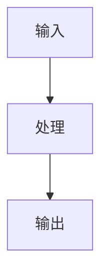
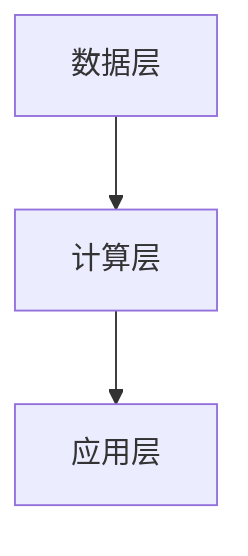
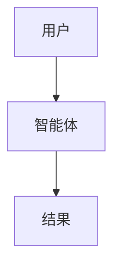

                 


# AI Agent的认知计算模型：模拟人类思维过程

> 关键词：AI Agent、认知计算模型、人类思维过程、知识表示、推理算法、系统架构

> 摘要：本文详细探讨了AI Agent的认知计算模型，从背景介绍、核心概念、算法原理、系统架构到项目实战，全面分析了如何模拟人类思维过程。通过案例分析和代码实现，帮助读者理解认知计算模型的实现与应用。

---

## 第1章: AI Agent的认知计算模型背景介绍

### 1.1 AI Agent的基本概念
AI Agent（智能体）是指能够感知环境并采取行动以实现目标的实体。它具有自主性、反应性、主动性、社会性和智能性等核心特征。

### 1.2 认知计算模型的定义
认知计算模型是模拟人类认知过程的数学模型，旨在通过感知、推理、学习和决策等模块实现智能体的自主行为。

### 1.3 AI Agent与人类思维的类比
人类思维过程包括感知、记忆、推理、学习和决策等环节。AI Agent的认知计算模型通过模拟这些过程，实现类似人类的智能行为。

### 1.4 本章小结
本章介绍了AI Agent的基本概念和认知计算模型的定义，并通过与人类思维的类比，明确了认知计算模型的核心目标。

---

## 第2章: 认知计算模型的核心概念

### 2.1 知识表示
知识表示是认知计算模型的基础，常用的表示方法包括符号表示、语义网络和知识图谱。

#### 2.1.1 符号表示
符号表示通过符号逻辑描述知识，例如逻辑表达式 $A \land B$ 表示“且”的关系。

#### 2.1.2 语义网络
语义网络通过节点和边表示概念及其关系，例如节点表示“人”，边表示“属于”关系。

### 2.2 推理机制
推理机制是认知计算模型的核心，分为基于符号的推理和基于概率的推理。

#### 2.2.1 基于符号的推理
基于符号的推理通过逻辑规则进行推理，例如使用逻辑表达式 $A \implies B$ 表示“如果A，则B”。

#### 2.2.2 基于概率的推理
基于概率的推理通过概率模型进行推理，例如贝叶斯网络用于计算条件概率。

### 2.3 学习机制
学习机制是认知计算模型的重要组成部分，包括监督学习、无监督学习和强化学习。

#### 2.3.1 监督学习
监督学习通过标记数据训练模型，例如使用线性回归模型 $y = mx + b$ 进行预测。

#### 2.3.2 无监督学习
无监督学习通过无标记数据发现模式，例如聚类分析。

### 2.4 本章小结
本章详细介绍了认知计算模型的核心概念，包括知识表示、推理机制和学习机制，并通过实例分析了不同方法的特点。

---

## 第3章: 认知计算模型的算法原理

### 3.1 基于符号的知识推理
基于符号的知识推理通过逻辑规则进行推理，例如使用逻辑表达式 $A \land B$ 表示“且”的关系。

#### 3.1.1 算法流程
1. 输入知识库和查询。
2. 通过逻辑推理算法（如DPLL）进行推理。
3. 输出推理结果。

#### 3.1.2 代码实现
```python
def dpll(sat, symbols):
    # 简单的DPLL实现
    pass
```

### 3.2 基于神经网络的推理
基于神经网络的推理通过深度学习模型进行推理，例如使用LSTM进行序列推理。

#### 3.2.1 算法流程
1. 输入数据预处理。
2. 训练深度学习模型。
3. 使用模型进行推理。

#### 3.2.2 代码实现
```python
import tensorflow as tf
model = tf.keras.Sequential([...])
```

### 3.3 数学模型与公式
认知计算模型的数学模型包括逻辑推理、概率推理和神经网络模型。

#### 3.3.1 逻辑推理公式
$$A \implies B$$

#### 3.3.2 概率推理公式
$$P(B|A) = \frac{P(A|B)P(B)}{P(A)}$$

### 3.4 本章小结
本章详细介绍了认知计算模型的算法原理，包括基于符号的推理和基于神经网络的推理，并通过代码和数学公式分析了不同方法的特点。

---

## 第4章: 系统分析与架构设计方案

### 4.1 问题场景
AI Agent需要解决的问题包括感知、推理、学习和决策。

### 4.2 系统功能设计
系统功能包括感知模块、推理模块、学习模块和决策模块。

#### 4.2.1 感知模块
感知模块负责从环境中获取信息，例如通过传感器或API接口。

#### 4.2.2 推理模块
推理模块负责根据感知信息进行推理，例如使用逻辑推理或深度学习模型。

### 4.3 系统架构设计
系统架构包括数据层、计算层和应用层。

#### 4.3.1 数据层
数据层负责存储和管理数据，例如使用数据库或知识图谱。

#### 4.3.2 计算层
计算层负责进行推理和学习，例如使用逻辑推理引擎或深度学习框架。

#### 4.3.3 应用层
应用层负责与用户交互，例如通过API或图形界面提供服务。

### 4.4 系统接口设计
系统接口包括感知接口、推理接口、学习接口和决策接口。

### 4.5 系统交互流程图
使用Mermaid序列图描述系统交互流程。

### 4.6 本章小结
本章详细介绍了AI Agent的认知计算模型的系统架构设计，包括功能设计、架构设计和接口设计。

---

## 第5章: 项目实战——基于认知计算模型的智能助手开发

### 5.1 项目背景
智能助手需要具备感知、推理、学习和决策能力。

### 5.2 环境安装
安装必要的开发工具和库，例如Python、TensorFlow和自然语言处理库。

### 5.3 核心功能实现
实现感知、推理、学习和决策模块，例如使用NLP库进行意图识别。

#### 5.3.1 感知模块实现
```python
import spacy
nlp = spacy.load("en_core_web_sm")
```

#### 5.3.2 推理模块实现
```python
from transformers import pipeline
classifier = pipeline("text-classification", model="bert-base-uncased")
```

### 5.4 代码实现与解读
详细解读代码实现，例如使用BERT进行文本分类。

### 5.5 案例分析
通过具体案例分析，展示智能助手的推理过程。

### 5.6 项目小结
总结项目实现的经验和教训，提出改进建议。

---

## 第6章: 总结与展望

### 6.1 本章总结
总结全文内容，强调认知计算模型的核心作用。

### 6.2 未来展望
讨论认知计算模型的发展方向，例如模型的可解释性、多模态能力等。

### 6.3 最佳实践
提出一些实用的建议，例如选择合适的工具和技术栈。

### 6.4 本章小结
本章总结了认知计算模型的应用与挑战，并展望了未来的发展方向。

---

## 第7章: 参考文献与进一步阅读

### 7.1 参考文献
列出本文参考的主要文献和资料。

### 7.2 进一步阅读
推荐一些深入学习认知计算模型的书籍和论文。

---

## 第8章: 思考与练习

### 8.1 思考题
提出一些思考题，帮助读者巩固所学内容。

### 8.2 练习题
提供一些练习题，帮助读者实践所学知识。

---

## 第9章: 结语

感谢读者的阅读，鼓励读者继续探索AI Agent的认知计算模型的更多应用与可能性。

---

## 图表清单

### 图表1: 知识表示的符号表示


### 图表2: 推理过程的流程图


### 图表3: 系统架构设计的分层架构


### 图表4: 系统交互的流程图


---

## 附录

### 附录A: 代码示例
```python
import spacy
from transformers import pipeline

nlp = spacy.load("en_core_web_sm")
classifier = pipeline("text-classification", model="bert-base-uncased")
```

### 附录B: 数学公式
$$P(A|B) = \frac{P(B|A)P(A)}{P(B)}$$

---

## 接下来

[以上是思考过程的详细描述，接下来是按照用户要求的完整文章内容。]

