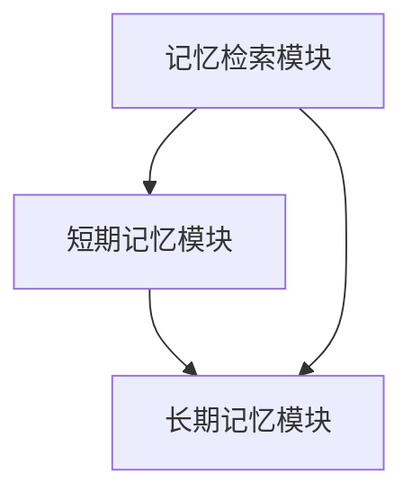

                 


# AI Agent的记忆机制：短期与长期记忆管理

> **关键词**：AI Agent，短期记忆，长期记忆，记忆机制，人工智能

> **摘要**：本文深入探讨了AI Agent的短期与长期记忆机制，分析了其在智能系统中的作用与实现方法。通过介绍短期记忆和长期记忆的核心概念、算法原理、系统架构设计以及实际项目案例，本文详细阐述了AI Agent如何通过有效的记忆管理提升智能水平。

---

## 第1章 AI Agent与记忆机制概述

### 1.1 AI Agent的基本概念
AI Agent（智能体）是指能够感知环境、自主决策并采取行动的智能系统。它具备以下特点：
- **自主性**：能够在没有外部干预的情况下独立运行。
- **反应性**：能够根据环境输入实时调整行为。
- **目标导向性**：通常具有明确的目标，驱动其行动。

AI Agent的记忆机制是其智能行为的核心部分，它允许AI Agent在与环境交互的过程中积累经验，并利用这些经验来优化未来的决策。

### 1.2 记忆机制的重要性
记忆机制使得AI Agent能够：
- **处理上下文信息**：理解当前行为与过去行为之间的关系。
- **保持一致性**：在多步推理中保持信息的一致性。
- **提升效率**：通过记忆避免重复计算，提高决策速度。

### 1.3 短期记忆与长期记忆的区别
- **短期记忆**：短期记忆主要用于存储与当前任务直接相关的临时信息，类似于人类的“工作记忆”。它具有容量有限、访问速度快的特点。
- **长期记忆**：长期记忆用于存储重要的、长期需要的信息，类似于人类的“记忆库”。它具有容量大、存储时间长的特点。

---

## 第2章 短期记忆机制的核心概念

### 2.1 短期记忆的神经科学基础
短期记忆的神经机制主要依赖于大脑的额叶和顶叶皮层。神经科学研究表明，短期记忆的存储涉及神经元之间的突触连接强度的临时变化。

### 2.2 短期记忆的信息处理模型
基于RNN（循环神经网络）的短期记忆模型广泛应用于自然语言处理领域。例如，LSTM（长短期记忆网络）通过引入门控机制，有效地解决了传统RNN在处理长序列时的梯度消失问题。

### 2.3 短期记忆与上下文的关系
短期记忆中的上下文表示通常采用向量形式，通过注意力机制可以动态调整对上下文不同部分的关注程度。

---

## 第3章 短期记忆机制的算法原理

### 3.1 基于RNN的短期记忆模型
LSTM网络通过三个门控（输入门、遗忘门和输出门）来控制信息的流动。其核心公式如下：

$$
i = \sigma(W_i x + U_i h_{prev})
$$
$$
f = \sigma(W_f x + U_f h_{prev})
$$
$$
o = \sigma(W_o x + U_o h_{prev})
$$
$$
h = i \cdot \tanh(W_c x + U_c h_{prev}) + f \cdot h_{prev}
$$

其中，$i$、$f$、$o$分别为输入门、遗忘门和输出门，$\sigma$为sigmoid函数，$h$为隐藏状态。

---

## 第4章 长期记忆机制的核心概念

### 4.1 长期记忆的神经科学基础
长期记忆的存储涉及海马体和内嗅皮层。神经科学研究表明，长期记忆的形成需要经历巩固过程，其中海马体起着关键作用。

### 4.2 长期记忆的信息处理模型
基于知识图谱的长期记忆模型通过构建语义网络，将实体与实体之间的关系以图结构的形式存储。例如，知识图谱中的节点表示实体，边表示实体之间的关系。

---

## 第5章 长期记忆机制的算法原理

### 5.1 基于图结构的长期记忆模型
知识图谱的构建通常采用WordNet或ConceptNet等知识库。例如，WordNet将词语分为不同的词性，并通过同义词集构建语义网络。

### 5.2 基于检索机制的长期记忆模型
检索机制的核心是通过向量空间模型（如余弦相似度）来计算查询与存储信息之间的相似性。例如，使用TF-IDF（词频-逆文档频率）对文本进行特征表示。

---

## 第6章 系统分析与架构设计

### 6.1 系统架构设计
AI Agent的记忆系统通常由以下模块组成：
- **短期记忆模块**：负责存储和管理短期记忆信息。
- **长期记忆模块**：负责存储和管理长期记忆信息。
- **记忆检索模块**：负责根据当前任务检索相关记忆信息。

系统架构图如下：



### 6.2 系统交互流程
1. 接收外部输入（如用户查询）。
2. 短期记忆模块处理输入，提取临时信息。
3. 长期记忆模块检索相关历史信息。
4. 记忆检索模块整合短期和长期记忆信息。
5. 输出结果。

---

## 第7章 项目实战

### 7.1 环境安装
需要安装以下工具：
- Python 3.8+
- PyTorch 1.9+
- transformers库

### 7.2 核心实现代码
以下是基于RNN的短期记忆模型的代码示例：

```python
import torch
import torch.nn as nn
import torch.optim as optim

class LSTMModel(nn.Module):
    def __init__(self, input_size, hidden_size, output_size):
        super(LSTMModel, self).__init__()
        self.lstm = nn.LSTM(input_size, hidden_size, batch_first=True)
        self.fc = nn.Linear(hidden_size, output_size)
    
    def forward(self, x):
        out, _ = self.lstm(x)
        out = self.fc(out[:, -1, :])
        return out

# 初始化模型
input_size = 10
hidden_size = 20
output_size = 5
model = LSTMModel(input_size, hidden_size, output_size)

# 定义损失函数和优化器
criterion = nn.CrossEntropyLoss()
optimizer = optim.Adam(model.parameters(), lr=0.001)
```

### 7.3 案例分析
假设我们有一个文本生成任务，短期记忆模型可以帮助生成器记住上下文信息，从而生成连贯的文本。

---

## 第8章 最佳实践与小结

### 8.1 最佳实践
1. 在实际应用中，建议结合短期记忆和长期记忆机制，以充分发挥两者的优点。
2. 注意数据质量和多样性，避免记忆偏差。
3. 定期更新记忆内容，保持记忆的时效性。

### 8.2 小结
本文系统地介绍了AI Agent的短期与长期记忆机制，分析了其在智能系统中的作用与实现方法。通过理论与实践相结合，本文为AI Agent的记忆机制研究提供了有价值的参考。

---

通过本文的详细讲解，读者可以全面理解AI Agent的记忆机制，并在实际项目中灵活应用这些知识。

