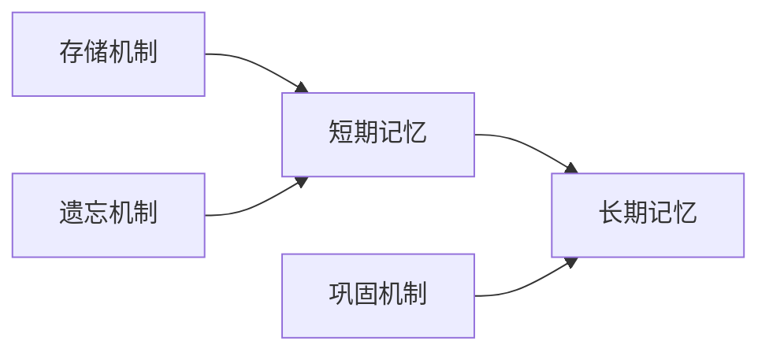
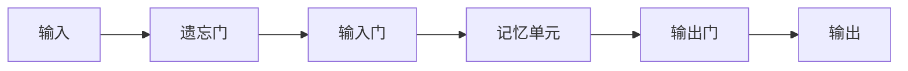
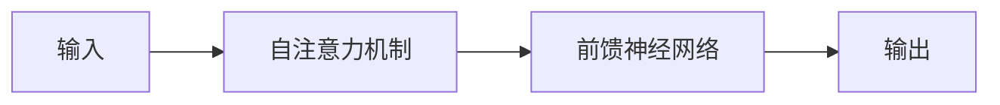
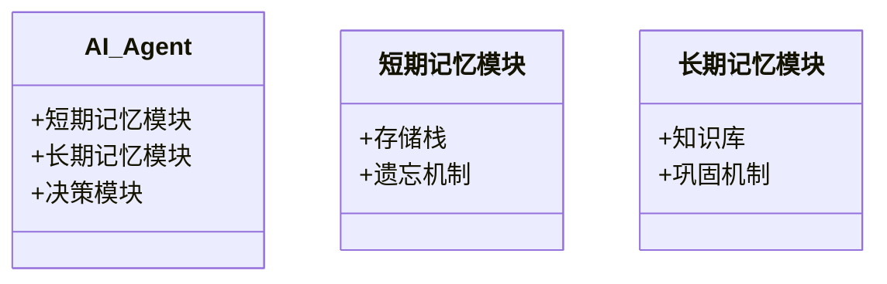
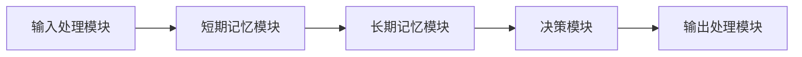

                 


# AI Agent的记忆机制：短期记忆与长期记忆的实现

## 关键词
AI Agent, 短期记忆, 长期记忆, LSTM, Transformer, 系统架构

## 摘要
本文深入探讨了AI Agent的短期记忆与长期记忆机制，从理论基础到算法实现，再到系统设计和实际应用，全面分析了记忆机制的核心概念、实现原理和应用场景。通过详细讲解LSTM和Transformer等算法模型，结合系统架构设计和项目实战，为读者提供了一个全面理解AI Agent记忆机制的框架。

---

# 第1章: AI Agent与记忆机制的背景介绍

## 1.1 AI Agent的基本概念

### 1.1.1 什么是AI Agent
AI Agent（人工智能代理）是指能够感知环境并采取行动以实现目标的智能实体。它具备自主性、反应性、目标导向性和社会性等核心特征。

### 1.1.2 AI Agent的核心功能与特点
- **自主性**：无需外部干预，自主决策。
- **反应性**：能够实时感知环境并做出反应。
- **目标导向性**：所有行为都围绕特定目标展开。
- **社会性**：能够与其他Agent或人类进行交互协作。

### 1.1.3 AI Agent的应用场景与发展趋势
AI Agent广泛应用于自动驾驶、智能助手、机器人、推荐系统等领域。随着技术进步，AI Agent的智能性和复杂性不断提高，记忆机制在其中扮演着关键角色。

---

## 1.2 记忆机制在AI Agent中的重要性

### 1.2.1 记忆机制的基本概念
记忆机制是指AI Agent存储和检索信息的能力，帮助其在复杂环境中保持一致性、连续性和智能性。

### 1.2.2 记忆机制在AI Agent中的作用
- **连续性**：确保Agent在不同时间点的行为一致。
- **智能性**：通过存储和检索信息，提升决策能力。
- **复杂性**：处理多任务和复杂场景的能力。

### 1.2.3 短期记忆与长期记忆的定义与区别

| 特性         | 短期记忆                  | 长期记忆                  |
|--------------|--------------------------|--------------------------|
| 存储时间     | 短暂，通常几分钟到几小时 | 长期，可达数天甚至终身   |
| 存储容量     | 有限                     | 较大                     |
| 记忆内容     | 近期任务和信息           | 过去经验、知识和策略     |
| 访问方式     | 高速随机访问           | 需要特定检索机制       |
| 自然对应     | 类似人类工作记忆         | 类似人类长期记忆         |

---

## 1.3 短期记忆与长期记忆的实现背景

随着AI Agent在复杂环境中的广泛应用，如何有效管理和利用记忆机制成为关键问题。短期记忆和长期记忆的结合能够提升Agent的智能性和适应性，但其实现面临诸多挑战，如数据存储、信息检索和算法优化等。

---

# 第2章: 短期记忆与长期记忆的核心概念

## 2.1 短期记忆的实现原理

### 2.1.1 短期记忆的基本特点
- **瞬时性**：信息存储时间短暂，容易被遗忘。
- **易变性**：信息容易受到新信息的干扰。
- **容量有限**：通常只能存储少量信息。

### 2.1.2 短期记忆的存储机制
短期记忆通常依赖于快速存储和访问机制，如基于栈或队列的数据结构，能够快速存入和取出信息。

### 2.1.3 短期记忆的遗忘机制
短期记忆中的信息会随着时间推移逐渐遗忘，遗忘速率取决于信息的重要性和关联性。

---

## 2.2 长期记忆的实现原理

### 2.2.1 长期记忆的基本特点
- **持久性**：信息存储时间长，能够在长时间内保持稳定。
- **容量较大**：能够存储大量信息，包括知识、经验等。
- **稳定性**：信息不易被遗忘，除非有主动删除操作。

### 2.2.2 长期记忆的存储机制
长期记忆通常依赖于持久化存储技术，如数据库或文件系统，能够长期保存信息。

### 2.2.3 长期记忆的巩固机制
信息在长期记忆中的巩固需要通过多次重复和强化，类似于人类大脑神经元的突触强化过程。

---

## 2.3 短期记忆与长期记忆的对比分析

### 2.3.1 实体关系图（Mermaid）



---

# 第3章: 短期记忆与长期记忆的实现算法

## 3.1 短期记忆的实现算法

### 3.1.1 基于LSTM的短期记忆模型

LSTM（长短期记忆网络）是一种常用的短期记忆实现算法，通过门控机制控制信息的存储和遗忘。

#### LSTM算法流程图（Mermaid）



#### LSTM算法数学模型

遗忘门：
$$ f_t = \sigma(W_f x + U_f h_{prev}) $$
输入门：
$$ i_t = \sigma(W_i x + U_i h_{prev}) $$
记忆单元：
$$ c_t = f_t \odot h_{prev} + i_t \odot \tanh(W_c x + U_c h_{prev}) $$
输出门：
$$ o_t = \sigma(W_o x + U_o h_{prev}) $$
最终输出：
$$ h_t = o_t \odot \tanh(c_t) $$

### 3.1.2 基于队列的短期记忆实现

队列是一种先进先出的数据结构，适合实现简单的短期记忆机制。

#### 队列实现代码示例

```python
class ShortTermMemory:
    def __init__(self, max_size=10):
        self.max_size = max_size
        self.memory = deque()

    def remember(self, data):
        if len(self.memory) >= self.max_size:
            self.memory.popleft()
        self.memory.append(data)

    def recall(self):
        return list(self.memory)
```

---

## 3.2 长期记忆的实现算法

### 3.2.1 基于Transformer的长期记忆模型

Transformer模型通过自注意力机制实现长期记忆，能够捕捉长距离依赖关系。

#### Transformer算法流程图（Mermaid）



#### Transformer算法数学模型

自注意力机制：
$$ \text{Attention}(Q, K, V) = \text{softmax}\left(\frac{QK^T}{\sqrt{d_k}}\right)V $$

---

# 第4章: AI Agent的记忆系统架构设计

## 4.1 系统功能设计

### 4.1.1 系统功能模块

| 模块名称       | 功能描述                       |
|----------------|----------------------------|
| 输入处理模块   | 接收外部输入数据             |
| 短期记忆模块   | 实现短期记忆功能             |
| 长期记忆模块   | 实现长期记忆功能             |
| 决策模块       | 基于记忆模块进行决策         |
| 输出处理模块   | 输出决策结果或相关信息       |

### 4.1.2 领域模型（Mermaid类图）



---

## 4.2 系统架构设计

### 4.2.1 系统架构设计图（Mermaid）



---

## 4.3 系统交互设计

### 4.3.1 系统交互流程图（Mermaid）


---

# 第5章: 项目实战——基于记忆机制的AI Agent实现

## 5.1 环境安装与配置

### 5.1.1 安装Python与必要的库
```bash
pip install numpy
pip install tensorflow
pip install pytorch
```

---

## 5.2 短期记忆模块实现

### 5.2.1 LSTM实现代码

```python
import torch
import torch.nn as nn
import torch.optim as optim

class LSTMShortTermMemory(nn.Module):
    def __init__(self, input_size, hidden_size):
        super(LSTMShortTermMemory, self).__init__()
        self.lstm = nn.LSTM(input_size, hidden_size, batch_first=True)
        self.hidden_size = hidden_size

    def forward(self, x, hidden=None):
        if hidden is None:
            hidden = (torch.zeros(1, 1, self.hidden_size).to(x.device),
                      torch.zeros(1, 1, self.hidden_size).to(x.device))
        output, hidden = self.lstm(x, hidden)
        return output, hidden
```

---

## 5.3 长期记忆模块实现

### 5.3.1 Transformer实现代码

```python
import torch
import torch.nn as nn
import torch.nn.functional as F

class TransformerLongTermMemory(nn.Module):
    def __init__(self, d_model, nhead, dropout=0.1):
        super(TransformerLongTermMemory, self).__init__()
        self.self_attn = nn.MultiheadAttention(embed_dim=d_model, num_heads=nhead)
        self.dropout = nn.Dropout(dropout)
        self.norm = nn.LayerNorm(d_model)

    def forward(self, x, mask=None):
        x = self.self_attn(x, x, x, mask=mask)[0]
        x = self.dropout(x)
        x = self.norm(x)
        return x
```

---

## 5.4 系统整合与测试

### 5.4.1 系统整合代码

```python
class AI_Agent:
    def __init__(self):
        self.stm = LSTMShortTermMemory(input_size=10, hidden_size=20)
        self.ltm = TransformerLongTermMemory(d_model=20, nhead=2)
    
    def remember(self, input_data):
        output, _ = self.stm(input_data)
        output = self.ltm(output)
        return output
    
    def recall(self):
        # 实现长期记忆的检索功能
        pass
```

---

## 5.5 案例分析与解读

### 5.5.1 应用场景分析
以智能客服为例，短期记忆用于存储当前对话内容，长期记忆用于存储客户历史咨询记录和偏好。

### 5.5.2 实际案例分析
- 短期记忆：记录用户当前输入的问题。
- 长期记忆：检索用户过去的所有咨询记录，辅助智能客服提供更精准的回复。

---

## 5.6 项目小结

通过实现短期记忆和长期记忆模块，我们构建了一个具备记忆能力的AI Agent系统。短期记忆模块基于LSTM实现，能够快速存储和遗忘信息；长期记忆模块基于Transformer实现，能够长期保存和检索信息。

---

# 第6章: 最佳实践与注意事项

## 6.1 最佳实践

### 6.1.1 短期记忆的设计建议
- 确保短期记忆的存储容量与应用场景匹配。
- 定期清理无效信息，避免内存泄漏。

### 6.1.2 长期记忆的设计建议
- 选择合适的持久化存储方案，如数据库或文件系统。
- 定期优化长期记忆的检索算法，提升访问效率。

---

## 6.2 小结

AI Agent的记忆机制是实现智能决策的核心，短期记忆与长期记忆的结合能够显著提升Agent的智能性和适应性。通过合理设计记忆机制，我们可以构建更加高效和智能的AI系统。

---

## 6.3 注意事项

- **数据安全**：长期记忆中的信息可能包含敏感数据，需做好加密和权限管理。
- **系统性能**：长期记忆的存储和检索可能对系统性能产生较大压力，需优化算法和架构。
- **数据一致性**：确保短期记忆和长期记忆之间的数据一致性，避免信息冲突。

---

## 6.4 拓展阅读

- [《神经网络与深度学习》](https://zh-v2.deeplearningbook.org/)
- [《Transformer解构系列》](https://zhuanlan.zhihu.com/series/1478365643627248128)
- [《AI Agent与强化学习》](https://zhuanlan.zhihu.com/series/1487825903334965248)

---

# 结语

AI Agent的记忆机制是实现智能系统的核心，短期记忆与长期记忆的结合能够显著提升系统的智能性和适应性。通过深入理解记忆机制的实现原理和应用场景，我们可以设计出更加高效和智能的AI系统，为未来的智能化发展奠定坚实基础。

