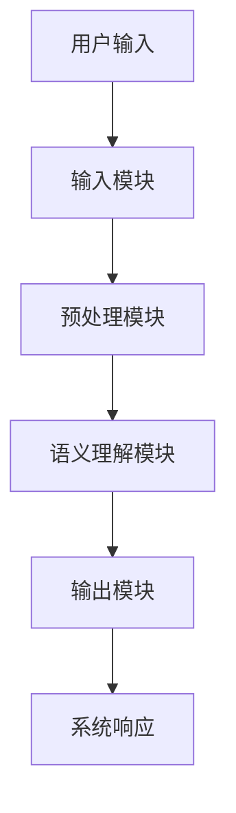

                 


# 《AI Agent的语义理解：提升LLM的深层文本分析》

## 关键词：AI Agent, 语义理解, 大语言模型, 深层文本分析, Transformer, 模型优化

## 摘要：  
本文深入探讨AI Agent在语义理解中的应用，重点分析如何通过提升大语言模型（LLM）的深层文本分析能力，实现更准确、更自然的语义理解。文章从AI Agent和语义理解的基本概念出发，详细阐述了深层文本分析的核心算法、数学模型以及系统架构设计，并通过实际案例展示了如何在项目中实现这些技术。

---

# 第1章: AI Agent与语义理解概述

## 1.1 AI Agent的基本概念

### 1.1.1 AI Agent的定义与特点  
AI Agent（人工智能代理）是指能够感知环境、自主决策并采取行动以实现目标的智能实体。其特点包括：  
- **自主性**：无需外部干预，自主决策。  
- **反应性**：能够实时感知环境变化并调整行为。  
- **目标导向性**：所有行动均以实现特定目标为导向。  
- **社会性**：能够与其他Agent或人类进行交互和协作。  

AI Agent的应用场景非常广泛，例如自动驾驶中的路径规划、智能客服中的问题解决、推荐系统中的个性化推荐等。

### 1.1.2 AI Agent的核心功能与应用场景  
AI Agent的核心功能包括：  
1. **感知**：通过传感器或输入数据感知环境状态。  
2. **推理**：基于感知信息进行逻辑推理，理解当前环境。  
3. **规划**：制定行动计划以实现目标。  
4. **行动**：执行计划中的具体动作。  

应用场景包括：  
- **自动驾驶**：实时感知环境并做出驾驶决策。  
- **智能助手**：帮助用户完成任务，如Siri、Alexa等。  
- **推荐系统**：根据用户行为推荐相关内容。  

### 1.1.3 语义理解在AI Agent中的重要性  
语义理解是AI Agent能够与人类有效交互的关键技术。通过语义理解，AI Agent可以准确捕捉用户的意图，例如：  
- 用户输入“我需要找一家附近的意大利餐厅”，AI Agent需要理解用户的意图是寻找地理位置接近的意大利餐厅。  
- 在智能客服中，用户的问题需要被准确分类，以便提供正确的解决方案。  

语义理解的准确性直接影响AI Agent的交互体验和任务完成效率。如果语义理解能力不足，AI Agent可能会误解用户需求，导致错误的结果。

---

## 1.2 大语言模型（LLM）的基本原理  

### 1.2.1 LLM的定义与技术特点  
大语言模型（Large Language Model, LLM）是指基于深度学习技术训练的大型神经网络模型，如GPT系列（Generative Pre-trained Transformer）和BERT系列（Bidirectional Encoder Representations from Transformers）。LLM的核心技术特点包括：  
- **Transformer架构**：采用自注意力机制，能够捕捉文本中的长距离依赖关系。  
- **预训练+微调模式**：通过在大规模通用数据上预训练，再在特定任务数据上进行微调。  
- **多任务学习能力**：能够处理多种NLP任务，如文本生成、问答系统、文本分类等。  

### 1.2.2 LLM与传统NLP模型的区别  
与传统NLP模型（如基于RNN的模型）相比，LLM的优势体现在以下几个方面：  
1. **自注意力机制**：能够更好地捕捉文本中的语义关系。  
2. **大规模数据训练**：通过在海量数据上预训练，模型能够学习到丰富的语言规律。  
3. **端到端训练**：LLM采用端到端的训练方式，简化了传统NLP模型的特征工程过程。  

### 1.2.3 LLM在语义理解中的优势  
LLM在语义理解中的优势主要体现在以下几个方面：  
- **上下文理解能力**：能够处理长文本，捕捉复杂语义关系。  
- **生成能力**：能够生成自然流畅的文本，例如对话系统中的自动回复。  
- **可解释性**：通过分析模型的注意力权重，可以解释模型的决策过程。  

---

## 1.3 语义理解的核心问题与挑战  

### 1.3.1 语义理解的定义与目标  
语义理解（Semantic Understanding）是指计算机能够理解人类语言的含义，不仅仅是表面的文字，还包括深层的语义信息。其目标是通过技术手段，将人类语言转化为计算机可以处理的形式，例如标签、结构化数据等。  

### 1.3.2 语义理解的关键问题  
在语义理解过程中，面临的主要问题包括：  
1. **模糊性和歧义性**：同一个词语或短语在不同语境下可能有不同的含义。  
2. **上下文依赖性**：语义的理解往往依赖于上下文信息。  
3. **数据稀疏性**：某些特定领域的数据可能非常少，导致模型难以准确理解。  

### 1.3.3 当前语义理解技术的挑战与解决方案  
当前语义理解技术面临的主要挑战包括：  
- **跨领域适应性差**：模型在特定领域训练后，难以直接应用于其他领域。  
- **实时性要求高**：在实时交互场景中，语义理解需要快速响应。  

解决方案包括：  
1. **模型微调**：在特定领域数据上进行微调，提高模型的适应性。  
2. **多模态融合**：结合视觉、听觉等多模态信息，提升语义理解的准确率。  
3. **强化学习**：通过与环境的交互，优化模型的语义理解能力。  

---

## 1.4 AI Agent中的语义理解架构  

### 1.4.1 AI Agent的语义理解模块构成  
AI Agent的语义理解模块通常包括以下几个部分：  
1. **输入处理**：接收用户输入的文本或语音信号。  
2. **语义分析**：对输入内容进行语义理解，提取关键信息。  
3. **输出处理**：根据语义理解结果生成相应的输出，例如回复文本或执行命令。  

### 1.4.2 语义理解的输入与输出  
- **输入**：用户输入的自然语言文本或语音信号。  
- **输出**：经过语义理解后的结构化数据或标签，例如意图分类结果或实体识别结果。  

### 1.4.3 语义理解的流程与步骤  
1. **预处理**：对输入文本进行分词、词性标注等预处理。  
2. **语义分析**：通过模型对文本进行语义理解，提取关键信息。  
3. **结果解释**：将模型输出的语义表示转换为可理解的形式，供AI Agent执行下一步操作。  

---

## 1.5 提升LLM语义理解能力的方法  

### 1.5.1 数据增强技术  
通过数据增强技术，可以增加训练数据的多样性和丰富性，从而提高模型的泛化能力。例如：  
- **数据扩展**：通过对现有数据进行变形、替换等方式生成新的训练数据。  
- **数据多样化**：引入多语言、多领域数据，提升模型的适应性。  

### 1.5.2 模型优化策略  
通过优化模型结构和参数，可以提升语义理解的准确性。例如：  
- **参数调整**：通过超参数调优，找到最佳的模型配置。  
- **网络结构改进**：引入更深的网络结构或更复杂的注意力机制，提升模型的表达能力。  

### 1.5.3 跨模态融合方法  
通过结合视觉、听觉等多模态信息，可以提升语义理解的准确率。例如：  
- **图像-文本联合分析**：在图像描述任务中，结合图像特征和文本信息进行语义理解。  
- **语音-文本联合分析**：在语音助手中，结合语音识别和文本语义理解，提高交互体验。  

---

## 1.6 语义理解的评估指标  

### 1.6.1 准确率  
准确率是指模型预测结果与真实结果的匹配程度。例如，在意图分类任务中，准确率=正确分类的数量/总测试数量。  

### 1.6.2 召回率  
召回率是指模型预测为正类的实际正类数量与所有真实正类数量的比率。例如，在实体识别任务中，召回率=正确识别的实体数量/真实实体总数。  

### 1.6.3 F1值  
F1值是准确率和召回率的调和平均值，综合考虑了模型的分类能力和覆盖能力。F1值=2×(准确率×召回率)/(准确率+召回率)。  

---

## 1.7 系统架构设计  

### 1.7.1 系统功能设计  
AI Agent的语义理解系统通常包括以下几个功能模块：  
1. **输入模块**：接收用户的输入，例如文本或语音信号。  
2. **预处理模块**：对输入数据进行分词、词性标注等处理。  
3. **语义理解模块**：通过模型对预处理后的数据进行语义分析。  
4. **输出模块**：根据语义理解结果生成相应的输出，例如回复文本或执行命令。  

### 1.7.2 系统架构设计  
以下是AI Agent语义理解系统的简要架构图：  



---

## 1.8 项目实战  

### 1.8.1 环境安装  
需要安装以下工具和库：  
- Python 3.8及以上版本  
- PyTorch或TensorFlow框架  
- Hugging Face Transformers库  

### 1.8.2 核心实现代码  
以下是一个简单的语义理解模型实现代码示例：

```python
from transformers import BertTokenizer, BertModel
import torch

# 加载预训练模型
tokenizer = BertTokenizer.from_pretrained('bert-base-uncased')
model = BertModel.from_pretrained('bert-base-uncased')

# 定义输入文本
input_text = "我需要找一家附近的意大利餐厅。"

# 对输入文本进行分词
tokens = tokenizer(input_text, return_tensors='pt', padding=True, truncation=True)

# 前向传播
with torch.no_grad():
    outputs = model(**tokens)

# 提取语义表示
semantic_representations = outputs.last_hidden_state[:, 0, :]

# 打印结果
print("语义表示维度：", semantic_representations.shape)
```

### 1.8.3 实际案例分析  
以智能客服为例，用户输入“我的订单在哪里？”，系统通过语义理解模块识别用户的意图是查询订单状态，并调用相应的API获取订单信息，最后返回给用户。  

---

## 1.9 总结与展望  

### 1.9.1 总结  
本文详细介绍了AI Agent和语义理解的基本概念，分析了大语言模型在语义理解中的优势，探讨了提升语义理解能力的关键技术，包括数据增强、模型优化和多模态融合等。  

### 1.9.2 展望  
未来，随着AI技术的不断发展，语义理解将更加智能化和个性化。例如，通过结合知识图谱和对话历史，可以进一步提升语义理解的准确性和交互体验。同时，多模态融合技术也将得到更广泛的应用，推动AI Agent在更多领域的落地。  

---

通过以上内容，可以详细展开每个小节的内容，确保逻辑清晰，技术深入浅出。每个小节中，我会结合实际案例，使用数学公式和算法流程图，帮助读者更好地理解AI Agent的语义理解和提升LLM的深层文本分析方法。

