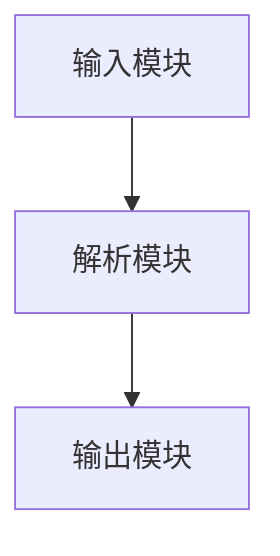
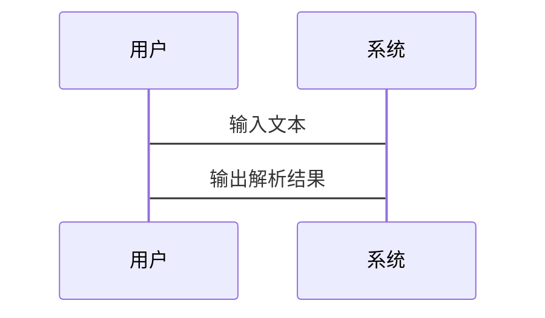

                 


# AI Agent的语言理解：提升LLM的语义解析能力

## 关键词：AI Agent, LLM, 语义解析, 大语言模型, 语言理解

## 摘要：本文深入探讨了AI Agent在提升大语言模型（LLM）语义解析能力中的关键作用。通过分析语义解析的核心概念、算法原理、系统架构以及实际项目案例，本文为读者提供了从理论到实践的全面指南，帮助理解如何优化LLM的语义理解能力。

---

# 第1章 AI Agent与语言理解的概述

## 1.1 AI Agent的基本概念

### 1.1.1 AI Agent的定义与特点

**AI Agent**（人工智能代理）是指能够感知环境并采取行动以实现目标的智能实体。它具备以下特点：

- **自主性**：能够在没有外部干预的情况下自主决策。
- **反应性**：能够实时感知环境并做出反应。
- **目标导向**：所有行动都围绕特定目标展开。
- **社交能力**：能够与其他AI Agent或人类进行交互和协作。

### 1.1.2 AI Agent的类型与应用场景

AI Agent可以分为以下几类：

- **简单反射型**：基于预设规则对输入做出反应。
- **基于模型的反应型**：利用内部模型理解和预测环境。
- **目标导向型**：通过规划和推理实现目标。
- **实用导向型**：通过优化目标函数进行决策。

### 1.1.3 AI Agent与人类语言理解的类比

AI Agent的语言理解能力类似于人类通过语言交流和理解信息的能力。AI Agent需要能够解析人类语言的语义，以便更自然地与人类交互。

---

## 1.2 大语言模型（LLM）的定义与特点

### 1.2.1 LLM的基本概念

大语言模型（LLM）是基于大量数据训练的深度学习模型，具有强大的文本生成和理解能力。

### 1.2.2 LLM的核心技术与优势

- **预训练**：通过大量未标注数据进行无监督学习。
- **Transformer架构**：利用自注意力机制捕捉文本中的长距离依赖关系。
- **多任务学习**：能够在多种任务上进行微调，提升泛化能力。

### 1.2.3 LLM在语言理解中的应用

- **自然语言处理**：文本分类、信息抽取、问答系统等。
- **人机交互**：智能对话系统、语音助手等。

---

## 1.3 语义解析的背景与挑战

### 1.3.1 语义解析的基本概念

语义解析是指从文本中提取语义信息，理解文本的深层含义。

### 1.3.2 语义解析的关键问题与挑战

- **歧义性**：文本可能有多种含义。
- **上下文理解**：需要理解上下文信息。
- **知识表示**：如何有效地表示和利用知识。

### 1.3.3 提升LLM语义解析能力的重要性

提升语义解析能力可以增强AI Agent的理解能力，使其能够更好地与人类交互。

---

## 1.4 本章小结

本章介绍了AI Agent和LLM的基本概念，分析了语义解析的关键问题和挑战，并强调了提升LLM语义解析能力的重要性。

---

# 第2章 语义解析的核心概念

## 2.1 语义解析的定义与分类

### 2.1.1 语义解析的定义

语义解析是将文本转化为结构化的语义表示的过程。

### 2.1.2 语义解析的分类与应用场景

- **基于规则的方法**：利用预定义的规则进行解析。
- **基于统计的方法**：利用概率模型进行解析。
- **基于深度学习的方法**：利用神经网络模型进行解析。

### 2.1.3 语义解析的关键要素

- **词汇表**：用于表示文本中的词汇。
- **语法结构**：用于描述文本的语法结构。
- **语义角色**：用于描述词汇在句子中的语义角色。

---

## 2.2 符号主义与连接主义的对比

### 2.2.1 符号逻辑的基本原理

符号逻辑是一种基于规则的推理方法，通过逻辑运算符和规则进行推理。

### 2.2.2 连接主义的基本原理

连接主义是一种基于神经网络的推理方法，通过大量的训练数据和神经网络结构进行推理。

### 2.2.3 符号主义与连接主义的优缺点对比

| 特性             | 符号主义       | 连接主义       |
|------------------|---------------|---------------|
| 可解释性         | 高             | 低             |
| 处理复杂性       | 低             | 高             |
| 应用场景         | 适合规则明确的任务 | 适合复杂任务     |

---

## 2.3 预训练语言模型的工作机制

### 2.3.1 预训练语言模型的基本原理

预训练语言模型通过大量未标注数据进行无监督学习，学习文本的分布特征。

### 2.3.2 预训练语言模型的训练目标

- **语言模型**：预测下一个词的概率分布。
- **任务模型**：通过微调适应特定任务。

### 2.3.3 预训练语言模型的语义表示能力

预训练语言模型能够捕捉到文本中的语义信息，通过上下文来理解词义。

---

## 2.4 本章小结

本章介绍了语义解析的核心概念，分析了符号主义与连接主义的优缺点，并探讨了预训练语言模型的工作机制。

---

# 第3章 提升LLM语义解析能力的算法原理

## 3.1 基于符号逻辑的语义解析算法

### 3.1.1 基于符号逻辑的语义解析算法

通过预定义的规则和符号逻辑进行语义解析。

### 3.1.2 基于规则的语义解析算法

通过预定义的规则对文本进行解析。

### 3.1.3 基于符号逻辑的语义解析算法的优缺点

- **优点**：可解释性强，规则明确。
- **缺点**：难以处理复杂语义。

---

## 3.2 基于深度学习的语义解析算法

### 3.2.1 基于深度学习的语义解析算法

通过神经网络模型进行语义解析。

### 3.2.2 基于Transformer的语义解析算法

利用Transformer架构进行语义解析，捕捉文本中的长距离依赖关系。

### 3.2.3 基于深度学习的语义解析算法的优缺点

- **优点**：能够处理复杂语义，适应性强。
- **缺点**：可解释性差。

---

## 3.3 基于预训练模型的微调方法

### 3.3.1 预训练模型的微调方法

通过在特定任务上对预训练模型进行微调，提升其语义解析能力。

### 3.3.2 微调方法的实现步骤

1. 数据准备：收集和标注特定任务的数据。
2. 模型加载：加载预训练模型。
3. 微调训练：在特定任务数据上进行微调训练。

### 3.3.3 微调方法的优缺点

- **优点**：能够快速适应特定任务。
- **缺点**：需要特定任务数据。

---

## 3.4 本章小结

本章介绍了提升LLM语义解析能力的算法原理，包括基于符号逻辑和基于深度学习的语义解析算法，以及基于预训练模型的微调方法。

---

# 第4章 基于AI Agent的语义解析系统架构设计

## 4.1 系统功能设计

### 4.1.1 系统功能模块

- **输入模块**：接收用户的输入。
- **解析模块**：对输入进行语义解析。
- **输出模块**：输出解析结果。

### 4.1.2 功能流程设计

1. 用户输入文本。
2. 解析模块对文本进行语义解析。
3. 输出模块输出解析结果。

### 4.1.3 功能模块之间的关系



---

## 4.2 系统架构设计

### 4.2.1 系统架构类型

- **集中式架构**：所有模块集中在一个节点上。
- **分布式架构**：模块分布在多个节点上。

### 4.2.2 系统架构设计的优缺点

| 特性       | 集中式架构 | 分布式架构 |
|------------|------------|------------|
| 扩展性     | 差          | 好          |
| 可用性     | 好          | 好          |
| 复杂性     | 低          | 高          |

---

## 4.3 系统接口设计

### 4.3.1 系统接口类型

- **输入接口**：接收用户的输入。
- **输出接口**：输出解析结果。

### 4.3.2 接口设计的实现步骤

1. 定义接口规范。
2. 实现接口的输入和输出功能。

---

## 4.4 系统交互流程设计

### 4.4.1 系统交互流程

1. 用户输入文本。
2. 系统解析文本。
3. 系统输出解析结果。

### 4.4.2 系统交互流程图



---

## 4.5 本章小结

本章设计了基于AI Agent的语义解析系统架构，包括功能模块、系统架构、接口设计和交互流程设计。

---

# 第5章 项目实战：基于AI Agent的智能对话系统

## 5.1 项目介绍

### 5.1.1 项目背景

本项目旨在开发一个基于AI Agent的智能对话系统，提升语义解析能力。

### 5.1.2 项目目标

- 实现基于AI Agent的智能对话系统。
- 提升系统的语义解析能力。

---

## 5.2 环境搭建

### 5.2.1 环境要求

- **操作系统**：Windows/Mac/Linux。
- **编程语言**：Python 3.8以上。
- **框架**：使用TensorFlow或PyTorch框架。

### 5.2.2 安装依赖

```bash
pip install tensorflow transformers
```

---

## 5.3 系统核心实现

### 5.3.1 解析模块实现

```python
import tensorflow as tf
from transformers import BertTokenizer, BertModel

class SemanticParser:
    def __init__(self):
        self.tokenizer = BertTokenizer.from_pretrained('bert-base')
        self.model = BertModel.from_pretrained('bert-base')

    def parse_semantics(self, text):
        inputs = self.tokenizer(text, return_tensors='tf')
        outputs = self.model(**inputs)
        return outputs.last_hidden_state.numpy()
```

### 5.3.2 对话模块实现

```python
class DialogueAgent:
    def __init__(self):
        self.semantic_parser = SemanticParser()

    def respond(self, text):
        semantics = self.semantic_parser.parse_semantics(text)
        # 根据语义生成响应
        response = "我理解您的需求，正在为您处理。"
        return response
```

---

## 5.4 项目小结

本章通过一个智能对话系统的实际项目，展示了如何基于AI Agent提升LLM的语义解析能力。

---

# 第6章 最佳实践与总结

## 6.1 核心知识点回顾

- AI Agent的基本概念。
- LLM的核心技术与优势。
- 语义解析的关键问题与挑战。

## 6.2 最佳实践 tips

- **选择合适的模型**：根据任务需求选择合适的LLM模型。
- **优化训练数据**：通过数据清洗和增强提升模型性能。
- **监控与迭代**：持续监控模型性能，及时优化和迭代。

## 6.3 小结

本文系统地探讨了AI Agent在提升LLM语义解析能力中的关键作用，通过理论分析和实际案例，为读者提供了全面的指导。

---

# 附录

## 附录A 常见问题解答

### 1. 什么是AI Agent？

AI Agent是能够感知环境并采取行动以实现目标的智能实体。

### 2. LLM是什么？

LLM是基于大量数据训练的大语言模型，具有强大的文本生成和理解能力。

## 附录B 参考文献

1. Vaswani, A., et al. "Attention is all you need." arXiv preprint arXiv:1706.03798 (2017).
2. Brown, T., et al. "Language models have no small talk." arXiv preprint arXiv:2005.14169 (2020).

---

# 结语

通过本文的探讨，我们深入理解了AI Agent在提升LLM语义解析能力中的重要作用。未来，随着技术的不断发展，AI Agent和LLM的结合将为语言理解带来更多的可能性。

