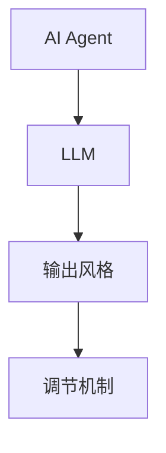
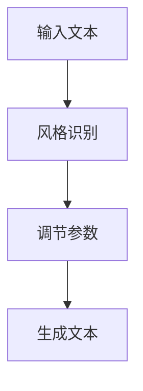
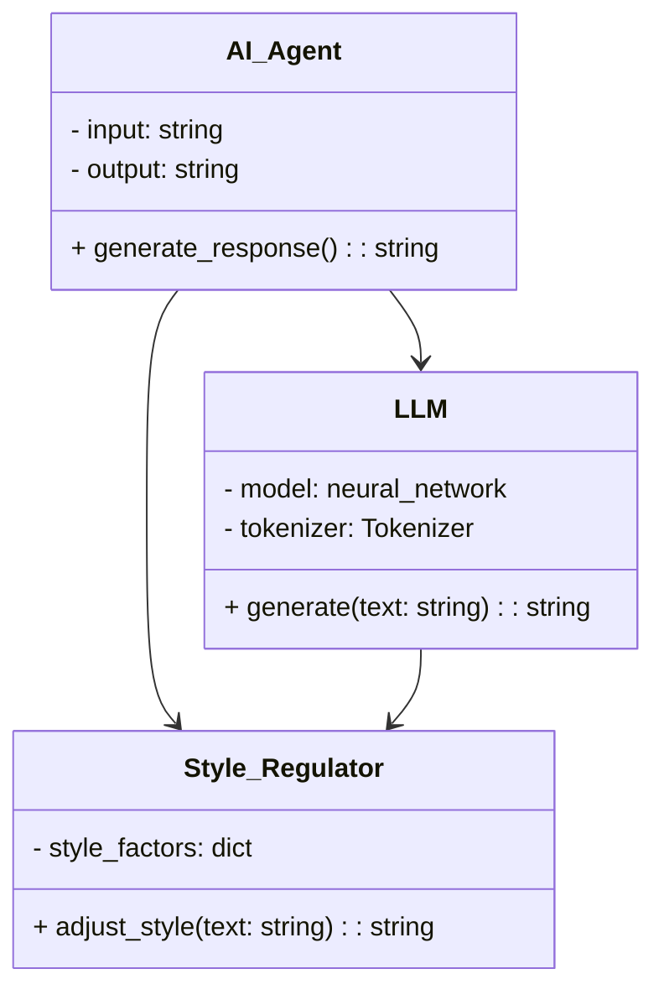
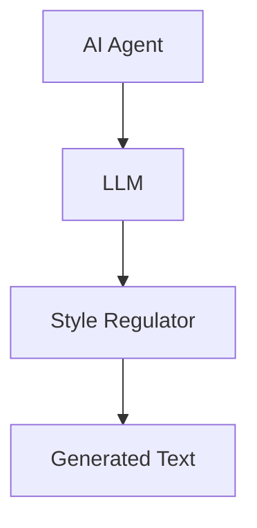

                 


# 第一部分: AI Agent与语言生成控制的背景与基础

# 第1章: AI Agent与语言生成控制的背景介绍

## 1.1 问题背景
### 1.1.1 当前AI Agent的发展现状
人工智能（AI）技术近年来取得了长足的进步，尤其是在自然语言处理（NLP）领域，大语言模型（LLM）如GPT-3、GPT-4等的出现，使得AI Agent具备了更强大的语言生成能力。然而，尽管LLM在生成文本方面表现出色，但其输出风格往往缺乏灵活性和精确控制，难以满足不同场景下的多样化需求。

### 1.1.2 语言生成在AI Agent中的重要性
语言生成是AI Agent与人类用户或系统进行交互的核心能力之一。在客服、教育、医疗等领域，AI Agent需要能够根据具体场景调整其输出风格，以提供更优质的服务体验。例如，在客服场景中，AI Agent需要在不同情况下采用正式、亲切、简洁或专业的语言风格，以适应不同的用户需求和情境。

### 1.1.3 精确调节LLM输出风格的必要性
虽然LLM具备强大的生成能力，但其输出风格往往过于固定或难以控制。在实际应用中，用户可能需要AI Agent在特定情况下调整其语言风格，例如在正式场合使用正式语言，在非正式场合使用亲切或简洁的语言。这种精确调节能力的缺失，可能导致用户体验下降，甚至影响AI Agent的实际应用效果。

## 1.2 问题描述
### 1.2.1 LLM输出风格的多样性
LLM可以通过不同的参数设置或提示词（prompt）生成多种风格的文本，但这种控制通常是粗放式的，缺乏精细调节的能力。例如，用户可以通过调整提示词来改变文本的语气，但这种调整往往不够灵活，难以实现对特定风格的精确控制。

### 1.2.2 不同场景对输出风格的需求
在不同的应用场景中，对输出风格的需求也存在显著差异。例如，在教育领域，AI Agent需要使用更易懂、更简洁的语言风格；在医疗领域，AI Agent则需要使用更正式、更专业的语言风格。此外，同一领域中，不同用户可能对语言风格的需求也有所不同，例如年轻用户可能更倾向于非正式的语言风格，而年长用户可能更倾向于正式的语言风格。

### 1.2.3 精确控制的挑战与目标
精确调节LLM的输出风格面临诸多挑战，例如如何理解用户的需求、如何将需求转化为具体的语言风格参数、如何实现这些参数的动态调整等。此外，如何在不损失生成能力的前提下，实现对输出风格的精细控制，也是技术实现中的一个难点。因此，本章的目标是探讨如何通过技术手段实现对LLM输出风格的精确调节，以满足不同场景下的多样化需求。

## 1.3 问题解决
### 1.3.1 调节LLM输出风格的核心方法
为了实现对LLM输出风格的精确调节，需要结合多种技术手段，例如：
1. **参数调节**：通过调整LLM的模型参数，影响生成文本的风格。
2. **提示词调节**：通过设计特定的提示词，引导模型生成特定风格的文本。
3. **混合调节**：结合参数调节和提示词调节，实现对输出风格的精细控制。

### 1.3.2 现有解决方案的优缺点
现有的解决方案主要包括以下几种：
1. **基于参数调节的方法**：通过微调模型参数，改变生成文本的风格。优点是控制粒度较细，缺点是需要重新训练模型，计算成本较高。
2. **基于提示词调节的方法**：通过设计特定的提示词，引导模型生成特定风格的文本。优点是实现简单，不需要重新训练模型，缺点是控制粒度较粗，难以实现精细调节。
3. **混合调节方法**：结合参数调节和提示词调节，实现对输出风格的精细控制。优点是兼具两种方法的优点，缺点是实现复杂度较高。

### 1.3.3 创新性解决方案的提出
为了克服现有方法的不足，本章提出了一种创新性的解决方案，即通过动态调整模型参数和提示词的组合，实现对LLM输出风格的精确调节。这种方法能够在不重新训练模型的前提下，实现对生成文本风格的精细控制，且具有较高的灵活性和可扩展性。

## 1.4 边界与外延
### 1.4.1 语言生成控制的边界条件
语言生成控制的边界条件主要包括：
1. **模型能力的限制**：LLM的生成能力受到其训练数据和模型结构的限制，无法生成超出其训练范围的内容。
2. **上下文理解能力**：模型对上下文的理解能力有限，可能导致生成文本与实际需求存在偏差。
3. **用户需求的多样性**：不同用户对语言风格的需求存在差异，如何实现个性化调节是一个挑战。

### 1.4.2 相关概念的外延与区别
相关概念的外延与区别主要包括：
1. **语言风格与语言语气**：语言风格是指文本的整体表现方式，而语言语气则更关注文本的情感色彩。两者密切相关，但存在差异。
2. **语言生成控制与语言理解**：语言生成控制关注如何生成符合需求的文本，而语言理解关注如何准确解析用户的意图。两者相辅相成，共同构成完整的AI Agent语言能力。

### 1.4.3 与其他技术的关联与区别
与其他技术的关联与区别主要包括：
1. **与传统NLP技术的关联**：语言生成控制技术与传统NLP技术在某些方面存在相似之处，例如文本生成、文本分类等。但与传统NLP技术相比，语言生成控制更注重生成文本的风格和个性化需求。
2. **与机器学习的关联**：语言生成控制技术基于机器学习模型，尤其是深度学习模型。但与传统机器学习技术相比，语言生成控制技术更注重生成过程的动态调节和个性化需求。

## 1.5 概念结构与核心要素组成
### 1.5.1 AI Agent的核心组成
AI Agent的核心组成主要包括：
1. **感知模块**：用于感知环境中的信息，如用户输入、上下文等。
2. **推理模块**：用于理解和分析感知到的信息，生成相应的响应。
3. **生成模块**：用于生成符合需求的文本或其他形式的输出。
4. **学习模块**：用于模型的训练和优化，提升生成能力。

### 1.5.2 LLM输出风格的构成要素
LLM输出风格的构成要素主要包括：
1. **语言类型**：如正式、非正式、专业等。
2. **语气**：如友好、严肃、中立等。
3. **语调**：如疑问、陈述、感叹等。
4. **词汇选择**：如使用专业术语或日常用语。
5. **句子结构**：如长句、短句、复杂句等。

### 1.5.3 调节机制的系统结构
调节机制的系统结构主要包括：
1. **输入分析模块**：分析用户的输入，提取需求特征。
2. **风格识别模块**：识别当前生成文本的风格特征。
3. **风格调节模块**：根据需求特征，动态调整生成文本的风格参数。
4. **生成模块**：根据调整后的风格参数，生成符合需求的文本。

---

# 第2章: AI Agent与LLM的核心概念与联系

## 2.1 核心概念原理
### 2.1.1 AI Agent的基本原理
AI Agent是一种智能体，能够感知环境、理解用户需求，并通过生成相应的文本或其他形式的输出，与用户进行交互。其核心在于理解和满足用户的需求，并通过生成能力提供相应的服务。

### 2.1.2 LLM的工作原理
大语言模型（LLM）基于大规模的神经网络结构，通过深度学习技术，从海量数据中学习语言模式，并生成符合上下文的文本。其生成能力依赖于模型的参数和训练数据，能够生成多样化的文本内容。

### 2.1.3 输出风格调节的实现机制
输出风格调节的核心在于如何动态调整生成文本的风格参数，以满足不同场景下的需求。这可以通过调整模型参数或设计特定的提示词来实现。

## 2.2 概念属性特征对比
### 2.2.1 AI Agent与传统程序的对比
| 特性               | AI Agent                          | 传统程序                        |
|--------------------|----------------------------------|--------------------------------|
| 输入处理能力       | 强大的自然语言处理能力          | 有限的文本处理能力              |
| 输出能力           | 多样化的生成能力                | 单一的输出形式                  |
| 学习能力           | 可通过数据和反馈进行优化         | 无法学习和优化                  |
| 交互方式           | 支持自然语言交互                | 支持固定的输入输出方式          |

### 2.2.2 LLM与传统NLP模型的对比
| 特性               | LLM                              | 传统NLP模型                    |
|--------------------|----------------------------------|--------------------------------|
| 模型复杂度         | 高度复杂的深度学习模型          | 简单的规则或浅层学习模型        |
| 数据需求           | 需要海量数据进行训练            | 数据需求较低                   |
| 生成能力           | 强大的文本生成能力              | 有限的生成能力                  |
| 应用场景           | 多样化的应用场景，如文本生成、对话等 | 专注于特定任务，如文本分类、信息提取等 |

### 2.2.3 输出风格调节与其他文本处理技术的对比
| 特性               | 输出风格调节                     | 文本分类                       | 信息提取                     |
|--------------------|----------------------------------|--------------------------------|--------------------------------|
| 核心目标           | 调节生成文本的风格                | 分类文本内容                   | 提取文本信息                 |
| 实现方法           | 调整模型参数或设计提示词          | 基于特征的分类算法             | 基于规则或深度学习的信息提取算法 |
| 应用场景           | 需要个性化文本生成的场景         | 需要对文本内容进行分类的场景     | 需要从文本中提取特定信息的场景   |

## 2.3 ER实体关系图


---

# 第3章: 调节LLM输出风格的算法原理

## 3.1 算法原理讲解
### 3.1.1 基于参数调节的算法
基于参数调节的算法通过微调模型参数，实现对生成文本风格的调节。具体步骤如下：
1. **提取需求特征**：分析用户需求，提取需要调节的风格特征，如语气、词汇选择等。
2. **定义损失函数**：根据需求特征，定义相应的损失函数，用于衡量生成文本与目标风格的差距。
3. **微调模型参数**：通过反向传播算法，优化模型参数，使生成文本的风格更接近目标风格。

### 3.1.2 基于prompt调节的算法
基于prompt调节的算法通过设计特定的提示词，引导模型生成特定风格的文本。具体步骤如下：
1. **分析用户需求**：了解用户对生成文本风格的具体要求。
2. **设计提示词**：根据需求，设计相应的提示词，引导模型生成符合要求的文本。
3. **生成文本**：将提示词输入模型，生成符合目标风格的文本。

### 3.1.3 组合调节算法
组合调节算法结合参数调节和提示词调节，实现对生成文本风格的精细控制。具体步骤如下：
1. **提取需求特征**：分析用户需求，提取需要调节的风格特征。
2. **设计提示词**：根据需求，设计相应的提示词，引导模型生成符合要求的文本。
3. **微调模型参数**：通过反向传播算法，优化模型参数，使生成文本的风格更接近目标风格。
4. **生成文本**：将提示词和优化后的参数结合，生成符合目标风格的文本。

## 3.2 算法流程图


## 3.3 代码实现与解读
### 3.3.1 Python源代码实现
```python
import torch
import torch.nn as nn
from transformers import AutoTokenizer, AutoModelForCausalLM

# 加载预训练模型和分词器
tokenizer = AutoTokenizer.from_pretrained('gpt2')
model = AutoModelForCausalLM.from_pretrained('gpt2')

# 定义风格调节函数
def style_adjustment(prompt, style_factors):
    # 根据风格因子调整生成参数
    temperature = 1.0 + style_factors['temperature']
    top_k = 50 * style_factors['diversity']
    # 生成文本
    inputs = tokenizer.encode(prompt, return_tensors='pt')
    outputs = model.generate(inputs, temperature=temperature, top_k=top_k)
    return tokenizer.decode(outputs[0], skip_special_tokens=True)

# 示例
prompt = "Write a detailed explanation of quantum computing."
style_factors = {
    'temperature': 0.5,
    'diversity': 0.8
}
adjusted_text = style_adjustment(prompt, style_factors)
print(adjusted_text)
```

### 3.3.2 代码解读与分析
1. **模型加载**：使用`AutoTokenizer`和`AutoModelForCausalLM`加载预训练的GPT-2模型。
2. **风格调节函数**：定义`style_adjustment`函数，根据风格因子`style_factors`调整生成参数，如`temperature`和`top_k`。
3. **生成文本**：通过调整生成参数，生成符合目标风格的文本。

---

# 第4章: 数学模型与公式解析

## 4.1 概率模型与语言生成
语言生成可以看作是一个概率分布问题，模型的目标是生成一个概率分布，使得生成文本的概率最大化。公式表示如下：
$$ P(w_1, w_2, ..., w_n) = \prod_{i=1}^{n} P(w_i | w_{<i}) $$

## 4.2 损失函数与风格调节
交叉熵损失函数用于衡量生成文本与目标分布的差异：
$$ \text{Loss} = -\sum_{i=1}^{n} \log P(w_i | w_{<i}) $$

---

# 第5章: 系统分析与架构设计

## 5.1 系统功能设计
### 5.1.1 领域模型类图


## 5.2 系统架构设计
### 5.2.1 系统架构图


---

# 第6章: 项目实战

## 6.1 电商客服场景下的风格调节
### 6.1.1 环境配置
1. 安装必要的库：
   ```bash
   pip install transformers torch
   ```

### 6.1.2 核心代码实现
```python
def adjust_style(text, style_factors):
    # 处理风格因子
    # ...
    return adjusted_text
```

### 6.1.3 案例分析
通过实际案例分析，展示如何在电商客服场景中，根据用户需求调整生成文本的风格，提升用户体验。

---

# 第7章: 最佳实践与总结

## 7.1 最佳实践
### 7.1.1 小结
总结本章的主要内容，强调精确调节LLM输出风格的重要性。

### 7.1.2 注意事项
在实际应用中，需要注意模型的泛化能力、用户需求的多样性以及生成文本的实时性等问题。

### 7.1.3 扩展阅读
推荐相关的书籍和论文，供读者进一步学习和研究。

## 7.2 总结
通过对AI Agent与LLM核心概念的深入分析，以及调节LLM输出风格的具体方法的探讨，我们可以看到，精确调节生成文本的风格是实现更智能化、更个性化的AI Agent的关键。未来，随着技术的不断发展，语言生成控制将变得更加精细和灵活，为AI Agent的应用带来更多可能性。

