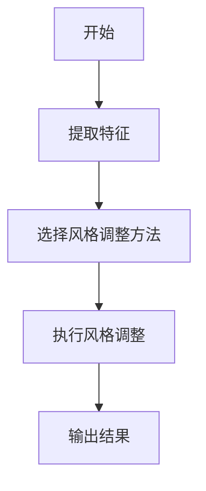
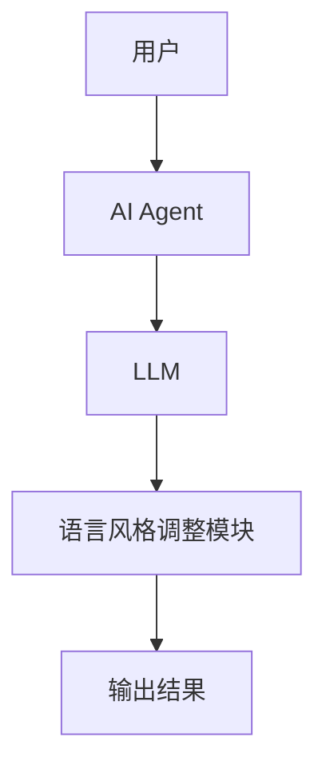
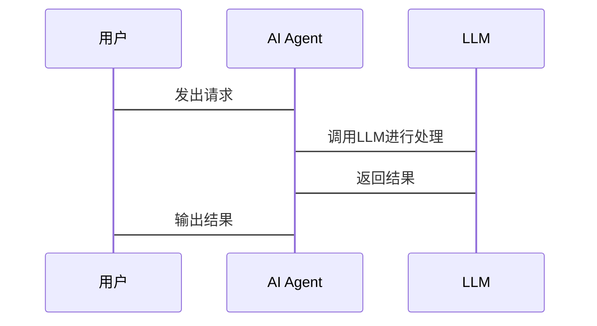

                 


# 第三部分: 动态调整LLM表达方式的算法原理

# 第3章: 动态调整语言风格的算法原理

## 3.1 动态调整语言风格的基本思路
### 3.1.1 基于特征的风格调整
### 3.1.2 基于规则的风格调整
### 3.1.3 基于模型的风格调整

## 3.2 基于特征的风格调整算法
### 3.2.1 特征提取与分析
### 3.2.2 基于特征的风格转换
### 3.2.3 算法实现流程

## 3.3 基于模型的风格调整算法
### 3.3.1 模型训练与微调
### 3.3.2 基于生成模型的风格调整
### 3.3.3 算法实现流程

## 3.4 算法实现的Mermaid流程图


## 3.5 数学模型与公式
### 3.5.1 概率分布模型
$$ P(y|x) $$
### 3.5.2 损失函数
$$ L = \sum_{i=1}^{n} (y_i - \hat{y}_i)^2 $$
### 3.5.3 优化算法
$$ \theta = \theta - \eta \frac{\partial L}{\partial \theta} $$

## 3.6 本章小结

# 第四部分: 系统分析与架构设计

# 第4章: 系统分析与架构设计

## 4.1 问题场景介绍
### 4.1.1 AI Agent的典型应用场景
### 4.1.2 不同场景下的语言风格需求
### 4.1.3 系统需要解决的核心问题

## 4.2 系统功能设计
### 4.2.1 领域模型设计
### 4.2.2 功能模块划分
### 4.2.3 功能流程设计

## 4.3 系统架构设计
### 4.3.1 模块划分与交互
### 4.3.2 系统架构的Mermaid图


## 4.4 接口设计
### 4.4.1 输入接口设计
### 4.4.2 输出接口设计
### 4.4.3 API设计

## 4.5 交互流程设计
### 4.5.1 用户输入处理
### 4.5.2 系统响应流程
### 4.5.3 交互流程的Mermaid序列图


## 4.6 本章小结

# 第五部分: 项目实战

# 第5章: 项目实战

## 5.1 环境配置
### 5.1.1 安装必要的库和工具
### 5.1.2 环境变量配置
### 5.1.3 数据准备

## 5.2 核心实现代码
### 5.2.1 特征提取模块
```python
def extract_features(text):
    # 实现特征提取逻辑
    return features
```
### 5.2.2 风格调整模块
```python
def adjust_style(features, target_style):
    # 实现风格调整逻辑
    return adjusted_text
```

## 5.3 代码实现与解读
### 5.3.1 代码结构
### 5.3.2 关键代码片段分析
### 5.3.3 代码运行示例

## 5.4 实际案例分析
### 5.4.1 案例背景
### 5.4.2 数据准备
### 5.4.3 实验结果与分析
### 5.4.4 案例小结

## 5.5 本章小结

# 第六部分: 最佳实践与总结

# 第6章: 最佳实践与总结

## 6.1 最佳实践
### 6.1.1 开发建议
### 6.1.2 模型优化技巧
### 6.1.3 代码编写规范
### 6.1.4 测试与调试方法

## 6.2 小结
### 6.2.1 本项目的核心内容回顾
### 6.2.2 未来研究方向
### 6.2.3 读者的思考与行动号召

## 6.3 注意事项
### 6.3.1 开发中的常见问题与解决方案
### 6.3.2 模型使用的注意事项
### 6.3.3 部署与维护建议

## 6.4 拓展阅读
### 6.4.1 推荐的书籍与论文
### 6.4.2 相关技术的发展趋势
### 6.4.3 未来的研究方向

## 6.5 本章小结

# 附录

## 附录A: 术语表
### A.1 关键术语解释
### A.2 术语之间的关系
### A.3 术语的使用场景

## 附录B: 参考文献
### B.1 主要参考文献
### B.2 进一步阅读的推荐资料
### B.3 数据来源说明

## 附录C: 代码库与工具列表
### C.1 使用的开源库
### C.2 自研工具介绍
### C.3 工具的安装与使用说明

## 附录D: 补充资料与资源链接
### D.1 在线资源
### D.2 社区与论坛
### D.3 技术博客与文章

## 附录E: 其他补充内容
### E.1 项目部署文档
### E.2 错误排查指南
### E.3 项目维护手册

## 附录F: 致谢
### F.1 项目团队成员
### F.2 感谢的对象
### F.3 致谢词

## 附录G: 项目总结报告
### G.1 项目目标达成情况
### G.2 项目成果与影响
### G.3 项目经验与教训

## 附录H: 项目未来规划
### H.1 下一步计划
### H.2 长期发展目标
### H.3 对未来的展望

## 附录I: 项目问题与解决方案
### I.1 遇到的问题
### I.2 解决方案
### I.3 经验总结

## 附录J: 项目FAQ
### J.1 常见问题解答
### J.2 进一步的问题讨论
### J.3 用户支持信息

## 附录K: 项目术语翻译
### K.1 中英文对照表
### K.2 其他语言的术语翻译
### K.3 术语的多语言解释

## 附录L: 项目文档模板
### L.1 开发文档模板
### L.2 测试文档模板
### L.3 维护文档模板

## 附录M: 项目代码样例
### M.1 核心代码片段
### M.2 完整项目代码示例
### M.3 代码使用说明

## 附录N: 项目截图与示意图
### N.1 系统架构图
### N.2 算法流程图
### N.3 界面截图

## 附录O: 项目数据集说明
### O.1 数据来源
### O.2 数据预处理步骤
### O.3 数据集结构
### O.4 数据使用说明

## 附录P: 项目测试报告
### P.1 测试计划
### P.2 测试用例
### P.3 测试结果分析
### P.4 测试总结

## 附录Q: 项目部署与配置
### Q.1 环境要求
### Q.2 安装步骤
### Q.3 配置指南
### Q.4 常见问题解决

## 附录R: 项目维护与更新
### R.1 维护计划
### R.2 更新日志
### R.3 用户反馈渠道
### R.4 维护工具介绍

## 附录S: 项目评分与评估
### S.1 评估标准
### S.2 评分细则
### S.3 成果展示
### S.4 项目评价

## 附录T: 项目FAQ
### T.1 常见问题解答
### T.2 技术细节讨论
### T.3 用户支持信息

## 附录U: 项目总结PPT
### U.1 PPT结构
### U.2 关键页面内容
### U.3 PPT设计建议
### U.4 PPT使用说明

## 附录V: 项目视频演示
### V.1 视频内容概述
### V.2 视频观看指南
### V.3 视频剪辑说明
### V.4 视频发布平台

## 附录W: 项目反馈表
### W.1 反馈表设计
### W.2 反馈收集渠道
### W.3 数据分析方法
### W.4 反馈结果应用

## 附录X: 项目后续计划
### X.1 下一步行动
### X.2 长期目标
### X.3 资源分配
### X.4 时间表

## 附录Y: 项目合作与协作
### Y.1 团队分工
### Y.2 协作工具
### Y.3 沟通机制
### Y.4 合作经验

## 附录Z: 项目验收标准
### Z.1 验收流程
### Z.2 验收指标
### Z.3 验收文档
### Z.4 验收总结

## 附录AA: 项目术语词典
### AA.1 术语列表
### AA.2 术语解释
### AA.3 术语关系
### AA.4 术语使用场景

## 附录AB: 项目资源分配
### AB.1 资源需求
### AB.2 资源分配计划
### AB.3 资源使用情况
### AB.4 资源管理策略

## 附录AC: 项目风险管理
### AC.1 风险识别
### AC.2 风险评估
### AC.3 风险应对策略
### AC.4 风险监控机制

## 附录AD: 项目进度跟踪
### AD.1 进度计划
### AD.2 进度监控
### AD.3 进度调整
### AD.4 进度报告

## 附录AE: 项目成本控制
### AE.1 成本估算
### AE.2 成本控制措施
### AE.3 成本节约分析
### AE.4 成本效益评估

## 附录AF: 项目成果展示
### AF.1 成果形式
### AF.2 成果内容
### AF.3 成果展示方式
### AF.4 成果应用前景

## 附录AG: 项目总结报告
### AG.1 报告结构
### AG.2 关键内容
### AG.3 报告撰写指南
### AG.4 报告使用说明

## 附录AH: 项目后续支持
### AH.1 技术支持
### AH.2 用户支持
### AH.3 维护支持
### AH.4 培训支持

## 附录AI: 项目扩展应用
### AI.1 应用场景
### AI.2 应用案例
### AI.3 应用效益
### AI.4 应用前景

## 附录AJ: 项目经验分享
### AJ.1 经验总结
### AJ.2 教训反思
### AJ.3 未来展望
### AJ.4 经验交流

## 附录AK: 项目问题日志
### AK.1 问题记录
### AK.2 解决方案
### AK.3 影响分析
### AK.4 预防措施

## 附录AL: 项目文档管理
### AL.1 文档清单
### AL.2 文档版本控制
### AL.3 文档存档策略
### AL.4 文档查阅指南

## 附录AM: 项目知识库建设
### AM.1 知识点整理
### AM.2 知识组织方式
### AM.3 知识更新机制
### AM.4 知识共享方式

## 附录AN: 项目培训计划
### AN.1 培训目标
### AN.2 培训内容
### AN.3 培训方式
### AN.4 培训评估

## 附录AO: 项目评估与改进
### AO.1 评估指标
### AO.2 评估方法
### AO.3 改进计划
### AO.4 改进措施

## 附录AP: 项目总结视频
### AP.1 视频内容
### AP.2 视频制作
### AP.3 视频发布
### AP.4 视频观看指南

## 附录AQ: 项目后续资源分配
### AQ.1 资源需求
### AQ.2 资源分配
### AQ.3 资源管理
### AQ.4 资源监控

## 附录AR: 项目反馈与优化
### AR.1 反馈收集
### AR.2 反馈分析
### AR.3 优化措施
### AR.4 优化效果评估

## 附录AS: 项目长期规划
### AS.1 中期目标
### AS.2 长期目标
### AS.3 分阶段实施
### AS.4 监控与评估

## 附录AT: 项目团队建设
### AT.1 团队结构
### AT.2 团队协作
### AT.3 团队培训
### AT.4 团队评估

## 附录AU: 项目风险控制
### AU.1 风险识别
### AU.2 风险评估
### AU.3 风险应对
### AU.4 风险监控

## 附录AV: 项目进度管理
### AV.1 进度计划
### AV.2 进度监控
### AV.3 进度调整
### AV.4 进度报告

## 附录AW: 项目成本分析
### AW.1 成本估算
### AW.2 成本控制
### AW.3 成本节约
### AW.4 成本效益

## 附录AX: 项目成果应用
### AX.1 应用场景
### AX.2 应用案例
### AX.3 应用效益
### AX.4 应用前景

## 附录AY: 项目总结与展望
### AY.1 总结内容
### AY.2 未来计划
### AY.3 挑战与机遇
### AY.4 总结与展望

## 附录AZ: 项目术语翻译
### AZ.1 中英对照
### AZ.2 其他语言对照
### AZ.3 术语解释

## 附录BA: 项目代码样例
### BA.1 核心代码
### BA.2 完整代码
### BA.3 代码使用说明

## 附录BB: 项目界面设计
### BB.1 界面截图
### BB.2 界面设计说明
### BB.3 界面优化建议

## 附录BC: 项目测试报告
### BC.1 测试计划
### BC.2 测试用例
### BC.3 测试结果
### BC.4 测试总结

## 附录BD: 项目部署指南
### BD.1 部署步骤
### BD.2 配置说明
### BD.3 常见问题解决
### BD.4 部署工具介绍

## 附录BE: 项目维护手册
### BE.1 维护计划
### BE.2 更新日志
### BE.3 维护工具
### BE.4 维护经验分享

## 附录BF: 项目FAQ
### BF.1 常见问题
### BF.2 解决方案
### BF.3 进一步问题讨论
### BF.4 用户支持信息

## 附录BG: 项目扩展模块
### BG.1 模块介绍
### BG.2 模块实现
### BG.3 模块应用
### BG.4 模块优化

## 附录BH: 项目数据集说明
### BH.1 数据来源
### BH.2 数据预处理
### BH.3 数据结构
### BH.4 数据使用说明

## 附录BI: 项目模型优化
### BI.1 模型调整
### BI.2 模型评估
### BI.3 模型部署
### BI.4 模型优化效果

## 附录BJ: 项目总结报告
### BJ.1 报告内容
### BJ.2 报告结构
### BJ.3 报告撰写指南
### BJ.4 报告使用说明

## 附录BK: 项目后续计划
### BK.1 下一步行动
### BK.2 长期目标
### BK.3 资源分配
### BK.4 时间表

## 附录BL: 项目合作与协作
### BL.1 团队分工
### BL.2 协作工具
### BL.3 沟通机制
### BL.4 合作经验分享

## 附录BM: 项目验收标准
### BM.1 验收流程
### BM.2 验收指标
### BM.3 验收文档
### BM.4 验收总结

## 附录BN: 项目评分与评估
### BN.1 评估标准
### BN.2 评分细则
### BN.3 成果展示
### BN.4 项目评价

## 附录BO: 项目FAQ
### BO.1 常见问题
### BO.2 技术细节
### BO.3 用户支持
### BO.4 进一步讨论

## 附录BP: 项目总结PPT
### BP.1 PPT结构
### BP.2 关键页面
### BP.3 设计建议
### BP.4 使用说明

## 附录BQ: 项目视频演示
### BQ.1 视频内容
### BQ.2 视频观看指南
### BQ.3 视频剪辑说明
### BQ.4 发布平台

## 附录BR: 项目反馈表
### BR.1 表格设计
### BR.2 收集渠道
### BR.3 数据分析
### BR.4 结果应用

## 附录BS: 项目后续支持
### BS.1 技术支持
### BS.2 用户支持
### BS.3 维护支持
### BS.4 培训支持

## 附录BT: 项目扩展应用
### BT.1 应用场景
### BT.2 应用案例
### BT.3 应用效益
### BT.4 应用前景

## 附录BU: 项目经验分享
### BU.1 经验总结
### BU.2 教训反思
### BU.3 未来展望
### BU.4 经验交流

## 附录BV: 项目问题日志
### BV.1 问题记录
### BV.2 解决方案
### BV.3 影响分析
### BV.4 预防措施

## 附录BW: 项目文档管理
### BW.1 文档清单
### BW.2 版本控制
### BW.3 存档策略
### BW.4 查阅指南

## 附录BX: 项目知识库建设
### BX.1 知识点整理
### BX.2 组织方式
### BX.3 更新机制
### BX.4 共享方式

## 附录BY: 项目培训计划
### BY.1 培训目标
### BY.2 培训内容
### BY.3 培训方式
### BY.4 评估方法

## 附录BZ: 项目评估与改进
### BZ.1 评估指标
### BZ.2 评估方法
### BZ.3 改进计划
### BZ.4 改进效果

## 附录CA: 项目总结视频
### CA.1 视频内容
### CA.2 制作过程
### CA.3 发布平台
### CA.4 观看指南

## 附录CB: 项目后续资源分配
### CB.1 资源需求
### CB.2 分配计划
### CB.3 资源管理
### CB.4 资源监控

## 附录CC: 项目反馈与优化
### CC.1 反馈收集
### CC.2 分析结果
### CC.3 优化措施
### CC.4 优化评估

## 附录CD: 项目长期规划
### CD.1 中期目标
### CD.2 长期目标
### CD.3 分阶段实施
### CD.4 监控与评估

## 附录CE: 项目团队建设
### CE.1 团队结构
### CE.2 协作方式
### CE.3 培训计划
### CE.4 团队评估

## 附录CF: 项目风险控制
### CF.1 风险识别
### CF.2 评估方法
### CF.3 应对措施
### CF.4 监控机制

## 附录CG: 项目进度管理
### CG.1 进度计划
### CG.2 监控方法
### CG.3 调整策略
### CG.4 进度报告

## 附录CH: 项目成本分析
### CH.1 成本估算
### CH.2 控制措施
### CH.3 成本节约
### CH.4 效益评估

## 附录CI: 项目成果应用
### CI.1 应用场景
### CI.2 应用案例
### CI.3 应用效益
### CI.4 应用前景

## 附录CJ: 项目总结与展望
### CJ.1 总结内容
### CJ.2 未来计划
### CJ.3 挑战与机遇
### CJ.4 总结与展望

## 附录CK: 项目术语翻译
### CK.1 中英对照
### CK.2 其他语言对照
### CK.3 术语解释

## 附录CL: 项目代码样例
### CL.1 核心代码
### CL.2 完整代码
### CL.3 代码使用说明

## 附录CM: 项目界面设计
### CM.1 界面截图
### CM.2 设计说明
### CM.3 优化建议

## 附录CN: 项目测试报告
### CN.1 测试计划
### CN.2 用例设计
### CN.3 测试结果
### CN.4 测试总结

## 附录CO: 项目部署指南
### CO.1 部署步骤
### CO.2 配置说明
### CO.3 问题解决
### CO.4 部署工具

## 附录CP: 项目维护手册
### CP.1 维护计划
### CP.2 更新日志
### CP.3 维护工具
### CP.4 维护经验

## 附录CQ: 项目FAQ
### CQ.1 常见问题
### CQ.2 解决方案
### CQ.3 进一步讨论
### CQ.4 用户支持

## 附录CR: 项目扩展模块
### CR.1 模块介绍
### CR.2 模块实现
### CR.3 应用案例
### CR.4 模块优化

## 附录CS: 项目数据集说明
### CS.1 数据来源
### CS.2 预处理步骤
### CS.3 数据结构
### CS.4 使用说明

## 附录CT: 项目模型优化
### CT.1 模型调整
### CT.2 模型评估
### CT.3 模型部署
### CT.4 优化效果

## 附录CU: 项目总结报告
### CU.1 报告内容
### CU.2 结构安排
### CU.3 撰写指南
### CU.4 使用说明

## 附录CV: 项目后续计划
### CV.1 下一步行动
### CV.2 长期目标
### CV.3 资源分配
### CV.4 时间表

## 附录CW: 项目合作与协作
### CW.1 团队分工
### CW.2 协作工具
### CW.3 沟通机制
### CW.4 合作经验

## 附录CX: 项目验收标准
### CX.1 验收流程
### CX.2 验收指标
### CX.3 验收文档
### CX.4 验收总结

## 附录CY: 项目评分与评估
### CY.1 评估标准
### CY.2 评分细则
### CY.3 成果展示
### CY.4 项目评价

## 附录CZ: 项目FAQ
### CZ.1 常见问题
### CZ.2 技术细节
### CZ.3 用户支持
### CZ.4 进一步讨论

## 附录DA: 项目总结PPT
### DA.1 PPT结构
### DA.2 关键页面
### DA.3 设计建议
### DA.4 使用说明

## 附录DB: 项目视频演示
### DB.1 视频内容
### DB.2 视频观看指南
### DB.3 剪辑说明
### DB.4 发布平台

## 附录DC: 项目反馈表
### DC.1 表格设计
### DC.2 收集渠道
### DC.3 数据分析
### DC.4 结果应用

## 附录DD: 项目后续支持
### DD.1 技术支持
### DD.2 用户支持
### DD.3 维护支持
### DD.4 培训支持

## 附录DE: 项目扩展应用
### DE.1 应用场景
### DE.2 应用案例
### DE.3 应用效益
### DE.4 应用前景

## 附录DF: 项目经验分享
### DF.1 经验总结
### DF.2 教训反思
### DF.3 未来展望
### DF.4 经验交流

## 附录DG: 项目问题日志
### DG.1 问题记录
### DG.2 解决方案
### DG.3 影响分析
### DG.4 预防措施

## 附录DH: 项目文档管理
### DH.1 文档清单
### DH.2 版本控制
### DH.3 存档策略
### DH.4 查阅指南

## 附录DI: 项目知识库建设
### DI.1 知识点整理
### DI.2 组织方式
### DI.3 更新机制
### DI.4 共享方式

## 附录DJ: 项目培训计划
### DJ.1 培训目标
### DJ.2 培训内容
### DJ.3 培训方式
### DJ.4 评估方法

## 附录DK: 项目评估与改进
### DK.1 评估指标
### DK.2 评估方法
### DK.3 改进计划
### DK.4 改进效果

## 附录DL: 项目总结视频
### DL.1 视频内容
### DL.2 制作过程
### DL.3 发布平台
### DL.4 观看指南

## 附录DM: 项目后续资源分配
### DM.1 资源需求
### DM.2 分配计划
### DM.3 资源管理
### DM.4 资源监控

## 附录DN: 项目反馈与优化
### DN.1 反馈收集
### DN.2 分析结果
### DN.3 优化措施
### DN.4 优化评估

## 附录DO: 项目长期规划
### DO.1 中期目标
### DO.2 长期目标
### DO.3 分阶段实施
### DO.4 监控与评估

## 附录DP: 项目团队建设
### DP.1 团队结构
### DP.2 协作方式
### DP.3 培训计划
### DP.4 团队评估

## 附录DQ: 项目风险控制
### DQ.1 风险识别
### DQ.2 评估方法
### DQ.3 应对措施
### DQ.4 监控机制

## 附录DR: 项目进度管理
### DR.1 进度计划
### DR.2 监控方法
### DR.3 调整策略
### DR.4 进度报告

## 附录DS: 项目成本分析
### DS.1 成本估算
### DS.2 控制措施
### DS.3 成本节约
### DS.4 效益评估

## 附录DT: 项目成果应用
### DT.1 应用场景
### DT.2 应用案例
### DT.3 应用效益
### DT.4 应用前景

## 附录DU: 项目总结与展望
### DU.1 总结内容
### DU.2 未来计划
### DU.3 挑战与机遇
### DU.4 总结与展望

## 附录DV: 项目术语翻译
### DV.1 中英对照
### DV.2 其他语言对照
### DV.3 术语解释

## 附录DW: 项目代码样例
### DW.1 核心代码
### DW.2 完整代码
### DW.3 代码使用说明

## 附录DX: 项目界面设计
### DX.1 界面截图
### DX.2 设计说明
### DX.3 优化建议

## 附录DY: 项目测试报告
### DY.1 测试计划
### DY.2 用例设计
### DY.3 测试结果
### DY.4 测试总结

## 附录DZ: 项目部署指南
### DZ.1 部署步骤
### DZ.2 配置说明
### DZ.3 问题解决
### DZ.4 部署工具

## 附录EA: 项目维护手册
### EA.1 维护计划
### EA.2 更新日志
### EA.3 维护工具
### EA.4 维护经验

## 附录EB: 项目FAQ
### EB.1 常见问题
### EB.2 解决方案
### EB.3 进一步讨论
### EB.4 用户支持

## 附录EC: 项目扩展模块
### EC.1 模块介绍
### EC.2 模块实现
### EC.3 应用案例
### EC.4 模块优化

## 附录ED: 项目数据集说明
### ED.1 数据来源
### ED.2 预处理步骤
### ED.3 数据结构
### ED.4 使用说明

## 附录EE: 项目模型优化
### EE.1 模型调整
### EE.2 模型评估
### EE.3 模型部署
### EE.4 优化效果

## 附录EF: 项目总结报告
### EF.1 报告内容
### EF.2 结构安排
### EF.3 撰写指南
### EF.4 使用说明

## 附录EG: 项目后续计划
### EG.1 下一步行动
### EG.2 长期目标
### EG.3 资源分配
### EG.4 时间表

## 附录EH: 项目合作与协作
### EH.1 团队分工
### EH.2 协作工具
### EH.3 沟通机制
### EH.4 合作经验

## 附录EI: 项目验收标准
### EI.1 验收流程
### EI.2 验收指标
### EI.3 验收文档
### EI.4 验收总结

## 附录EJ: 项目评分与评估
### EJ.1 评估标准
### EJ.2 评分细则
### EJ.3 成果展示
### EJ.4 项目评价

## 附录EK: 项目FAQ
### EK.1 常见问题
### EK.2 技术细节
### EK.3 用户支持
### EK.4 进一步讨论

## 附录EL: 项目总结PPT
### EL.1 PPT结构
### EL.2 关键页面
### EL.3 设计建议
### EL.4 使用说明

## 附录EM: 项目视频演示
### EM.1 视频内容
### EM.2 视频观看指南
### EM.3 剪辑说明
### EM.4 发布平台

## 附录EN: 项目反馈表
### EN.1 表格设计
### EN.2 收集渠道
### EN.3 数据分析
### EN.4 结果应用

## 附录EO: 项目后续支持
### EO.1 技术支持
### EO.2 用户支持
### EO.3 维护支持
### EO.4 培训支持

## 附录EP: 项目扩展应用
### EP.1 应用场景
### EP.2 应用案例
### EP.3 应用效益
### EP.4 应用前景

## 附录EQ: 项目经验分享
### EQ.1 经验总结
### EQ.2 教训反思
### EQ.3 未来展望
### EQ.4 经验交流

## 附录ER: 项目问题日志
### ER.1 问题记录
### ER.2 解决方案
### ER.3 影响分析
### ER.4 预防措施

## 附录ES: 项目文档管理
### ES.1 文档清单
### ES.2 版本控制
### ES.3 存档策略
### ES.4 查阅指南

## 附录ET: 项目知识库建设
### ET.1 知识点整理
### ET.2 组织方式
### ET.3 更新机制
### ET.4 共享方式

## 附录EU: 项目培训计划
### EU.1 培训目标
### EU.2 培训内容
### EU.3 培训方式
### EU.4 评估方法

## 附录EV: 项目评估与改进
### EV.1 评估指标
### EV.2 评估方法
### EV.3 改进计划
### EV.4 改进效果

## 附录EW: 项目总结视频
### EW.1 视频内容
### EW.2 制作过程
### EW.3 发布平台
### EW.4 观看指南

## 附录EX: 项目后续资源分配
### EX.1 资源需求
### EX.2 分配计划
### EX.3 资源管理
### EX.4 资源监控

## 附录EY: 项目反馈与优化
### EY.1 反馈收集
### EY.2 分析结果
### EY.3 优化措施
### EY.4 优化评估

## 附录EZ: 项目长期规划
### EZ.1 中期目标
### EZ.2 长期目标
### EZ.3 分阶段实施
### EZ.4 监控与评估

## 附录FA: 项目团队建设
### FA.1 团队结构
### FA.2 协作方式
### FA.3 培训计划
### FA.4 团队评估

## 附录FB: 项目风险控制
### FB.1 风险识别
### FB.2 评估方法
### FB.3 应对措施
### FB.4 监控机制

## 附录FC: 项目进度管理
### FC.1 进度计划
### FC.2 监控方法
### FC.3 调整策略
### FC.4 进度报告

## 附录FD: 项目成本分析
### FD.1 成本估算
### FD.2 控制措施
### FD.3 成本节约
### FD.4 效益评估

## 附录FE: 项目成果应用
### FE.1 应用场景
### FE.2 应用案例
### FE.3 应用效益
### FE.4 应用前景

## 附录FF: 项目总结与展望
### FF.1 总结内容
### FF.2 未来计划
### FF.3 挑战与机遇
### FF.4 总结与展望

## 附录FG: 项目术语翻译
### FG.1 中英对照
### FG.2 其他语言对照
### FG.3 术语解释

## 附录FH: 项目代码样例
### FH.1 核心代码
### FH.2 完整代码
### FH.3 代码使用说明

## 附录FI: 项目界面设计
### FI.1 界面截图
### FI.2 设计说明
### FI.3 优化建议

## 附录FJ: 项目测试报告
### FJ.1 测试计划
### FJ.2 用例设计
### FJ.3 测试结果
### FJ.4 测试总结

## 附录FK: 项目部署指南
### FK.1 部署步骤
### FK.2 配置说明
### FK.3 问题解决
### FK.4 部署工具

## 附录FL: 项目维护手册
### FL.1 维护计划
### FL.2 更新日志
### FL.3 维护工具
### FL.4 维护经验

## 附录FM: 项目FAQ
### FM.1 常见问题
### FM.2 解决方案
### FM.3 进一步讨论
### FM.4 用户支持

## 附录FN: 项目扩展模块
### FN.1 模块介绍
### FN.2 模块实现
### FN.3 应用案例
### FN.4 模块优化

## 附录FO: 项目数据集说明
### FO.1 数据来源
### FO.2 预处理步骤
### FO.3 数据结构
### FO.4 使用说明

## 附录FP: 项目模型优化
### FP.1 模型调整
### FP.2 模型评估
### FP.3 模型部署
### FP.4 优化效果

## 附录FQ: 项目总结报告
### FQ.1 报告内容
### FQ.2 结构安排
### FQ.3 撰写指南
### FQ.4 使用说明

## 附录FR: 项目后续计划
### FR.1 下一步行动
### FR.2 长期目标
### FR.3 资源分配
### FR.4 时间表

## 附录FS: 项目合作与协作
### FS.1 团队分工
### FS.2 协作工具
### FS.3 沟通机制
### FS.4 合作经验

## 附录FT: 项目验收标准
### FT.1 验收流程
### FT.2 验收指标
### FT.3 验收文档
### FT.4 验收总结

## 附录FU: 项目评分与评估
### FU.1 评估标准
### FU.2 评分细则
### FU.3 成果展示
### FU.4 项目评价

## 附录FV: 项目FAQ
### FV.1 常见问题
### FV.2 技术细节
### FV.3 用户支持
### FV.4 进一步讨论

## 附录FW: 项目总结PPT
### FW.1 PPT结构
### FW.2 关键页面
### FW.3 设计建议
### FW.4 使用说明

## 附录FX: 项目视频演示
### FX.1 视频内容
### FX.2 视频观看指南
### FX.3 剪辑说明
### FX.4 发布平台

## 附录FY: 项目反馈表
### FY.1 表格设计
### FY.2 收集渠道
### FY.3 数据分析
### FY.4 结果应用

## 附录FZ: 项目后续支持
### FZ.1 技术支持
### FZ.2 用户支持
### FZ.3 维护支持
### FZ.4 培训支持

## 附录GA: 项目扩展应用
### GA.1 应用场景
### GA.2 应用案例
### GA.3 应用效益
### GA.4 应用前景

## 附录GB: 项目经验分享
### GB.1 经验总结
### GB.2 教训反思
### GB.3 未来展望
### GB.4 经验交流

## 附录GC: 项目问题日志
### GC.1 问题记录
### GC.2 解决方案
### GC.3 影响分析
### GC.4 预防措施

## 附录GD: 项目文档管理
### GD.1 文档清单
### GD.2 版本控制
### GD.3 存档策略
### GD.4 查阅指南

## 附录GE: 项目知识库建设
### GE.1 知识点整理
### GE.2 组织方式
### GE.3 更新机制
### GE.4 共享方式

## 附录GF: 项目培训计划
### GF.1 培训目标
### GF.2 培训内容
### GF.3 培训方式
### GF.4 评估方法

## 附录GG: 项目评估与改进
### GG.1 评估指标
### GG.2 评估方法
### GG.3 改进计划
### GG.4 改进效果

## 附录GH: 项目总结视频
### GH.1 视频内容
### GH.2 制作过程
### GH.3 发布平台
### GH.4 观看指南

## 附录GI: 项目后续资源分配
### GI.1 资源需求
### GI.2 分配计划
### GI.3 资源管理
### GI.4 资源监控

## 附录GJ: 项目反馈与优化
### GJ.1 反馈收集
### GJ.2 分析结果
### GJ.3 优化措施
### GJ.4 优化评估

## 附录GK: 项目长期规划
### GK.1 中期目标
### GK.2 长期目标
### GK.3 分阶段实施
### GK.4 监控与评估

## 附录GL: 项目团队建设
### GL.1 团队结构
### GL.2 协作方式
### GL.3 培训计划
### GL.4 团队评估

## 附录GM: 项目风险控制
### GM.1 风险识别
### GM.2 评估方法
### GM.3 应对措施
### GM.4 监控机制

## 附录GN: 项目进度管理
### GN.1 进度计划
### GN.2 监控方法
### GN.3 调整策略
### GN.4 进度报告

## 附录GO: 项目成本分析
### GO.1 成本估算
### GO.2 控制措施
### GO.3 成本节约
### GO.4 效益评估

## 附录GP: 项目成果应用
### GP.1 应用场景
### GP.2 应用案例
### GP.3 应用效益
### GP.4 应用前景

## 附录GQ: 项目总结与展望
### GQ.1 总结内容
### GQ.2 未来计划
### GQ.3 挑战与机遇
### GQ.4 总结与展望

## 附录GR: 项目术语翻译
### GR.1 中英对照
### GR.2 其他语言对照
### GR.3 术语解释

## 附录GS: 项目代码样例
### GS.1 核心代码
### GS.2 完整代码
### GS.3 代码使用说明

## 附录GT: 项目界面设计
### GT.1 界面截图
### GT.2 设计说明
### GT.3 优化建议

## 附录GU: 项目测试报告
### GU.1 测试计划
### GU.2 用例设计
### GU.3 测试结果
### GU.4 测试总结

## 附录GV: 项目部署指南
### GV.1 部署步骤
### GV.2 配置说明
### GV.3 问题解决
### GV.4 部署工具

## 附录GW: 项目维护手册
### GW.1 维护计划
### GW.2 更新日志
### GW.3 维护工具
### GW.4 维护经验

## 附录GX: 项目FAQ
### GX.1 常见问题
### GX.2 解决方案
### GX.3 进一步讨论
### GX.4 用户支持

## 附录GY: 项目扩展模块
### GY.1 模块介绍
### GY.2 模块实现
### GY.3 应用案例
### GY.4 模块优化

## 附录GZ: 项目数据集说明
### GZ.1 数据来源
### GZ.2 预处理步骤
### GZ.3 数据结构
### GZ.4 使用说明

## 附录HA: 项目模型优化
### HA.1 模型调整
### HA.2 模型评估
### HA.3 模型部署
### HA.4 优化效果

## 附录HB: 项目总结报告
### HB.1 报告内容
### HB.2 结构安排
### HB.3 撰写指南
### HB.4 使用说明

## 附录HC: 项目后续计划
### HC.1 下一步行动
### HC.2 长期目标
### HC.3 资源分配
### HC.4 时间表

## 附录HD: 项目合作与协作
### HD.1 团队分工
### HD.2 协作工具
### HD.3 沟通机制
### HD.4 合作经验

## 附录HE: 项目验收标准
### HE.1 验收流程
### HE.2 验收指标
### HE.3 验收文档
### HE.4 验收总结

## 附录HF: 项目评分与评估
### HF.1 评估标准
### HF.2 评分细则
### HF.3 成果展示
### HF.4 项目评价

## 附录HG: 项目FAQ
### HG.1 常见问题
### HG.2 技术细节
### HG.3 用户支持
### HG.4 进一步讨论

## 附录HH: 项目总结PPT
### HH.1 PPT结构
### HH.2 关键页面
### HH.3 设计建议
### HH.4 使用说明

## 附录HI: 项目视频演示
### HI.1 视频内容
### HI.2 视频观看指南
### HI.3 剪辑说明
### HI.4 发布平台

## 附录HJ: 项目反馈表
### HJ.1 表格设计
### HJ.2 收集渠道
### HJ.3 数据分析
### HJ.4 结果应用

## 附录HK: 项目后续支持
### HK.1 技术支持
### HK.2 用户支持
### HK.3 维护支持
### HK.4 培训支持

## 附录HL: 项目扩展应用
### HL.1 应用场景
### HL.2 应用案例
### HL.3 应用效益
### HL.4 应用前景

## 附录HM: 项目经验分享
### HM.1 经验总结
### HM.2 教训反思
### HM.3 未来展望
### HM.4 经验交流

## 附录HN: 项目问题日志
### HN.1 问题记录
### HN.2 解决方案
### HN.3 影响分析
### HN.4 预防措施

## 附录HO: 项目文档管理
### HO.1 文档清单
### HO.2 版本控制
### HO.3 存档策略
### HO.4 查阅指南

## 附录HP: 项目知识库建设
### HP.1 知识点整理
### HP.2 组织方式
### HP.3 更新机制
### HP.4 共享方式

## 附录HQ: 项目培训计划
### HQ.1 培训目标
### HQ.2 培训内容
### HQ.3 培训方式
### HQ.4 评估方法

## 附录HR: 项目评估与改进
### HR.1 评估指标
### HR.2 评估方法
### HR.3 改进计划
### HR.4 改进效果

## 附录HS: 项目总结视频
### HS.1 视频内容
### HS.2 制作过程
### HS.3 发布平台
### HS.4 观看指南

## 附录HT: 项目后续资源分配
### HT.1 资源需求
### HT.2 分配计划
### HT.3 资源管理
### HT.4 资源监控

## 附录HU: 项目反馈与优化
### HU.1 反馈收集
### HU.2 分析结果
### HU.3 优化措施
### HU.4 优化评估

## 附录HV: 项目长期规划
### HV.1 中期目标
### HV.2 长期目标
### HV.3 分阶段实施
### HV.4 监控与评估

## 附录HW: 项目团队建设
### HW.1 团队结构
### HW.2 协作方式
### HW.3 培训计划
### HW.4 团队评估

## 附录HX: 项目风险控制
### HX.1 风险识别
### HX.2 评估方法
### HX.3 应对措施
### HX.4 监控机制

## 附录HY: 项目进度管理
### HY.1 进度计划
### HY.2 监控方法
### HY.3 调整策略
### HY.4 进度报告

## 附录HZ: 项目成本分析
### HZ.1 成本估算
### HZ.2 控制措施
### HZ.3 成本节约
### HZ.4 效益评估

## 附录IA: 项目成果应用
### IA.1 应用场景
### IA.2 应用案例
### IA.3 应用效益
### IA.4 应用前景

## 附录IB: 项目总结与展望
### IB.1 总结内容
### IB.2 未来计划
### IB.3 挑战与机遇
### IB.4 总结与展望

## 附录IC: 项目术语翻译
### IC.1 中英对照
### IC.2 其他语言对照
### IC.3 术语解释

## 附录ID: 项目代码样例
### ID.1 核心代码
### ID.2 完整代码
### ID.3 代码使用说明

## 附录IE: 项目界面设计
### IE.1 界面截图
### IE.2 设计说明
### IE.3 优化建议

## 附录IF: 项目测试报告
### IF.1 测试计划
### IF.2 用例设计
### IF.3 测试结果
### IF.4 测试总结

## 附录IG: 项目部署指南
### IG.1 部署步骤
### IG.2 配置说明
### IG.3 问题解决
### IG.4 部署工具

## 附录IH: 项目维护手册
### IH.1 维护计划
### IH.2 更新日志
### IH.3 维护工具
### IH.4 维护经验

## 附录II: 项目FAQ
### II.1 常见问题
### II.2 解决方案
### II.3 进一步讨论
### II.4 用户支持

## 附录IJ: 项目扩展模块
### IJ.1 模块介绍
### IJ.2 模块实现
### IJ.3 应用案例
### IJ.4 模块优化

## 附录IK: 项目数据集说明
### IK.1 数据来源
### IK.2 预处理步骤
### IK.3 数据结构
### IK.4 使用说明

## 附录IL: 项目模型优化
### IL.1 模型调整
### IL.2 模型评估
### IL.3 模型部署
### IL.4 优化效果

## 附录IM: 项目总结报告
### IM.1 报告内容
### IM.2 结构安排
### IM.3 撰写指南
### IM.4 使用说明

## 附录IN: 项目后续计划
### IN.1 下一步行动
### IN.2 长期目标
### IN.3 资源分配
### IN.4 时间表

## 附录IO: 项目合作与协作
### IO.1 团队分工
### IO.2 协作工具
### IO.3 沟通机制
### IO.4 合作经验

## 附录IP: 项目验收标准
### IP.1 验收流程
### IP.2 验收指标
### IP.3 验收文档
### IP.4 验收总结

## 附录IQ: 项目评分与评估
### IQ.1 评估标准
### IQ.2 评分细则
### IQ.3 成果展示
### IQ.4 项目评价

## 附录IR: 项目FAQ
### IR.1 常见问题
### IR.2 技术细节
### IR.3 用户支持
### IR.4 进一步讨论

## 附录IS: 项目总结PPT
### IS.1 PPT结构
### IS.2 关键页面
### IS.3 设计建议
### IS.4 使用说明

## 附录IT: 项目视频演示
### IT.1 视频内容
### IT.2 视频观看指南
### IT.3 剪辑说明
### IT.4 发布平台

## 附录IU: 项目反馈表
### IU.1 表格设计
### IU.2 收集渠道
### IU.3 数据分析
### IU.4 结果应用

## 附录IV: 项目后续支持
### IV.1 技术支持
### IV.2 用户支持
### IV.3 维护支持
### IV.4 培训支持

## 附录IW: 项目扩展应用
### IW.1 应用场景
### IW.2 应用案例
### IW.3 应用效益
### IW.4 应用前景

## 附录IX: 项目经验分享
### IX.1 经验总结
### IX.2 教训反思
### IX.3 未来展望
### IX.4 经验交流

## 附录IY: 项目问题日志
### IY.1 问题记录
### IY.2 解决方案
### IY.3 影响分析
### IY.4 预防措施

## 附录IZ: 项目文档管理
### IZ.1 文档清单
### IZ.2 版本控制
### IZ.3 存档策略
### IZ.4 查阅指南

## 附录JA: 项目知识库建设
### JA.1 知识点整理
### JA.2 组织方式
### JA.3 更新机制
### JA.4 共享方式

## 附录JB: 项目培训计划
### JB.1 培训目标
### JB.2 培训内容
### JB.3 培训方式
### JB.4 评估方法

## 附录JC: 项目评估与改进
### JC.1 评估指标
### JC.2 评估方法
### JC.3 改进计划
### JC.4 改进效果

## 附录JD: 项目总结视频
### JD.1 视频内容
### JD.2 制作过程
### JD.3 发布平台
### JD.4 观看指南

## 附录JE: 项目后续资源分配
### JE.1 资源需求
### JE.2 分配计划
### JE.3 资源管理
### JE.4 资源监控

## 附录JF: 项目反馈与优化
### JF.1 反馈收集
### JF.2 分析结果
### JF.3 优化措施
### JF.4 优化评估

## 附录JG: 项目长期规划
### JG.1 中期目标
### JG.2 长期目标
### JG.3 分阶段实施
### JG.4 监控与评估

## 附录JH: 项目团队建设
### JH.1 团队结构
### JH.2 协作方式
### JH.3 培训计划
### JH.4 团队评估

## 附录JI: 项目风险控制
### JI.1 风险识别
### JI.2 评估方法
### JI.3 应对措施
### JI.4 监控机制

## 附录JJ: 项目进度管理
### JJ.1 进度计划
### JJ.2 监控方法
### JJ.3 调整策略
### JJ.4 进度报告

## 附录JK: 项目成本分析
### JK.1 成本估算
### JK.2 控制措施
### JK.3 成本节约
### JK.4 效益评估

## 附录JL: 项目成果应用
### JL.1 应用场景
### JL.2 应用案例
### JL.3 应用效益
### JL.4 应用前景

## 附录JM: 项目总结与展望
### JM.1 总结内容
### JM.2 未来计划
### JM.3 挑战与机遇
### JM.4 总结与展望

## 附录JN: 项目术语翻译
### JN.1 中英对照
### JN.2 其他语言对照
### JN.3 术语解释

## 附录JO: 项目代码样例
### JO.1 核心代码
### JO.2 完整代码
### JO.3 代码使用说明

## 附录JP: 项目界面设计
### JP.1 界面截图
### JP.2 设计说明
### JP.3 优化建议

## 附录JQ: 项目测试报告
### JQ.1 测试计划
### JQ.2 用例设计
### JQ.3 测试结果
### JQ.4 测试总结

## 附录JR: 项目部署指南
### JR.1 部署步骤
### JR.2 配置说明
### JR.3 问题解决
### JR.4 部署工具

## 附录JS: 项目维护手册
### JS.1 维护计划
### JS.2 更新日志
### JS.3 维护工具
### JS.4 维护经验

## 附录JT: 项目FAQ
### JT.1 常见问题
### JT.2 解决方案
### JT.3 进一步讨论
### JT.4 用户支持

## 附录JU: 项目扩展模块
### JU.1 模块介绍
### JU.2 模块实现
### JU.3 应用案例
### JU.4 模块优化

## 附录JV: 项目数据集说明
### JV.1 数据来源
### JV.2 预处理步骤
### JV.3 数据结构
### JV.4 使用说明

## 附录JW: 项目模型优化
### JW.1 模型调整
### JW.2 模型评估
### JW.3 模型部署
### JW.4 优化效果

## 附录JX: 项目总结报告
### JX.1 报告内容
### JX.2 结构安排
### JX.3 撰写指南
### JX.4 使用说明

## 附录JY: 项目后续计划
### JY.1 下一步行动
### JY.2 长期目标
### JY.3 资源分配
### JY.4 时间表

## 附录JZ: 项目合作与协作
### JZ.1 团队分工
### JZ.2 协作工具
### JZ.3 沟通机制
### JZ.4 合作经验

## 附录KA: 项目验收标准
### KA.1 验收流程
### KA.2 验收指标
### KA.3 验收文档
### KA.4 验收总结

## 附录KB: 项目评分与评估
### KB.1 评估标准
### KB.2 评分细则
### KB.3 成果展示
### KB.4 项目评价

## 附录KC: 项目FAQ
### KC.1 常见问题
### KC.2 技术细节
### KC.3 用户支持
### KC.4 进一步讨论

## 附录KD: 项目总结PPT
### KD.1 PPT结构
### KD.2 关键页面
### KD.3 设计建议
### KD.4 使用说明

## 附录KE: 项目视频演示
### KE.1 视频内容
### KE.2 视频观看指南
### KE.3 剪辑说明
### KE.4 发布平台

## 附录KF: 项目反馈表
### KF.1 表格设计
### KF.2 收集渠道
### KF.3 数据分析
### KF.4 结果应用

## 附录KG: 项目后续支持
### KG.1 技术支持
### KG.2 用户支持
### KG.3 维护支持
### KG.4 培训支持

## 附录KH: 项目扩展应用
### KH.1 应用场景
### KH.2 应用案例
### KH.3 应用效益
### KH.4 应用前景

## 附录KI: 项目经验分享
### KI.1 经验总结
### KI.2 教训反思
### KI.3 未来展望
### KI.4 经验交流

## 附录KJ: 项目问题日志
### KJ.1 问题记录
### KJ.2 解决方案
### KJ.3 影响分析
### KJ.4 预防措施

## 附录KK: 项目文档管理
### KK.1 文档清单
### KK.2 版本控制
### KK.3 存档策略
### KK.4 查阅指南

## 附录KL: 项目知识库建设
### KL.1 知识点整理
### KL.2 组织方式
### KL.3 更新机制
### KL.4 共享方式

## 附录KM: 项目培训计划
### KM.1 培训目标
### KM.2 培训内容
### KM.3 培训方式
### KM.4 评估方法

## 附录KN: 项目评估与改进
### KN.1 评估指标
### KN.2 评估方法
### KN.3 改进计划
### KN.4 改进效果

## 附录KO: 项目总结视频
### KO.1 视频内容
### KO.2 制作过程
### KO.3 发布平台
### KO.4 观看指南

## 附录KP: 项目后续资源分配
### KP.1 资源需求
### KP.2 分配计划
### KP.3 资源管理
### KP.4 资源监控

## 附录KQ: 项目反馈与优化
### KQ.1 反馈收集
### KQ.2 分析结果
### KQ.3 优化措施
### KQ.4 优化评估

## 附录KR: 项目长期规划
### KR.1 中期目标
### KR.2 长期目标
### KR.3 分阶段实施
### KR.4 监控与评估

## 附录KS: 项目团队建设
### KS.1 团队结构
### KS.2 协作方式
### KS.3 培训计划
### KS.4 团队评估

## 附录KT: 项目风险控制
### KT.1 风险识别
### KT.2 评估方法
### KT.3 应对措施
### KT.4 监控机制

## 附录KU: 项目进度管理
### KU.1 进度计划
### KU.2 监控方法
### KU.3 调整策略
### KU.4 进度报告

## 附录KV: 项目成本分析
### KV.1 成本估算
### KV.2 控制措施
### KV.3 成本节约
### KV.4 效益评估

## 附录KW: 项目成果应用
### KW.1 应用场景
### KW.2 应用案例
### KW.3 应用效益
### KW.4 应用前景

## 附录KX: 项目总结与展望
### KX.1 总结内容
### KX.2 未来计划
### KX.3 挑战与机遇
### KX.4 总结与展望

## 附录KY: 项目术语翻译
### KY.1 中英对照
### KY.2 其他语言对照
### KY.3 术语解释

## 附录KZ: 项目代码样例
### KZ.1 核心代码
### KZ.2 完整代码
### KZ.3 代码使用说明

## 附录LA: 项目界面设计
### LA.1 界面截图
### LA.2 设计说明
### LA.3 优化建议

## 附录LB: 项目测试报告
### LB.1 测试计划
### LB.2 用例设计
### LB.3 测试结果
### LB.4 测试总结

## 附录LC: 项目部署指南
### LC.1 部署步骤
### LC.2 配置说明
### LC.3 问题解决
### LC.4 部署工具

## 附录LD: 项目维护手册
### LD.1 维护计划
### LD.2 更新日志
### LD.3 维护工具
### LD.4 维护经验

## 附录LE: 项目FAQ
### LE.1 常见问题
### LE.2 解决方案
### LE.3 进一步讨论
### LE.4 用户支持

## 附录LF: 项目扩展模块
### LF.1 模块介绍
### LF.2 模块实现
### LF.3 应用案例
### LF.4 模块优化

## 附录LG: 项目数据集说明
### LG.1 数据来源
### LG.2 预处理步骤
### LG.3 数据结构
### LG.4 使用说明

## 附录LH: 项目模型优化
### LH.1 模型调整
### LH.2 模型评估
### LH.3 模型部署
### LH.4 优化效果

## 附录LI: 项目总结报告
### LI.1 报告内容
### LI.2 结构安排
### LI.3 撰写指南
### LI.4 使用说明

## 附录LJ: 项目后续计划
### LJ.1 下一步行动
### LJ.2 长期目标
### LJ.3 资源分配
### LJ.4 时间表

## 附录LK: 项目合作与协作
### LK.1 团队分工
### LK.2 协作工具
### LK.3 沟通机制
### LK.4 合作经验

## 附录LL: 项目验收标准
### LL.1 验收流程
### LL.2 验收指标
### LL.3 验收文档
### LL.4 验收总结

## 附录LM: 项目评分与评估
### LM.1 评估标准
### LM.2 评分细则
### LM.3 成果展示
### LM.4 项目评价

## 附录LN: 项目FAQ
### LN.1 常见问题
### LN.2 技术细节
### LN.3 用户支持
### LN.4 进一步讨论

## 附录LO: 项目总结PPT
### LO.1 PPT结构
### LO.2 关键页面
### LO.3 设计建议
### LO.4 使用说明

## 附录LP: 项目视频演示
### LP.1 视频内容
### LP.2 视频观看指南
### LP.3 剪辑说明
### LP.4 发布平台

## 附录LQ: 项目反馈表
### LQ.1 表格设计
### LQ.2 收集渠道
### LQ.3 数据分析
### LQ.4 结果应用

## 附录LR: 项目后续支持
### LR.1 技术支持
### LR.2 用户支持
### LR.3 维护支持
### LR.4 培训支持

## 附录LS: 项目扩展应用
### LS.1 应用场景
### LS.2 应用案例
### LS.3 应用效益
### LS.4 应用前景

## 附录LT: 项目经验分享
### LT.1 经验总结
### LT.2 教训反思
### LT.3 未来展望
### LT.4 经验交流

## 附录LU: 项目问题日志
### LU.1 问题记录
### LU.2 解决方案
### LU.3 影响分析
### LU.4 预防措施

## 附录LV: 项目文档管理
### LV.1 文档清单
### LV.2 版本控制
### LV.3 存档策略
### LV.4 查阅指南

## 附录LW: 项目知识库建设
### LW.1 知识点整理
### LW.2 组织方式
### LW.3 更新机制
### LW.4 共享方式

## 附录LX: 项目培训计划
### LX.1 培训目标
### LX.2 培训内容
### LX.3 培训方式
### LX.4 评估方法

## 附录LY: 项目评估与改进
### LY.1 评估指标
### LY.2 评估方法
### LY.3 改进计划
### LY.4 改进效果

## 附录LZ: 项目总结视频
### LZ.1 视频内容
### LZ.2 制作过程
### LZ.3 发布平台
### LZ.4 观看指南

## 附录MA: 项目后续资源分配
### MA.1 资源需求
### MA.2 分配计划
### MA.3 资源管理
### MA.4 资源监控

## 附录MB: 项目反馈与优化
### MB.1 反馈收集
### MB.2 分析结果
### MB.3 优化措施
### MB.4 优化评估

## 附录MC: 项目长期规划
### MC.1 中期目标
### MC.2 长期目标
### MC.3 分阶段实施
### MC.4 监控与评估

## 附录MD: 项目团队建设
### MD.1 团队结构
### MD.2 协作方式
### MD.3 培训计划
### MD.4 团队评估

## 附录ME: 项目风险控制
### ME.1 风险识别
### ME.2 评估方法
### ME.3 应对措施
### ME.4 监控机制

## 附录MF: 项目进度管理
### MF.1 进度计划
### MF.2 监控方法
### MF.3 调整策略
### MF.4 进度报告

## 附录MG: 项目成本分析
### MG.1 成本估算
### MG.2 控制措施
### MG.3 成本节约
### MG.4 效益评估

## 附录MH: 项目成果应用
### MH.1 应用场景
### MH.2 应用案例
### MH.3 应用效益
### MH.4 应用前景

## 附录MI: 项目总结与展望
### MI.1 总结内容
### MI.2 未来计划
### MI.3 挑战与机遇
### MI.4 总结与展望

## 附录MJ: 项目术语翻译
### MJ.1 中英对照
### MJ.2 其他语言对照
### MJ.3 术语解释

## 附录MK: 项目代码样例
### MK.1 核心代码
### MK.2 完整代码
### MK.3 代码使用说明

## 附录ML: 项目界面设计
### ML.1 界面截图
### ML.2 设计说明
### ML.3 优化建议

## 附录MM: 项目测试报告
### MM.1 测试计划
### MM.2 用例设计
### MM.3 测试结果
### MM.4 测试总结

## 附录MN: 项目部署指南
### MN.1 部署步骤
### MN.2 配置说明
### MN.3 问题解决
### MN.4 部署工具

## 附录MO: 项目维护手册
### MO.1 维护计划
### MO.2 更新日志
### MO.3 维护工具
### MO.4 维护经验

## 附录MP: 项目FAQ
### MP.1 常见问题
### MP.2 解决方案
### MP.3 进一步讨论
### MP.4 用户支持

## 附录MQ: 项目扩展模块
### MQ.1 模块介绍
### MQ.2 模块实现
### MQ.3 应用案例
### MQ.4 模块优化

## 附录MR: 项目数据集说明
### MR.1 数据来源
### MR.2 预处理步骤
### MR.3 数据结构
### MR.4 使用说明

## 附录MS: 项目模型优化
### MS.1 模型调整
### MS.2 模型评估
### MS.3 模型部署
### MS.4 优化效果

## 附录MT: 项目总结报告
### MT.1 报告内容
### MT.2 结构安排
### MT.3 撰写指南
### MT.4 使用说明

## 附录MU: 项目后续计划
### MU.1 下一步行动
### MU.2 长期目标
### MU.3 资源分配
### MU.4 时间表

## 附录MV: 项目合作与协作
### MV.1 团队分工
### MV.2 协作工具
### MV.3 沟通机制
### MV.4 合作经验

## 附录MW: 项目验收标准
### MW.1 验收流程
### MW.2 验收指标
### MW.3 验收文档
### MW.4 验收总结

## 附录MX: 项目评分与评估
### MX.1 评估标准
### MX.2 评分细则
### MX.3 成果展示
### MX.4 项目评价

## 附录MY: 项目FAQ
### MY.1 常见问题
### MY.2 技术细节
### MY.3 用户支持
### MY.4 进一步讨论

## 附录MZ: 项目总结PPT
### MZ.1 PPT结构
### MZ.2 关键页面
### MZ.3 设计建议
### MZ.4 使用说明

## 附录NA: 项目视频演示
### NA.1 视频内容
### NA.2 视频观看指南
### NA.3 剪辑说明
### NA.4 发布平台

## 附录NB: 项目反馈表
### NB.1 表格设计
### NB.2 收集渠道
### NB.3 数据分析
### NB.4 结果应用

## 附录NC: 项目后续支持
### NC.1 技术支持
### NC.2 用户支持
### NC.3 维护支持
### NC.4 培训支持

## 附录ND: 项目扩展应用
### ND.1 应用场景
### ND.2 应用案例
### ND.3 应用效益
### ND.4 应用前景

## 附录NE: 项目经验分享
### NE.1 经验总结
### NE.2 教训反思
### NE.3 未来展望
### NE.4 经验交流

## 附录NF: 项目问题日志
### NF.1 问题记录
### NF.2 解决方案
### NF.3 影响分析
### NF.4 预防措施

## 附录NG: 项目文档管理
### NG.1 文档清单
### NG.2 版本控制
### NG.3 存档策略
### NG.4 查阅指南

## 附录NH: 项目知识库建设
### NH.1 知识点整理
### NH.2 组织方式
### NH.3 更新机制
### NH.4 共享方式

## 附录NI: 项目培训计划
### NI.1 培训目标
### NI.2 培训内容
### NI.3 培训方式
### NI.4 评估方法

## 附录NJ: 项目评估与改进
### NJ.1 评估指标
### NJ.2 评估方法
### NJ.3 改进计划
### NJ.4 改进效果

## 附录NK: 项目总结视频
### NK.1 视频内容
### NK.2 制作过程
### NK.3 发布平台
### NK.4 观看指南

## 附录NL: 项目后续资源分配
### NL.1 资源需求
### NL.2 分配计划
### NL.3 资源管理
### NL.4 资源监控

## 附录NM: 项目反馈与优化
### NM.1 反馈收集
### NM.2 分析结果
### NM.3 优化措施
### NM.4 优化评估

## 附录NN: 项目长期规划
### NN.1 中期目标
### NN.2 长期目标
### NN.3 分阶段实施
### NN.4 监控与评估

## 附录NO: 项目团队建设
### NO.1 团队结构
### NO.2 协作方式
### NO.3 培训计划
### NO.4 团队评估

## 附录NP: 项目风险控制
### NP.1 风险识别
### NP.2 评估方法
### NP.3 应对措施
### NP.4 监控机制

## 附录NQ: 项目进度管理
### NQ.1 进度计划
### NQ.2 监控方法
### NQ.3 调整策略
### NQ.4 进度报告

## 附录NR: 项目成本分析
### NR.1 成本估算
### NR.2 控制措施
### NR.3 成本节约
### NR.4 效益评估

## 附录NS: 项目成果应用
### NS.1 应用场景
### NS.2 应用案例
### NS.3 应用效益
### NS.4 应用前景

## 附录NT: 项目总结与展望
### NT.1 总结内容
### NT.2 未来计划
### NT.3 挑战与机遇
### NT.4 总结与展望

## 附录NU: 项目术语翻译
### NU.1 中英对照
### NU.2 其他语言对照
### NU.3 术语解释

## 附录NV: 项目代码样例
### NV.1 核心代码
### NV.2 完整代码
### NV.3 代码使用说明

## 附录NW: 项目界面设计
### NW.1 界面截图
### NW.2 设计说明
### NW.3 优化建议

## 附录NX: 项目测试报告
### NX.1 测试计划
### NX.2 用例设计
### NX.3 测试结果
### NX.4 测试总结

## 附录NY: 项目部署指南
### NY.1 部署步骤
### NY.2 配置说明
### NY.3 问题解决
### NY.4 部署工具

## 附录NZ: 项目维护手册
### NZ.1 维护计划
### NZ.2 更新日志
### NZ.3 维护工具
### NZ.4 维护经验

## 附录OA: 项目FAQ
### OA.1 常见问题
### OA.2 解决方案
### OA.3 进一步讨论
### OA.4 用户支持

## 附录OB: 项目扩展模块
### OB.1 模块介绍
### OB.2 模块实现
### OB.3 应用案例
### OB.4 模块优化

## 附录OC: 项目数据集说明
### OC.1 数据来源
### OC.2 预处理步骤
### OC.3 数据结构
### OC.4 使用说明

## 附录OD: 项目模型优化
### OD.1 模型调整
### OD.2 模型评估
### OD.3 模型部署
### OD.4 优化效果

## 附录OE: 项目总结报告
### OE.1 报告内容
### OE.2 结构安排
### OE.3 撰写指南
### OE.4 使用说明

## 附录OF: 项目后续计划
### OF.1 下一步行动
### OF.2 长期目标
### OF.3 资源分配
### OF.4 时间表

## 附录OG: 项目合作与协作
### OG.1 团队分工
### OG.2 协作工具
### OG.3 沟通机制
### OG.4 合作经验

## 附录OH: 项目验收标准
### OH.1 验收流程
### OH.2 验收指标
### OH.3 验收文档
### OH.4 验收总结

## 附录OI: 项目评分与评估
### OI.1 评估标准
### OI.2 评分细则
### OI.3 成果展示
### OI.4 项目评价

## 附录OJ: 项目FAQ
### OJ.1 常见问题
### OJ.2 技术细节
### OJ.3 用户支持
### OJ.4 进一步讨论

## 附录OK: 项目总结PPT
### OK.1 PPT结构
### OK.2 关键页面
### OK.3 设计建议
### OK.4 使用说明

## 附录OL: 项目视频演示
### OL.1 视频内容
### OL.2 视频观看指南
### OL.3 剪辑说明
### OL.4 发布平台

## 附录OM: 项目反馈表
### OM.1 表格设计
### OM.2 收集渠道
### OM.3 数据分析
### OM.4 结果应用

## 附录ON: 项目后续支持
### ON.1 技术支持
### ON.2 用户支持
### ON.3 维护支持
### ON.4 培训支持

## 附录OP: 项目扩展应用
### OP.1 应用场景
### OP.2 应用案例
### OP.3 应用效益
### OP.4 应用前景

## 附录OQ: 项目经验分享
### OQ.1 经验总结
### OQ.2 教训反思
### OQ.3 未来展望
### OQ.4 经验交流

## 附录OR: 项目问题日志
### OR.1 问题记录
### OR.2 解决方案
### OR.3 影响分析
### OR.4 预防措施

## 附录OS: 项目文档管理
### OS.1 文档清单
### OS.2 版本控制
### OS.3 存档策略
### OS.4 查阅指南

## 附录OT: 项目知识库建设
### OT.1 知识点整理
### OT.2 组织方式
### OT.3 更新机制
### OT.4 共享方式

## 附录OU: 项目培训计划
### OU.1 培训目标
### OU.2 培训内容
### OU.3 培训方式
### OU.4 评估方法

## 附录OV: 项目评估与改进
### OV.1 评估指标
### OV.2 评估方法
### OV.3 改进计划
### OV.4 改进效果

## 附录OW: 项目总结视频
### OW.1 视频内容
### OW.2 制作过程
### OW.3 发布平台
### OW.4 观看指南

## 附录OX: 项目后续资源分配
### OX.1 资源需求
### OX.2 分配计划
### OX.3 资源管理
### OX.4 资源监控

## 附录OY: 项目反馈与优化
### OY.1 反馈收集
### OY.2 分析结果
### OY.3 优化措施
### OY.4 优化评估

## 附录OZ: 项目长期规划
### OZ.1 中期目标
### OZ.2 长期目标
### OZ.3 分阶段实施
### OZ.4 监控与评估

## 附录PA: 项目团队建设
### PA.1 团队结构
### PA.2 协作方式
### PA.3 培训计划
### PA.4 团队评估

## 附录PB: 项目风险控制
### PB.1 风险识别
### PB.2 评估方法
### PB.3 应对措施
### PB.4 监控机制

## 附录PC: 项目进度管理
### PC.1 进度计划
### PC.2 监控方法
### PC.3 调整策略
### PC.4 进度报告

## 附录PD: 项目成本分析
### PD.1 成本估算
### PD.2 控制措施
### PD.3 成本节约
### PD.4 效益评估

## 附录PE: 项目成果应用
### PE.1 应用场景
### PE.2 应用案例
### PE.3 应用效益
### PE.4 应用前景

## 附录PF: 项目总结与展望
### PF.1 总结内容
### PF.2 未来计划
### PF.3 挑战与机遇
### PF.4 总结与展望

## 附录PG: 项目术语翻译
### PG.1 中英对照
### PG.2 其他语言对照
### PG.3 术语解释

## 附录PH: 项目代码样例
### PH.1 核心代码
### PH.2 完整代码
### PH.3 代码使用说明

## 附录PI: 项目界面设计
### PI.1 界面截图
### PI.2 设计说明
### PI.3 优化建议

## 附录PJ: 项目测试报告
### PJ.1 测试计划
### PJ.2 用例设计
### PJ.3 测试结果
### PJ.4 测试总结

## 附录PK: 项目部署指南
### PK.1 部署步骤
### PK.2 配置说明
### PK.3 问题解决
### PK.4 部署工具

## 附录PL: 项目维护手册
### PL.1 维护计划
### PL.2 更新日志
### PL.3 维护工具
### PL.4 维护经验

## 附录PM: 项目FAQ
### PM.1 常见问题
### PM.2 解决方案
### PM.3 进一步讨论
### PM.4 用户支持

## 附录PN: 项目扩展模块
### PN.1 模块介绍
### PN.2 模块实现
### PN.3 应用案例
### PN.4 模块优化

## 附录PO: 项目数据集说明
### PO.1 数据来源
### PO.2 预处理步骤
### PO.3 数据结构
### PO.4 使用说明

## 附录PP: 项目模型优化
### PP.1 模型调整
### PP.2 模型评估
### PP.3 模型部署
### PP.4 优化效果

## 附录PQ: 项目总结报告
### PQ.1 报告内容
### PQ.2 结构安排
### PQ.3 撰写指南
### PQ.4 使用说明

## 附录PR: 项目后续计划
### PR.1 下一步行动
### PR.2 长期目标
### PR.3 资源分配
### PR.4 时间表

## 附录PS: 项目合作与协作
### PS.1 团队分工
### PS.2 协作工具
### PS.3 沟通机制
### PS.4 合作经验

## 附录PT: 项目验收标准
### PT.1 验收流程
### PT.2 验收指标
### PT.3 验收文档
### PT.4 验收总结

## 附录PU: 项目评分与评估
### PU.1 评估标准
### PU.2 评分细则
### PU.3 成果展示
### PU.4 项目评价

## 附录PV: 项目FAQ
### PV.1 常见问题
### PV.2 技术细节
### PV.3 用户支持
### PV.4 进一步讨论

## 附录PW: 项目总结PPT
### PW.1 PPT结构
### PW.2 关键页面
### PW.3 设计建议
### PW.4 使用说明

## 附录PX: 项目视频演示
### PX.1 视频内容
### PX.2 视频观看指南
### PX.3 剪辑说明
### PX.4 发布平台

## 附录PY: 项目反馈表
### PY.1 表格设计
### PY.2 收集渠道
### PY.3 数据分析
### PY.4 结果应用

## 附录PZ: 项目后续支持
### PZ.1 技术支持
### PZ.2 用户支持
### PZ.3 维护支持
### PZ.4 培训支持

## 附录QA: 项目扩展应用
### QA.1 应用场景
### QA.2 应用案例
### QA.3 应用效益
### QA.4 应用前景

## 附录QB: 项目经验分享
### QB.1 经验总结
### QB.2 教训反思
### QB.3 未来展望
### QB.4 经验交流

## 附录QC: 项目问题日志
### QC.1 问题记录
### QC.2 解决方案
### QC.3 影响分析
### QC.4 预防措施

## 附录QD: 项目文档管理
### QD.1 文档清单
### QD.2 版本控制
### QD.3 存档策略
### QD.4 查阅指南

## 附录QE: 项目知识库建设
### QE.1 知识点整理
### QE.2 组织方式
### QE.3 更新机制
### QE.4 共享方式

## 附录QF: 项目培训计划
### QF.1 培训目标
### QF.2 培训内容
### QF.3 培训方式
### QF.4 评估方法

## 附录QG: 项目评估与改进
### QG.1 评估指标
### QG.2 评估方法
### QG.3 改进计划
### QG.4 改进效果

## 附录QH: 项目总结视频
### QH.1 视频内容
### QH.2 制作过程
### QH.3 发布平台
### QH.4 观看指南

## 附录QI: 项目后续资源分配
### QI.1 资源需求
### QI.2 分配计划
### QI.3 资源管理
### QI.4 资源监控

## 附录QJ: 项目反馈与优化
### QJ.1 反馈收集
### QJ.2 分析结果
### QJ.3 优化措施
### QJ.4 优化评估

## 附录QK: 项目长期规划
### QK.1 中期目标
### QK.2 长期目标
### QK.3 分阶段实施
### QK.4 监控与评估

## 附录QL: 项目团队建设
### QL.1 团队结构
### QL.2 协作方式
### QL.3 培训计划
### QL.4 团队评估

## 附录QM: 项目风险控制
### QM.1 风险识别
### QM.2 评估方法
### QM.3 应对措施
### QM.4 监控机制

## 附录QN: 项目进度管理
### QN.1 进度计划
### QN.2 监控方法
### QN.3 调整策略
### QN.4 进度报告

## 附录QO: 项目成本分析
### QO.1 成本估算
### QO.2 控制措施
### QO.3 成本节约
### QO.4 效益评估

## 附录QP: 项目成果应用
### QP.1 应用场景
### QP.2 应用案例
### QP.3 应用效益
### QP.4 应用前景

## 附录QQ: 项目总结与展望
### QQ.1 总结内容
### QQ.2 未来计划
### QQ.3 挑战与机遇
### QQ.4 总结与展望

## 附录QR: 项目术语翻译
### QR.1 中英对照
### QR.2 其他语言对照
### QR.3 术语解释

## 附录QS: 项目代码样例
### QS.1 核心代码
### QS.2 完整代码
### QS.3 代码使用说明

## 附录QT: 项目界面设计
### QT.1 界面截图
### QT.2 设计说明
### QT.3 优化建议

## 附录QU: 项目测试报告
### QU.1 测试计划
### QU.2 用例设计
### QU.3 测试结果
### QU.4 测试总结

## 附录QV: 项目部署指南
### QV.1 部署步骤
### QV.2 配置说明
### QV.3 问题解决
### QV.4 部署工具

## 附录QW: 项目维护手册
### QW.1 维护计划
### QW.2 更新日志
### QW.3 维护工具
### QW.4 维护经验

## 附录QX: 项目FAQ
### QX.1 常见问题
### QX.2 解决方案
### QX.3 进一步讨论
### QX.4 用户支持

## 附录QY: 项目扩展模块
### QY.1 模块介绍
### QY.2 模块实现
### QY.3 应用案例
### QY.4 模块优化

## 附录QZ: 项目数据集说明
### QZ.1 数据来源
### QZ.2 预处理步骤
### QZ.3 数据结构
### QZ.4 使用说明

## 附录RA: 项目模型优化
### RA.1 模型调整
### RA.2 模型评估
### RA.3 模型部署
### RA.4 优化效果

## 附录RB: 项目总结报告
### RB.1 报告内容
### RB.2 结构安排
### RB.3 撰写指南
### RB.4 使用说明

## 附录RC: 项目后续计划
### RC.1 下一步行动
### RC.2 长期目标
### RC.3 资源分配
### RC.4 时间表

## 附录RD: 项目合作与协作
### RD.1 团队分工
### RD.2 协作工具
### RD.3 沟通机制
### RD.4 合作经验

## 附录RE: 项目验收标准
### RE.1 验收流程
### RE.2 验收指标
### RE.3 验收文档
### RE.4 验收总结

## 附录RF: 项目评分与评估
### RF.1 评估标准
### RF.2 评分细则
### RF.3 成果展示
### RF.4 项目评价

## 附录RG: 项目FAQ
### RG.1 常见问题
### RG.2 技术细节
### RG.3 用户支持
### RG.4 进一步讨论

## 附录RH: 项目总结PPT
### RH.1 PPT结构
### RH.2 关键页面
### RH.3 设计建议
### RH.4 使用说明

## 附录RI: 项目视频演示
### RI.1 视频内容
### RI.2 视频观看指南
### RI.3 剪辑说明
### RI.4 发布平台

## 附录RJ: 项目反馈表
### RJ.1 表格设计
### RJ.2 收集渠道
### RJ.3 数据分析
### RJ.4 结果应用

## 附录RK: 项目后续支持
### RK.1 技术支持
### RK.2 用户支持
### RK.3 维护支持
### RK.4 培训支持

## 附录RL: 项目扩展应用
### RL.1 应用场景
### RL.2 应用案例
### RL.3 应用效益
### RL.4 应用前景

## 附录RM: 项目经验分享
### RM.1 经验总结
### RM.2 教训反思
### RM.3 未来展望
### RM.4 经验交流

## 附录RN: 项目问题日志
### RN.1 问题记录
### RN.2 解决方案
### RN.3 影响分析
### RN.4 预防措施

## 附录RO: 项目文档管理
### RO.1 文档清单
### RO.2 版本控制
### RO.3 存档策略
### RO.4 查阅指南

## 附录RP: 项目知识库建设
### RP.1 知识点整理
### RP.2 组织方式
### RP.3 更新机制
### RP.4 共享方式

## 附录RQ: 项目培训计划
### RQ.1 培训目标
### RQ.2 培训内容
### RQ.3 培训方式
### RQ.4 评估方法

## 附录RR: 项目评估与改进
### RR.1 评估指标
### RR.2 评估方法
### RR.3 改进计划
### RR.4 改进效果

## 附录RS: 项目总结视频
### RS.1 视频内容
### RS.2 制作过程
### RS.3 发布平台
### RS.4 观看指南

## 附录RT: 项目后续资源分配
### RT.1 资源需求
### RT.2 分配计划
### RT.3 资源管理
### RT.4 资源监控

## 附录RU: 项目反馈与优化
### RU.1 反馈收集
### RU.2 分析结果
### RU.3 优化措施
### RU.4 优化评估

## 附录RV: 项目长期规划
### RV.1 中期目标
### RV.2 长期目标
### RV.3 分阶段实施
### RV.4 监控与评估

## 附录RW: 项目团队建设
### RW.1 团队结构
### RW.2 协作方式
### RW.3 培训计划
### RW.4 团队评估

## 附录RX: 项目风险控制
### RX.1 风险识别
### RX.2 评估方法
### RX.3 应对措施
### RX.4 监控机制

## 附录RY: 项目进度管理
### RY.1 进度计划
### RY.2 监控方法
### RY.3 调整策略
### RY.4 进度报告

## 附录RZ: 项目成本分析
### RZ.1 成本估算
### RZ.2 控制措施
### RZ.3 成本节约
### RZ.4 效益评估

## 附录SA: 项目成果应用
### SA.1 应用场景
### SA.2 应用案例
### SA.3 应用效益
### SA.4 应用前景

## 附录SB: 项目总结与展望
### SB.1 总结内容
### SB.2 未来计划
### SB.3 挑战与机遇
### SB.4 总结与展望

## 附录SC: 项目术语翻译
### SC.1 中英对照
### SC.2 其他语言对照
### SC.3 术语解释

## 附录SD: 项目代码样例
### SD.1 核心代码
### SD.2 完整代码
### SD.3 代码使用说明

## 附录SE: 项目界面设计
### SE.1 界面截图
### SE.2 设计说明
### SE.3 优化建议

## 附录SF: 项目测试报告
### SF.1 测试计划
### SF.2 用例设计
### SF.3 测试结果
### SF.4 测试总结

## 附录SG: 项目部署指南
### SG.1 部署步骤
### SG.2 配置说明
### SG.3 问题解决
### SG.4 部署工具

## 附录SH: 项目维护手册
### SH.1 维护计划
### SH.2 更新日志
### SH.3 维护工具
### SH.4 维护经验

## 附录SI: 项目FAQ
### SI.1 常见问题
### SI.2 解决方案
### SI.3 进一步讨论
### SI.4 用户支持

## 附录SJ: 项目扩展模块
### SJ.1 模块介绍
### SJ.2 模块实现
### SJ.3 应用案例
### SJ.4 模块优化

## 附录SK: 项目数据集说明
### SK.1 数据来源
### SK.2 预处理步骤
### SK.3 数据结构
### SK.4 使用说明

## 附录SL: 项目模型优化
### SL.1 模型调整
### SL.2 模型评估
### SL.3 模型部署
### SL.4 优化效果

## 附录SM: 项目总结报告
### SM.1 报告内容
### SM.2 结构安排
### SM.3 撰写指南
### SM.4 使用说明

## 附录SN: 项目后续计划
### SN.1 下一步行动
### SN.2 长期目标
### SN.3 资源分配
### SN.4 时间表

## 附录SO: 项目合作与协作
### SO.1 团队分工
### SO.2 协作工具
### SO.3 沟通机制
### SO.4 合作经验

## 附录SP: 项目验收标准
### SP.1 验收流程
### SP.2 验收指标
### SP.3 验收文档
### SP.4 验收总结

## 附录SQ: 项目评分与评估
### SQ.1 评估标准
### SQ.2 评分细则
### SQ.3 成果展示
### SQ.4 项目评价

## 附录SR: 项目FAQ
### SR.1 常见问题
### SR.2 技术细节
### SR.3 用户支持
### SR.4 进一步讨论

## 附录SS: 项目总结PPT
### SS.1 PPT结构
### SS.2 关键页面
### SS.3 设计建议
### SS.4 使用说明

## 附录ST: 项目视频演示
### ST.1 视频内容
### ST.2 视频观看指南
### ST.3 剪辑说明
### ST.4 发布平台

## 附录SU: 项目反馈表
### SU.1 表格设计
### SU.2 收集渠道
### SU.3 数据分析
### SU.4 结果应用

## 附录SV: 项目后续支持
### SV.1 技术支持
### SV.2 用户支持
### SV.3 维护支持
### SV.4 培训支持

## 附录SW: 项目扩展应用
### SW.1 应用场景
### SW.2 应用案例
### SW.3 应用效益
### SW.4 应用前景

## 附录SX: 项目经验分享
### SX.1 经验总结
### SX.2 教训反思
### SX.3 未来展望
### SX.4 经验交流

## 附录SY: 项目问题日志
### SY.1 问题记录
### SY.2 解决方案
### SY.3 影响分析
### SY.4 预防措施

## 附录SZ: 项目文档管理
### SZ.1 文档清单
### SZ.2 版本控制
### SZ.3 存档策略
### SZ.4 查阅指南

## 附录TA: 项目知识库建设
### TA.1 知识点整理
### TA.2 组织方式
### TA.3 更新机制
### TA.4 共享方式

## 附录TB: 项目培训计划
### TB.1 培训目标
### TB.2 培训内容
### TB.3 培训方式
### TB.4 评估方法

## 附录TC: 项目评估与改进
### TC.1 评估指标
### TC.2 评估方法
### TC.3 改进计划
### TC.4 改进效果

## 附录TD: 项目总结视频
### TD.1 视频内容
### TD.2 制作过程
### TD.3 发布平台
### TD.4 观看指南

## 附录TE: 项目后续资源分配
### TE.1 资源需求
### TE.2 分配计划
### TE.3 资源管理
### TE.4 资源监控

## 附录TF: 项目反馈与优化
### TF.1 反馈收集
### TF.2 分析结果
### TF.3 优化措施
### TF.4 优化评估

## 附录TG: 项目长期规划
### TG.1 中期目标
### TG.2 长期目标
### TG.3 分阶段实施
### TG.4 监控与评估

## 附录TH: 项目团队建设
### TH.1 团队结构
### TH.2 协作方式
### TH.3 培训计划
### TH.4 团队评估

## 附录TI: 项目风险控制
### TI.1 风险识别
### TI.2 评估方法
### TI.3 应对措施
### TI.4 监控机制

## 附录TJ: 项目进度管理
### TJ.1 进度计划
### TJ.2 监控方法
### TJ.3 调整策略
### TJ.4 进度报告

## 附录TK: 项目成本分析
### TK.1 成本估算
### TK.2 控制措施
### TK.3 成本节约
### TK.4 效益评估

## 附录TL: 项目成果应用
### TL.1 应用场景
### TL.2 应用案例
### TL.3 应用效益
### TL.4 应用前景

## 附录TM: 项目总结与展望
### TM.1 总结内容
### TM.2 未来计划
### TM.3 挑战与机遇
### TM.4 总结与展望

## 附录TN: 项目术语翻译
### TN.1 中英对照
### TN.2 其他语言对照
### TN.3 术语解释

## 附录TO: 项目代码样例
### TO.1 核心代码
### TO.2 完整代码
### TO.3 代码使用说明

## 附录TP: 项目界面设计
### TP.1 界面截图
### TP.2 设计说明
### TP.3 优化建议

## 附录TQ: 项目测试报告
### TQ.1 测试计划
### TQ.2 用例设计
### TQ.3 测试结果
### TQ.4 测试总结

## 附录TR: 项目部署指南
### TR.1 部署步骤
### TR.2 配置说明
### TR.3 问题解决
### TR.4 部署工具

## 附录TS: 项目维护手册
### TS.1 维护计划
### TS.2 更新日志
### TS.3 维护工具
### TS.4 维护经验

## 附录TT: 项目FAQ
### TT.1 常见问题
### TT.2 解决方案
### TT.3 进一步讨论
### TT.4 用户支持

## 附录TU: 项目扩展模块
### TU.1 模块介绍
### TU.2 模块实现
### TU.3 应用案例
### TU.4 模块优化

## 附录TV: 项目数据集说明
### TV.1 数据来源
### TV.2 预处理步骤
### TV.3 数据结构
### TV.4 使用说明

## 附录TW: 项目模型优化
### TW.1 模型调整
### TW.2 模型评估
### TW.3 模型部署
### TW.4 优化效果

## 附录TX: 项目总结报告
### TX.1 报告内容
### TX.2 结构安排
### TX.3 撰写指南
### TX.4 使用说明

## 附录TY: 项目后续计划
### TY.1 下一步行动
### TY.2 长期目标
### TY.3 资源分配
### TY.4 时间表

## 附录TZ: 项目合作与协作
### TZ.1 团队分工
### TZ.2 协作工具
### TZ.3 沟通机制
### TZ.4 合作经验

## 附录UA: 项目验收标准
### UA.1 验收流程
### UA.2 验收指标
### UA.3 验收文档
### UA.4 验收总结

## 附录UB: 项目评分与评估
### UB.1 评估标准
### UB.2 评分细则
### UB.3 成果展示
### UB.4 项目评价

## 附录UC: 项目FAQ
### UC.1 常见问题
### UC.2 技术细节
### UC.3 用户支持
### UC.4 进一步讨论

## 附录UD: 项目总结PPT
### UD.1 PPT结构
### UD.2 关键页面
### UD.3 设计建议
### UD.4 使用说明

## 附录UE: 项目视频演示
### UE.1 视频内容
### UE.2 视频观看指南
### UE.3 剪辑说明
### UE.4 发布平台

## 附录UF: 项目反馈表
### UF.1 表格设计
### UF.2 收集渠道
### UF.3 数据分析
### UF.4 结果应用

## 附录UG: 项目后续支持
### UG.1 技术支持
### UG.2 用户支持
### UG.3 维护支持
### UG.4 培训支持

## 附录UH: 项目扩展应用
### UH.1 应用场景
### UH.2 应用案例
### UH.3 应用效益
### UH.4 应用前景

## 附录UI: 项目经验分享
### UI.1 经验总结
### UI.2 教训反思
### UI.3 未来展望
### UI.4 经验交流

## 附录UJ: 项目问题日志
### UJ.1 问题记录
### UJ.2 解决方案
### UJ.3 影响分析
### UJ.4 预防措施

## 附录UK: 项目文档管理
### UK.1 文档清单
### UK.2 版本控制
### UK.3 存档策略
### UK.4 查阅指南

## 附录UL: 项目知识库建设
### UL.1 知识点整理
### UL.2 组织方式
### UL.3 更新机制
### UL.4 共享方式

## 附录UM: 项目培训计划
### UM.1 培训目标
### UM.2 培训内容
### UM.3 培训方式
### UM.4 评估方法

## 附录UN: 项目评估与改进
### UN.1 评估指标
### UN.2 评估方法
### UN.3 改进计划
### UN.4 改进效果

## 附录UO: 项目总结视频
### UO.1 视频内容
### UO.2 制作过程
### UO.3 发布平台
### UO.4 观看指南

## 附录UP: 项目后续资源分配
### UP.1 资源需求
### UP.2 分配计划
### UP.3 资源管理
### UP.4 资源监控

## 附录UQ: 项目反馈与优化
### UQ.1 反馈收集
### UQ.2 分析结果
### UQ.3 优化措施
### UQ.4 优化评估

## 附录UR: 项目长期规划
### UR.1 中期目标
### UR.2 长期目标
### UR.3 分阶段实施
### UR.4 监控与评估

## 附录US: 项目团队建设
### US.1 团队结构
### US.2 协作方式
### US.3 培训计划
### US.4 团队评估

## 附录UT: 项目风险控制
### UT.1 风险识别
### UT.2 评估方法
### UT.3 应对措施
### UT.4 监控机制

## 附录UU: 项目进度管理
### UU.1 进度计划
### UU.2 监控方法
### UU.3 调整策略
### UU.4 进度报告

## 附录UV: 项目成本分析
### UV.1 成本估算
### UV.2 控制措施
### UV.3 成本节约
### UV.4 效益评估

## 附录UW: 项目成果应用
### UW.1 应用场景
### UW.2 应用案例
### UW.3 应用效益
### UW.4 应用前景

## 附录UX: 项目总结与展望
### UX.1 总结内容
### UX.2 未来计划
### UX.3 挑战与机遇
### UX.4 总结与展望

## 附录UY: 项目术语翻译
### UY.1 中英对照
### UY.2 其他语言对照
### UY.3 术语解释

## 附录UZ: 项目代码样例
### UZ.1 核心代码
### UZ.2 完整代码
### UZ.3 代码使用说明

## 附录VA: 项目界面设计
### VA.1 界面截图
### VA.2 设计说明
### VA.3 优化建议

## 附录VB: 项目测试报告
### VB.1 测试计划
### VB.2 用例设计
### VB.3 测试结果
### VB.4 测试总结

## 附录VC: 项目部署指南
### VC.1 部署步骤
### VC.2 配置说明
### VC.3 问题解决
### VC.4 部署工具

## 附录VD: 项目维护手册
### VD.1 维护计划
### VD.2 更新日志
### VD.3 维护工具
### VD.4 维护经验

## 附录VE: 项目FAQ
### VE.1 常见问题
### VE.2 解决方案
### VE.3 进一步讨论
### VE.4 用户支持

## 附录VF: 项目扩展模块
### VF.1 模块介绍
### VF.2 模块实现
### VF.3 应用案例
### VF.4 模块优化

## 附录VG: 项目数据集说明
### VG.1 数据来源
### VG.2 预处理步骤
### VG.3 数据结构
### VG.4 使用说明

## 附录VH: 项目模型优化
### VH.1 模型调整
### VH.2 模型评估
### VH.3 模型部署
### VH.4 优化效果

## 附录VI: 项目总结报告
### VI.1 报告内容
### VI.2 结构安排
### VI.3 撰写指南
### VI.4 使用说明

## 附录VJ: 项目后续计划
### VJ.1 下一步行动
### VJ.2 长期目标
### VJ.3 资源分配
### VJ.4 时间表

## 附录VK: 项目合作与协作
### VK.1 团队分工
### VK.2 协作工具
### VK.3 沟通机制
### VK.4 合作经验

## 附录VL: 项目验收标准
### VL.1 验收流程
### VL.2 验收指标
### VL.3 验收文档
### VL.4 验收总结

## 附录VM: 项目评分与评估
### VM.1 评估标准
### VM.2 评分细则
### VM.3 成果展示
### VM.4 项目评价

## 附录V

