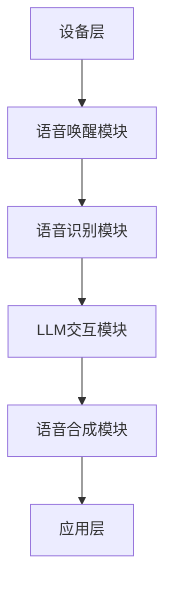
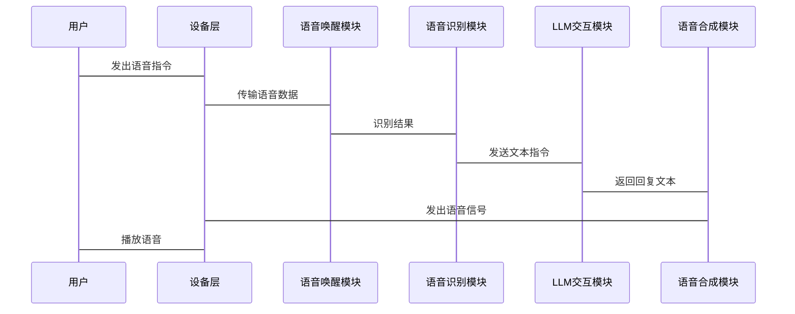

                 


# AI Agent的语音交互：整合LLM与语音识别技术

> 关键词：AI Agent, 大语言模型, 语音识别, 语音交互, 人机交互

> 摘要：本文探讨了AI Agent在语音交互中的应用，重点分析了整合大语言模型（LLM）与语音识别技术的核心原理、系统架构和项目实现。通过详细的技术分析和实际案例，展示了如何构建高效、智能的语音交互系统。

---

## 第三章: LLM与语音识别的算法原理

### 3.1 大语言模型（LLM）的算法流程

#### 3.1.1 LLM的训练流程

LLM的训练过程通常涉及大规模的数据和先进的训练算法。以下是训练流程的简要步骤：

1. **数据准备**：收集并预处理大量文本数据，包括清洗、分词和格式化。
2. **模型构建**：选择合适的模型架构，如Transformer。
3. **损失函数定义**：通常使用交叉熵损失函数。
4. **优化器选择**：常用Adam优化器。
5. **训练过程**：通过梯度下降更新模型参数，最小化损失函数。

数学公式：
- 交叉熵损失函数：$$\mathcal{L} = -\frac{1}{N}\sum_{i=1}^{N} \sum_{j=1}^{M} y_{i,j} \log p(y_{i,j}|y_{i,1},...,y_{i,j-1})$$
- Adam优化器更新公式：$$\theta_{t+1} = \theta_t - \eta \frac{ \beta_1 (1-\beta_1^t) \nabla f_t + \beta_2 (1-\beta_2^t) \nabla g_t }{1-\beta_2^t}$$

#### 3.1.2 LLM的推理流程

推理过程包括以下步骤：
1. **输入处理**：接收用户输入，如语音信号或文本。
2. **编码**：将输入转换为模型可理解的向量表示。
3. **解码**：生成模型输出的序列，通常是文本或语音信号。

数学公式：
- 编码：$$x = \text{emb}(s)$$，其中$s$是输入序列。
- 解码：$$y = \text{dec}(x)$$，生成输出序列$y$。

#### 3.1.3 LLM的优化与调优

优化目标是提高模型的准确性和响应速度。常用的技术包括：
- 增加模型层数或参数量。
- 使用更高效的训练策略，如分布式训练。
- 调整超参数，如学习率和批量大小。

### 3.2 语音识别技术的算法流程

#### 3.2.1 语音识别的基本原理

语音识别涉及将语音信号转换为文本或命令。关键步骤包括：
1. **特征提取**：将语音信号转换为频域特征，如MFCC。
2. **声学建模**：使用HMM或DNN模型建模语音特征。
3. **语言模型集成**：结合语言模型进行解码，提高识别准确率。

数学公式：
- MFCC特征计算：$$DFT(x) = \sum_{n=0}^{N-1} x[n]e^{-j2\pi kn/N}$$
- 隐马尔可夫模型（HMM）状态转移概率：$$a_{i,j} = P(\text{状态 } j \mid \text{状态 } i)$$

#### 3.2.2 语音识别的优化

优化方法包括：
- 使用深度学习模型（如RNN、LSTM）提高识别精度。
- 采用端到端模型（如CTC）简化训练流程。
- 结合语言模型进行后处理，减少错误率。

#### 3.2.3 LLM与语音识别的整合

整合的关键在于将LLM的自然语言处理能力与语音识别的信号处理能力结合，实现端到端的语音交互。例如，使用LLM生成回复，再通过语音合成模块输出语音信号。

数学公式：
- 语音合成的波形生成模型：$$y = \text{model}(x)$$，其中$x$是输入特征，$y$是生成的语音波形。

### 3.3 算法的实现与优化

实现步骤：
1. **选择模型架构**：如GPT系列模型。
2. **数据预处理**：包括清洗、分词和格式化。
3. **训练与调优**：使用分布式训练和超参数优化。
4. **集成语音识别**：将LLM与语音识别模块结合，实现语音输入和文本输出的双向交互。

优化策略：
- 使用更高效的训练策略，如混合精度训练。
- 结合小样本数据微调，适应特定领域需求。
- 优化语音识别模型的实时性，减少延迟。

---

## 第四章: AI Agent语音交互系统分析与架构设计

### 4.1 项目介绍

以智能音箱为例，系统需要支持语音唤醒、命令识别和反馈生成。用户通过语音指令与系统交互，系统通过LLM生成回复，并通过语音合成播放。

### 4.2 系统功能设计

#### 4.2.1 功能需求

- 用户可以通过语音唤醒系统，如“小爱同学”。
- 系统识别用户指令，如“播放音乐”。
- 系统通过LLM生成回复，如“好的，播放您喜欢的歌曲”。

#### 4.2.2 系统模块划分

- **语音唤醒模块**：负责识别用户的唤醒词。
- **语音识别模块**：将语音信号转换为文本指令。
- **LLM交互模块**：解析指令并生成回复。
- **语音合成模块**：将回复文本转换为语音信号。
- **设备控制模块**：执行用户的指令，如控制音响设备。

### 4.3 系统架构设计

#### 4.3.1 分层架构

系统分为三层：
- **设备层**：处理硬件交互，如麦克风和喇叭。
- **服务层**：包含语音识别、LLM交互和语音合成服务。
- **应用层**：实现用户界面和业务逻辑。

mermaid架构图：


#### 4.3.2 关键模块交互

- 用户语音输入经过设备层，传至语音唤醒模块，确认后进入语音识别模块。
- 识别出的文本传至LLM交互模块，生成回复。
- 回复文本传至语音合成模块，生成语音信号，返回设备层播放。

### 4.4 系统接口设计

#### 4.4.1 API定义

- **语音唤醒接口**：`POST /唤醒`，接收唤醒词。
- **语音识别接口**：`POST /识别`，接收语音数据，返回文本指令。
- **LLM交互接口**：`POST /交互`，接收文本指令，返回回复文本。
- **语音合成接口**：`POST /合成`，接收回复文本，返回语音数据。

#### 4.4.2 序列图

mermaid序列图：


### 4.5 系统优化与扩展

- **实时性优化**：减少语音识别和LLM响应的延迟。
- **可用性扩展**：增加多设备支持，如手机、手表。
- **可扩展性设计**：支持多种语言和方言，扩展功能模块。

---

## 第五章: AI Agent语音交互系统项目实战

### 5.1 环境安装

安装Python和相关库：
- **Python 3.8+**
- **库：transformers、 librosa、pydub、flask**

命令：
```
pip install transformers librosa pydub flask
```

### 5.2 核心代码实现

#### 5.2.1 语音唤醒模块

代码示例：
```python
import librosa

def audio_feature_extraction(audio_path):
    y, sr = librosa.load(audio_path, sr=None)
    mfcc = librosa.feature.mfcc(y=y, sr=sr)
    return mfcc.T
```

#### 5.2.2 语音识别模块

代码示例：
```python
from transformers import Wav2Vec2Model, Wav2Vec2Tokenizer

tokenizer = Wav2Vec2Tokenizer.from_pretrained("facebook/wav2vec2-base")
model = Wav2Vec2Model.from_pretrained("facebook/wav2vec2-base")

def speech_to_text(audio_path):
    input_arrays = tokenizer(audio_path, return_tensors="np")
    with torch.no_grad():
        outputs = model(**input_arrays)
    return tokenizer.decode(outputs.logits.argmax(dim=-1).flatten().tolist())
```

#### 5.2.3 LLM交互模块

代码示例：
```python
from transformers import AutoModelForCausalLM, AutoTokenizer

tokenizer = AutoTokenizer.from_pretrained("gpt2")
model = AutoModelForCausalLM.from_pretrained("gpt2")

def generate_response(prompt):
    inputs = tokenizer.encode(prompt, return_tensors="pt")
    outputs = model.generate(inputs, max_length=50)
    response = tokenizer.decode(outputs[0], skip_special_tokens=True)
    return response
```

#### 5.2.4 语音合成模块

代码示例：
```python
import pydub

def text_to_speech(text):
    from gtts import gTTS
    tts = gTTS(text, lang='zh-CN')
    tts.save("output.mp3")
    return "output.mp3"
```

### 5.3 代码应用解读与分析

- **语音唤醒模块**：提取语音特征，如MFCC，用于唤醒词识别。
- **语音识别模块**：使用预训练模型将语音信号转换为文本指令。
- **LLM交互模块**：生成回复文本，具备自然语言处理能力。
- **语音合成模块**：将回复文本转换为语音信号，提供反馈。

### 5.4 实际案例分析

案例：用户说“播放音乐”。

1. 语音唤醒模块识别“播放音乐”中的关键词，触发识别。
2. 语音识别模块将语音信号转换为文本指令“播放音乐”。
3. LLM交互模块生成回复“好的，请问您喜欢什么类型的音乐？”。
4. 语音合成模块将回复文本转换为语音信号，设备播放。

### 5.5 项目总结

- **实现目标**：构建了一个完整的AI Agent语音交互系统，支持从语音输入到文本输出的全链路处理。
- **项目难点**：优化系统的实时性和准确性，尤其是语音识别和LLM的响应速度。
- **未来扩展**：增加更多功能，如多语言支持和个性化设置。

---

## 第六章: AI Agent语音交互系统的最佳实践

### 6.1 小结

本文详细探讨了AI Agent在语音交互中的应用，重点分析了LLM与语音识别技术的整合。通过系统架构设计和项目实战，展示了如何构建高效、智能的语音交互系统。

### 6.2 注意事项

- **数据隐私**：处理用户语音数据时，需遵守数据隐私法规。
- **系统稳定性**：确保系统在高负载下的稳定运行。
- **用户体验**：优化交互流程，提升用户体验。

### 6.3 扩展阅读

- **相关书籍**：《深度学习入门：基于Python和TensorFlow》。
- **在线资源**：查阅GitHub上的开源项目，如Hugging Face的模型库。
- **技术博客**：关注技术博客，获取最新的语音交互技术动态。

### 6.4 附录

#### 附录A: 术语表

- **LLM**：大语言模型。
- **HMM**：隐马尔可夫模型。
- **MFCC**：mel频率倒谱系数。

#### 附录B: 参考文献

1. Vaswani, A., et al. "Attention is all you need." Advances in Neural Information Processing Systems. 2017.
2. Asher, N., et al. "wav2vec 2: A universal framework for speech representation." arXiv preprint arXiv:2004.14990, 2020.

---

## 结语

AI Agent的语音交互整合了LLM和语音识别技术，为用户提供了更加智能和便捷的交互方式。通过系统的分析和实践，我们可以构建高效的语音交互系统，推动人机交互技术的发展。未来，随着技术的进步，AI Agent将在更多领域发挥重要作用，为用户提供更优质的服务。

