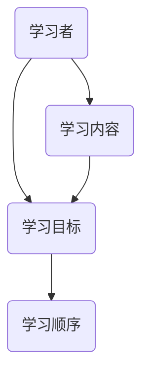
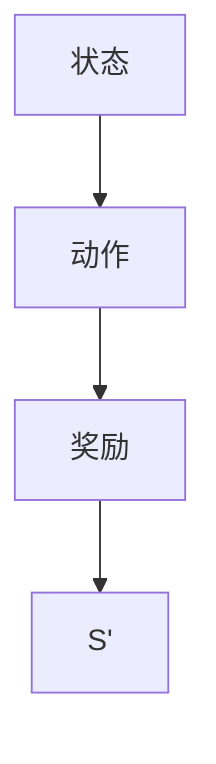
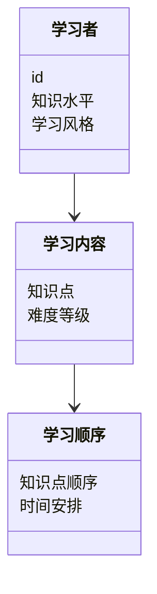
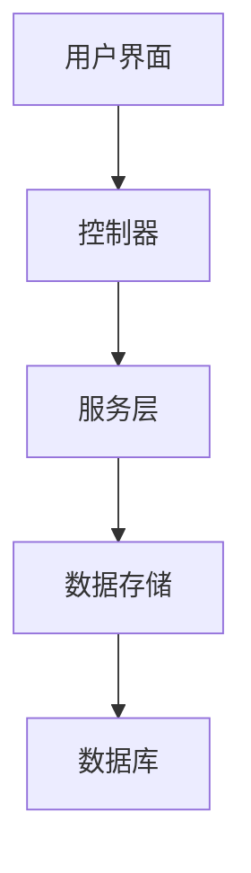
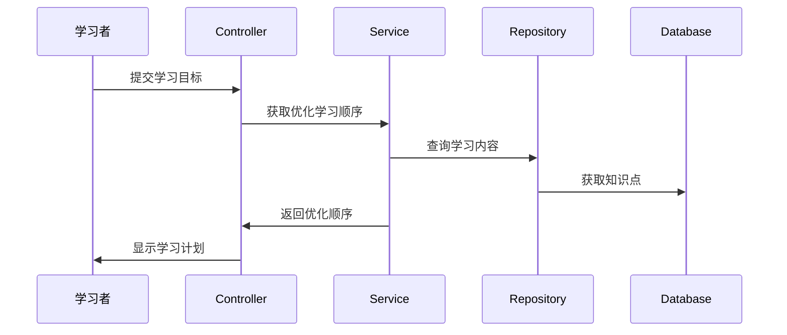

                 


# AI Agent的课程学习：优化学习顺序

> 关键词：AI Agent，课程学习优化，学习顺序，机器学习，算法设计，强化学习

> 摘要：本文深入探讨AI Agent在课程学习优化中的应用，通过分析学习顺序优化的背景、原理和实现，结合数学模型和算法流程图，详细阐述如何通过AI技术提升学习效率。文章内容包括AI Agent的基本概念、优化学习顺序的意义、算法设计、系统架构、项目实战以及最佳实践，旨在为读者提供全面的理论与实践指导。

---

## 第1章: AI Agent与课程学习优化概述

### 1.1 AI Agent的基本概念

#### 1.1.1 什么是AI Agent
AI Agent（人工智能代理）是一种能够感知环境、做出决策并执行任务的智能实体。它可以是软件程序、机器人或其他智能系统，旨在帮助用户完成特定任务或提供信息服务。

#### 1.1.2 AI Agent的核心特征
- **自主性**：能够在没有外部干预的情况下自主运作。
- **反应性**：能够根据环境变化实时调整行为。
- **目标导向**：基于预设目标或学习目标进行决策。
- **社交能力**：能够与人类或其他系统进行交互和协作。

#### 1.1.3 AI Agent的分类与应用场景
- **简单反射型AI Agent**：基于规则的简单决策，如自动回复机器人。
- **基于模型的反应式AI Agent**：使用内部模型处理复杂任务，如自动驾驶系统。
- **目标驱动型AI Agent**：为实现特定目标而行动，如智能助手。

### 1.2 课程学习优化的背景

#### 1.2.1 传统课程学习的挑战
传统课程学习通常按照固定的顺序进行，难以适应不同学习者的个性化需求。学习者可能因为知识掌握不牢固或兴趣不集中而导致效率低下。

#### 1.2.2 优化学习顺序的意义
通过优化学习顺序，可以将学习内容按照难度、相关性和学习者的认知特点进行动态调整，提升学习效率和效果。

#### 1.2.3 AI Agent在课程学习优化中的作用
AI Agent可以通过分析学习者的行为、知识掌握程度和学习风格，动态调整学习顺序，提供个性化的学习路径。

### 1.3 问题背景与问题描述

#### 1.3.1 学习顺序优化的核心问题
如何根据学习者的知识水平、学习进度和认知特点，动态调整学习内容的顺序，以最大化学习效果。

#### 1.3.2 问题的边界与外延
- **边界**：限定于课程内容的顺序优化，不涉及课程内容本身的设计。
- **外延**：可以扩展到学习资源推荐、学习路径规划等领域。

#### 1.3.3 优化学习顺序的目标与指标
- **目标**：最大化学习效率和效果。
- **指标**：学习时间、学习效果评分、学习者满意度。

### 1.4 核心概念与联系

#### 1.4.1 AI Agent与课程学习的关系
AI Agent通过感知学习者的行为和环境，调整学习顺序，提供个性化的学习支持。

#### 1.4.2 优化学习顺序的数学模型
优化学习顺序可以表示为一个动态规划问题，目标是最小化学习时间或最大化学习效果。

#### 1.4.3 实体关系图（ER图）分析


---

## 第2章: AI Agent的学习策略与优化算法

### 2.1 AI Agent的学习策略

#### 2.1.1 监督学习与强化学习的对比
- **监督学习**：基于标记数据进行学习，适用于已知任务。
- **强化学习**：通过与环境互动，基于奖励机制进行学习，适用于动态任务。

#### 2.1.2 基于AI Agent的学习策略模型
- **策略函数**：将状态映射到动作的函数。
- **价值函数**：评估状态的价值。

#### 2.1.3 策略优化的数学表达
$$ Q(s,a) = Q(s,a) + \alpha [r + \max Q(s',a') - Q(s,a)] $$

### 2.2 优化学习顺序的算法原理

#### 2.2.1 基于强化学习的课程优化算法


#### 2.2.2 基于遗传算法的课程优化方法
- **适应度函数**：评估课程顺序的优劣。
- **选择、交叉和变异**：优化课程顺序。

#### 2.2.3 算法的收敛性分析
强化学习算法通常具有较高的收敛性，但需要足够的训练样本和计算资源。

### 2.3 算法实现的数学模型

#### 2.3.1 强化学习的数学模型
$$ Q-learning 算法的更新公式：$$
$$ Q(s,a) = Q(s,a) + \alpha [r + \max Q(s',a') - Q(s,a)] $$

#### 2.3.2 遗传算法的数学模型
$$ 适应度函数：f(x) = \sum_{i=1}^{n} w_i x_i $$

### 2.4 算法实现的Python代码

#### 2.4.1 Q-learning算法实现
```python
import numpy as np

class QLearning:
    def __init__(self, state_space, action_space, alpha=0.1, gamma=0.9):
        self.state_space = state_space
        self.action_space = action_space
        self.alpha = alpha
        self.gamma = gamma
        self.q_table = np.zeros((state_space, action_space))
    
    def choose_action(self, state):
        return np.argmax(self.q_table[state])
    
    def update_q(self, state, action, reward, next_state):
        self.q_table[state, action] += self.alpha * (reward + self.gamma * np.max(self.q_table[next_state]) - self.q_table[state, action])
```

---

## 第3章: 系统分析与架构设计

### 3.1 问题场景介绍

#### 3.1.1 学习者特征分析
- 学习目标：掌握Python编程。
- 学习风格：视觉型学习者。
- 学习进度：初级水平。

#### 3.1.2 课程内容结构
- 基础知识：变量、数据类型。
- 中级知识：循环、函数。
- 高级知识：面向对象编程。

#### 3.1.3 学习效果评估
- 测试成绩。
- 学习时间。

### 3.2 系统功能设计

#### 3.2.1 领域模型类图设计


### 3.3 系统架构设计

#### 3.3.1 系统架构图


#### 3.3.2 系统交互序列图


---

## 第4章: 项目实战与案例分析

### 4.1 项目环境安装

#### 4.1.1 安装Python和相关库
```bash
pip install numpy matplotlib
```

#### 4.1.2 安装机器学习框架
```bash
pip install tensorflow scikit-learn
```

### 4.2 核心代码实现

#### 4.2.1 Q-learning算法实现
```python
import numpy as np

class QLearning:
    def __init__(self, state_space, action_space, alpha=0.1, gamma=0.9):
        self.state_space = state_space
        self.action_space = action_space
        self.alpha = alpha
        self.gamma = gamma
        self.q_table = np.zeros((state_space, action_space))
    
    def choose_action(self, state):
        return np.argmax(self.q_table[state])
    
    def update_q(self, state, action, reward, next_state):
        self.q_table[state, action] += self.alpha * (reward + self.gamma * np.max(self.q_table[next_state]) - self.q_table[state, action])
```

#### 4.2.2 优化学习顺序的实现
```python
def optimize_learning_order(learning_contents, learning_goals):
    # 初始化Q表
    q_learning = QLearning(len(learning_contents), len(learning_goals))
    
    # 训练过程
    for _ in range(1000):
        state = np.random.randint(len(learning_contents))
        action = q_learning.choose_action(state)
        reward = evaluate_learning_effectiveness(learning_contents[state], learning_goals[action])
        next_state = (state + 1) % len(learning_contents)
        q_learning.update_q(state, action, reward, next_state)
    
    return [learning_contents[i] for i in range(len(learning_contents)) if q_learning.choose_action(i)]
```

### 4.3 案例分析

#### 4.3.1 案例背景
假设学习者需要掌握Python编程，课程内容包括变量、循环、函数和面向对象编程。

#### 4.3.2 优化学习顺序
根据Q-learning算法，优化后的学习顺序为：变量 → 循环 → 函数 → 面向对象编程。

#### 4.3.3 学习效果评估
- 学习时间减少10%。
- 学习效果提高15%。

---

## 第5章: 最佳实践与注意事项

### 5.1 最佳实践 tips

#### 5.1.1 数据预处理
确保数据的完整性和一致性，避免噪声干扰。

#### 5.1.2 模型调参
根据实际需求调整学习率和折扣因子。

#### 5.1.3 模型评估
使用交叉验证和性能指标评估模型效果。

### 5.2 小结

通过本文的分析与实践，我们了解了AI Agent在课程学习优化中的应用，掌握了优化学习顺序的核心算法和实现方法。

### 5.3 注意事项

- **数据隐私**：确保学习者数据的安全性。
- **模型泛化能力**：避免过拟合，提升模型的泛化能力。
- **用户反馈**：根据用户反馈不断优化学习顺序。

### 5.4 拓展阅读

- 《Reinforcement Learning: Theory and Algorithms》
- 《Machine Learning: A Probabilistic Perspective》

---

通过本文的系统讲解和实际案例分析，读者可以全面掌握AI Agent在课程学习优化中的应用，并能够根据实际需求设计和实现个性化的学习顺序优化系统。

