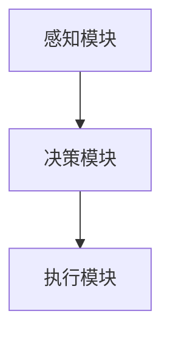
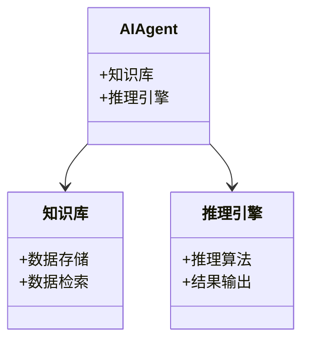

                 


# AI Agent的课程学习：模拟LLM的系统知识获取过程

> 关键词：AI Agent, LLM, 知识获取, 监督学习, 强化学习, 对比学习, 人工智能

> 摘要：AI Agent通过模拟人类学习过程，利用大规模语言模型（LLM）的知识获取机制，实现对复杂任务的自动化处理和决策。本文系统性地介绍了AI Agent的知识获取过程，从基础概念到算法原理，再到系统实现，帮助读者全面理解AI Agent的工作原理和实际应用。

---

## 第一部分: AI Agent与LLM概述

### 第1章: AI Agent的基本概念与背景

#### 1.1 AI Agent的定义与核心特征
AI Agent（人工智能代理）是指能够感知环境、自主决策并执行任务的智能实体。与传统AI相比，AI Agent具有以下核心特征：
- **自主性**：能够在没有外部干预的情况下独立运作。
- **反应性**：能够实时感知环境并做出响应。
- **目标导向性**：基于目标进行决策和行动。
- **社交能力**：能够与人类或其他系统进行交互和协作。

#### 1.2 LLM的基本概念
LLM（Large Language Model，大规模语言模型）是一种基于深度学习的自然语言处理模型，能够理解和生成人类语言。其核心技术包括：
- **Transformer架构**：通过自注意力机制捕捉上下文信息。
- **预训练与微调**：通过大规模数据预训练，然后针对特定任务进行微调。

### 第2章: AI Agent的知识获取机制

#### 2.1 监督学习机制
监督学习是一种基于标注数据的训练方法，AI Agent通过学习标注数据的输入输出关系，逐步掌握知识。

##### 2.1.1 正向传播与反向传播
- **正向传播**：输入数据经过模型处理，生成输出。
- **反向传播**：通过计算损失函数的梯度，调整模型参数以最小化预测误差。

数学公式：
$$\text{损失函数} = \frac{1}{n}\sum_{i=1}^{n}(y_i - \hat{y}_i)^2$$
$$\text{优化算法} = \theta - \eta \frac{\partial L}{\partial \theta}$$

#### 2.2 强化学习机制
强化学习是一种通过与环境交互，基于奖励机制进行学习的方法。

##### 2.2.1 奖励函数的设计
- **奖励函数**：定义在特定状态和动作下，AI Agent获得的奖励。
- **策略优化**：通过最大化奖励函数，调整动作策略。

数学公式：
$$Q(s, a) = Q(s, a) + \alpha [r + \gamma \max Q(s', a') - Q(s, a)]$$

#### 2.3 对比学习机制
对比学习通过比较正样本和负样本，提升模型的区分能力。

##### 2.3.1 对比损失函数
- **对比损失**：衡量正样本和负样本之间的相似度差异。

数学公式：
$$\mathcal{L} = -\log \frac{\exp(\text{sim}(x,y))}{\exp(\text{sim}(x,y)) + \sum_{k \neq y} \exp(\text{sim}(x,k))}$$

### 第3章: AI Agent的知识表示与推理

#### 3.1 知识表示的基本概念
知识表示是AI Agent理解和表示知识的关键步骤，常见的表示方法包括：
- **符号表示法**：使用符号和规则表示知识。
- **向量表示法**：通过向量编码语义信息。
- **图结构表示法**：通过图结构表示实体之间的关系。

#### 3.2 知识推理的算法原理
知识推理是基于知识表示，通过推理算法生成新的知识。

##### 3.2.1 推理算法
- **符号逻辑推理**：基于逻辑规则进行推理。
- **概率推理**：基于概率论进行推理。

---

## 第二部分: AI Agent的系统架构与实现

### 第4章: AI Agent的系统架构设计

#### 4.1 系统组件与交互
- **感知模块**：负责环境数据的采集。
- **决策模块**：负责基于感知数据进行决策。
- **执行模块**：负责执行决策动作。

##### 4.1.1 系统架构图


#### 4.2 系统功能设计
- **知识库管理**：存储和管理知识。
- **推理引擎**：执行推理任务。

##### 4.2.1 系统功能图


### 第5章: AI Agent的项目实战

#### 5.1 环境搭建
- **开发环境**：安装Python、TensorFlow、Keras等开发工具。
- **数据集**：选择适合的标注数据集。

#### 5.2 系统核心实现

##### 5.2.1 数据预处理
```python
def preprocess_data(data):
    # 数据清洗和特征提取
    processed_data = []
    for item in data:
        processed_item = {
            'input': item['input'].lower(),
            'output': item['output']
        }
        processed_data.append(processed_item)
    return processed_data
```

##### 5.2.2 模型训练
```python
def train_model(train_data):
    model = build_model()  # 定义模型
    optimizer = tf.keras.optimizers.Adam(lr=1e-3)
    model.compile(optimizer=optimizer, loss='sparse_categorical_crossentropy', metrics=['accuracy'])
    history = model.fit(train_data, epochs=10, batch_size=32)
    return model, history
```

##### 5.2.3 模型部署
```python
def deploy_model(model, input_data):
    prediction = model.predict(input_data)
    return prediction
```

### 第6章: AI Agent的学习与优化

#### 6.1 模型优化策略
- **蒸馏优化**：通过知识蒸馏技术减少模型大小。
- **量化优化**：通过量化技术降低模型计算成本。

#### 6.2 应用案例分析
- **智能客服对话系统**：通过AI Agent实现自动应答和问题解决。

#### 6.3 未来展望
- **多模态学习**：结合视觉、听觉等多种模态信息，提升AI Agent的感知能力。
- **人机协作**：通过人机协作，提升AI Agent的决策能力和用户体验。

---

## 总结
AI Agent通过模拟LLM的知识获取过程，实现对复杂任务的自动化处理和决策。本文从基础知识到系统实现，详细讲解了AI Agent的学习过程，帮助读者全面理解和应用这一技术。

---

## Tips
- **学习建议**：建议读者结合实际项目，动手实践AI Agent的开发和优化。
- **注意事项**：在实际应用中，需注意数据隐私和模型的可解释性问题。
- **拓展阅读**：推荐阅读《Deep Learning》和《Transformer: A Tour》等书籍，深入了解相关技术细节。

