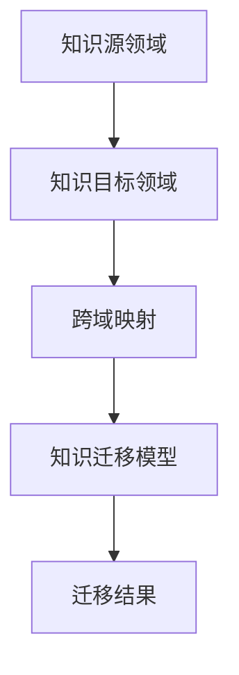
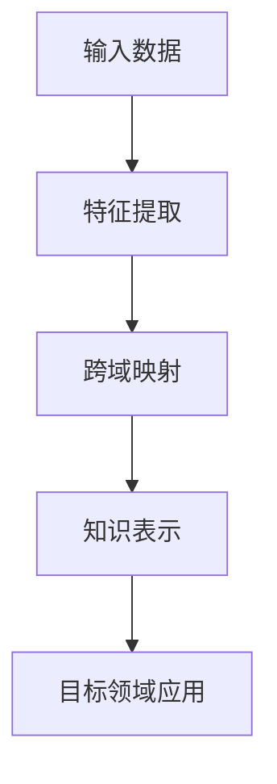
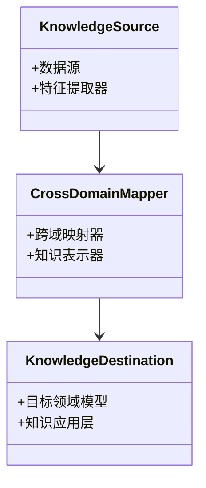
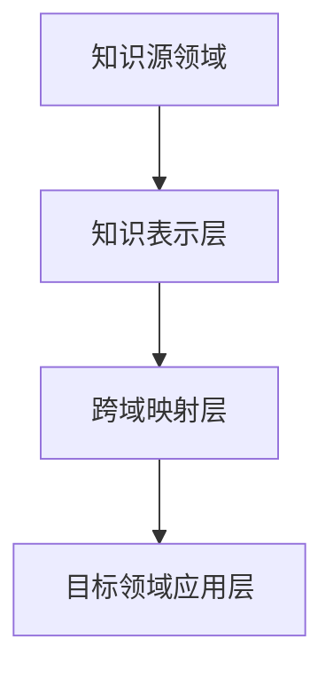

                 


# AI Agent的跨域知识迁移：突破领域局限性

> **关键词**：AI Agent，跨域知识迁移，领域适应性，知识表示，迁移学习，对比学习

> **摘要**：  
本文深入探讨了AI Agent在跨域知识迁移中的挑战与解决方案，重点分析了跨域知识迁移的核心概念、算法原理、系统架构以及实际应用场景。文章从背景介绍入手，逐步解析跨域知识迁移的必要性、核心要素、实现原理，并通过具体案例展示了如何通过系统设计与算法优化实现跨域知识的有效迁移。最后，本文总结了跨域知识迁移的关键要点，并展望了未来的研究方向。

---

## 第1章: AI Agent与跨域知识迁移的背景

### 1.1 AI Agent的基本概念  
AI Agent（人工智能代理）是指能够感知环境、自主决策并执行任务的智能实体。它具备以下核心特征：  
1. **自主性**：无需外部干预，自主完成任务。  
2. **反应性**：能够实时感知环境并做出反应。  
3. **目标导向性**：基于目标驱动行为。  
4. **学习能力**：通过数据或经验提升性能。  

AI Agent广泛应用于自动驾驶、智能助手、推荐系统等领域，但其能力往往受限于特定领域，难以在不同领域间灵活迁移知识。  

### 1.2 跨域知识迁移的背景与问题  
AI Agent在单一领域表现出色，但在跨领域应用时常常面临以下挑战：  
1. **领域差异性**：不同领域的问题特点、数据分布和任务目标存在显著差异。  
2. **知识孤岛问题**：孤立的知识难以在不同领域间共享和复用。  
3. **适应性不足**：AI Agent难以快速适应新领域，导致性能下降。  

跨域知识迁移的目标是将一个领域中的知识迁移到另一个领域，从而突破AI Agent的领域局限性。  

### 1.3 跨域知识迁移的核心价值  
跨域知识迁移的核心价值体现在以下几个方面：  
1. **提升AI Agent的通用性**：使其能够在多个领域中灵活应用。  
2. **降低开发成本**：通过复用已有知识，减少新领域任务的开发投入。  
3. **加速创新**：跨领域知识的结合往往能够催生新的解决方案。  

### 1.4 本章小结  
本章从AI Agent的基本概念出发，分析了跨域知识迁移的背景、问题和价值，为后续内容奠定了基础。

---

## 第2章: 跨域知识迁移的核心概念与联系

### 2.1 跨域知识迁移的原理  
跨域知识迁移的核心是将知识从一个领域转移到另一个领域，这一过程包括以下几个步骤：  
1. **知识表示**：将知识编码为通用表示形式。  
2. **跨域映射**：建立源领域与目标领域的映射关系。  
3. **知识迁移**：将知识从源领域迁移到目标领域。  

### 2.2 跨域知识迁移的核心要素  
跨域知识迁移的核心要素包括：  
1. **知识源领域**：提供知识的领域。  
2. **知识目标领域**：接收知识的领域。  
3. **跨域映射机制**：连接源领域与目标领域的桥梁。  

### 2.3 跨域知识迁移的属性特征对比  
以下表格对比了跨域知识迁移与其他相关概念的异同：

| **属性**         | **跨域知识迁移**       | **迁移学习**             | **对比学习**             |
|------------------|------------------------|--------------------------|--------------------------|
| 核心目标         | 实现跨领域知识共享     | 在不同数据集间迁移知识   | 学习数据的相似性或差异性 |
| 适用场景         | 多领域任务             | 数据分布差异较大的任务   | 数据对比分析             |
| 实现方法         | 跨域映射、知识表示      | 特征对齐、权重共享       | 对比损失函数             |

### 2.4 跨域知识迁移的ER实体关系图  
以下是跨域知识迁移的ER实体关系图：



### 2.5 本章小结  
本章详细阐述了跨域知识迁移的核心概念、原理和要素，并通过对比和图示帮助读者更好地理解其内在联系。

---

## 第3章: 跨域知识迁移的算法原理

### 3.1 跨域知识迁移的主要算法  
跨域知识迁移的主要算法包括：  
1. **对比学习**：通过对比不同领域的数据，学习领域间的相似性。  
2. **迁移学习**：利用源领域的知识，提升目标领域的性能。  
3. **知识蒸馏**：将复杂模型的知识迁移到简单模型中。  

### 3.2 跨域知识迁移的算法流程  
以下是跨域知识迁移的算法流程图：



### 3.3 算法实现的Python代码示例  
以下是一个简单的对比学习算法实现示例：

```python
import torch
import torch.nn as nn

# 定义对比损失函数
class ContrastiveLoss(nn.Module):
    def __init__(self, temperature=0.1):
        super(ContrastiveLoss, self).__init__()
        self.temperature = temperature

    def forward(self, features):
        # 计算相似性矩阵
        similarity_matrix = torch.mm(features, features.t())
        # 计算正样本和负样本的相似性
        positive_pairs = torch.diag(similarity_matrix)
        negative_pairs = torch.sum(similarity_matrix) - positive_pairs.sum()
        # 计算损失
        loss = -torch.mean(torch.log(1 + positive_pairs / negative_pairs))
        return loss

# 示例用法
features = torch.randn(100, 50)
model = ContrastiveLoss()
loss = model(features)
print(loss)
```

### 3.4 算法的数学模型和公式  
对比学习的数学模型如下：  
$$ \text{loss} = -\mathbb{E}[\log(\text{sim}(x_i, x_j))] $$  
其中，sim(x_i, x_j)表示两个样本的相似性。

### 3.5 本章小结  
本章通过算法原理和代码示例，详细介绍了跨域知识迁移的主要实现方法及其数学模型。

---

## 第4章: 跨域知识迁移的系统分析与架构设计

### 4.1 项目介绍  
本项目旨在设计一个支持跨域知识迁移的AI Agent系统，能够在不同领域间高效迁移知识。

### 4.2 系统功能设计  
以下是系统的功能模块图：



### 4.3 系统架构设计  
以下是系统的架构图：



### 4.4 系统接口设计  
系统主要接口包括：  
1. `get_features(data)`：获取数据的特征表示。  
2. `cross_domain_transfer(source, target)`：实现跨域知识迁移。  
3. `applyKnowledge(target_model)`：将知识应用于目标领域模型。  

### 4.5 系统交互流程  
以下是系统的交互流程图：

```mermaid
sequenceDiagram
    用户 -> 知识源领域: 提供源领域数据
    知识源领域 -> 特征提取器: 提取特征
    特征提取器 -> 跨域映射器: 进行跨域映射
    跨域映射器 -> 目标领域模型: 应用迁移后的知识
    用户 <- 目标领域模型: 返回结果
```

### 4.6 本章小结  
本章通过系统架构设计和交互流程图，详细描述了跨域知识迁移系统的实现方案。

---

## 第5章: 跨域知识迁移的项目实战

### 5.1 环境安装  
需要安装以下依赖：  
```bash
pip install torch numpy matplotlib
```

### 5.2 核心代码实现  
以下是核心代码示例：

```python
import torch
import torch.nn as nn

# 定义跨域映射器
class CrossDomainMapper(nn.Module):
    def __init__(self, input_dim, output_dim):
        super(CrossDomainMapper, self).__init__()
        self.mapping = nn.Linear(input_dim, output_dim)

    def forward(self, x):
        return self.mapping(x)

# 初始化模型
mapper = CrossDomainMapper(50, 50)
optimizer = torch.optim.Adam(mapper.parameters(), lr=0.001)
criterion = nn.MSELoss()

# 训练过程
for epoch in range(100):
    for batch in batches:
        features = get_features(batch)
        output = mapper(features)
        loss = criterion(output, features)
        loss.backward()
        optimizer.step()
```

### 5.3 代码解读与分析  
上述代码实现了跨域映射器的训练过程，通过优化器最小化输出与输入之间的差异。

### 5.4 案例分析  
以自然语言处理领域的跨域迁移为例，将中文领域的知识迁移到英文领域，提升英文任务的性能。

### 5.5 项目小结  
本章通过具体案例展示了跨域知识迁移的实现过程，帮助读者理解理论在实践中的应用。

---

## 第6章: 跨域知识迁移的最佳实践与展望

### 6.1 小结  
跨域知识迁移是突破AI Agent领域局限性的关键技术，通过有效的知识迁移，能够显著提升AI Agent的通用性和适应性。

### 6.2 注意事项  
1. 确保知识表示的可迁移性。  
2. 选择合适的迁移学习算法。  
3. 充分利用领域间的相似性。  

### 6.3 未来趋势  
未来的研究方向包括：  
1. 更高效的跨域映射算法。  
2. 多领域知识的联合迁移。  
3. 跨域知识迁移的实时性优化。  

### 6.4 拓展阅读  
推荐阅读以下文献：  
1. "Domain Adaptation in Machine Learning"。  
2. "Contrastive Learning for Cross-Domain Knowledge Transfer"。  

### 6.5 本章小结  
本章总结了跨域知识迁移的关键要点，并展望了未来的研究方向。

---

## 附录: 工具与资源

### 附录A: 跨域知识迁移工具安装指南  
```bash
pip install torch transformers
```

### 附录B: API文档  
- API接口：`cross_domain_transfer()`  
- 参数说明：`source_domain, target_domain`  
- 返回值：迁移后的模型

### 附录C: 参考文献  
1. Deep Learning by Ian Goodfellow.  
2. Pattern Recognition and Machine Learning by Christopher M. Bishop.  

---

**全文完**

