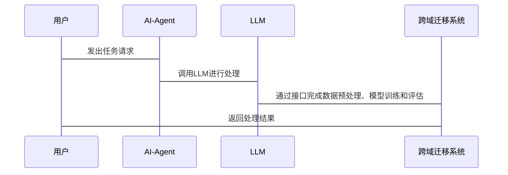

                 


好的，接下来我将按照你提供的目录大纲撰写一篇关于《AI Agent的跨域迁移：LLM在不同领域间的知识迁移》的技术博客文章。为了确保内容完整且符合你的要求，我会逐步展开每个部分的内容。

---

# AI Agent的跨域迁移：LLM在不同领域间的知识迁移

## 关键词：
- AI Agent
- 跨域迁移
- LLM
- 语言模型
- 知识迁移

## 摘要：
随着人工智能技术的快速发展，AI Agent（智能体）在多个领域中的应用越来越广泛。然而，AI Agent在不同领域间的知识迁移仍然面临许多挑战。本文将从AI Agent的基本概念出发，探讨大语言模型（LLM）在跨域迁移中的原理、技术挑战以及解决方案。通过分析对比学习、迁移学习等算法，结合实际应用场景，本文深入剖析了LLM在跨领域应用中的潜力与实现路径。

---

## 第一部分: AI Agent的跨域迁移概述

### 第1章: AI Agent与跨域迁移的背景介绍

#### 1.1 AI Agent的基本概念
- **AI Agent的定义**  
  AI Agent（智能体）是指在特定环境中能够感知并自主行动以实现目标的实体。它可以通过接收输入、分析信息、做出决策并执行操作来完成任务。
  
- **AI Agent的核心要素**  
  1. 感知能力：通过传感器或数据输入获取环境信息。  
  2. 决策能力：基于感知信息做出行动决策。  
  3. 行动能力：通过执行器或输出模块完成实际操作。  
  4. 学习能力：通过经验或数据优化自身的决策和行动能力。

- **AI Agent的分类与特点**  
  1. 按智能水平分类：  
     - 单一智能体：专注于单一任务（如语音助手）。  
     - 复合智能体：具备多任务处理能力（如自动驾驶系统）。  
  2. 按应用场景分类：  
     - 软件智能体：运行在计算机系统中的AI Agent（如聊天机器人）。  
     - 物理智能体：与物理环境交互的AI Agent（如工业机器人）。  

---

#### 1.2 跨域迁移的基本概念
- **跨域迁移的定义**  
  跨域迁移是指将AI Agent在某一领域（源域）中学到的知识或经验，应用到另一个领域（目标域）中的过程。  
- **跨域迁移的背景与意义**  
  在实际应用中，AI Agent往往需要处理来自不同领域的问题。例如，一个AI Agent可能需要在医疗领域分析病历数据，同时在金融领域进行风险评估。  
- **跨域迁移的核心问题与挑战**  
  1. 数据分布差异：目标域与源域的数据分布可能不同，导致模型在目标域上的性能下降。  
  2. 知识表示的通用性：如何在不同领域之间共享知识是跨域迁移的核心问题。  
  3. 迁移效率：如何高效地完成跨域迁移是技术挑战之一。  

---

#### 1.3 LLM在跨域迁移中的作用
- **LLM的定义与特点**  
  大语言模型（LLM）是一种基于深度学习的自然语言处理模型，具有强大的语言理解和生成能力。  
- **LLM在跨领域应用中的优势**  
  1. 多领域适应性：LLM可以通过微调或提示工程（Prompt Engineering）技术适应不同领域的任务。  
  2. 知识整合能力：LLM可以整合多个领域的知识，从而支持跨域迁移。  
- **跨域迁移对LLM的挑战**  
  1. 数据稀缺性：目标域可能缺乏足够的标注数据。  
  2. 领域特定性：不同领域的语言风格和术语可能差异较大。  
  3. 模型泛化能力：如何在保持源域性能的同时，提升目标域的适应性是关键问题。  

---

#### 1.4 本章小结
本章从AI Agent的基本概念出发，介绍了跨域迁移的核心概念及其在实际应用中的重要性。同时，分析了LLM在跨域迁移中的优势与挑战，为后续内容奠定了基础。

---

## 第二部分: LLM的原理与技术基础

### 第2章: 大语言模型（LLM）的核心原理

#### 2.1 LLM的预训练过程
- **预训练的基本概念**  
  预训练是指在大规模通用数据集上训练模型，以捕获语言的通用特征。  
- **常见的预训练方法**  
  1. 自然语言理解（NLU）：通过任务如文本摘要、问答系统等训练模型。  
  2. 自然语言生成（NLG）：通过任务如文本生成、对话生成等训练模型。  
- **预训练模型的评估与优化**  
  通过评估指标（如BLEU、ROUGE）优化模型的生成能力。  

#### 2.2 LLM的微调与适配
- **微调的基本概念**  
  微调是指在预训练模型的基础上，使用特定领域的数据进一步训练模型。  
- **微调的主要方法**  
  1. 参数微调：调整模型的所有参数以适应特定任务。  
  2. �.freeze微调：冻结部分参数，仅调整任务相关的参数。  
- **微调对模型性能的影响**  
  微调可以显著提高模型在特定领域的性能，但需要大量目标域的数据支持。  

#### 2.3 提示工程（Prompt Engineering）
- **提示工程的定义与作用**  
  提示工程是指通过设计特定的提示（Prompt）来引导模型生成符合需求的输出。  
- **提示设计的关键原则**  
  1. 明确性：提示应清晰地表达任务需求。  
  2. 简洁性：提示应简短且易于理解。  
  3. 可适应性：提示应支持跨领域的任务需求。  
- **提示工程在跨域迁移中的应用**  
  通过设计通用的提示，LLM可以在不同领域间灵活切换任务。  

#### 2.4 本章小结
本章详细介绍了LLM的核心原理，包括预训练、微调和提示工程。这些技术为LLM在跨域迁移中的应用奠定了基础。

---

### 第3章: 跨域迁移的核心挑战

#### 3.1 数据偏差与分布偏移
- **数据偏差的定义与表现**  
  数据偏差是指数据在分布、数量或质量上的不平衡，可能导致模型在特定领域上的表现不佳。  
- **分布偏移对模型性能的影响**  
  分布偏移会使模型在目标域上的预测能力下降。  
- **数据偏差对跨域迁移的挑战**  
  如何减少数据偏差对模型的影响是跨域迁移中的关键问题。  

#### 3.2 模型的泛化能力
- **模型泛化的定义与衡量标准**  
  模型泛化能力是指模型在不同数据集上的表现一致性。  
- **LLM的泛化能力与跨域迁移的关系**  
  泛化能力强的模型更适用于跨域迁移任务。  
- **提升模型泛化能力的方法**  
  1. 数据增强：通过生成更多样化的数据提升模型的泛化能力。  
  2. 正则化：通过正则化技术减少过拟合。  

#### 3.3 跨域迁移中的模型鲁棒性
- **模型鲁棒性的定义与重要性**  
  模型鲁棒性是指模型在面对噪声或不确定性时仍能保持良好性能的能力。  
- **跨域迁移中模型鲁棒性的挑战**  
  不同领域的数据可能具有不同的噪声分布，如何提升模型的鲁棒性是关键。  
- **提升模型鲁棒性的策略**  
  1. 对比学习：通过对比源域和目标域的数据，增强模型的鲁棒性。  
  2. 迁移学习：通过迁移学习技术，提升模型在目标域上的鲁棒性。  

#### 3.4 本章小结
本章分析了跨域迁移中的核心挑战，包括数据偏差、模型泛化能力和鲁棒性问题，并提出了相应的解决方案。

---

### 第4章: 跨域迁移的算法原理

#### 4.1 对比学习（Contrastive Learning）
- **对比学习的定义与原理**  
  对比学习是一种通过比较不同数据之间的相似性来优化模型的方法。  
- **对比学习在跨域迁移中的应用**  
  通过对比源域和目标域的数据，增强模型的跨域适应能力。  
- **对比学习的优缺点分析**  
  优点：能够有效减少数据偏差。  
  缺点：需要设计有效的对比策略。  

#### 4.2 迁移学习（Transfer Learning）
- **迁移学习的定义与分类**  
  迁移学习是指将一个领域中学到的知识应用到另一个领域中的过程。  
- **迁移学习在跨域迁移中的应用**  
  通过迁移学习技术，提升模型在目标域上的性能。  
- **迁移学习的关键技术与挑战**  
  1. 域适配：通过调整模型参数，使模型适应目标域。  
  2. 域不变性：通过设计不变性函数，保持源域和目标域之间的特征一致性。  

#### 4.3 跨域迁移的数学模型
- **跨域迁移的基本数学模型**  
  设源域数据为$X_s$，目标域数据为$X_t$，模型参数为$\theta$。  
  模型在源域上的损失函数为$L_s$，目标域上的损失函数为$L_t$。  
  跨域迁移的目标是最小化$L_s$和$L_t$的差异。  
- **对比学习的数学表达**  
  对比损失函数为：  
  $$L_{\text{contrast}} = -\log\left(\frac{\exp(s(x_i, x_j))}{\sum_{k} \exp(s(x_i, x_k))}\right)$$  
  其中，$s(x_i, x_j)$是对比相似性分数。  
- **迁移学习的数学框架**  
  迁移学习的目标是最小化目标域上的风险：  
  $$\min_{\theta} \mathbb{E}_{(x,y)\sim D_t}[ \mathcal{L}(f_\theta(x), y)]$$  
  其中，$D_t$是目标域数据分布，$f_\theta$是模型参数。  

#### 4.4 本章小结
本章详细介绍了对比学习和迁移学习在跨域迁移中的应用，并通过数学模型展示了其工作原理。

---

## 第五部分: 系统分析与架构设计

### 第5章: 跨域迁移系统的分析与设计

#### 5.1 系统功能设计
- **系统功能模块划分**  
  1. 数据预处理模块：对源域和目标域数据进行清洗和标注。  
  2. 模型训练模块：基于对比学习或迁移学习技术训练模型。  
  3. 模型评估模块：评估模型在目标域上的性能。  
  4. 提示工程模块：设计适用于不同领域的提示。  

- **领域模型的Mermaid类图**  
  ```mermaid
  classDiagram
      class AI-Agent {
          -感知能力
          -决策能力
          -行动能力
          -学习能力
      }
      class LLM {
          -预训练模型
          -微调模块
          -提示工程模块
      }
      class 跨域迁移系统 {
          -源域数据
          -目标域数据
          -模型训练模块
          -模型评估模块
      }
      AI-Agent --> LLM
      LLM --> 跨域迁移系统
  ```

#### 5.2 系统架构设计
- **系统架构的Mermaid架构图**  
  ```mermaid
  architecture
      跨域迁移系统
      ├── 数据预处理模块
      ├── 模型训练模块
      ├── 模型评估模块
      └── 提示工程模块
  ```

#### 5.3 系统接口设计
- **接口描述**  
  1. 数据预处理接口：接收源域和目标域数据，返回清洗后的数据集。  
  2. 模型训练接口：接收训练数据和模型参数，返回训练好的模型。  
  3. 模型评估接口：接收评估数据和模型，返回评估结果。  
  4. 提示工程接口：接收任务需求，返回适用的提示。  

#### 5.4 系统交互的Mermaid序列图


---

### 第6章: 项目实战

#### 6.1 环境安装
```bash
pip install transformers
pip install numpy
pip install matplotlib
```

#### 6.2 核心实现源代码
```python
import torch
import torch.nn as nn
from transformers import AutoTokenizer, AutoModel

class ContrastiveLoss(nn.Module):
    def __init__(self, temperature=1.0):
        super(ContrastiveLoss, self).__init__()
        self.temperature = temperature
        
    def forward(self, features, labels):
        # 计算相似性分数
        similarity = torch.mm(features, features.T) / self.temperature
        # 计算标签是否相同
        same_labels = (labels.unsqueeze(1) == labels.unsqueeze(0)).float()
        # 计算损失
        loss = -torch.mean(torch.log(torch.sigmoid(similarity) + 1e-8))
        return loss

# 加载预训练模型
model = AutoModel.from_pretrained('bert-base-uncased')
tokenizer = AutoTokenizer.from_pretrained('bert-base-uncased')

# 定义对比学习训练函数
def contrastive_train(model, tokenizer, source_data, target_data):
    optimizer = torch.optim.Adam(model.parameters(), lr=1e-5)
    loss_fn = ContrastiveLoss()
    
    for epoch in range(10):
        for batch in zip(source_data, target_data):
            # 将数据转换为tokens
            inputs_s = tokenizer(batch[0], return_tensors='pt', padding=True, truncation=True)
            inputs_t = tokenizer(batch[1], return_tensors='pt', padding=True, truncation=True)
            
            # 前向传播
            with torch.no_grad():
                embed_s = model(**inputs_s).last_hidden_state[:, 0, :]
                embed_t = model(**inputs_t).last_hidden_state[:, 0, :]
            
            # 计算相似性
            loss = loss_fn(embed_s, embed_t)
            optimizer.zero_grad()
            loss.backward()
            optimizer.step()
    return model
```

#### 6.3 代码解读与分析
- **代码功能**  
  该代码实现了基于对比学习的模型训练，通过将源域和目标域的数据进行对比，优化模型的跨域适应能力。  
- **关键模块**  
  1. `ContrastiveLoss`：定义对比损失函数。  
  2. `contrastive_train`：实现对比学习的训练过程。  

#### 6.4 实际案例分析
- **案例背景**  
  假设我们希望将一个在医疗领域训练好的LLM应用到金融领域。  
- **案例分析**  
  1. 数据预处理：收集医疗和金融领域的文本数据。  
  2. 模型训练：使用对比学习方法训练模型，使其在两个领域间具有良好的迁移能力。  
  3. 模型评估：评估模型在金融领域的性能，并进行优化。  

#### 6.5 本章小结
本章通过实际案例展示了跨域迁移系统的实现过程，包括环境安装、代码实现、案例分析等。

---

## 第六部分: 总结与展望

### 6.1 最佳实践 Tips
- 在跨域迁移中，建议优先使用对比学习和迁移学习技术。  
- 数据预处理是关键，需注意数据的平衡性和代表性。  
- 提示工程在跨域应用中具有重要作用，需精心设计提示语。  

### 6.2 小结
本文从AI Agent的基本概念出发，深入探讨了LLM在跨域迁移中的原理、技术挑战及解决方案。通过对比学习、迁移学习等算法，结合实际应用场景，本文为跨域迁移提供了理论支持和实践指导。

### 6.3 注意事项
- 在实际应用中，需注意目标域数据的质量和数量。  
- 对比学习和迁移学习的结合使用可以显著提升模型的跨域适应能力。  
- 模型的鲁棒性和泛化能力是跨域迁移成功的关键因素。  

### 6.4 拓展阅读
- 进一步研究多任务学习（Multi-Task Learning）在跨域迁移中的应用。  
- 探索元学习（Meta-Learning）技术在跨域迁移中的潜力。  
- 研究基于生成对抗网络（GAN）的跨域迁移方法。  

---

以上是《AI Agent的跨域迁移：LLM在不同领域间的知识迁移》的技术博客文章的完整目录和内容框架。如果你需要进一步细化某部分内容或补充更多技术细节，请随时告诉我！

