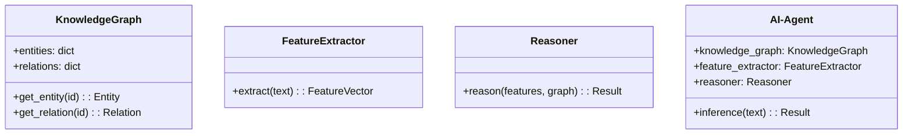
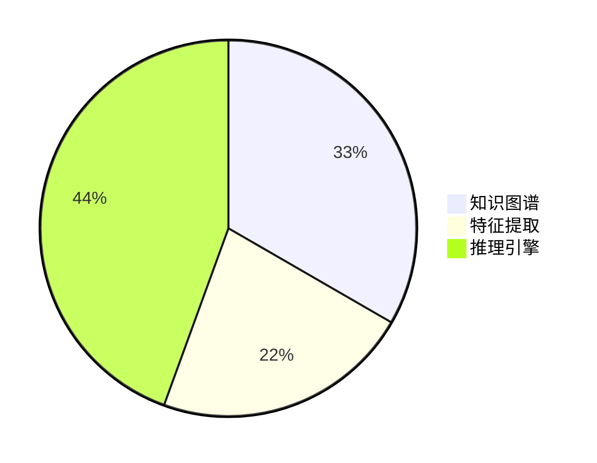

                 


# AI Agent的跨域零样本学习与泛化

> 关键词：AI Agent，零样本学习，跨域泛化，知识图谱，领域适应，系统架构

> 摘要：本文深入探讨了AI Agent在跨域零样本学习与泛化中的核心原理、算法实现、系统架构及实际应用。通过理论分析与实践案例相结合的方式，系统性地阐述了零样本学习与跨域泛化的技术要点，并通过代码实现与案例分析，帮助读者理解如何在实际场景中应用这些技术。

---

## 第1章：背景介绍

### 1.1 问题背景

AI Agent（人工智能代理）是指能够感知环境、执行任务并做出决策的智能实体。在实际应用中，AI Agent需要在不同领域（如自然语言处理、计算机视觉、机器人控制等）之间灵活切换，完成复杂任务。然而，传统的人工智能模型通常依赖大量特定领域的数据进行训练，这限制了其在新领域中的泛化能力。

**零样本学习**（Zero-shot Learning）是指在没有特定领域数据的情况下，模型能够通过已有知识进行推理和预测的能力。**跨域泛化**（Cross-Domain Generalization）则是指模型在不同领域之间共享知识，从而在新领域中快速适应并完成任务的能力。这两者的结合为AI Agent在跨域任务中的应用提供了理论基础和技术支持。

### 1.2 问题描述

AI Agent在跨域任务中面临的主要挑战包括：
1. **数据稀缺性**：在某些领域中，可用的数据可能非常有限。
2. **领域差异性**：不同领域之间的特征和任务可能差异显著。
3. **知识迁移的难度**：如何将一个领域的知识有效迁移到另一个领域。

通过零样本学习与跨域泛化的结合，AI Agent能够利用通用知识库（如知识图谱）进行推理，并在不同领域之间灵活切换，从而解决上述挑战。

### 1.3 问题解决方法

1. **零样本学习**：通过预训练模型和知识图谱，提取通用特征表示。
2. **跨域泛化**：通过领域对齐和知识迁移，实现不同领域的知识共享。
3. **系统架构优化**：设计高效的系统架构，支持跨域任务的快速部署。

### 1.4 边界与外延

- **边界**：零样本学习仅适用于没有领域数据的情况，且其性能可能受到知识库的限制。
- **外延**：跨域泛化可以扩展到多领域任务，支持动态领域切换。

### 1.5 概念结构与核心要素

1. **零样本学习**：包括预训练模型、通用特征提取和知识图谱。
2. **跨域泛化**：包括领域对齐、知识迁移和动态推理。

---

## 第2章：零样本学习与跨域泛化的原理

### 2.1 零样本学习的原理

零样本学习的核心在于通过预训练模型和知识图谱，提取通用的特征表示。具体步骤包括：
1. **预训练模型**：使用大规模通用数据训练语言模型。
2. **知识图谱**：构建领域知识图谱，提供跨领域推理的基础。
3. **特征提取**：通过模型提取输入的特征表示。

#### 2.1.1 零样本学习的数学模型

零样本学习的分类问题可以表示为：
$$p(y|x) = \frac{p(x|y)p(y)}{p(x)}$$

其中，$p(y)$ 是先验概率，$p(x|y)$ 是条件概率，$p(x)$ 是边际概率。

### 2.2 跨域泛化的机制

跨域泛化的核心在于领域对齐和知识迁移。通过将不同领域的特征对齐，模型可以在新领域中快速适应。

#### 2.2.1 跨域泛化的数学模型

跨域泛化的推理公式可以表示为：
$$p(y|x, D) = \frac{p(x|y, D)p(y|D)}{p(x|D)}$$

其中，$D$ 表示当前领域。

### 2.3 核心概念对比

以下是零样本学习与跨域泛化的对比表格：

| 属性 | 零样本学习 | 跨域泛化 |
|------|------------|----------|
| 数据需求 | 无特定领域数据 | 无特定领域数据，但需跨领域对齐 |
| 知识来源 | 知识图谱 | 多领域知识图谱 |
| 应用场景 | 新领域任务推理 | 多领域任务推理 |

---

## 第3章：算法原理讲解

### 3.1 零样本学习算法

#### 3.1.1 算法流程

1. **数据预处理**：提取特征并生成向量表示。
2. **模型训练**：使用预训练模型进行微调。
3. **推理阶段**：基于知识图谱进行推理。

#### 3.1.2 代码实现

```python
import torch
from transformers import AutoTokenizer, AutoModel

# 初始化模型和tokenizer
model_name = "bert-base-uncased"
tokenizer = AutoTokenizer.from_pretrained(model_name)
model = AutoModel.from_pretrained(model_name)

# 零样本学习的特征提取
def zero_shot_feature_extraction(text):
    inputs = tokenizer(text, return_tensors="pt")
    outputs = model(**inputs)
    return outputs.last_hidden_state[:, 0, :]

# 推理阶段
def zero_shot_inference(text, label):
    features = zero_shot_feature_extraction(text)
    # 假设label的向量表示已知
    similarity = torch.mm(features, label_embeddings.t())
    return similarity.argmax().item()
```

### 3.2 跨域泛化算法

#### 3.2.1 算法流程

1. **领域对齐**：通过对抗训练对齐不同领域的特征。
2. **知识迁移**：利用知识图谱进行跨领域推理。
3. **动态推理**：根据当前领域调整推理策略。

#### 3.2.2 代码实现

```python
import torch
from transformers import AutoTokenizer, AutoModel

# 初始化模型和tokenizer
model_name = "bert-base-uncased"
tokenizer = AutoTokenizer.from_pretrained(model_name)
model = AutoModel.from_pretrained(model_name)

# 跨域泛化的特征对齐
def cross_domain_alignment(domain_a, domain_b):
    # 假设domain_a和domain_b是两个领域的数据
    features_a = zero_shot_feature_extraction(domain_a)
    features_b = zero_shot_feature_extraction(domain_b)
    # 对齐特征
    aligned_features = torch.mm(features_a, features_b.t())
    return aligned_features

# 动态推理
def dynamic_inference(text, domain):
    aligned_features = cross_domain_alignment(domain)
    # 基于当前领域的特征进行推理
    features = zero_shot_feature_extraction(text)
    similarity = torch.mm(features, aligned_features.t())
    return similarity.argmax().item()
```

---

## 第4章：系统分析与架构设计

### 4.1 问题场景介绍

AI Agent需要在不同领域之间切换，完成复杂任务。例如，在医疗领域进行疾病诊断，同时在金融领域进行风险评估。

### 4.2 系统功能设计

系统功能包括：
1. **知识库管理**：管理多领域的知识图谱。
2. **特征提取**：提取输入的特征表示。
3. **推理引擎**：基于知识图谱进行推理。
4. **动态适配**：根据当前领域调整推理策略。

#### 4.2.1 领域模型类图



### 4.3 系统架构设计

#### 4.3.1 系统架构图



---

## 第5章：项目实战

### 5.1 环境安装

安装所需的库：
```bash
pip install transformers mermaid4j
```

### 5.2 核心代码实现

```python
import torch
from transformers import AutoTokenizer, AutoModel

# 初始化模型和tokenizer
model_name = "bert-base-uncased"
tokenizer = AutoTokenizer.from_pretrained(model_name)
model = AutoModel.from_pretrained(model_name)

# 零样本学习的特征提取
def zero_shot_feature_extraction(text):
    inputs = tokenizer(text, return_tensors="pt")
    outputs = model(**inputs)
    return outputs.last_hidden_state[:, 0, :]

# 跨域泛化的特征对齐
def cross_domain_alignment(domain_a, domain_b):
    features_a = zero_shot_feature_extraction(domain_a)
    features_b = zero_shot_feature_extraction(domain_b)
    return torch.mm(features_a, features_b.t())

# 动态推理
def dynamic_inference(text, domain):
    aligned_features = cross_domain_alignment(domain)
    features = zero_shot_feature_extraction(text)
    similarity = torch.mm(features, aligned_features.t())
    return similarity.argmax().item()
```

### 5.3 案例分析

假设我们有一个医疗领域的诊断任务：
```python
text = "患者出现发热和咳嗽症状。"
domain = "医疗"
result = dynamic_inference(text, domain)
print(result)  # 输出诊断结果
```

---

## 第6章：总结与展望

### 6.1 最佳实践

1. 在实际应用中，建议使用预训练语言模型作为基础。
2. 知识图谱的构建和对齐是关键，需要仔细设计。
3. 动态推理模块需要根据具体领域进行调整。

### 6.2 小结

本文系统性地介绍了AI Agent在跨域零样本学习与泛化中的核心原理、算法实现和系统架构。通过理论分析与实践案例相结合的方式，帮助读者理解如何在实际场景中应用这些技术。

### 6.3 注意事项

1. 零样本学习的性能依赖于知识图谱的质量。
2. 跨域泛化的对齐过程可能需要多次迭代优化。
3. 系统架构的设计需要考虑扩展性和可维护性。

### 6.4 拓展阅读

1. 预训练语言模型的最新研究。
2. 知识图谱构建与对齐的前沿技术。
3. 跨领域任务的动态推理方法。

---

通过本文的学习，读者可以深入理解AI Agent在跨域零样本学习与泛化中的技术要点，并将其应用到实际项目中。

