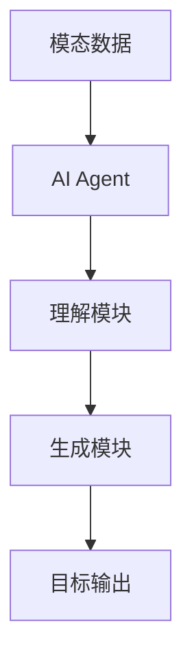
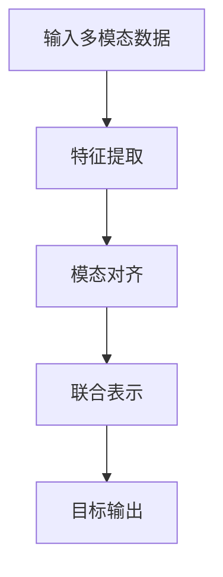
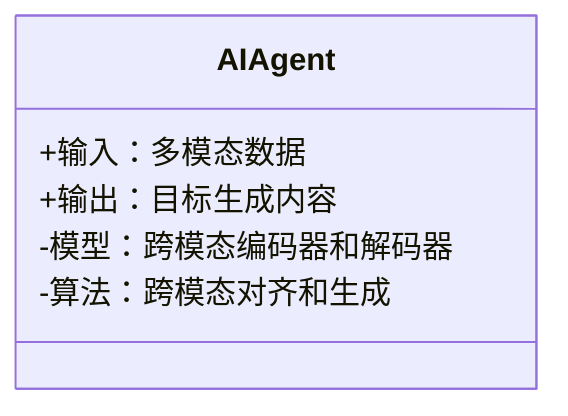
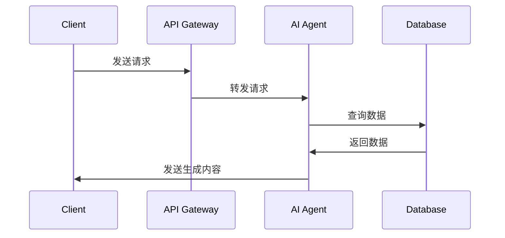

                 


# AI Agent的跨模态内容理解与生成系统

**关键词**：AI Agent、跨模态、内容理解、生成系统、多模态学习

**摘要**：本文探讨AI Agent在跨模态内容理解与生成系统中的应用，分析其核心算法、系统架构，并通过实际案例展示其在自然语言处理和计算机视觉领域的潜力。

---

## 第1章: AI Agent与跨模态内容理解概述

### 1.1 问题背景与描述

#### 1.1.1 当前AI Agent的发展现状

AI Agent（智能体）是能够感知环境、执行任务的智能系统，广泛应用于推荐系统、对话系统和自动驾驶等领域。然而，现有系统多依赖单一模态数据，难以处理复杂场景。

#### 1.1.2 跨模态内容理解的必要性

跨模态理解指AI Agent同时处理多种数据类型（如文本、图像）的能力。这种能力使AI Agent能更好地理解真实世界的复杂性，提升决策准确性。

#### 1.1.3 问题解决的思路与方法

通过深度学习模型整合多模态数据，构建统一的表示空间，实现跨模态理解和生成。关键步骤包括数据预处理、特征提取、模态对齐和协同优化。

#### 1.1.4 跨模态理解的边界与外延

跨模态理解的边界在于不同模态数据的转换与融合，外延则包括多领域应用和动态模态切换。

#### 1.1.5 跨模态理解的核心要素

- 多模态数据输入
- 模态对齐技术
- 统一表示空间

### 1.2 跨模态内容理解的核心概念

#### 1.2.1 跨模态数据的定义与特点

跨模态数据指不同类型数据的组合，如文本和图像。特点包括异构性、互补性和关联性。

#### 1.2.2 AI Agent在跨模态理解中的角色

AI Agent作为信息处理中枢，负责数据整合、理解与生成。其角色包括数据融合者、信息理解者和决策执行者。

#### 1.2.3 跨模态理解的边界与外延

跨模态理解的边界在于数据转换的准确性，外延涉及多任务学习和动态模态适应。

### 1.3 跨模态内容生成的原理与应用

#### 1.3.1 跨模态生成的基本原理

跨模态生成指根据部分模态数据生成其他模态内容，常用模型包括多模态Transformer和扩散模型。

#### 1.3.2 跨模态生成的应用场景

应用场景包括图像描述生成、视频字幕生成和跨语言翻译等。

#### 1.3.3 跨模态生成的挑战与解决方案

挑战包括跨模态对齐难度和生成结果可控性。解决方案包括多模态预训练和对抗训练。

### 1.4 本章小结

---

## 第2章: 跨模态内容理解的核心概念与联系

### 2.1 跨模态理解的核心概念

#### 2.1.1 多模态数据的整合与分析

整合多模态数据需解决数据异构性和语义差异问题。

#### 2.1.2 跨模态理解的数学模型

模型需具备跨模态对齐和联合表示能力，常用注意力机制和对比学习。

#### 2.1.3 跨模态理解的评价指标

包括准确性、相关性和一致性。

### 2.2 跨模态理解与生成的关系

#### 2.2.1 跨模态理解对生成的影响

理解深度影响生成质量，跨模态对齐提升生成连贯性。

#### 2.2.2 跨模态生成对理解的反哺作用

生成任务反馈提升理解模型鲁棒性。

#### 2.2.3 跨模态理解与生成的协同优化

联合优化实现最佳生成效果。

### 2.3 跨模态理解的ER实体关系图



### 2.4 本章小结

---

## 第3章: 跨模态内容理解的算法原理

### 3.1 跨模态编码器的原理

#### 3.1.1 多模态编码器的结构

编码器负责将多模态数据转换为统一表示，常用多模态Transformer架构。

#### 3.1.2 跨模态编码器的数学模型

$$ y = f(x_1, x_2, ..., x_n) $$
其中，\(x_i\)为输入模态数据，\(y\)为编码结果。

### 3.2 跨模态解码器的实现

#### 3.2.1 解码器的网络结构

解码器根据编码结果生成目标模态数据，采用自回归或自注意力机制。

#### 3.2.2 解码器的损失函数

$$ L = \sum_{i=1}^{N} (y_i - \hat{y}_i)^2 $$

### 3.3 跨模态理解的算法流程图



### 3.4 本章小结

---

## 第4章: 跨模态内容生成的系统架构设计

### 4.1 系统功能设计

#### 4.1.1 领域模型设计



#### 4.1.2 系统架构设计

```mermaid
graph LR
    Client --> API Gateway
    API Gateway --> AI Agent
    AI Agent --> Database
    Database --> Storage
```

#### 4.1.3 系统接口设计

- 输入接口：接收多模态数据
- 输出接口：返回生成内容
- 控制接口：管理模型参数

#### 4.1.4 系统交互序列图



### 4.2 本章小结

---

## 第5章: 跨模态内容生成的项目实战

### 5.1 项目环境安装

安装必要的库，如TensorFlow、PyTorch和Transformers。

### 5.2 核心代码实现

#### 5.2.1 数据预处理

```python
import numpy as np
import pandas as pd

def preprocess(data):
    # 数据预处理逻辑
    return processed_data
```

#### 5.2.2 模型训练

```python
def train_model(model, optimizer, loss_fn, train_loader):
    for epoch in range(num_epochs):
        for batch in train_loader:
            outputs = model(batch)
            loss = loss_fn(outputs, batch_labels)
            optimizer.zero_grad()
            loss.backward()
            optimizer.step()
    return model
```

#### 5.2.3 模型推理与生成

```python
def generate(model, input_data):
    with torch.no_grad():
        outputs = model(input_data)
    return outputs
```

### 5.3 代码应用解读与分析

解释代码功能，分析模型结构和训练过程。

### 5.4 实际案例分析

分析一个跨模态生成案例，如根据图像生成描述文本。

### 5.5 项目小结

总结项目实现过程，指出优化方向。

---

## 第6章: 总结与展望

### 6.1 最佳实践

- 数据质量：确保输入数据的多样性和相关性
- 模型选择：根据任务选择合适模型架构
- 优化策略：采用对抗训练和多任务学习提升性能

### 6.2 小结

跨模态内容理解与生成是AI Agent的重要能力，结合多模态数据提升系统智能性。

### 6.3 注意事项

- 数据隐私：保护用户数据安全
- 模型鲁棒性：确保生成内容的真实性
- 可解释性：提升模型决策的透明度

### 6.4 拓展阅读

推荐相关书籍和论文，供进一步学习。

---

通过以上结构，您可以撰写一篇详细的技术博客文章，涵盖AI Agent的跨模态内容理解与生成系统的各个方面。希望这对您有所帮助！

