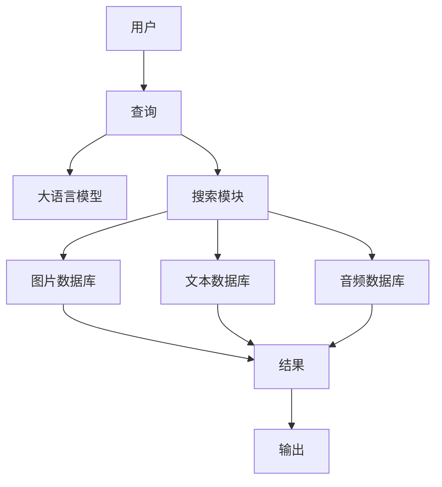
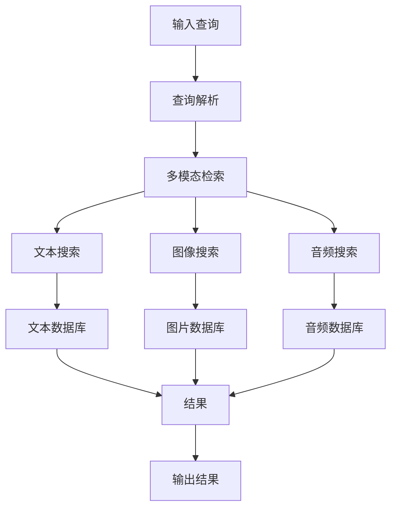
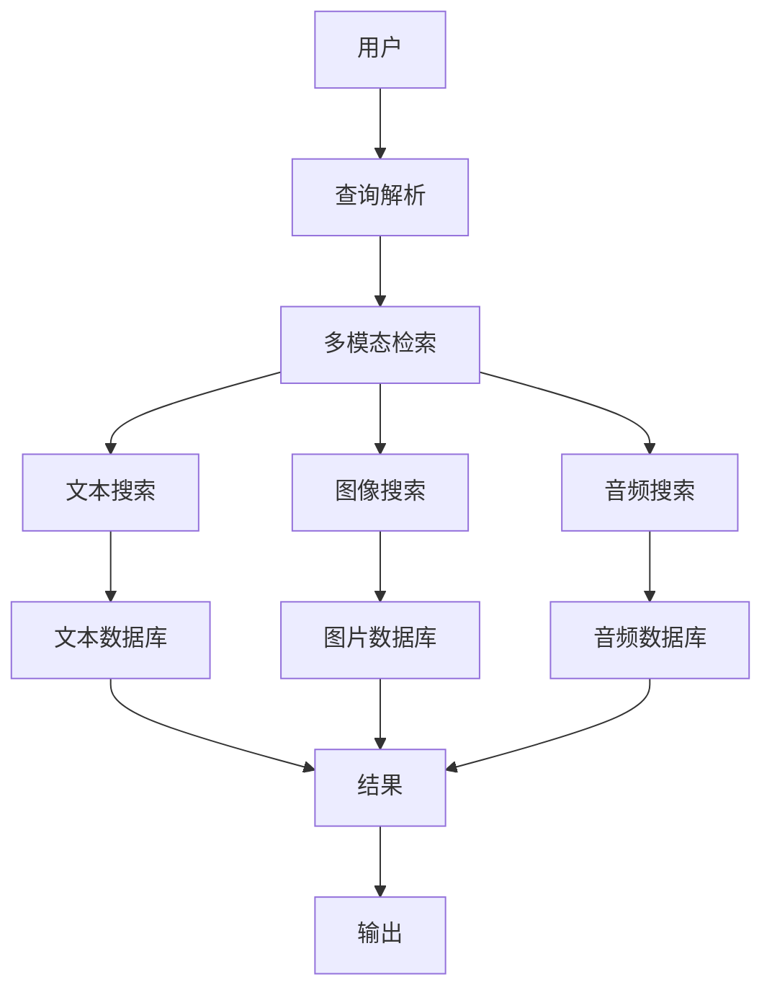
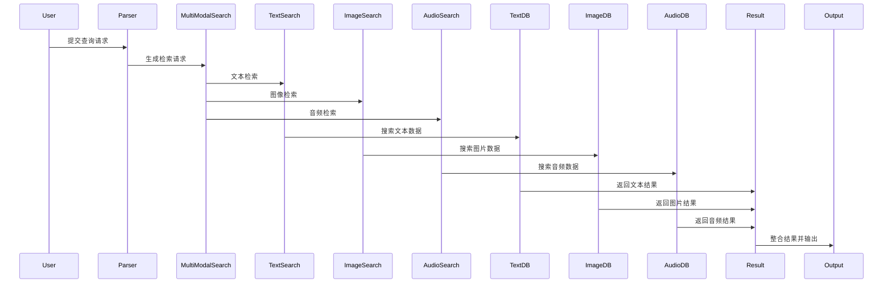

                 


# AI Agent的跨模态检索：整合LLM与多媒体搜索

> 关键词：AI Agent，跨模态检索，LLM，多媒体搜索，多模态数据，系统架构，算法原理

> 摘要：本文探讨AI Agent在跨模态检索中的应用，整合大语言模型（LLM）与多媒体搜索技术，分析其核心原理、算法实现和系统架构，通过实际案例展示跨模态检索的应用场景和未来发展方向。

---

## 第一部分：AI Agent与跨模态检索的背景

### 第1章：AI Agent的基本概念

#### 1.1 AI Agent的定义与特点
- **AI Agent**：智能体，能够感知环境并执行任务，具备自主决策和学习能力。
- **特点**：
  - 智能性：能理解并处理复杂任务。
  - 自主性：无需外部干预，自主完成任务。
  - 交互性：与用户或其他系统进行有效交互。
  - 可扩展性：支持多种任务和数据类型的处理。

#### 1.2 跨模态检索的定义与特点
- **定义**：在多种数据类型之间进行信息检索的技术。
- **特点**：
  - 多样性：支持文本、图像、音频等多种数据类型。
  - 融合性：整合不同模态的信息，提升检索精度。
  - 实时性：快速响应用户查询。

#### 1.3 LLM与多媒体搜索的整合
- **LLM**：大语言模型，具备强大的文本理解和生成能力。
- **多媒体搜索**：基于图像、音频等非文本数据的检索技术。
- **整合方式**：
  - 利用LLM增强多媒体检索的语义理解能力。
  - 结合多媒体数据丰富LLM的输出结果。

---

### 第2章：AI Agent与跨模态检索的核心概念

#### 2.1 跨模态检索的核心原理
- **多模态数据表示**：将不同模态的数据转换为统一的表示形式。
- **LLM的作用**：通过语言模型处理文本信息，辅助多媒体数据的检索。
- **检索流程**：
  1. 用户输入查询。
  2. 系统解析查询意图。
  3. 跨模态检索引擎执行搜索。
  4. 返回多模态结果。

#### 2.2 跨模态数据的实体关系图


#### 2.3 跨模态检索的架构设计


---

### 第3章：跨模态检索的算法原理

#### 3.1 多模态融合算法
- **融合方式**：
  - **特征融合**：将不同模态的特征向量进行线性组合。
  - **注意力机制**：根据查询意图，关注相关模态的信息。
- **数学模型**：
  - 特征融合公式：
    $$ f_{\text{融合}}(x) = \alpha x_{\text{文本}} + (1-\alpha) x_{\text{图像}} $$
  - 注意力机制公式：
    $$ \alpha = \frac{e^{q \cdot w}}{\sum e^{q \cdot w}} $$

#### 3.2 LLM的调优方法
- **微调**：在特定数据集上对LLM进行微调，提升任务相关性。
- **提示工程**：设计有效的提示词，引导模型生成符合要求的输出。
- **多模态输入**：将图像或其他模态数据转化为文本描述，作为LLM的输入。

#### 3.3 跨模态检索的评估指标
- **准确率**：检索结果与查询意图的匹配程度。
- **召回率**：检索结果中相关项的比例。
- **F1分数**：综合准确率和召回率的评估指标。

---

### 第4章：跨模态检索系统的分析与设计

#### 4.1 系统功能模块
- **查询解析模块**：解析用户输入，生成检索请求。
- **多模态检索模块**：执行跨模态数据检索。
- **结果整合模块**：将多模态结果整合为统一输出。

#### 4.2 系统架构设计


#### 4.3 系统交互流程


---

### 第5章：跨模态检索的项目实战

#### 5.1 开发环境搭建
- **工具与库**：
  - Python 3.8+
  - Hugging Face Transformers
  - PyTorch
  - Elasticsearch

#### 5.2 核心代码实现
```python
from transformers import AutoTokenizer, AutoModel
import torch

class MultiModalRetriever:
    def __init__(self, model_name='sentence-transformers/all-mpnet-base-v2'):
        self.tokenizer = AutoTokenizer.from_pretrained(model_name)
        self.model = AutoModel.from_pretrained(model_name)
        
    def encode_text(self, text):
        inputs = self.tokenizer(text, return_tensors='pt', padding=True, truncation=True)
        outputs = self.model(**inputs)
        return outputs.last_hidden_state[:, 0, :].detach().numpy()

    def search(self, query, texts, k=3):
        query_embeddings = self.encode_text(query)
        text_embeddings = [self.encode_text(text) for text in texts]
        # 计算余弦相似度
        similarities = []
        for text_emb in text_embeddings:
            sim = np.dot(query_embeddings, text_emb.T)
            sim = sim / (np.linalg.norm(query_embeddings) * np.linalg.norm(text_emb))
            similarities.append(sim[0][0])
        # 排序并返回前k个结果
        indices = sorted(range(len(similarities)), key=lambda i: -similarities[i])
        return [(texts[i], similarities[i]) for i in indices[:k]]
```

#### 5.3 实际案例分析
- **案例背景**：用户搜索“如何训练一只猫”。
- **系统处理**：
  - 文本检索：找到相关文章和教程。
  - 图像检索：提供猫的训练图片。
  - 音频检索：提供训练声音片段。
- **结果整合**：将文本、图像和音频结果整合，输出多模态的搜索结果。

---

### 第6章：跨模态检索的总结与展望

#### 6.1 最佳实践
- **数据预处理**：对多模态数据进行清洗和标注，提升检索精度。
- **模型调优**：根据具体任务调整LLM和检索算法的参数。
- **系统优化**：优化系统架构，提升检索速度和响应时间。

#### 6.2 小结
- AI Agent通过整合LLM和多媒体搜索，实现了跨模态信息的高效检索。
- 跨模态检索技术在实际应用中展现了巨大的潜力，未来将更加智能化和多样化。

#### 6.3 注意事项
- 数据隐私：确保用户数据的安全和隐私。
- 模型泛化能力：避免过拟合特定数据集，提升模型的泛化能力。

#### 6.4 拓展阅读
- 探索更多跨模态检索的应用场景，如医疗、教育、娱乐等领域。
- 关注最新的研究成果，了解跨模态检索的前沿技术。

---

通过以上分析，我们详细探讨了AI Agent在跨模态检索中的应用，从基础概念到系统实现，再到实际案例分析，为读者提供了一个全面且深入的技术视角。未来，随着技术的不断发展，跨模态检索将展现出更多可能性，为AI Agent的应用开辟更广阔的天地。

