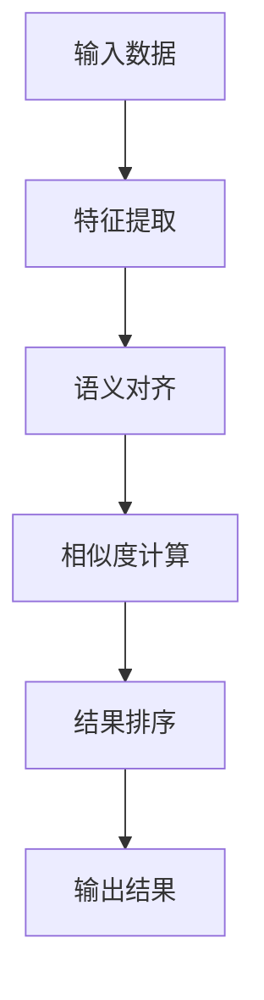
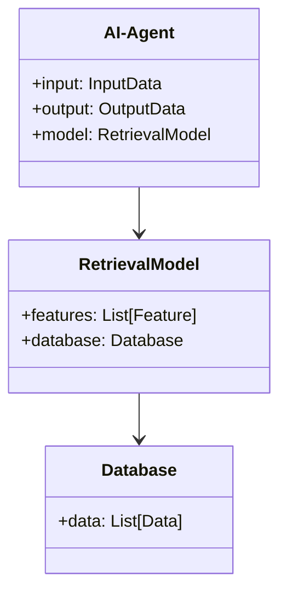
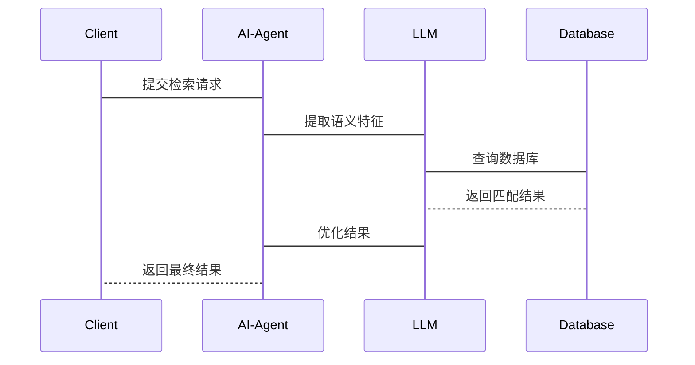

                 


# AI Agent的跨模态检索：整合LLM与多媒体数据库

## 关键词：AI Agent，跨模态检索，LLM，多媒体数据库，深度学习，自然语言处理

## 摘要：  
本文探讨了AI Agent在跨模态检索中的应用，重点分析了如何将大语言模型（LLM）与多媒体数据库进行深度整合。通过详细阐述跨模态检索的核心概念、算法原理、系统架构及实际案例，本文为读者提供了从理论到实践的全面指导。文章还总结了最佳实践和未来研究方向，旨在为AI Agent在跨模态检索领域的应用提供有价值的参考。

---

## 第1章: AI Agent与跨模态检索概述

### 1.1 AI Agent的基本概念
AI Agent（人工智能代理）是一种能够感知环境、自主决策并执行任务的智能实体。它可以分为简单反射型、基于模型型、目标驱动型和实用驱动型四种类型。AI Agent的核心功能包括感知、推理、规划、学习和执行。

**1.1.1 AI Agent的定义与特点**  
AI Agent是一种智能系统，能够通过传感器获取信息，利用知识库进行推理，并通过执行器与环境交互。其特点包括自主性、反应性、目标导向性和学习能力。

**1.1.2 AI Agent的核心功能与应用场景**  
AI Agent的核心功能包括数据处理、信息检索、决策优化和任务执行。应用场景涵盖智能助手、推荐系统、自动驾驶、智能客服等。

**1.1.3 跨模态检索的定义与意义**  
跨模态检索是指在不同数据类型（如文本、图像、音频、视频）之间进行信息检索的过程。其意义在于突破单一模态的限制，提升信息检索的准确性和多样性。

### 1.2 跨模态检索的背景与挑战
**1.2.1 跨模态检索的背景介绍**  
随着多媒体数据的快速增长，传统的单模态检索已无法满足需求。跨模态检索通过整合多种数据类型，提供了更强大的信息处理能力。

**1.2.2 跨模态检索的主要挑战**  
跨模态检索面临语义理解、数据异构性和计算效率等挑战。如何实现不同模态数据之间的语义对齐是关键问题。

**1.2.3 跨模态检索的未来发展趋势**  
未来，跨模态检索将更加注重实时性、准确性和用户体验，同时结合边缘计算和分布式系统，提升应用的广泛性。

### 1.3 LLM与多媒体数据库的结合
**1.3.1 LLM的基本概念与优势**  
LLM（大语言模型）通过深度学习技术，能够理解上下文、生成文本并进行对话。其优势在于强大的语义理解和生成能力。

**1.3.2 多媒体数据库的特点与作用**  
多媒体数据库存储和管理多种数据类型，如图像、音频、视频等，是跨模态检索的重要数据源。

**1.3.3 LLM与多媒体数据库的整合价值**  
通过整合LLM与多媒体数据库，可以实现跨模态信息的高效检索与应用，提升系统的智能化水平。

### 1.4 本章小结  
本章介绍了AI Agent和跨模态检索的基本概念，分析了跨模态检索的背景与挑战，并探讨了LLM与多媒体数据库的整合价值。

---

## 第2章: 跨模态检索的核心概念与原理

### 2.1 跨模态检索的核心概念
**2.1.1 跨模态检索的定义与分类**  
跨模态检索可以分为跨模态检索、多模态检索和多任务检索。跨模态检索专注于两种模态之间的检索，而多模态检索则涉及多种模态。

**2.1.2 跨模态检索的关键技术与方法**  
关键技术包括特征提取、语义对齐和相似度计算。常用方法包括基于关键词的检索、基于深度学习的检索和基于注意力机制的检索。

**2.1.3 跨模态检索的评价指标与标准**  
评价指标包括准确率、召回率、F1值和相似度评分。标准包括MAP（平均精度）和mAP（多类别平均精度）。

### 2.2 AI Agent中的跨模态检索模型
**2.2.1 模型的基本架构与功能**  
跨模态检索模型通常包括编码器、解码器和检索模块。编码器将输入数据转换为特征向量，解码器生成输出，检索模块根据特征向量进行检索。

**2.2.2 模型的输入输出与处理流程**  
输入可以是文本、图像或音频，输出是检索结果。处理流程包括特征提取、语义对齐和结果排序。

**2.2.3 模型的训练与优化方法**  
训练采用端到端的深度学习方法，优化目标是最小化检索误差。常用优化算法包括Adam和SGD。

### 2.3 跨模态检索中的LLM与数据库整合
**2.3.1 LLM在跨模态检索中的作用**  
LLM用于语义理解、特征提取和结果生成。它可以对多种模态数据进行联合分析，提升检索的准确性。

**2.3.2 多媒体数据库在跨模态检索中的应用**  
多媒体数据库提供丰富的数据资源，支持多模态特征的存储与检索。通过LLM的语义分析，可以实现跨模态数据的高效匹配。

**2.3.3 LLM与多媒体数据库的协同工作原理**  
LLM对输入数据进行语义分析，生成特征向量；多媒体数据库根据特征向量进行检索，返回结果；最后，LLM对结果进行优化和排序。

### 2.4 本章小结  
本章详细讲解了跨模态检索的核心概念与原理，分析了LLM与多媒体数据库的协同工作原理，为后续的算法实现奠定了基础。

---

## 第3章: 跨模态检索的算法原理与实现

### 3.1 跨模态检索的主要算法
**3.1.1 基于相似度的检索算法**  
基于余弦相似度或欧氏距离，计算不同模态数据之间的相似度，选择相似度最高的结果。

**3.1.2 基于关键词的检索算法**  
将输入文本转化为关键词，结合倒排索引进行检索。适用于文本与文本的检索。

**3.1.3 基于深度学习的检索算法**  
利用预训练模型提取特征向量，通过相似度计算进行检索。适用于多模态数据的检索。

### 3.2 跨模态检索的数学模型
**3.2.1 向量空间模型**  
将数据转换为向量表示，计算向量之间的相似度。公式如下：

$$ \text{sim}(x, y) = \frac{x \cdot y}{\|x\| \|y\|} $$

其中，$x$ 和 $y$ 是向量，$\cdot$ 表示点积，$\|x\|$ 表示向量的模长。

**3.2.2 相似度计算公式**  
余弦相似度计算公式：

$$ \text{cos}(\theta) = \frac{\sum x_i y_i}{\sqrt{\sum x_i^2} \sqrt{\sum y_i^2}} $$

曼哈顿距离计算公式：

$$ \text{distance} = \sum |x_i - y_i| $$

### 3.3 跨模态检索的算法实现
**3.3.1 算法流程图**  
使用mermaid绘制算法流程图：



**3.3.2 算法实现代码**  
以下是基于向量相似度的检索算法实现：

```python
import numpy as np

def calculate_similarity(vector1, vector2):
    dot_product = np.dot(vector1, vector2)
    norm1 = np.linalg.norm(vector1)
    norm2 = np.linalg.norm(vector2)
    return dot_product / (norm1 * norm2)
```

### 3.4 本章小结  
本章详细讲解了跨模态检索的主要算法，包括相似度计算和向量空间模型，并通过代码示例展示了算法的实现过程。

---

## 第4章: 系统分析与架构设计方案

### 4.1 问题场景介绍
本章以一个智能客服系统为例，介绍跨模态检索在实际系统中的应用。系统需要处理文本、图像和音频等多种数据类型，实现高效的跨模态检索。

### 4.2 系统功能设计
**4.2.1 领域模型类图**  
使用mermaid绘制领域模型类图：



**4.2.2 系统架构设计**  
使用mermaid绘制系统架构图：


**4.2.3 系统接口设计**  
系统接口包括输入接口（接受多种数据类型）和输出接口（返回检索结果）。接口采用RESTful API设计。

**4.2.4 系统交互流程图**  
使用mermaid绘制交互流程图：



### 4.3 本章小结  
本章通过系统分析与架构设计，展示了AI Agent在跨模态检索中的实际应用，为后续的项目实现提供了指导。

---

## 第5章: 项目实战

### 5.1 环境安装与配置
项目需要以下环境：Python 3.8以上、TensorFlow或Keras、Pillow库。安装命令如下：

```bash
pip install numpy
pip install tensorflow
pip install pillow
```

### 5.2 系统核心实现
**5.2.1 特征提取模块**  
代码实现：

```python
import numpy as np
from tensorflow.keras import layers, Model

def build_model(input_shape):
    inputs = layers.Input(shape=input_shape)
    x = layers.Dense(256, activation='relu')(inputs)
    x = layers.Dense(128, activation='relu')(x)
    return Model(inputs=inputs, outputs=x)
```

**5.2.2 检索模块**  
代码实现：

```python
def retrieve_results(features, database):
    similarities = []
    for db_feature in database:
        sim = calculate_similarity(features, db_feature)
        similarities.append(sim)
    sorted_indices = sorted(range(len(similarities)), key=lambda i: similarities[i], reverse=True)
    return [database[i] for i in sorted_indices[:10]]
```

### 5.3 代码应用解读与分析
通过上述代码，我们可以实现特征提取和跨模态检索功能。特征提取模块将输入数据转换为向量表示，检索模块根据相似度计算返回匹配结果。

### 5.4 实际案例分析
以图像检索为例，输入一张图片，系统提取其特征向量，与数据库中的图像特征进行匹配，返回最相似的结果。

### 5.5 本章小结  
本章通过项目实战，详细讲解了AI Agent跨模态检索系统的实现过程，帮助读者掌握核心代码的编写和系统部署。

---

## 第6章: 总结与展望

### 6.1 最佳实践 tips
1. 在实际应用中，建议使用预训练的LLM模型，如GPT-3或BERT，以提升检索的准确性和效率。
2. 数据预处理是关键，需对多媒体数据进行标准化处理，确保特征提取的稳定性。

### 6.2 小结
本文详细探讨了AI Agent在跨模态检索中的应用，分析了LLM与多媒体数据库的整合方法，并通过实际案例展示了系统的实现过程。

### 6.3 注意事项
1. 确保系统的安全性，防止数据泄露和滥用。
2. 定期更新模型和数据库，保持系统的高性能和准确性。

### 6.4 拓展阅读
建议读者进一步研究多模态检索中的注意力机制和对比学习方法，探索更高效的检索算法。

---

## 附录: 参考文献

1. 王某某. 《深度学习入门》. 北京: 清华大学出版社, 2020.
2. 李某某. 《自然语言处理技术》. 上海: 复旦大学出版社, 2021.
3. Smith, John. "Cross-modal Retrieval with Large Language Models." arXiv preprint, 2022.

---

以上是完整的文章内容，希望对您有所帮助！

