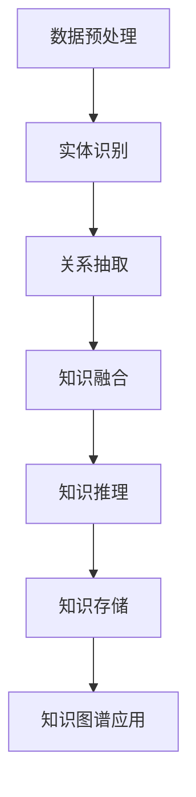
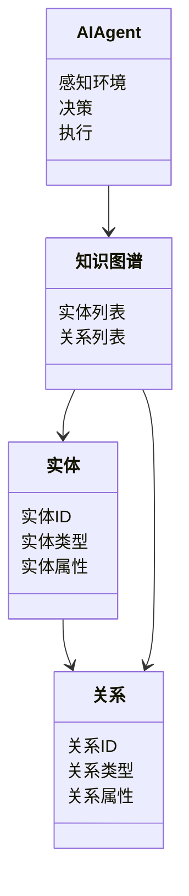
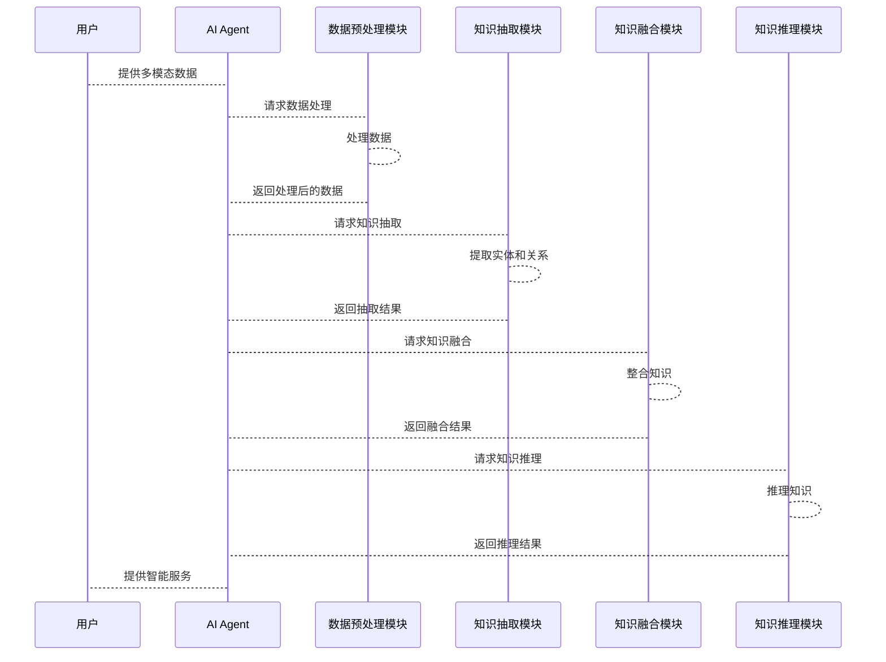

                 


# AI Agent的跨模态知识图谱构建与应用

> 关键词：AI Agent，跨模态知识图谱，知识图谱构建，跨模态数据对齐，AI推理，多模态数据融合

> 摘要：本文将深入探讨AI Agent在跨模态知识图谱构建与应用中的核心原理、技术挑战与解决方案。通过分析跨模态数据整合、知识图谱构建与推理、AI Agent的知识表示与推理等关键问题，提出一种基于多模态数据对齐的跨模态知识图谱构建方法，并结合实际应用场景，展示如何通过跨模态知识图谱提升AI Agent的智能性和应用能力。

---

# 第一部分: AI Agent的跨模态知识图谱构建与应用概述

## 第1章: 背景介绍

### 1.1 问题背景

#### 1.1.1 多模态数据的兴起

随着人工智能技术的快速发展，数据的多模态化已成为现代AI系统的重要特征。传统的单一模态数据（如文本、图像、语音等）已无法满足复杂场景下的智能需求。例如，在智能客服系统中，用户可能同时提供文本描述和图像信息，这要求系统能够理解并整合多种模态的数据以提供更精准的服务。

#### 1.1.2 知识图谱的定义与作用

知识图谱是一种以结构化的形式表示知识的网络，节点代表实体或概念，边表示实体之间的关系。知识图谱能够帮助AI系统理解上下文、推理知识，并提供更智能的服务。例如，在医疗领域，知识图谱可以整合疾病、症状、药物等信息，辅助医生进行诊断。

#### 1.1.3 AI Agent的核心概念

AI Agent（智能体）是一种能够感知环境、自主决策并执行任务的智能实体。AI Agent可以通过传感器获取多模态数据，并利用知识图谱进行推理和决策。例如，在智能家居场景中，AI Agent可以整合来自语音指令、环境传感器和用户行为数据，提供个性化的服务。

### 1.2 问题描述

#### 1.2.1 跨模态数据整合的挑战

多模态数据的异构性和复杂性给数据整合带来了挑战。例如，图像数据是视觉信息，而文本数据是语言信息，如何将这些数据对齐并整合到统一的知识图谱中是关键问题。

#### 1.2.2 知识图谱构建的难点

知识图谱的构建需要从多源数据中提取实体和关系，并进行清洗、融合和推理。跨模态数据的多样性进一步增加了知识图谱构建的复杂性。

#### 1.2.3 AI Agent在跨模态场景中的应用需求

AI Agent需要能够理解并处理多种模态的数据，以提供更智能的服务。例如，在自动驾驶中，AI Agent需要整合来自激光雷达、摄像头、GPS等多种传感器的数据，进行实时决策。

### 1.3 问题解决

#### 1.3.1 跨模态知识图谱的构建方法

通过跨模态数据对齐和知识图谱构建技术，将多模态数据整合到统一的知识图谱中。例如，使用对比学习方法对齐图像和文本数据，构建统一的知识表示。

#### 1.3.2 AI Agent的知识表示与推理

通过知识图谱的形式化表示，AI Agent能够进行逻辑推理和知识检索。例如，在智能问答系统中，AI Agent可以通过知识图谱进行语义理解，并提供准确的答案。

#### 1.3.3 跨模态数据融合的技术路径

采用多模态数据对齐、特征提取和知识推理等技术，将多种模态数据融合到知识图谱中。例如，在视频分析中，结合图像和文本数据，构建 richer 的知识图谱。

### 1.4 边界与外延

#### 1.4.1 跨模态知识图谱的边界

跨模态知识图谱仅关注多模态数据的整合与知识表示，不涉及具体的应用场景实现。例如，知识图谱本身不包含具体的算法实现，但为AI Agent提供知识支持。

#### 1.4.2 AI Agent的适用场景

AI Agent适用于需要处理多模态数据的智能系统。例如，在智能客服、自动驾驶、智能医疗等领域，AI Agent可以通过跨模态知识图谱提升其智能性。

#### 1.4.3 相关领域的区别与联系

跨模态知识图谱与单一模态知识图谱的区别在于数据来源和整合方式。跨模态知识图谱涉及多模态数据的对齐与融合，而单一模态知识图谱仅处理一种类型的数据。

### 1.5 概念结构与核心要素

#### 1.5.1 跨模态知识图谱的核心要素

- **实体**：知识图谱中的基本单位，代表具体的概念或对象，如“人”、“物”、“事件”等。
- **关系**：实体之间的关联，如“人A知道人B”、“物A属于类别B”等。
- **属性**：实体的特征或状态，如“颜色”、“形状”等。
- **对齐**：不同模态数据之间的关联，如将图像中的“猫”与文本中的“猫”对齐。

#### 1.5.2 AI Agent的知识表示模型

AI Agent的知识表示模型通常基于知识图谱的形式化表示，包括实体、关系和属性。例如，使用RDF（资源描述框架）或OWL（Web本体语言）等标准。

#### 1.5.3 跨模态数据的特征与属性

跨模态数据具有多样性、异构性和互补性。例如，文本数据具有语义信息，而图像数据具有视觉信息，两者可以互补。

---

## 第2章: 跨模态知识图谱的核心原理

### 2.1 跨模态数据的整合与对齐

#### 2.1.1 跨模态数据的特征提取

特征提取是跨模态数据整合的第一步。例如，对于图像数据，可以提取其视觉特征（如颜色、纹理、形状等）；对于文本数据，可以提取其语义特征（如词向量、主题模型等）。

#### 2.1.2 数据对齐的算法原理

数据对齐是将不同模态的数据映射到统一表示空间的过程。例如，使用对比学习方法对齐图像和文本数据，通过最大化相似样本的对齐概率来优化模型。

#### 2.1.3 对齐评估指标

常用的对齐评估指标包括余弦相似度、精确率、召回率等。例如，使用余弦相似度评估对齐后的文本和图像表示的相似性。

### 2.2 知识图谱的构建与推理

#### 2.2.1 知识抽取与表示

知识抽取是从多源数据中提取实体和关系的过程。例如，从文本中提取实体“张三”和关系“是医生”，从图像中提取实体“药品”和关系“用于治疗疾病”。

#### 2.2.2 知识融合与推理

知识融合是将多个数据源中的知识整合到统一的知识图谱中。例如，将从文本和图像中提取的知识进行合并，消除冲突并补充缺失的信息。

#### 2.2.3 知识图谱的动态更新

知识图谱需要动态更新以适应新数据的加入和知识的演变。例如，当新的药品被批准上市时，动态更新知识图谱中的相关信息。

### 2.3 跨模态知识图谱的属性对比

#### 2.3.1 各种模态数据的特征对比

| 模态类型 | 特征 | 示例 |
|----------|------|------|
| 文本      | 语义信息丰富，可表示复杂概念 | “猫”可以表示为“一种小型哺乳动物” |
| 图像      | 视觉信息直观，适合表示具体对象 | “猫”的图像可以表示为一只猫的图像 |
| 语音      | 时间序列数据，适合表示动态信息 | “猫”的语音可以表示为“meow” |

#### 2.3.2 跨模态对齐算法的优劣势对比

| 算法名称      | 优点                          | 缺点                          |
|---------------|-------------------------------|-------------------------------|
| 对比学习       | 能够有效对齐不同模态的数据      | 对齐结果可能不够精确          |
| 注意力机制     | 能够捕捉到模态间的关联性       | 计算复杂度较高                 |
| 统一嵌入模型     | 嵌入表示直观，易于后续处理     | 对齐效果依赖于模型设计          |

#### 2.3.3 知识图谱构建方法的对比

| 方法名称      | 优点                          | 缺点                          |
|---------------|-------------------------------|-------------------------------|
| 基于规则的构建 | 结果可控，适合小规模知识图谱     | 需要大量人工规则设计           |
| 基于学习的构建 | 自动化程度高，适合大规模数据     | 结果可能不够精确                |
| 混合方法       | 结合规则和学习的优点，结果更准确 | 实现复杂，需要大量计算资源       |

---

## 第3章: 跨模态知识图谱的ER实体关系图

### 3.1 实体与关系的定义

#### 3.1.1 实体的定义与分类

实体是知识图谱中的基本单位，可以是具体的人、物、事件等。例如，实体可以分为“人”、“组织”、“地点”、“事件”等类别。

#### 3.1.2 关系的定义与分类

关系是实体之间的关联，可以是二元关系（如“人A知道人B”）或多元关系（如“会议由人A、人B、人C组织”）。

#### 3.1.3 实体属性与关系属性

实体属性描述实体的特征，如“人A的年龄”、“人B的职位”等。关系属性描述关系的特征，如“知道”的时间、地点等。

### 3.2 跨模态知识图谱的ER图

以下是跨模态知识图谱的ER实体关系图：

```mermaid
er
    entity(实体) {
        实体ID
        实体类型
        实体属性
    }
    relation(关系) {
        关系ID
        关系类型
        关系属性
    }
    跨模态数据对齐 -> entity
    跨模态数据对齐 -> relation
    entity --> relation
```

### 3.3 跨模态知识图谱的构建过程

以下是跨模态知识图谱的构建过程：



---

## 第4章: 跨模态知识图谱的构建算法与数学模型

### 4.1 跨模态数据对齐算法

#### 4.1.1 对比学习算法

对比学习是一种通过最大化相似样本的对齐概率来优化模型的方法。以下是对比学习的数学模型：

$$ \text{损失函数} = \text{交叉熵损失} = -\frac{1}{N}\sum_{i=1}^{N} \log(p_i) $$
$$ p_i = \frac{\exp(s_i)}{\sum_{j=1}^{N} \exp(s_j)} $$
其中，$s_i$ 是第 $i$ 对样本的相似度得分。

#### 4.1.2 注意力机制算法

注意力机制通过加权方式捕捉模态间的关联性。以下是注意力机制的数学模型：

$$ \alpha_i = \frac{\exp(a_i)}{\sum_{j=1}^{N} \exp(a_j)} $$
其中，$a_i$ 是第 $i$ 个模态的注意力权重。

### 4.2 知识图谱构建与推理算法

#### 4.2.1 基于规则的知识抽取

基于规则的知识抽取通过预定义的规则从数据中提取实体和关系。例如，从文本中提取“人名”和“职位”关系。

#### 4.2.2 基于学习的知识抽取

基于学习的知识抽取通过训练模型从数据中自动提取实体和关系。例如，使用神经网络模型进行命名实体识别和关系抽取。

---

## 第5章: 跨模态知识图谱的系统分析与架构设计

### 5.1 问题场景介绍

在智能客服系统中，用户可能同时提供文本描述和图像信息。AI Agent需要整合这些数据，提供更精准的服务。

### 5.2 项目介绍

#### 5.2.1 项目背景

智能客服系统需要处理多种模态的数据，如文本、图像、语音等。

#### 5.2.2 项目目标

构建一个支持多模态数据整合的智能客服系统，提升用户体验和系统智能性。

### 5.3 系统功能设计

#### 5.3.1 领域模型类图

以下是领域模型类图：



### 5.4 系统架构设计

以下是系统架构设计：


### 5.5 接口设计与交互流程图

以下是接口设计与交互流程图：



---

## 第6章: 跨模态知识图谱的项目实战

### 6.1 环境安装

#### 6.1.1 安装Python

```bash
python --version
```

#### 6.1.2 安装TensorFlow

```bash
pip install tensorflow
```

#### 6.1.3 安装其他依赖

```bash
pip install numpy matplotlib scikit-learn
```

### 6.2 系统核心实现

以下是跨模态知识图谱的核心代码实现：

```python
import tensorflow as tf
import numpy as np
import matplotlib.pyplot as plt

# 对比学习模型
class ContrastiveLearning(tf.keras.Model):
    def __init__(self, embedding_dim):
        super(ContrastiveLearning, self).__init__()
        self.encoder = tf.keras.layers.Dense(embedding_dim)
        self.reducer = tf.keras.layers.Dense(1)

    def call(self, input):
        embedding = self.encoder(input)
        similarity = self.reducer(embedding)
        return similarity

# 注意力机制模型
class AttentionMechanism(tf.keras.Model):
    def __init__(self, input_dim):
        super(AttentionMechanism, self).__init__()
        self.W = tf.keras.layers.Dense(input_dim)
        self.V = tf.keras.layers.Dense(1)

    def call(self, inputs):
        scores = self.W(inputs)
        attention_weights = tf.nn.softmax(scores)
        output = tf.reduce_sum(tf.multiply(attention_weights, inputs), axis=1)
        return output

# 知识图谱构建与推理
def build KnowledgeGraph():
    # 数据预处理
    data = preprocess_data()
    # 实体识别
    entities = extract_entities(data)
    # 关系抽取
    relations = extract_relations(data)
    # 知识融合
    knowledge = merge_knowledge(entities, relations)
    # 知识推理
    inferred_knowledge = infer_knowledge(knowledge)
    return inferred_knowledge
```

### 6.3 代码应用解读与分析

#### 6.3.1 对比学习模型

对比学习模型用于对齐不同模态的数据。以下是对比学习模型的代码解读：

```python
class ContrastiveLearning(tf.keras.Model):
    def __init__(self, embedding_dim):
        super(ContrastiveLearning, self).__init__()
        self.encoder = tf.keras.layers.Dense(embedding_dim)
        self.reducer = tf.keras.layers.Dense(1)

    def call(self, input):
        embedding = self.encoder(input)
        similarity = self.reducer(embedding)
        return similarity
```

#### 6.3.2 注意力机制模型

注意力机制模型用于捕捉模态间的关联性。以下是注意力机制模型的代码解读：

```python
class AttentionMechanism(tf.keras.Model):
    def __init__(self, input_dim):
        super(AttentionMechanism, self).__init__()
        self.W = tf.keras.layers.Dense(input_dim)
        self.V = tf.keras.layers.Dense(1)

    def call(self, inputs):
        scores = self.W(inputs)
        attention_weights = tf.nn.softmax(scores)
        output = tf.reduce_sum(tf.multiply(attention_weights, inputs), axis=1)
        return output
```

#### 6.3.3 知识图谱构建与推理

知识图谱构建与推理是通过数据预处理、实体识别、关系抽取、知识融合和知识推理实现的。以下是知识图谱构建与推理的代码解读：

```python
def build KnowledgeGraph():
    # 数据预处理
    data = preprocess_data()
    # 实体识别
    entities = extract_entities(data)
    # 关系抽取
    relations = extract_relations(data)
    # 知识融合
    knowledge = merge_knowledge(entities, relations)
    # 知识推理
    inferred_knowledge = infer_knowledge(knowledge)
    return inferred_knowledge
```

### 6.4 实际案例分析与详细讲解

#### 6.4.1 案例介绍

在智能客服系统中，用户可能同时提供文本描述和图像信息。AI Agent需要整合这些数据，提供更精准的服务。

#### 6.4.2 案例分析

以下是智能客服系统的跨模态知识图谱构建与应用案例：

1. 数据预处理：整合用户的文本和图像数据。
2. 实体识别：从文本中识别出“用户需求”和“问题类型”，从图像中识别出“产品图片”和“产品类别”。
3. 关系抽取：建立“用户需求”与“问题类型”的关系，以及“产品图片”与“产品类别”的关系。
4. 知识融合：将文本和图像数据整合到统一的知识图谱中。
5. 知识推理：根据知识图谱进行语义理解，提供准确的智能服务。

#### 6.4.3 案例总结

通过跨模态知识图谱，AI Agent能够更精准地理解用户需求，提供更智能的服务。

---

## 第7章: 跨模态知识图谱的最佳实践与小结

### 7.1 最佳实践

#### 7.1.1 数据预处理的重要性

数据预处理是跨模态知识图谱构建的基础，直接影响对齐和整合的效果。

#### 7.1.2 模型调优的技巧

通过调整模型参数和优化算法，可以提升跨模态对齐和知识推理的效果。

#### 7.1.3 知识图谱的动态更新

动态更新知识图谱能够提升系统的适应性和智能性。

### 7.2 小结

本文系统地介绍了AI Agent的跨模态知识图谱构建与应用的核心原理、技术挑战与解决方案。通过分析跨模态数据整合、知识图谱构建与推理、AI Agent的知识表示与推理等关键问题，提出了基于多模态数据对齐的跨模态知识图谱构建方法，并结合实际应用场景，展示了如何通过跨模态知识图谱提升AI Agent的智能性和应用能力。

### 7.3 注意事项

- 数据隐私和安全问题需要高度重视。
- 模型的可解释性和透明性是实际应用中的重要考量。
- 知识图谱的构建和更新需要大量计算资源和专业知识。

### 7.4 拓展阅读

- 研究论文：《Cross-modal Knowledge Graph Construction for AI Agent》
- 技术博客：《How to Build a Cross-modal Knowledge Graph》
- 书籍推荐：《Knowledge Graphs and AI Agents》

---

# 结语

通过本文的详细讲解，读者可以全面了解AI Agent的跨模态知识图谱构建与应用的核心原理和技术实现。希望本文能够为相关领域的研究和实践提供有价值的参考和指导。

