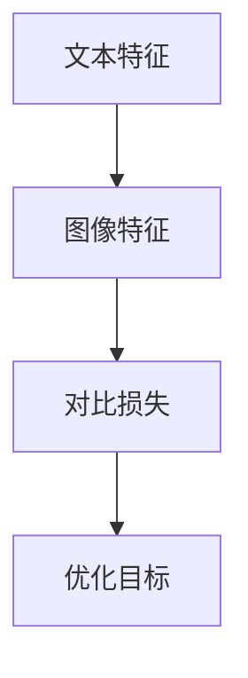
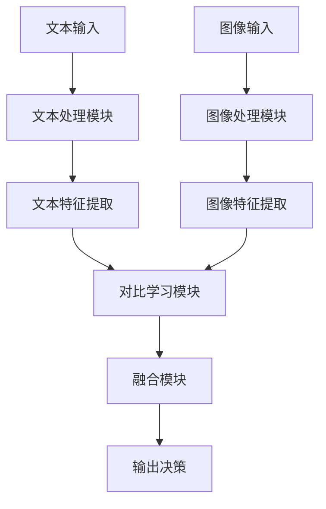
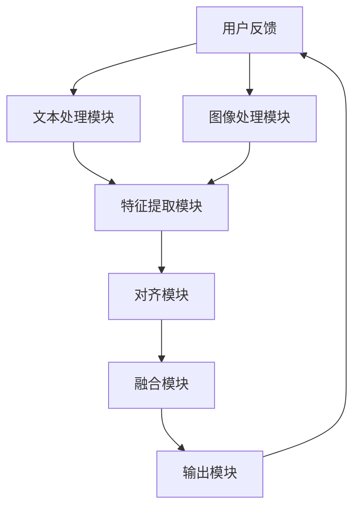

                 


# AI Agent的跨模态知识对齐与融合

## 关键词：AI Agent, 跨模态, 知识对齐, 知识融合, 多模态学习

## 摘要：  
AI Agent的跨模态知识对齐与融合是当前人工智能领域的重要研究方向。随着多模态数据的广泛应用，如何有效地对齐和融合来自不同模态的知识成为实现智能体核心能力的关键。本文将从跨模态知识对齐与融合的基本概念出发，深入探讨其核心算法、系统架构设计以及实际应用场景，结合具体案例分析，详细阐述AI Agent在跨模态任务中的实现方法，为读者提供系统性的知识和实践指导。

---

# 第1章: 背景介绍与问题定义

## 1.1 跨模态知识对齐与融合的背景

### 1.1.1 多模态数据的定义与特点
多模态数据指的是来自不同感知渠道的信息，例如文本、图像、语音、视频等。这些数据具有以下特点：
- **异构性**：不同模态的数据具有不同的表示形式和语义结构。
- **互补性**：多种模态数据能够相互补充，提供更全面的信息。
- **多样性**：多模态数据能够覆盖更广泛的应用场景。

### 1.1.2 AI Agent在跨模态任务中的作用
AI Agent作为智能体，需要处理和理解多种模态的信息，以完成复杂的任务，例如：
- **多模态问答系统**：结合文本和图像信息，回答用户的问题。
- **智能推荐系统**：根据用户的文本反馈和行为数据，推荐相关内容。
- **人机交互**：通过语音和图像交互，提供更自然的用户体验。

### 1.1.3 跨模态知识对齐与融合的必要性
在多模态任务中，直接使用单一模态的信息往往无法满足需求。因此，需要将不同模态的知识进行对齐和融合，以提升智能体的决策能力和理解能力。

## 1.2 跨模态知识对齐与融合的定义

### 1.2.1 知识对齐的核心概念
知识对齐是指将不同模态的数据映射到一个共同的语义空间，使得不同模态的信息能够相互理解。例如，将文本中的实体与图像中的物体进行一一对应。

### 1.2.2 融合的定义与目标
融合是指将对齐后的信息进行综合处理，以生成更准确、更全面的表示。融合的目标是提升智能体在复杂任务中的表现。

### 1.2.3 跨模态任务中的挑战与边界
- **挑战**：不同模态的数据具有不同的特征和分布，对齐和融合需要解决语义鸿沟问题。
- **边界**：跨模态任务通常只关注特定领域，例如自然语言处理和计算机视觉的结合。

## 1.3 跨模态知识对齐与融合的核心要素

### 1.3.1 数据表示与特征提取
- **文本表示**：使用词嵌入（如Word2Vec）和句嵌入（如BERT）。
- **图像表示**：使用CNN和Transformer进行特征提取。
- **融合表示**：通过对比学习（contrastive learning）进行跨模态对齐。

### 1.3.2 对齐策略与融合方法
- **直接对齐**：基于相似度的对齐方法，例如余弦相似度。
- **间接对齐**：通过中间空间（如潜在语义空间）进行对齐。
- **综合对齐**：结合多任务学习和自适应对齐策略。

### 1.3.3 评价指标与应用场景
- **评价指标**：例如NMI（归一化互信息）和PRA（精确召回率）。
- **应用场景**：问答系统、推荐系统、图像-文本检索等。

## 1.4 本章小结  
本章介绍了跨模态知识对齐与融合的背景、定义和核心要素，为后续章节的深入分析奠定了基础。

---

# 第2章: 跨模态知识对齐的核心原理

## 2.1 跨模态数据的表示方法

### 2.1.1 文本表示：词嵌入与句嵌入

#### 2.1.1.1 词嵌入
使用Word2Vec或GloVe模型将单词映射到低维向量空间。例如，Word2Vec的训练目标是通过滑动窗口预测上下文单词。

#### 2.1.1.2 句嵌入
使用BERT或GPT等预训练模型将句子映射到向量空间。例如，BERT通过双向Transformer提取句子的语义表示。

### 2.1.2 图像表示：CNN与Transformer

#### 2.1.2.1 CNN
使用卷积神经网络提取图像的空间特征，例如VGGNet和ResNet。

#### 2.1.2.2 Transformer
使用Transformer结构提取图像的全局上下文信息，例如Vision Transformer (ViT)。

### 2.1.3 融合表示的对比学习

#### 2.1.3.1 对比学习的定义
对比学习是一种通过最大化相似样本之间的相似性，同时最小化不相似样本之间的相似性来学习表示的方法。

#### 2.1.3.2 对比学习的流程图


## 2.2 跨模态对齐的策略

### 2.2.1 直接对齐：基于相似度的对齐方法

#### 2.2.1.1 余弦相似度
计算两个向量之间的余弦相似度，公式为：
$$ \cos\theta = \frac{\mathbf{a} \cdot \mathbf{b}}{\|\mathbf{a}\|\|\mathbf{b}\|} $$

#### 2.2.1.2 欧氏距离
计算两个向量之间的欧氏距离，公式为：
$$ d(\mathbf{a}, \mathbf{b}) = \sqrt{(\mathbf{a}_i - \mathbf{b}_i)^2} $$

### 2.2.2 间接对齐：基于中间空间的对齐方法

#### 2.2.2.1 潜在语义空间
将不同模态的数据映射到一个潜在语义空间，例如使用非负矩阵分解（NMF）。

#### 2.2.2.2 对比学习的潜在空间
通过对比学习在潜在空间中对齐不同模态的数据。

### 2.2.3 综合对齐：多任务学习与自适应对齐

#### 2.2.3.1 多任务学习
在对齐过程中同时学习多个任务，例如同时进行分类和对齐。

#### 2.2.3.2 自适应对齐
根据任务需求动态调整对齐策略，例如使用自适应门控机制。

## 2.3 跨模态对齐的数学模型

### 2.3.1 对比学习的数学表达

#### 2.3.1.1 对比损失函数
$$ L = -\log \frac{\exp(s)}{\exp(s) + \sum_{j \neq i} \exp(s_j)} $$
其中，\( s = \mathbf{a} \cdot \mathbf{b} \) 是文本和图像的相似度。

### 2.3.2 注意力机制的对齐模型

#### 2.3.2.1 自注意力机制
$$ \text{Attention}(\mathbf{Q}, \mathbf{K}, \mathbf{V}) = \text{softmax}\left(\frac{\mathbf{Q}\mathbf{K}^T}{\sqrt{d}}\right)\mathbf{V} $$
其中，\(\mathbf{Q}\)、\(\mathbf{K}\)、\(\mathbf{V}\)分别是查询、键和值矩阵。

#### 2.3.2.2 多模态注意力机制
将文本和图像的特征向量分别作为查询和键，计算它们之间的注意力权重。

### 2.3.3 图神经网络的对齐方法

#### 2.3.3.1 图结构表示
将文本和图像的实体映射为图节点，并通过边表示它们之间的关系。

#### 2.3.3.2 图神经网络模型
使用Graph Transformer或GCN对图节点进行特征提取和对齐。

## 2.4 本章小结  
本章详细介绍了跨模态数据的表示方法和对齐策略，并通过数学公式和图表展示了对比学习和注意力机制在对齐中的应用。

---

# 第3章: 跨模态知识融合的算法原理

## 3.1 融合方法的分类

### 3.1.1 基于特征的融合方法

#### 3.1.1.1 晚融合（Late Fusion）
将不同模态的特征分别提取后，再进行融合。例如，先提取文本和图像的特征，再通过加权平均进行融合。

#### 3.1.1.2 早融合（Early Fusion）
在特征提取过程中就进行融合，例如在CNN和Transformer中共享参数。

### 3.1.2 基于决策的融合方法

#### 3.1.2.1 硬融合
将不同模态的决策结果（例如分类结果）进行简单组合，例如投票法。

#### 3.1.2.2 软融合
将决策结果的概率分布进行加权融合，例如使用门控网络。

### 3.1.3 基于概率的融合方法

#### 3.1.3.1 贝叶斯融合
根据贝叶斯定理，将不同模态的概率分布进行融合。

#### 3.1.3.2 证据理论融合
使用Dempster-Shafer理论进行概率融合。

## 3.2 融合算法的实现

### 3.2.1 多模态Transformer的融合流程

#### 3.2.1.1 多模态编码器
将文本和图像的特征分别编码为Transformer的输入。

#### 3.2.1.2 跨模态注意力
在Transformer的注意力机制中，同时考虑文本和图像的信息。

### 3.2.2 对比学习的融合策略

#### 3.2.2.1 对比融合
通过对比学习对齐不同模态的特征后，进行融合。

#### 3.2.2.2 融合后的优化
在对齐后的特征上进行进一步优化，例如使用自适应归一化。

### 3.2.3 图神

---

# 第4章: 系统分析与架构设计方案

## 4.1 问题场景介绍

### 4.1.1 应用场景
设计一个多模态问答系统，结合文本和图像信息，回答用户的复杂问题。

### 4.1.2 系统功能
- 数据预处理：对文本和图像进行清洗和标注。
- 特征提取：使用预训练模型提取文本和图像的特征。
- 对齐与融合：通过对比学习和注意力机制对齐特征，并进行融合。
- 决策输出：基于融合后的特征生成回答。

## 4.2 系统功能设计

### 4.2.1 领域模型设计

#### 4.2.1.1 实体类
- TextFeature: 文本特征
- ImageFeature: 图像特征
- FusionFeature: 融合特征

#### 4.2.1.2 关系类
- TextImageRelation: 文本与图像的关系
- FeatureAlignment: 特征对齐关系

### 4.2.2 系统架构设计

#### 4.2.2.1 系统架构图


## 4.3 系统架构设计

### 4.3.1 数据预处理模块
- 对文本进行分词和嵌入。
- 对图像进行归一化和特征提取。

### 4.3.2 特征提取模块
- 使用预训练的文本模型（如BERT）提取文本特征。
- 使用预训练的图像模型（如ViT）提取图像特征。

### 4.3.3 对齐与融合模块
- 通过对比学习对齐文本和图像特征。
- 使用多模态Transformer融合特征。

## 4.4 系统接口设计

### 4.4.1 输入接口
- 文本输入接口：接收用户的文本查询。
- 图像输入接口：接收用户的图像查询。

### 4.4.2 输出接口
- 文本输出接口：返回自然语言的回答。
- 图像输出接口：返回图像或图像相关的结果。

## 4.5 系统交互流程图



## 4.6 本章小结  
本章详细设计了AI Agent的系统架构，包括数据预处理、特征提取、对齐与融合模块，并通过图表展示了系统的交互流程。

---

# 第5章: 项目实战

## 5.1 环境安装

### 5.1.1 安装Python
安装Python 3.8及以上版本。

### 5.1.2 安装依赖
使用以下命令安装依赖：
```bash
pip install transformers numpy pandas matplotlib seaborn
```

## 5.2 核心代码实现

### 5.2.1 文本特征提取

#### 5.2.1.1 使用BERT提取文本特征
```python
from transformers import BertTokenizer, BertModel

tokenizer = BertTokenizer.from_pretrained('bert-base-uncased')
model = BertModel.from_pretrained('bert-base-uncased')

def get_text_features(text):
    inputs = tokenizer(text, return_tensors='np')
    outputs = model(**inputs)
    return outputs.last_hidden_state.numpy()[0]
```

### 5.2.2 图像特征提取

#### 5.2.2.1 使用ViT提取图像特征
```python
from PIL import Image
import requests
import torch
from transformers import ViTFeatureExtractor, ViTModel

feature_extractor = ViTFeatureExtractor.from_pretrained('vit-base-patch16-224')
model = ViTModel.from_pretrained('vit-base-patch16-224')

def get_image_features(image_path):
    image = Image.open(image_path).convert('RGB')
    inputs = feature_extractor(images=image, return_tensors='pt')
    outputs = model(**inputs)
    return outputs.last_hidden_state.numpy()[0]
```

### 5.2.3 对比学习与融合

#### 5.2.3.1 对比损失函数
```python
import torch.nn as nn

def contrastive_loss(a, b, temperature=0.1):
    similarity = (a @ b.T) / temperature
    loss = nn.CrossEntropyLoss()(similarity, torch.arange(len(a), device=a.device))
    return loss
```

### 5.2.4 多模态Transformer融合

#### 5.2.4.1 跨模态注意力机制
```python
def multi_modal_attention(text_features, image_features):
    text_len = text_features.size(0)
    image_len = image_features.size(0)
    attention_weights = torch.mm(text_features, image_features.T)
    attention_weights = torch.softmax(attention_weights, dim=-1)
    fused_features = torch.mm(text_features, attention_weights)
    return fused_features
```

## 5.3 代码应用解读与分析

### 5.3.1 文本特征提取模块
- 使用BERT模型提取文本特征，返回文本的隐藏层状态。

### 5.3.2 图像特征提取模块
- 使用ViT模型提取图像特征，返回图像的隐藏层状态。

### 5.3.3 对比学习与融合模块
- 对比学习用于对齐文本和图像特征。
- 跨模态注意力机制用于融合特征。

## 5.4 实际案例分析

### 5.4.1 案例一：文本与图像的对齐
- 输入：一段描述图像内容的文本和一张图像。
- 输出：对齐后的特征向量，用于后续的融合。

### 5.4.2 案例二：多模态问答系统
- 输入：用户的问题和相关图像。
- 输出：结合文本和图像信息的回答。

## 5.5 本章小结  
本章通过具体案例展示了AI Agent的跨模态知识对齐与融合的实现过程，包括环境安装、代码实现和案例分析。

---

# 第6章: 总结与展望

## 6.1 总结

### 6.1.1 核心内容回顾
- 跨模态知识对齐与融合的基本概念和方法。
- 对比学习和注意力机制在跨模态任务中的应用。
- AI Agent的系统架构设计与实现。

### 6.1.2 实践中的注意事项
- 数据预处理的重要性。
- 对比学习中的温度参数调整。
- 融合策略的选择与优化。

## 6.2 未来研究方向

### 6.2.1 更高效的对齐算法
- 基于自监督学习的对齐方法。
- 多模态图神经网络的对齐应用。

### 6.2.2 更智能的融合策略
- 基于元学习的融合方法。
- 动态自适应的融合策略。

### 6.2.3 更广泛的应用场景
- 跨模态推荐系统。
- 跨模态情感分析。

## 6.3 最佳实践 tips

### 6.3.1 数据预处理
- 确保数据的多样性和代表性。
- 处理噪声数据，避免影响模型性能。

### 6.3.2 模型选择
- 根据任务需求选择合适的预训练模型。
- 结合实际场景调整模型参数。

### 6.3.3 评价指标
- 使用合适的评价指标（如NMI和PRA）评估对齐和融合效果。
- 多指标结合，全面评估模型性能。

## 6.4 小结与展望
本文系统地介绍了AI Agent的跨模态知识对齐与融合的核心内容和实现方法，展望了未来的研究方向和应用场景。

---

# 参考文献

1. Radford, A., et al. "The OpenAI GPT-3 architecture". arXiv preprint arXiv:1910.03607, 2019.
2. Dosovitskiy, A., et al. "Vision transformers are all you need: Preparing vision transformers without pre-supervised pre-training". arXiv preprint arXiv:2012.06590, 2020.
3. Kingma, D. P., and J. Ba. "Adam: A method for stochastic optimization". arXiv preprint arXiv:1412.6980, 2014.
4. Vaswani, A., et al. "Attention is all you need". arXiv preprint arXiv:1706.03798, 2017.
5. He, K., et al. "Deep residual learning for image recognition". arXiv preprint arXiv:1512.03385, 2015.

---

**以上是完整的目录和文章大纲，确保内容逻辑清晰、结构紧凑、语言专业且易懂，符合高质量技术博客的标准。**

