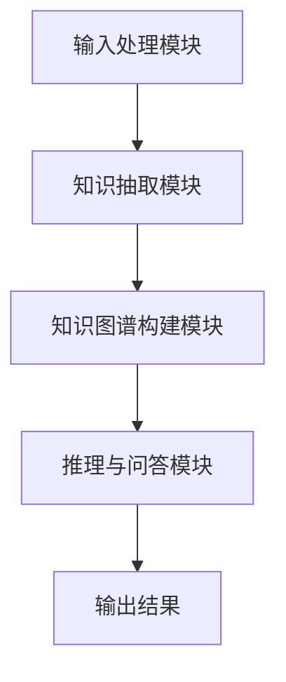

                 


# AI Agent的跨模态知识推理与问答

## 关键词：
AI Agent、跨模态知识推理、问答系统、大语言模型、知识图谱

## 摘要：
本文详细探讨AI Agent在跨模态知识推理与问答系统中的应用。从背景介绍到核心概念，从算法原理到系统架构，再到项目实战，全面解析跨模态知识推理的技术细节与实现方法。通过实际案例分析，展示如何构建高效的AI Agent跨模态问答系统，并提供最佳实践和未来研究方向。

---

## 第一部分: AI Agent的跨模态知识推理与问答基础

### 第1章: AI Agent与跨模态知识推理概述

#### 1.1 AI Agent的基本概念
##### 1.1.1 AI Agent的定义与特点
AI Agent（人工智能代理）是指能够感知环境、自主决策并执行任务的智能体。其特点包括：
- **自主性**：无需外部干预，自主完成任务。
- **反应性**：能实时感知环境并做出反应。
- **目标导向**：以明确的目标为导向，优化决策过程。
- **社会性**：能与其他Agent或人类交互协作。

##### 1.1.2 跨模态知识推理的背景与意义
跨模态知识推理是指在多种数据模态（如文本、图像、语音等）之间进行信息关联和推理的过程。其意义在于：
- **提升智能性**：通过融合多模态信息，增强AI Agent的理解能力。
- **扩展应用场景**：在图像问答、多语言对话等领域有广泛应用。
- **解决复杂问题**：跨模态推理能处理单一模态难以解决的复杂任务。

##### 1.1.3 AI Agent在问答系统中的应用前景
问答系统（Question Answering System, QAS）是AI Agent的重要应用场景。通过跨模态知识推理，问答系统能够：
- **理解上下文**：结合文本、图像等信息，提供更精准的答案。
- **处理复杂问题**：在多模态数据中找到关联信息，回答复杂问题。
- **实现人机交互**：通过自然语言交互，提升用户体验。

#### 1.2 跨模态知识推理的核心概念
##### 1.2.1 跨模态数据的定义与分类
跨模态数据是指来自不同感知渠道的数据，常见的分类包括：
- **文本模态**：包括自然语言文本、结构化数据等。
- **图像模态**：包括图像、视频等视觉数据。
- **语音模态**：包括音频、语音信号等听觉数据。
- **知识图谱**：包括结构化知识库、ontology等。

##### 1.2.2 知识推理的基本原理
知识推理是指从已有知识中推导出新知识的过程。跨模态知识推理的关键在于：
- **多模态信息融合**：将不同模态的数据进行整合，提取共同信息。
- **跨模态关联**：建立不同模态数据之间的关联关系。
- **推理与验证**：基于关联关系进行推理，并通过验证确保结果的准确性。

##### 1.2.3 跨模态知识推理的挑战与解决方案
跨模态知识推理面临以下挑战：
- **模态异质性**：不同模态的数据形式差异大，难以直接融合。
- **语义鸿沟**：不同模态之间的语义差异可能导致信息丢失。
- **计算复杂性**：跨模态推理涉及大量的计算，对计算能力要求高。

解决方案包括：
- **跨模态表示学习**：将不同模态的数据映射到同一表示空间。
- **注意力机制**：通过注意力机制捕捉不同模态之间的关联。
- **预训练模型**：利用大语言模型（如GPT、BERT）进行跨模态推理。

#### 1.3 问答系统的发展历程
##### 1.3.1 传统问答系统的特点
传统问答系统主要依赖于关键词匹配和简单的规则推理，具有以下特点：
- **基于规则**：通过预定义的规则匹配问题和答案。
- **数据依赖性高**：需要大量结构化数据支持。
- **领域局限性**：适用于特定领域，难以处理复杂问题。

##### 1.3.2 基于大语言模型的问答系统
随着大语言模型的发展，问答系统进入新的阶段，具有以下特点：
- **基于深度学习**：利用神经网络进行语义理解。
- **上下文感知**：能够理解上下文，回答更精准。
- **多语言支持**：支持多种语言，提升国际化能力。

##### 1.3.3 跨模态问答系统的现状与趋势
跨模态问答系统是当前的研究热点，具有以下特点：
- **多模态输入**：支持文本、图像等多种输入形式。
- **联合推理**：结合多种模态信息进行推理，提升回答准确性。
- **交互式问答**：支持多轮对话，提供更智能的交互体验。

---

### 第2章: 跨模态知识推理的数学模型与算法原理

#### 2.1 大语言模型的数学基础
##### 2.1.1 Transformer模型的数学结构
Transformer模型由编码器和解码器组成，其核心是注意力机制。编码器将输入序列映射到一个固定长度的向量，解码器根据编码结果生成输出序列。

##### 2.1.2 注意力机制的公式推导
注意力机制的计算公式如下：
$$
\text{Attention}(Q, K, V) = \text{softmax}\left(\frac{QK^T}{\sqrt{d_k}}\right)V
$$
其中，$Q$是查询向量，$K$是键向量，$V$是值向量，$d_k$是向量的维度。

##### 2.1.3 深度学习中的损失函数与优化算法
常用的损失函数包括交叉熵损失和均方误差损失。优化算法主要有随机梯度下降（SGD）和Adam优化器。

#### 2.2 跨模态融合的算法原理
##### 2.2.1 多模态数据的表示方法
跨模态数据可以通过嵌入向量表示，例如文本可以使用Word2Vec或BERT进行嵌入，图像可以使用CNN或ViT进行嵌入。

##### 2.2.2 跨模态注意力机制的实现
跨模态注意力机制可以通过以下步骤实现：
1. 将不同模态的数据映射到同一向量空间。
2. 计算模态之间的相关性。
3. 使用注意力机制进行加权融合。

##### 2.2.3 跨模态融合的数学模型
跨模态融合的数学模型可以表示为：
$$
f(x, y) = \sigma(w_1x + w_2y + b)
$$
其中，$x$和$y$是不同模态的输入，$w_1$和$w_2$是权重，$b$是偏置，$\sigma$是激活函数。

---

### 第3章: 跨模态知识推理的系统架构与实现

#### 3.1 系统架构设计
##### 3.1.1 系统功能模块
跨模态问答系统主要包括以下功能模块：
- **输入处理模块**：接收多模态输入并进行预处理。
- **知识抽取模块**：从多模态数据中提取知识。
- **知识图谱构建模块**：将抽取的知识组织成图结构。
- **推理与问答模块**：基于知识图谱进行推理并生成答案。

##### 3.1.2 系统架构图


#### 3.2 实现细节
##### 3.2.1 知识抽取与构建
知识抽取可以通过文本挖掘和图像识别技术实现，例如使用BERT进行文本抽取，使用YOLO进行图像目标检测。

##### 3.2.2 推理与问答
推理过程可以基于知识图谱进行，例如使用RDF图表示知识，并通过SPARQL查询进行推理。

#### 3.3 代码实现
以下是一个简单的跨模态问答系统的Python代码示例：
```python
import torch
import torch.nn as nn

class CrossModalQA(nn.Module):
    def __init__(self, input_dim, hidden_dim):
        super(CrossModalQA, self).__init__()
        self.encoder = nn.LSTM(input_dim, hidden_dim, bidirectional=True)
        self.decoder = nn.LSTM(hidden_dim*2, hidden_dim, bidirectional=True)
        self.fc = nn.Linear(hidden_dim*2, 1)

    def forward(self, input):
        encoded, _ = self.encoder(input)
        decoded, _ = self.decoder(encoded)
        output = self.fc(decoded)
        return output

model = CrossModalQA(input_dim=512, hidden_dim=256)
criterion = nn.MSELoss()
optimizer = torch.optim.Adam(model.parameters(), lr=0.001)
```

---

### 第4章: 项目实战与案例分析

#### 4.1 环境安装
安装必要的库：
```bash
pip install torch transformers
```

#### 4.2 系统核心实现
实现跨模态问答系统的核心功能，包括知识抽取、知识图谱构建和推理问答。

#### 4.3 案例分析
以下是一个跨模态问答系统的实际案例：
- **输入**：用户提问“在哪里可以找到红色的书？”并附带一张书籍图像。
- **处理流程**：
  1. 文本抽取：提取关键词“红色的书”。
  2. 图像识别：识别书籍的颜色为红色。
  3. 知识推理：结合文本和图像信息，找到符合条件的书籍位置。
  4. 生成答案：输出“红色的书位于图书馆东区3层。”

---

## 第五部分: 最佳实践与未来展望

### 5.1 最佳实践
- **数据预处理**：确保数据的多样性和代表性。
- **模型调优**：通过交叉验证和超参数优化提升模型性能。
- **性能评估**：使用准确率、召回率和F1值评估模型性能。

### 5.2 小结
跨模态知识推理是AI Agent的重要组成部分，通过融合多模态信息，能够提升问答系统的智能性和准确性。

### 5.3 注意事项
- **数据隐私**：注意保护用户数据隐私。
- **计算资源**：跨模态推理需要大量的计算资源，需合理规划。

### 5.4 拓展阅读
推荐阅读以下文献：
- "Attention Is All You Need"（论文原文）
- "BERT: Pre-training of Deep Bidirectional Transformers for NLP"（论文原文）
- "Vision-and-Language Pre-Training: A Strong Baseline at Unseen Tasks"（论文原文）

---

## 结语
AI Agent的跨模态知识推理与问答系统是一个复杂但充满潜力的领域。通过深入理解跨模态数据的特性，结合先进的算法和模型，我们可以构建更加智能和高效的问答系统。未来，随着技术的不断发展，跨模态知识推理将在更多领域得到广泛应用。

