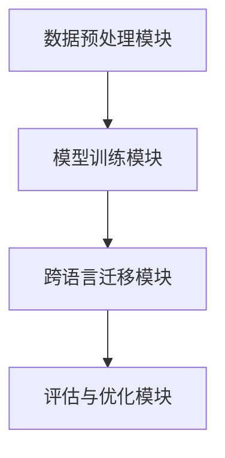
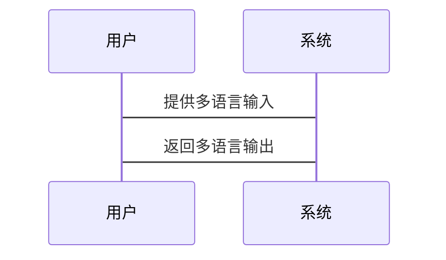

                 


# AI Agent的跨语言学习：增强LLM的多语言能力

> 关键词：AI Agent, 跨语言学习, 大语言模型, 多语言能力, 机器学习算法, 系统架构设计

> 摘要：本文详细探讨了AI Agent在跨语言学习中的应用，分析了增强大语言模型多语言能力的关键技术，包括跨语言学习的核心原理、算法实现、系统架构设计以及实际案例。通过深入分析和详细讲解，本文为读者提供了从理论到实践的全面指导，帮助读者理解和应用AI Agent的跨语言学习技术。

---

## 第一部分: AI Agent的跨语言学习概述

### 第1章: AI Agent与跨语言学习的背景介绍

#### 1.1 AI Agent的基本概念
- **1.1.1 AI Agent的定义与核心功能**
  - AI Agent（人工智能代理）是指能够感知环境、自主决策并执行任务的智能体。其核心功能包括感知、推理、规划和执行。
- **1.1.2 AI Agent在语言处理中的作用**
  - AI Agent能够通过语言处理技术与用户交互，理解并生成多种语言的内容，提升用户体验。
- **1.1.3 跨语言学习的定义与特点**
  - 跨语言学习是指让模型在多种语言之间进行学习和推理，能够理解并生成多种语言的内容。

#### 1.2 跨语言学习的重要性
- **1.2.1 跨语言学习的背景与问题背景**
  - 随着全球化的发展，多语言处理的需求日益增加，而单一语言模型难以满足跨语言任务的需求。
- **1.2.2 跨语言学习的目标与应用场景**
  - 跨语言学习的目标是让模型具备多种语言的理解和生成能力，应用场景包括机器翻译、跨语言问答系统、多语言对话系统等。
- **1.2.3 跨语言学习与LLM的结合**
  - 大语言模型（LLM）具有强大的语言处理能力，结合跨语言学习，能够进一步提升其多语言能力。

#### 1.3 当前LLM的多语言能力现状
- **1.3.1 LLM的多语言能力概述**
  - 当前LLM在多种语言上表现出色，但仍然存在一些不足，如某些小语种的处理能力较弱。
- **1.3.2 跨语言学习在LLM中的挑战**
  - 数据不平衡、跨语言迁移难度大、模型训练成本高等问题亟待解决。
- **1.3.3 跨语言学习的未来发展方向**
  - 提高小语种处理能力、优化跨语言迁移学习算法、降低训练成本等。

### 第2章: 跨语言学习的核心概念与联系

#### 2.1 跨语言学习的核心原理
- **2.1.1 跨语言学习的基本原理**
  - 跨语言学习通过共享跨语言的特征，提升模型在多种语言上的表现。
- **2.1.2 跨语言学习的关键技术**
  - 数据预处理、跨语言表示学习、跨语言迁移学习等。
- **2.1.3 跨语言学习的实现方法**
  - 对比学习、跨语言迁移学习、多任务学习等。

#### 2.2 跨语言学习与LLM的关系
- **2.2.1 跨语言学习对LLM的提升作用**
  - 跨语言学习能够增强LLM在多种语言上的泛化能力。
- **2.2.2 LLM在跨语言学习中的优势**
  - LLM具有强大的上下文理解和生成能力，适合跨语言任务。
- **2.2.3 跨语言学习对LLM的挑战**
  - 数据量不足、模型复杂度高等问题。

#### 2.3 跨语言学习的核心要素
- **2.3.1 数据预处理与特征提取**
  - 数据清洗、对齐、特征提取等。
- **2.3.2 模型训练与优化**
  - 模型参数调整、损失函数设计等。
- **2.3.3 跨语言迁移学习的实现**
  - 源语言到目标语言的知识迁移。

### 第3章: 跨语言学习的算法原理

#### 3.1 跨语言学习的算法概述
- **3.1.1 对比学习算法**
  - 对比学习通过对比不同语言的表示，提升跨语言对齐能力。
- **3.1.2 跨语言迁移学习算法**
  - 迁移学习通过共享跨语言特征，提升目标语言的性能。
- **3.1.3 多任务学习算法**
  - 多任务学习通过同时学习多种任务，提升模型的跨语言能力。

#### 3.2 跨语言学习算法的数学模型
- **3.2.1 对比学习的数学模型**
  - 对比损失函数：$$ L = \frac{1}{N} \sum_{i=1}^{N} \text{loss}(x_i, y_i) $$
- **3.2.2 跨语言迁移学习的数学模型**
  - 迁移损失函数：$$ L_{\text{transfer}} = \lambda L_{\text{source}} + (1-\lambda) L_{\text{target}} $$
- **3.2.3 多任务学习的数学模型**
  - 多任务损失函数：$$ L_{\text{total}} = \sum_{i=1}^{M} \alpha_i L_i $$

#### 3.3 跨语言学习算法的实现
- **3.3.1 对比学习的实现**
  - 使用对比损失函数，优化跨语言表示对齐。
- **3.3.2 跨语言迁移学习的实现**
  - 通过共享特征层，实现跨语言知识迁移。
- **3.3.3 多任务学习的实现**
  - 同时优化多个任务，共享模型参数。

---

## 第二部分: 跨语言学习的系统架构设计

### 第4章: 跨语言学习的系统分析

#### 4.1 问题场景介绍
- 跨语言学习系统需要解决多语言数据对齐、模型训练优化等问题。
- 系统需要支持多种语言的输入输出，具备高效的跨语言处理能力。

#### 4.2 系统功能设计
- **数据预处理模块**
  - 数据清洗、对齐、特征提取。
- **模型训练模块**
  - 模型参数调整、损失函数优化。
- **跨语言迁移模块**
  - 特征对齐、知识迁移。
- **评估与优化模块**
  - 性能评估、模型调优。

#### 4.3 系统架构设计


### 第5章: 系统接口设计

#### 5.1 系统接口设计
- **输入接口**
  - 支持多种语言的输入数据。
- **输出接口**
  - 提供多种语言的输出结果。
- **API接口**
  - 提供RESTful API，方便其他系统调用。

#### 5.2 系统交互设计


---

## 第三部分: 跨语言学习的项目实战

### 第6章: 项目实战

#### 6.1 环境安装
- **安装Python环境**
  - 使用Anaconda安装Python 3.8及以上版本。
- **安装依赖库**
  - 安装TensorFlow、Keras、numpy等。

#### 6.2 系统核心实现源代码
```python
# 对比学习实现示例
import tensorflow as tf
from tensorflow.keras import layers

def contrastive_loss(y_true, y_pred, temperature=0.1):
    similarity_matrix = tf.matmul(y_pred, y_pred, transpose_b=True)
    similarity_matrix = similarity_matrix / temperature
    loss = tf.nn.softmax_crossentropy(y_true, similarity_matrix)
    return tf.reduce_mean(loss)

# 跨语言迁移学习实现示例
def transfer_loss(source_logits, target_logits, lambda_weight=0.5):
    loss_source = tf.nn.sparse_softmax_crossentropy_loss(source_labels, source_logits)
    loss_target = tf.nn.sparse_softmax_crossentropy_loss(target_labels, target_logits)
    total_loss = lambda_weight * loss_source + (1 - lambda_weight) * loss_target
    return total_loss
```

#### 6.3 代码应用解读与分析
- **对比学习代码解读**
  - 计算相似性矩阵，使用对比损失函数优化模型。
- **跨语言迁移学习代码解读**
  - 结合源语言和目标语言的损失，优化模型的跨语言性能。

#### 6.4 实际案例分析
- **案例分析**
  - 使用跨语言学习算法，提升多语言问答系统的性能。
- **案例总结**
  - 通过对比学习和跨语言迁移学习，显著提升模型的多语言能力。

### 第7章: 总结与展望

#### 7.1 总结
- 跨语言学习是提升LLM多语言能力的关键技术。
- 本文详细探讨了跨语言学习的核心原理、算法实现和系统设计。

#### 7.2 未来展望
- 提高小语种的处理能力。
- 优化跨语言迁移学习算法。
- 降低模型训练成本。

#### 7.3 最佳实践 Tips
- 数据预处理是关键，需确保数据的对齐和质量。
- 选择合适的跨语言学习算法，根据具体任务需求调整参数。
- 定期更新模型，提升其适应性。

---

通过本文的详细讲解，读者可以系统地了解AI Agent的跨语言学习技术，并将其应用于实际项目中，提升大语言模型的多语言能力。

