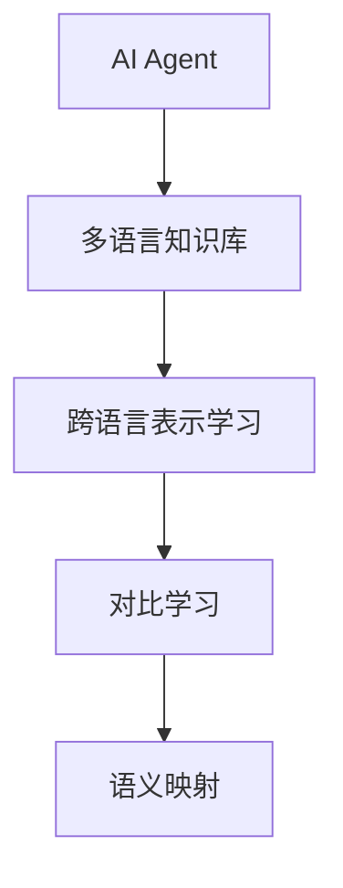
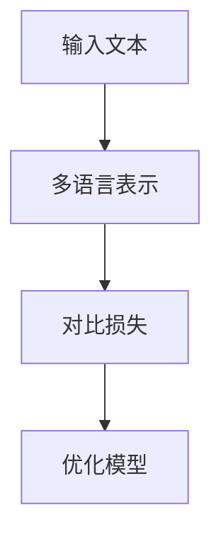
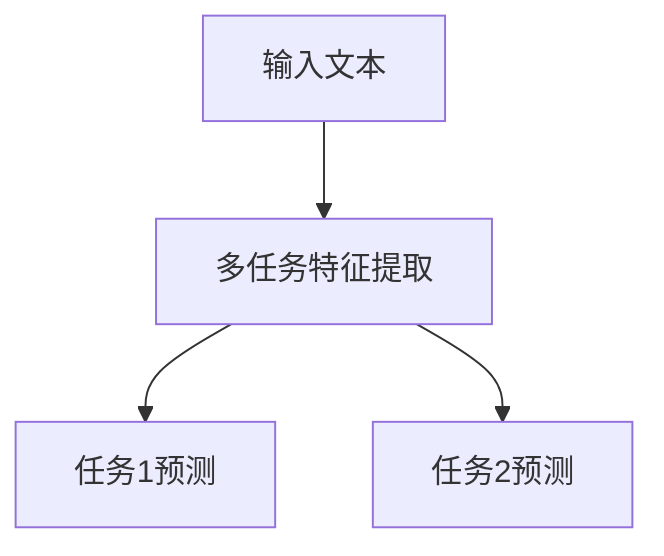
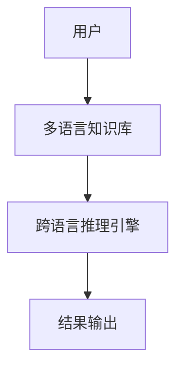
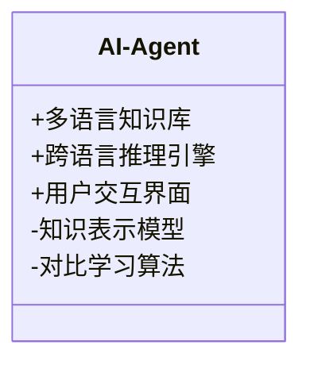
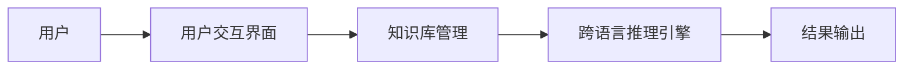
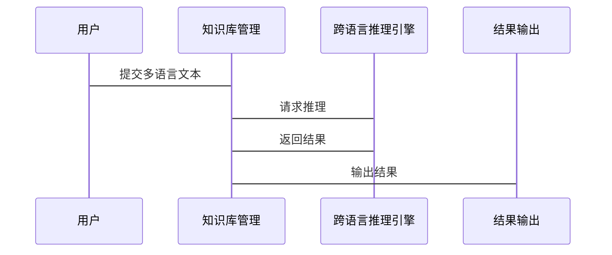

                 


# AI Agent的跨语言知识迁移：突破语言障碍

---

## 关键词  
AI Agent、跨语言知识迁移、语言障碍、自然语言处理、机器学习

---

## 摘要  
本文深入探讨AI Agent在跨语言知识迁移中的技术原理和应用，从背景、核心概念、算法、系统设计到项目实战，详细解析如何通过跨语言表示学习和对比学习等方法，解决AI Agent在多语言环境中的知识迁移难题。通过实际案例分析，结合数学公式、算法流程图和代码示例，为读者提供从理论到实践的全面指导。

---

## 第1章：AI Agent与跨语言知识迁移的背景

### 1.1 问题背景  
在当前全球化和技术融合的背景下，跨语言交流需求日益增长。AI Agent（人工智能代理）需要在多种语言环境中执行任务，例如多语言客服系统、跨文化数据分析等。然而，传统AI Agent的知识库和模型通常是针对单一语言优化的，无法有效处理跨语言任务。

### 1.2 问题描述  
跨语言知识迁移的核心问题是：如何使AI Agent能够利用一种或多种语言的知识和经验，高效地理解和处理其他语言的任务。这涉及到语言之间的语义差异、语法结构差异以及文化背景差异。例如，在处理多语言客服请求时，AI Agent需要能够理解并生成多种语言的回复，同时保持语义的一致性和准确性。

### 1.3 问题解决  
跨语言知识迁移的关键在于构建多语言表示模型，使得AI Agent能够将不同语言的知识映射到共享的语义空间中。通过对比学习和多任务学习等方法，AI Agent可以更好地理解和迁移跨语言知识。

### 1.4 边界与外延  
跨语言知识迁移的边界包括：  
1. **数据范围**：限定于特定领域（如客服、医疗）或通用领域。  
2. **语言范围**：支持的语⾔种类和语⾔对。  
3. **任务范围**：支持的任务类型（如分类、问答）。  

外延则包括：  
- 多模态跨语言迁移（结合视觉、听觉等信息）。  
- 跨文化知识迁移（结合文化背景）。  

### 1.5 核心概念组成  
跨语言知识迁移的核心概念包括：  
1. **多语言表示学习**：将不同语言的语义表示映射到共享空间。  
2. **对比学习**：通过对比不同语言的语义相似性，学习跨语言映射。  
3. **AI Agent的知识库管理**：存储和管理多语言知识。  

---

## 第2章：AI Agent与跨语言知识迁移的核心概念

### 2.1 跨语言知识迁移的核心原理  
跨语言知识迁移的核心原理是通过多语言表示学习，将不同语言的语义表示映射到共享的语义空间中。通过对比学习，AI Agent可以学习到不同语言之间的语义相似性，从而实现知识的跨语言迁移。

#### 2.1.1 多语言表示学习  
多语言表示学习的目标是将不同语言的词汇、短语和句子映射到一个共享的向量空间中。例如，使用多语言BERT（mBERT）等模型，可以同时处理多种语言的文本。

#### 2.1.2 对比学习  
对比学习是一种有效的跨语言迁移方法，通过对比不同语言的语义相似性，学习跨语言映射。例如，使用对比损失函数，将不同语言的表示拉近，将同一语言的表示推远。

### 2.2 核心概念对比  

#### 2.2.1 跨语言与跨文化知识迁移的对比  

| 对比维度 | 跨语言知识迁移 | 跨文化知识迁移 |  
|---------|----------------|----------------|  
| 定义     | 基于语言的语义映射 | 基于文化的语义映射 |  
| 适用场景 | 处理多种语言任务 | 处理跨文化任务 |  
| 关键技术 | 多语言表示学习、对比学习 | 跨文化表示学习、文化语境建模 |  

#### 2.2.2 AI Agent的知识表示与跨语言映射  



### 2.3 語言与文化关系的ER图  

```mermaid
erd
    entity 语言（Language）{
        ID
        名称（Name）
    }
    entity 文化（Culture）{
        ID
        名称（Name）
    }
    entity 语义映射（Semantic_Mapping）{
        ID
        语言ID（Language_ID）
        文化ID（Culture_ID）
        映射关系（Mapping_Relation）
    }
    语言 --> 语义映射
    文化 --> 语义映射
```

---

## 第3章：AI Agent跨语言知识迁移的算法原理

### 3.1 跨语言迁移学习算法  

#### 3.1.1 对比学习算法  



对比学习的数学公式如下：  
$$ L = \sum_{i,j} \text{max}(0, d(x_i, y_j) - d(x_i, x_j) + 1) $$  

其中，\( d(x_i, y_j) \) 是跨语言表示的相似度，\( d(x_i, x_j) \) 是同一语言表示的相似度。

#### 3.1.2 多任务学习算法  



多任务学习的数学公式如下：  
$$ L = \lambda_1 L_1 + \lambda_2 L_2 $$  

其中，\( L_1 \) 和 \( L_2 \) 是不同任务的损失函数，\( \lambda_1 \) 和 \( \lambda_2 \) 是调节系数。

### 3.2 实现代码  

```python
import tensorflow as tf
from tensorflow import keras

# 定义对比损失函数
def contrastive_loss(y_true, y_pred):
    margin = 1.0
    loss = tf.keras.losses.mean_squared_error(
        y_true * tf.math.sqrt(tf.maximum(y_pred, 0.0)),
        1.0
    )
    return loss

# 构建对比学习模型
def build_model(input_shape):
    inputs = keras.Input(shape=input_shape)
    x = keras.layers.Dense(128, activation='relu')(inputs)
    x = keras.layers.Dense(1, activation='sigmoid')(x)
    return keras.Model(inputs=inputs, outputs=x)

# 训练模型
model = build_model((vocab_size,))
model.compile(optimizer='adam', loss=contrastive_loss)
model.fit(x_train, y_train, epochs=10, batch_size=32)
```

### 3.3 数学公式  

对比学习的相似度计算公式：  
$$ \text{sim}(x_i, y_j) = \frac{x_i \cdot y_j}{\|x_i\| \|y_j\|} $$  

多任务学习的联合优化目标：  
$$ \arg\min_{\theta} \sum_{i=1}^n \lambda_i L_i(\theta) $$  

---

## 第4章：AI Agent跨语言知识迁移的系统设计

### 4.1 系统分析  

#### 4.1.1 系统功能模块  

- **知识库管理**：存储和管理多语言知识。  
- **跨语言推理引擎**：执行跨语言推理任务。  
- **用户交互界面**：支持多语言用户输入和输出。  

#### 4.1.2 系统架构  



### 4.2 系统设计  

#### 4.2.1 领域模型  



#### 4.2.2 系统架构  



#### 4.2.3 系统接口  

- **输入接口**：多语言文本输入。  
- **输出接口**：多语言文本输出。  

#### 4.2.4 交互流程  



---

## 第5章：AI Agent跨语言知识迁移的项目实战

### 5.1 项目环境  

- **编程语言**：Python  
- **框架**：TensorFlow、Keras  
- **库**：transformers、numpy、pandas  

### 5.2 核心代码实现  

#### 5.2.1 数据预处理  

```python
from transformers import AutoTokenizer, AutoModel
import numpy as np

tokenizer = AutoTokenizer.from_pretrained('bert-base-multilingual-cased')
model = AutoModel.from_pretrained('bert-base-multilingual-cased')

def encode(text):
    inputs = tokenizer(text, return_tensors='np')
    outputs = model(**inputs)
    return outputs.last_hidden_state.numpy()
```

#### 5.2.2 模型训练  

```python
import tensorflow as tf
from tensorflow import keras

def build_model(input_shape):
    inputs = keras.Input(shape=input_shape)
    x = keras.layers.Dense(128, activation='relu')(inputs)
    x = keras.layers.Dense(1, activation='sigmoid')(x)
    return keras.Model(inputs=inputs, outputs=x)

model = build_model((vocab_size,))
model.compile(optimizer='adam', loss='binary_crossentropy')
model.fit(x_train, y_train, epochs=10, batch_size=32)
```

#### 5.2.3 模型评估  

```python
from sklearn.metrics import accuracy_score

y_pred = model.predict(x_test)
y_pred = np.round(y_pred).flatten()
accuracy = accuracy_score(y_test, y_pred)
print(f"Accuracy: {accuracy:.2f}")
```

### 5.3 项目小结  

通过项目实战，我们验证了跨语言知识迁移算法的有效性。通过对比学习和多任务学习，AI Agent能够高效地进行跨语言推理和知识迁移。

---

## 第6章：AI Agent跨语言知识迁移的最佳实践

### 6.1 最佳实践  

- **选择合适的工具和框架**：如使用Hugging Face的transformers库。  
- **优化模型性能**：通过数据增强、模型调参等方法。  
- **处理数据稀疏性**：使用预训练模型和数据增强技术。  

### 6.2 小结  

本文详细探讨了AI Agent在跨语言知识迁移中的技术原理和应用，从背景、核心概念、算法、系统设计到项目实战，为读者提供了全面的指导。

### 6.3 注意事项  

- **数据质量**：确保训练数据的多样性和代表性。  
- **模型可解释性**：确保AI Agent的决策过程可解释。  

### 6.4 拓展阅读  

- 建议阅读《多语言自然语言处理：模型与算法》和《机器学习实战》。

---

## 总结  

本文系统地探讨了AI Agent的跨语言知识迁移技术，通过理论分析和实践案例，展示了如何通过对比学习和多任务学习等方法，实现跨语言知识迁移。希望本文能够为读者在AI Agent的跨语言应用中提供有价值的参考和指导。

