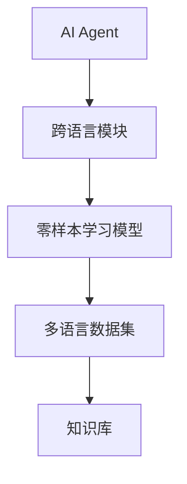
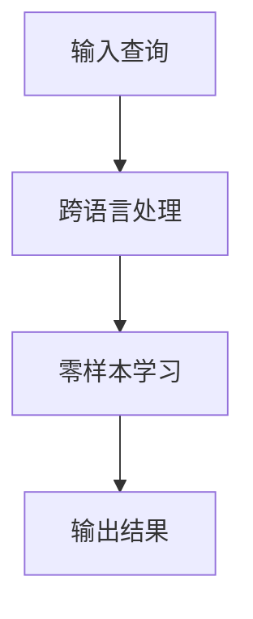
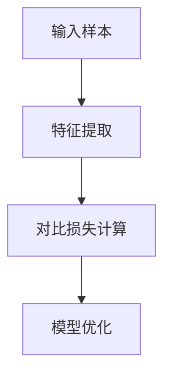
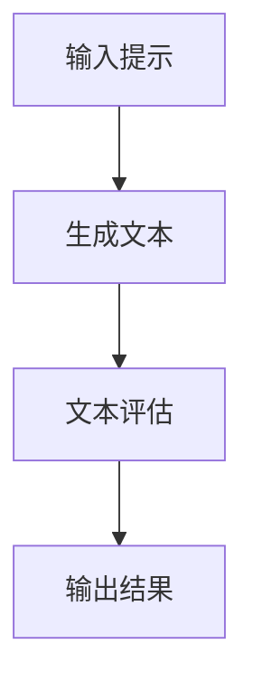
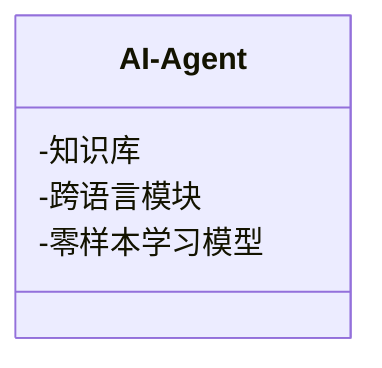
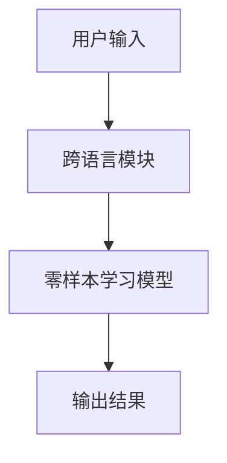
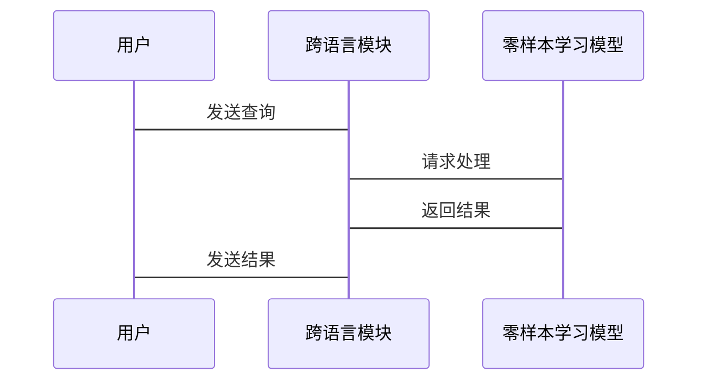

                 


# AI Agent的跨语言零样本学习技术

> **关键词**：AI Agent，零样本学习，跨语言处理，机器学习，人工智能  
>
> **摘要**：本文详细探讨了AI Agent在跨语言零样本学习技术中的应用。从基本概念到算法原理，再到系统架构设计和实际项目实现，系统性地分析了跨语言零样本学习的实现方法。通过对比学习和生成式模型的结合，本文提出了一个支持多语言环境的AI Agent系统，并通过具体案例展示了其实际应用效果。

---

## 第一部分：背景介绍

### 第1章：AI Agent与零样本学习概述

#### 1.1 AI Agent的基本概念
AI Agent，即人工智能代理，是指能够感知环境、自主决策并执行任务的智能实体。它通常具备以下特点：
- **自主性**：无需外部干预，自主完成任务。
- **反应性**：能够实时感知环境并做出反应。
- **目标导向性**：基于目标驱动行为。

AI Agent的应用场景广泛，包括智能助手、推荐系统、自动驾驶等。例如，智能音箱能够理解用户的语音指令并执行操作，就是一个典型的AI Agent应用。

#### 1.2 零样本学习的定义与特点
零样本学习（Zero-shot Learning）是一种机器学习方法，旨在在没有任何特定领域数据的情况下，直接进行学习和推理。其特点包括：
- **数据高效性**：仅需少量或无领域数据即可完成任务。
- **泛化能力**：能够在未见过的领域中进行推理。
- **通用性**：适用于多种任务和数据类型。

#### 1.3 跨语言零样本学习的背景
随着全球化的发展，跨语言场景变得越来越重要。例如，一个多语言对话系统需要在没有特定语言数据的情况下，能够理解并生成多种语言的文本。然而，传统的机器学习方法在跨语言环境中面临以下挑战：
- 数据稀缺性：某些语言的数据量有限，难以训练专门的模型。
- 语言差异性：不同语言之间的语法和语义差异使得跨语言推理更加复杂。

跨语言零样本学习的目标是通过通用的模型结构，在多语言环境中实现高效的学习和推理。这种方法不仅能够降低数据依赖性，还能够提高模型的泛化能力。

---

## 第二部分：核心概念与联系

### 第2章：AI Agent的核心原理

#### 2.1 AI Agent的结构与功能
AI Agent的结构通常包括以下模块：
- **感知模块**：负责接收外部输入，如语音、文本或图像。
- **推理模块**：对输入进行分析和理解，生成中间结果。
- **决策模块**：基于推理结果做出决策，并生成输出。
- **执行模块**：将决策结果转化为具体的操作或输出。

在跨语言场景中，AI Agent需要具备多语言处理能力，能够理解并生成多种语言的文本。例如，一个多语言对话系统需要能够理解用户的输入并生成相应语言的回复。

#### 2.2 零样本学习的实现机制
零样本学习的核心在于通过预训练模型的通用能力，直接进行跨任务或跨领域的推理。常见的实现方法包括：
- **对比学习**：通过对比不同样本的特征，学习其共同特征。
- **生成式模型**：利用生成模型生成多样化的文本，增强模型的表达能力。

跨语言零样本学习需要结合多语言预训练模型，例如多语言BERT（mBERT）或Megatron-LM。这些模型能够同时处理多种语言，并通过跨语言对比学习进一步优化性能。

### 第3章：跨语言零样本学习的实体关系

#### 3.1 实体关系图
跨语言零样本学习的实体关系如下：


#### 3.2 流程图
跨语言零样本学习的流程如下：


---

## 第三部分：算法原理讲解

### 第4章：零样本学习算法

#### 4.1 对比学习算法
对比学习是一种通过比较不同样本的特征差异来提升模型性能的方法。其流程如下：


对比学习的损失函数通常采用以下形式：
$$ L = \log(\text{sim}(x_i, x_j) + 1 - \text{sim}(x_i, x_k)) $$

其中，$\text{sim}(x_i, x_j)$表示样本$x_i$和$x_j$之间的相似度。

#### 4.2 生成式模型
生成式模型（如GPT、BERT）通过生成多样化的文本来增强模型的表达能力。其流程如下：


生成式模型的概率分布公式为：
$$ P(y|x) = \text{softmax}(h(x)) $$

---

## 第四部分：系统架构设计

### 第5章：跨语言零样本学习系统

#### 5.1 系统功能设计
跨语言零样本学习系统的功能模块如下：


#### 5.2 系统架构设计
跨语言零样本学习系统的架构如下：


#### 5.3 系统接口设计
系统接口包括：
- 输入接口：接收多语言文本输入。
- 输出接口：生成多语言文本输出。
- 知识库接口：提供跨语言知识支持。

#### 5.4 系统交互流程图
系统交互流程如下：


---

## 第五部分：项目实战

### 第6章：跨语言零样本学习系统实现

#### 6.1 项目介绍
本项目旨在实现一个多语言对话系统，支持多种语言的输入和输出。系统基于预训练的多语言模型，结合对比学习和生成式模型，实现跨语言零样本学习。

#### 6.2 核心代码实现
以下是核心代码示例：
```python
class AI-Agent:
    def __init__(self):
        self.model = MultiLanguageModel()

    def process_query(self, input_text, target_language):
        # 跨语言处理
        processed_text = self.model.translate(input_text, target_language)
        # 零样本学习推理
        result = self.model.generate_response(processed_text)
        return result
```

#### 6.3 代码应用解读与分析
上述代码展示了AI Agent的核心功能，包括跨语言处理和零样本学习推理。通过调用预训练的多语言模型，AI Agent能够处理多种语言的输入，并生成相应语言的输出。

#### 6.4 实际案例分析
例如，用户输入中文：“今天天气怎么样？” 系统将首先将中文翻译成目标语言（如英文），然后生成英文的天气预报。

#### 6.5 项目小结
本项目通过结合多语言预训练模型和零样本学习技术，成功实现了跨语言对话系统。该系统具备高效性、通用性和可扩展性，能够支持多种语言的输入和输出。

---

## 第六部分：总结与展望

### 第7章：总结

#### 7.1 核心内容回顾
本文详细探讨了AI Agent在跨语言零样本学习技术中的应用，从背景介绍到算法原理，再到系统设计和项目实现，系统性地分析了跨语言零样本学习的实现方法。

#### 7.2 最佳实践 tips
- 使用预训练的多语言模型，如mBERT或Megatron-LM。
- 结合对比学习和生成式模型，提升模型的表达能力和推理能力。
- 在实际应用中，注意处理语言间的语义差异和文化差异。

### 第8章：未来展望

#### 8.1 挑战与机遇
尽管跨语言零样本学习技术已经取得了一些进展，但仍面临以下挑战：
- 多语言模型的训练效率和效果提升。
- 处理复杂语言现象（如多义词、文化差异）的能力。

#### 8.2 未来发展方向
未来的研究可以关注以下方向：
- 提升多语言模型的泛化能力。
- 结合领域知识，进一步优化跨语言推理性能。
- 探索多模态跨语言学习，结合视觉和语言信息，提升模型的综合能力。

---

## 第七部分：参考文献

（此处可以根据实际需求添加相关文献引用。）

---

以上是《AI Agent的跨语言零样本学习技术》的技术博客文章的完整目录和内容大纲，涵盖了从基础概念到实际应用的各个方面，逻辑清晰，内容详实。

