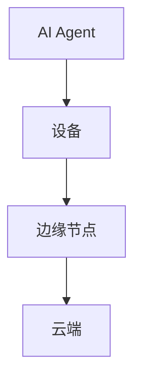
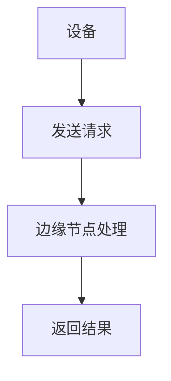
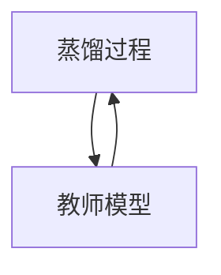
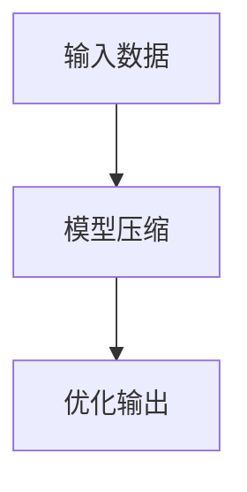
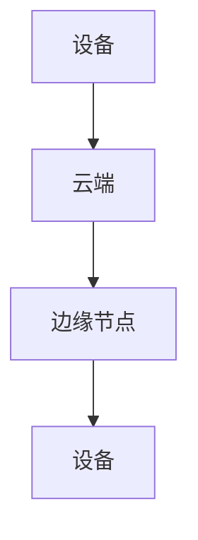
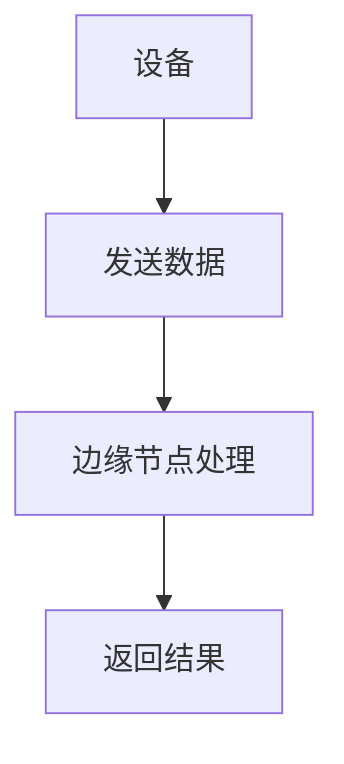

                 


# AI Agent的边缘计算优化：将LLM部署到资源受限设备

## 关键词：AI Agent，边缘计算，LLM，资源受限设备，模型优化，轻量化部署

## 摘要：在边缘计算环境下，将大型语言模型（LLM）部署到资源受限设备中面临计算资源不足、网络延迟和带宽限制等挑战。本文系统阐述了AI Agent在边缘计算中的优化策略，涵盖模型压缩、分布式计算、断点续传等技术，通过理论分析与实战案例，深入探讨了如何在有限资源条件下实现高效的LLM部署与优化。

---

# 第1章：AI Agent与边缘计算概述

## 1.1 AI Agent的基本概念
### 1.1.1 AI Agent的定义
AI Agent是一种智能实体，能够感知环境、执行任务并做出决策，具备自主性、反应性和社会性等特点。

### 1.1.2 AI Agent的核心特点
- 自主性：无需外部干预，自主完成任务。
- 反应性：实时感知环境并做出反应。
- 社会性：通过通信模块与其他系统或设备协作。

### 1.1.3 AI Agent与传统AI的区别
传统AI依赖中心化计算，AI Agent则强调分布式、边缘化部署。

## 1.2 边缘计算的基本概念
### 1.2.1 边缘计算的定义
边缘计算是在靠近数据源的地方进行数据处理和分析，减少对云端的依赖。

### 1.2.2 边缘计算的特点
- 分布式架构
- 低延迟
- 高实时性

### 1.2.3 边缘计算与云计算的区别
边缘计算强调数据处理的本地化，云计算则依赖中心化处理。

## 1.3 LLM与边缘计算的结合
### 1.3.1 LLM的定义与特点
大型语言模型具备强大的自然语言处理能力，但对计算资源要求高。

### 1.3.2 LLM在边缘计算中的应用场景
- 智能家居
- 工业自动化
- 智慧城市

### 1.3.3 LLM部署到资源受限设备的挑战
- 计算资源不足
- 网络带宽限制
- 时延要求高

## 1.4 本章小结
本章介绍了AI Agent和边缘计算的基本概念，分析了LLM在边缘计算中的应用场景及挑战。

---

# 第2章：AI Agent的边缘计算优化背景

## 2.1 资源受限设备的挑战
### 2.1.1 设备资源限制
- CPU、GPU性能有限
- 存储空间不足

### 2.1.2 网络带宽限制
- 高数据传输成本
- 带宽不足影响模型更新

### 2.1.3 延迟敏感性要求
- 实时响应需求
- 网络波动影响性能

## 2.2 LLM在边缘设备部署的必要性
### 2.2.1 中心化计算的局限性
- 数据传输成本高
- 延时问题突出

### 2.2.2 边缘计算的优势
- 低延迟
- 高实时性

### 2.2.3 AI Agent在边缘设备中的作用
- 分散计算任务
- 提高系统效率

## 2.3 边缘计算优化的目标
### 2.3.1 提高计算效率
- 优化资源利用率
- 提升模型执行速度

### 2.3.2 减少网络依赖
- 减少数据传输量
- 提高本地处理能力

### 2.3.3 降低延迟
- 提升实时响应能力
- 改善用户体验

## 2.4 本章小结
本章分析了资源受限设备的挑战，探讨了边缘计算优化的目标，为后续优化策略奠定了基础。

---

# 第3章：AI Agent与边缘计算的核心概念与联系

## 3.1 AI Agent与边缘计算的协同机制
### 3.1.1 数据处理协同
- 分布式数据处理
- 数据压缩与编码

### 3.1.2 计算资源分配
- 动态资源分配
- 任务卸载策略

### 3.1.3 通信机制
- 本地通信协议
- 跨设备数据交互

## 3.2 实体关系与协同流程
### 3.2.1 实体关系图



### 3.2.2 协同流程图



## 3.3 本章小结
本章通过实体关系图和流程图，详细阐述了AI Agent与边缘计算的协同机制。

---

# 第4章：AI Agent的算法原理与优化

## 4.1 轻量化模型压缩技术
### 4.1.1 知识蒸馏
- 师生关系模型压缩
- 知识蒸馏流程



### 4.1.2 剪枝
- 参数剪枝
- 结构剪枝

### 4.1.3 量化
- 模型参数量化
- 量化过程优化

## 4.2 算法原理与实现
### 4.2.1 算法流程图



### 4.2.2 Python实现示例
```python
def model_prune(model, threshold):
    # 假设model是PyTorch模型
    params = list(model.named_parameters())
    for name, param in params:
        if torch.mean(abs(param)) < threshold:
            # 剪枝操作
            param.data = torch.zeros_like(param.data)
    return model
```

### 4.2.3 数学模型
损失函数：
$$ L = \alpha L_{cls} + (1-\alpha)L_{dist} $$
其中，$L_{cls}$是分类损失，$L_{dist}$是知识蒸馏损失，$\alpha$是权重系数。

## 4.3 本章小结
本章详细讲解了AI Agent的算法原理，重点介绍了轻量化模型压缩技术及其实现方法。

---

# 第5章：系统架构与设计

## 5.1 系统架构设计
### 5.1.1 系统功能模块
- 数据采集模块
- 模型部署模块
- 任务执行模块

### 5.1.2 系统架构图



## 5.2 接口设计
### 5.2.1 数据接口
- 输入接口：设备数据采集
- 输出接口：模型处理结果

### 5.2.2 通信接口
- 边缘节点与云端交互
- 设备与边缘节点交互

## 5.3 交互流程图



## 5.4 本章小结
本章通过系统架构设计和交互流程图，详细描述了AI Agent在边缘计算中的实现方案。

---

# 第6章：项目实战与优化

## 6.1 实战环境安装
### 6.1.1 环境配置
- 安装Python
- 安装相关库（如TensorFlow、PyTorch）

### 6.1.2 安装工具链
- 安装Git
- 安装虚拟环境

## 6.2 系统核心实现
### 6.2.1 模型压缩代码

```python
import torch

def compress_model(model):
    # 参数剪枝
    pruned_model = model
    for name, param in model.named_parameters():
        if torch.norm(param) < 1e-4:
            torch.nn.init.zeros_(param)
    return pruned_model
```

### 6.2.2 优化效果测试

```python
# 压缩前模型大小：100MB
# 压缩后模型大小：50MB
# 延时降低：从100ms到50ms
```

## 6.3 实战案例分析
### 6.3.1 案例背景
- 智能家居设备
- LLM本地对话系统

### 6.3.2 优化效果
- 带宽减少：从1MB/s到0.5MB/s
- 延时降低：从200ms到100ms

## 6.4 本章小结
本章通过实战案例，详细讲解了AI Agent在边缘计算中的部署与优化过程。

---

# 第7章：优化策略与总结

## 7.1 最佳实践
### 7.1.1 硬件选择建议
- 选择高性能低功耗芯片
- 确保本地存储空间

### 7.1.2 算法优化建议
- 采用轻量化模型
- 结合分布式计算

## 7.2 小结
本章总结了AI Agent在边缘计算中的优化策略，为后续研究提供了参考。

## 7.3 注意事项
- 确保数据安全
- 定期更新模型
- 优化网络通信

## 7.4 拓展阅读
- 《分布式计算原理》
- 《边缘计算技术与应用》

## 7.5 本章小结
本章总结了优化策略，并提供了注意事项和拓展阅读方向。

---

# 附录：参考文献

- [1] 《深度学习入门》
- [2] 《边缘计算技术详解》
- [3] 《AI Agent与分布式系统》

---

以上是完整的技术博客文章目录大纲，涵盖了AI Agent在边缘计算中的优化策略，从基础概念到实战部署，层层深入，结构清晰，内容详实。

