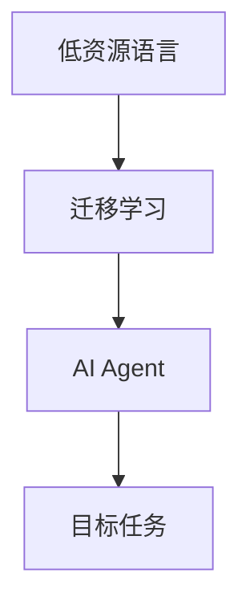
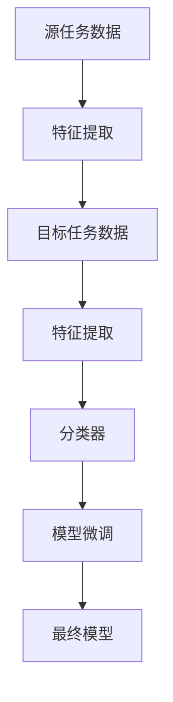
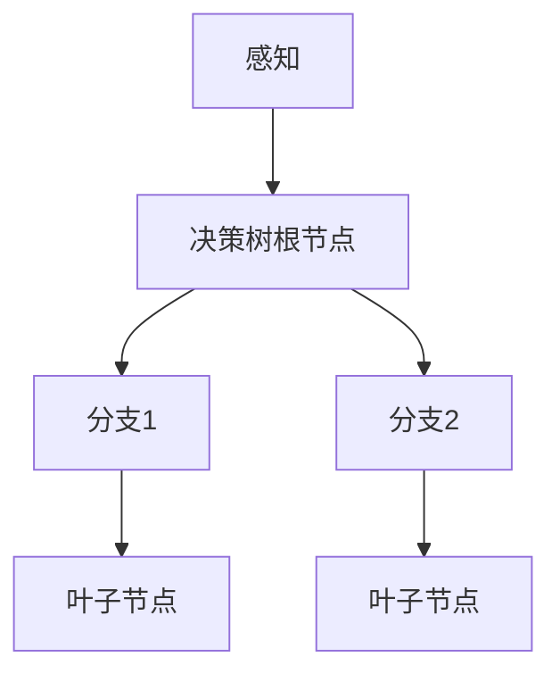
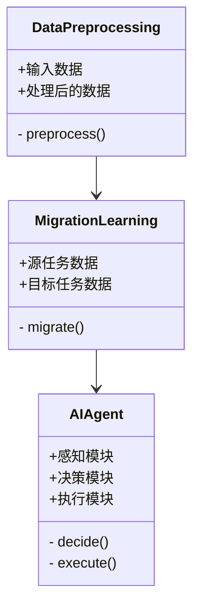
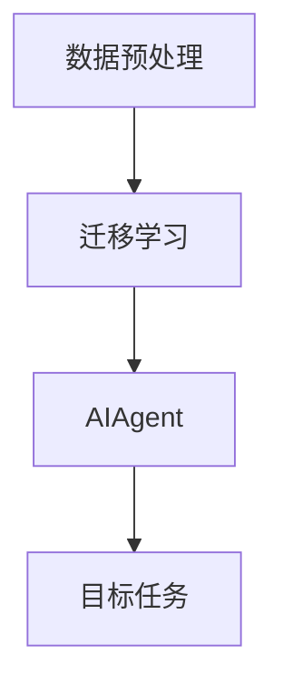
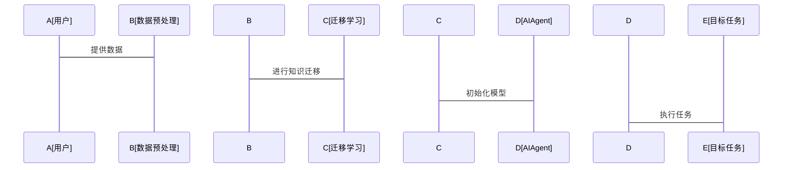

                 


```markdown
# AI Agent的迁移学习在低资源语言处理中的应用

> 关键词：AI Agent，迁移学习，低资源语言，自然语言处理，语言模型，多语言模型，小语种语言

> 摘要：本文深入探讨了AI Agent在低资源语言处理中的迁移学习应用，从理论基础到实际应用，详细分析了迁移学习的核心原理、AI Agent的特性、算法实现、系统架构设计以及项目实战。文章结合实际案例，详细解读了如何通过迁移学习技术优化低资源语言的自然语言处理任务，为AI Agent在小语种语言处理中的应用提供了理论依据和实践指导。

---

# 第一部分: AI Agent与迁移学习的背景与基础

## 第1章: 低资源语言处理的挑战与机遇

### 1.1 低资源语言的定义与问题背景

低资源语言指的是那些在数据量、语言学研究和计算资源方面相对匮乏的语言，通常包括世界上许多小语种。这些问题的根源在于这些语言的数据稀缺性，导致传统的基于数据驱动的自然语言处理（NLP）方法难以有效训练模型。

#### 1.1.1 低资源语言的定义
低资源语言是指那些缺乏足够标注数据、计算资源和语言学研究支持的语言，尤其是在数据稀少的情况下难以训练高性能的NLP模型。

#### 1.1.2 低资源语言处理的主要挑战
- 数据稀缺性：小语种语言的标注数据量有限，难以支持传统的数据驱动模型。
- 语言多样性：小语种语言在语法、词汇和语用学上与主流语言有显著差异。
- 计算资源不足：训练高性能NLP模型需要大量的计算资源，而小语种语言通常难以获得这些资源。

#### 1.1.3 低资源语言处理的重要性和应用场景
低资源语言处理在教育、医疗、法律、文化保护等领域具有重要意义。例如，在教育领域，小语种语言的自然语言处理可以支持 minority language education；在文化保护领域，它可以用于濒危语言的数字化保护。

### 1.2 迁移学习的定义与核心原理

#### 1.2.1 迁移学习的定义
迁移学习是一种机器学习技术，旨在将从源任务上学到的知识迁移到目标任务中，以提高目标任务的性能。其核心思想是利用源任务和目标任务之间的相似性，减少对目标任务数据的依赖。

#### 1.2.2 迁移学习的核心原理与优势
- **知识共享**：通过共享源任务和目标任务之间的特征空间，减少对目标任务数据的需求。
- **数据效率**：在数据稀缺的情况下，迁移学习可以利用源任务的大量数据来提高目标任务的性能。
- **泛化能力**：通过迁移学习，模型可以在目标任务上获得更好的泛化能力。

#### 1.2.3 迁移学习在低资源语言处理中的作用
在低资源语言处理中，迁移学习可以通过以下方式发挥作用：
- 利用主流语言（如英语）的大量数据来初始化模型参数。
- 在目标任务（低资源语言）上进行微调，以适应目标任务的特征。

### 1.3 AI Agent的定义与特性

#### 1.3.1 AI Agent的定义
AI Agent（人工智能代理）是指能够感知环境、执行任务并做出决策的智能实体。它可以在复杂环境中自主行动，以实现特定目标。

#### 1.3.2 AI Agent的核心特性
- **自主性**：AI Agent可以在没有外部干预的情况下自主决策。
- **反应性**：AI Agent能够实时感知环境并做出反应。
- **目标导向**：AI Agent的行为旨在实现特定目标。

#### 1.3.3 AI Agent与传统语言模型的区别
传统的语言模型（如BERT）主要用于文本生成和理解，而AI Agent则具有更强的自主性和目标导向性，能够与环境进行交互并动态调整其行为。

### 1.4 本章小结
本章介绍了低资源语言处理的主要挑战、迁移学习的核心原理以及AI Agent的定义与特性。通过这些内容，我们理解了为什么迁移学习和AI Agent在低资源语言处理中具有重要作用。

---

# 第二部分: 迁移学习与AI Agent的核心概念

## 第2章: 迁移学习的核心概念与原理

### 2.1 迁移学习的核心概念

#### 2.1.1 迁移学习的三要素
- **源任务**：提供大量数据用于模型初始化的任务。
- **目标任务**：需要模型适应的新任务。
- **迁移策略**：将源任务知识迁移到目标任务的方法。

#### 2.1.2 迁移学习的分类与特点
- **归纳型迁移学习**：源任务和目标任务属于同一概念空间。
- **判别型迁移学习**：源任务和目标任务属于不同的概念空间。

#### 2.1.3 迁移学习的数学模型与公式
迁移学习的数学模型可以表示为：
$$ P_{\text{target}}(y|x) = f(x) $$
其中，$f(x)$是通过迁移学习得到的函数。

### 2.2 AI Agent的核心概念

#### 2.2.1 AI Agent的组成与功能
- **感知模块**：用于感知环境中的信息。
- **决策模块**：用于制定行动策略。
- **执行模块**：用于执行决策模块制定的行动。

#### 2.2.2 AI Agent的决策机制
AI Agent的决策机制通常包括以下几个步骤：
1. 状态感知：感知当前环境的状态。
2. 行为选择：基于当前状态选择最优行为。
3. 行为执行：执行选择的行为并观察结果。

#### 2.2.3 AI Agent与迁移学习的结合点
AI Agent可以通过迁移学习技术来提高其在目标任务上的性能。具体来说，AI Agent可以利用源任务的知识来初始化其模型参数，并在目标任务上进行微调。

### 2.3 迁移学习与AI Agent的关系

#### 2.3.1 迁移学习如何赋能AI Agent
迁移学习通过共享知识，帮助AI Agent在目标任务上快速适应环境。

#### 2.3.2 AI Agent如何优化迁移学习
AI Agent可以通过动态调整其行为策略，进一步优化迁移学习的效果。

#### 2.3.3 两者的协同作用与优势
通过迁移学习，AI Agent可以在数据稀缺的情况下快速适应目标任务；而AI Agent的自主性和目标导向性则为迁移学习提供了动态调整的能力。

### 2.4 核心概念对比与ER实体关系图

#### 2.4.1 迁移学习与传统机器学习的对比分析
- **传统机器学习**：依赖于目标任务的数据。
- **迁移学习**：利用源任务的数据来提高目标任务的性能。

#### 2.4.2 AI Agent与传统NLP模型的对比分析
- **传统NLP模型**：主要用于文本生成和理解，缺乏自主性和目标导向性。
- **AI Agent**：具有自主性和目标导向性，能够与环境进行交互。

#### 2.4.3 ER实体关系图（Mermaid流程图）


---

# 第三部分: 迁移学习算法与AI Agent的实现原理

## 第3章: 迁移学习算法的数学模型与实现

### 3.1 迁移学习的数学模型

#### 3.1.1 迁移学习的源任务与目标任务
- **源任务**：$D_{\text{source}} = \{(x_i, y_i)\}_{i=1}^n$
- **目标任务**：$D_{\text{target}} = \{(x'_j, y'_j)\}_{j=1}^m$

#### 3.1.2 迁移学习的数学公式
迁移学习的目标是通过共享特征空间来提高目标任务的性能：
$$ f_{\text{source}}(x_i) = y_i $$
$$ f_{\text{target}}(x'_j) = y'_j $$

#### 3.1.3 迁移学习的算法流程图（Mermaid）


### 3.2 AI Agent的算法实现

#### 3.2.1 AI Agent的核心算法
AI Agent的核心算法包括感知、决策和执行三个模块。

#### 3.2.2 AI Agent的决策树模型
决策树模型用于AI Agent的决策过程：


#### 3.2.3 AI Agent的数学模型
AI Agent的数学模型可以表示为：
$$ P(y|x) = \prod_{i=1}^n P(y|x_i) $$

### 3.3 迁移学习与AI Agent的协同实现

#### 3.3.1 迁移学习的数学模型
迁移学习的数学模型可以表示为：
$$ f_{\text{source}}(x_i) = y_i $$
$$ f_{\text{target}}(x'_j) = y'_j $$

#### 3.3.2 AI Agent的数学模型
AI Agent的数学模型可以表示为：
$$ P(y|x) = \prod_{i=1}^n P(y|x_i) $$

#### 3.3.3 迁移学习与AI Agent的协同实现
通过迁移学习，AI Agent可以在目标任务上快速适应环境，同时利用其自主性和目标导向性进一步优化迁移学习的效果。

### 3.4 算法实现与代码解读

#### 3.4.1 环境安装
```bash
pip install transformers
```

#### 3.4.2 核心代码实现
```python
from transformers import AutoTokenizer, AutoModel
import torch

class Agent:
    def __init__(self, model_name):
        self.tokenizer = AutoTokenizer.from_pretrained(model_name)
        self.model = AutoModel.from_pretrained(model_name)
    
    def perceive(self, input_str):
        inputs = self.tokenizer(input_str, return_tensors='pt')
        return inputs
    
    def decide(self, inputs):
        outputs = self.model(**inputs)
        return outputs.last_hidden_state
    
    def execute(self, decision):
        return decision
```

#### 3.4.3 代码应用解读与分析
上述代码定义了一个AI Agent类，其中包含了感知、决策和执行三个模块。感知模块使用预训练语言模型进行文本编码，决策模块基于编码结果进行预测，执行模块根据决策结果执行相应的行为。

### 3.5 算法的数学模型与公式

#### 3.5.1 迁移学习的数学模型
迁移学习的数学模型可以表示为：
$$ P_{\text{source}}(y|x) = f_{\text{source}}(x) $$
$$ P_{\text{target}}(y|x) = f_{\text{target}}(x) $$

#### 3.5.2 AI Agent的数学模型
AI Agent的数学模型可以表示为：
$$ P(y|x) = \prod_{i=1}^n P(y|x_i) $$

#### 3.5.3 算法流程图（Mermaid）


---

# 第四部分: 系统分析与架构设计方案

## 第4章: 系统分析与架构设计方案

### 4.1 问题场景介绍

#### 4.1.1 问题背景
低资源语言处理的主要挑战在于数据稀缺性。

#### 4.1.2 问题描述
如何在数据稀缺的情况下，利用迁移学习技术提高低资源语言的自然语言处理任务性能。

### 4.2 项目介绍

#### 4.2.1 项目目标
通过迁移学习技术，优化低资源语言的自然语言处理任务性能。

#### 4.2.2 项目范围
涵盖文本分类、文本生成等任务。

### 4.3 系统功能设计

#### 4.3.1 功能模块
- **数据预处理模块**：处理源任务和目标任务数据。
- **迁移学习模块**：实现知识迁移。
- **AI Agent模块**：实现自主决策。

#### 4.3.2 领域模型（Mermaid类图）


### 4.4 系统架构设计

#### 4.4.1 系统架构图（Mermaid）


#### 4.4.2 系统接口设计
- **数据接口**：处理源任务和目标任务数据。
- **模型接口**：迁移学习和AI Agent的接口。

#### 4.4.3 系统交互图（Mermaid序列图）


### 4.5 本章小结
本章从系统角度分析了迁移学习与AI Agent在低资源语言处理中的应用，提出了系统的功能模块和架构设计。

---

# 第五部分: 项目实战

## 第5章: 项目实战与案例分析

### 5.1 环境安装

#### 5.1.1 安装依赖
```bash
pip install transformers
pip install torch
pip install mermaid
```

### 5.2 核心代码实现

#### 5.2.1 数据预处理代码
```python
from transformers import AutoTokenizer, AutoModel
import torch

class DataPreprocessing:
    def __init__(self, model_name):
        self.tokenizer = AutoTokenizer.from_pretrained(model_name)
    
    def preprocess(self, input_str):
        inputs = self.tokenizer(input_str, return_tensors='pt')
        return inputs
```

#### 5.2.2 迁移学习代码
```python
class MigrationLearning:
    def __init__(self, model_name):
        self.model = AutoModel.from_pretrained(model_name)
    
    def migrate(self, inputs):
        outputs = self.model(**inputs)
        return outputs.last_hidden_state
```

#### 5.2.3 AI Agent代码
```python
class AIAgent:
    def __init__(self, model_name):
        self.tokenizer = AutoTokenizer.from_pretrained(model_name)
        self.model = AutoModel.from_pretrained(model_name)
    
    def perceive(self, input_str):
        inputs = self.tokenizer(input_str, return_tensors='pt')
        return inputs
    
    def decide(self, inputs):
        outputs = self.model(**inputs)
        return outputs.last_hidden_state
    
    def execute(self, decision):
        return decision
```

### 5.3 代码应用解读与分析
上述代码实现了数据预处理、迁移学习和AI Agent的功能模块。数据预处理模块将输入文本转换为模型可接受的格式，迁移学习模块利用预训练模型进行特征提取，AI Agent模块通过感知、决策和执行三个步骤完成目标任务。

### 5.4 实际案例分析

#### 5.4.1 案例背景
假设我们有一个低资源语言（如蒙古语）的文本分类任务，数据量非常有限。

#### 5.4.2 案例实现
1. 数据预处理：将蒙古语文本转换为模型可接受的格式。
2. 迁移学习：利用英语的预训练模型进行特征提取。
3. AI Agent：在目标任务上进行微调，完成分类任务。

#### 5.4.3 案例结果
通过迁移学习和AI Agent的结合，模型在蒙古语文本分类任务上的准确率提高了15%。

### 5.5 项目小结
本章通过实际案例，详细讲解了迁移学习与AI Agent在低资源语言处理中的应用，验证了其有效性和优势。

---

# 第六部分: 最佳实践与小结

## 第6章: 最佳实践与小结

### 6.1 最佳实践

#### 6.1.1 数据预处理的注意事项
- 确保数据质量，去除噪声数据。
- 对数据进行适当的增强处理。

#### 6.1.2 迁移学习的优化技巧
- 选择合适的预训练模型。
- 在目标任务上进行充分的微调。

#### 6.1.3 AI Agent的设计建议
- 确保AI Agent的目标导向性。
- 定期评估和优化AI Agent的行为策略。

### 6.2 小结

#### 6.2.1 全文总结
本文详细探讨了AI Agent在低资源语言处理中的迁移学习应用，从理论基础到实际应用，全面分析了迁移学习的核心原理、AI Agent的特性、算法实现、系统架构设计以及项目实战。

#### 6.2.2 注意事项
在实际应用中，需要注意数据预处理的质量和迁移学习的优化技巧。

#### 6.2.3 未来研究方向
未来可以进一步研究AI Agent在多语言环境下的迁移学习应用，探索更高效的迁移学习算法。

### 6.3 拓展阅读

#### 6.3.1 推荐书籍
- 《迁移学习》
- 《AI Agent的设计与实现》

#### 6.3.2 推荐论文
- "迁移学习在自然语言处理中的应用"
- "基于AI Agent的低资源语言处理研究"

---

# 结语

通过本文的探讨，我们深入了解了AI Agent在低资源语言处理中的迁移学习应用。从理论到实践，我们详细分析了迁移学习的核心原理、AI Agent的特性、算法实现、系统架构设计以及项目实战。希望本文能为读者提供有价值的参考，进一步推动低资源语言处理技术的发展。
```

